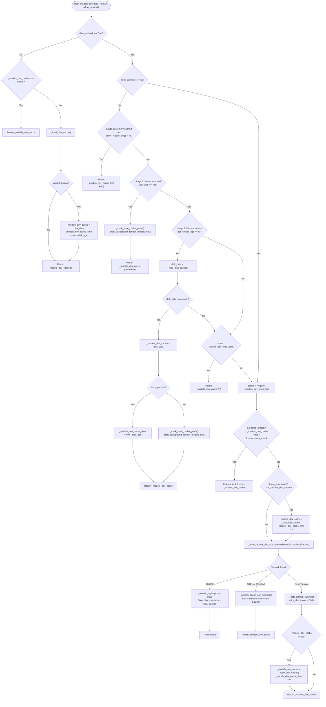

# Cloud Model Catalog (`models.dev`) Source Review

This document specifies the exact runtime semantics, observable cache hierarchy, TTL rules, stale/background refresh mechanisms, ETag conditional GET handling, corruption quarantine, forced/offline interactions, and concurrency guarantees of the cloud model catalog integration in [`agent/models_dev.py`](file:///home/eins0fx/development/hermes-agent-port/agent/models_dev.py). It provides verified findings for implementing the cloud catalog state machine in Rust without inventing substitutes.

---

## 1. Scope, Authority, and Source Mapping

### 1.1 Source Files and Line Ranges
- Primary Integration: [`agent/models_dev.py`](file:///home/eins0fx/development/hermes-agent-port/agent/models_dev.py)
  - Constants & In-Memory State: [lines 56-67](file:///home/eins0fx/development/hermes-agent-port/agent/models_dev.py#L56-L67)
  - Dataclasses ([`ModelInfo`](file:///home/eins0fx/development/hermes-agent-port/agent/models_dev.py#L73-L150), [`ProviderInfo`](file:///home/eins0fx/development/hermes-agent-port/agent/models_dev.py#L153-L162)): [lines 70-162](file:///home/eins0fx/development/hermes-agent-port/agent/models_dev.py#L70-L162)
  - Provider Mapping ([`PROVIDER_TO_MODELS_DEV`](file:///home/eins0fx/development/hermes-agent-port/agent/models_dev.py#L169-L220)): [lines 164-236](file:///home/eins0fx/development/hermes-agent-port/agent/models_dev.py#L164-L236)
  - Path and ETag Helpers: [lines 239-286](file:///home/eins0fx/development/hermes-agent-port/agent/models_dev.py#L239-L286)
  - URL Resolution ([`_get_models_dev_url`](file:///home/eins0fx/development/hermes-agent-port/agent/models_dev.py#L287-L305)): [lines 287-305](file:///home/eins0fx/development/hermes-agent-port/agent/models_dev.py#L287-L305)
  - Registry Validation & Disk Cache Handling: [lines 307-399](file:///home/eins0fx/development/hermes-agent-port/agent/models_dev.py#L307-L399)
  - Network Fetching & Conditional GET ([`_fetch_models_dev_from_network`](file:///home/eins0fx/development/hermes-agent-port/agent/models_dev.py#L405-L448)): [lines 401-448](file:///home/eins0fx/development/hermes-agent-port/agent/models_dev.py#L401-L448)
  - Cache State Transitions ([`_mark_stale_cache_grace`](file:///home/eins0fx/development/hermes-agent-port/agent/models_dev.py#L450-L461), [`_commit_registry`](file:///home/eins0fx/development/hermes-agent-port/agent/models_dev.py#L463-L482), [`_confirm_cache_not_modified`](file:///home/eins0fx/development/hermes-agent-port/agent/models_dev.py#L484-L515), [`_note_refresh_failure`](file:///home/eins0fx/development/hermes-agent-port/agent/models_dev.py#L517-L530)): [lines 450-530](file:///home/eins0fx/development/hermes-agent-port/agent/models_dev.py#L450-L530)
  - Background Refresh Worker ([`_background_refresh_models_dev`](file:///home/eins0fx/development/hermes-agent-port/agent/models_dev.py#L532-L555), [`_start_background_refresh_models_dev`](file:///home/eins0fx/development/hermes-agent-port/agent/models_dev.py#L557-L583)): [lines 532-583](file:///home/eins0fx/development/hermes-agent-port/agent/models_dev.py#L532-L583)
  - Main Retrieval Entrypoint ([`fetch_models_dev`](file:///home/eins0fx/development/hermes-agent-port/agent/models_dev.py#L585-L738)): [lines 585-738](file:///home/eins0fx/development/hermes-agent-port/agent/models_dev.py#L585-L738)
  - Immediate Downstream Context Query ([`lookup_models_dev_context`](file:///home/eins0fx/development/hermes-agent-port/agent/models_dev.py#L740-L821)): [lines 740-773](file:///home/eins0fx/development/hermes-agent-port/agent/models_dev.py#L740-L773)
- Atomic Persistence Utilities: [`utils.py`](file:///home/eins0fx/development/hermes-agent-port/utils.py)
  - [`atomic_write_text`](file:///home/eins0fx/development/hermes-agent-port/utils.py#L311-L344): [lines 311-344](file:///home/eins0fx/development/hermes-agent-port/utils.py#L311-L344)
  - [`atomic_json_write`](file:///home/eins0fx/development/hermes-agent-port/utils.py#L346-L408): [lines 346-408](file:///home/eins0fx/development/hermes-agent-port/utils.py#L346-L408)
- Home Directory Locator: [`hermes_constants.py`](file:///home/eins0fx/development/hermes-agent-port/hermes_constants.py)
  - `get_hermes_home()`: resolves `~/.hermes` or `$HERMES_HOME`.
- Relevant Test Suites:
  - Cache, ETag, Backoff, Corruption: [`tests/agent/test_models_dev.py`](file:///home/eins0fx/development/hermes-agent-port/tests/agent/test_models_dev.py#L151-L754)
  - Provider Alias Mapping: [`tests/agent/test_models_dev_meta_mapping.py`](file:///home/eins0fx/development/hermes-agent-port/tests/agent/test_models_dev_meta_mapping.py)
  - Model Selection Merge Invariants: [`tests/hermes_cli/test_models_dev_preferred_merge.py`](file:///home/eins0fx/development/hermes-agent-port/tests/hermes_cli/test_models_dev_preferred_merge.py)

---

## 2. Constants, Primitives, and Global State

### 2.1 Configuration Constants
- `MODELS_DEV_URL = "https://models.dev/api.json"` ([`models_dev.py:56`](file:///home/eins0fx/development/hermes-agent-port/agent/models_dev.py#L56))
  Default public endpoint. May be overridden at runtime via configuration.
- `_MODELS_DEV_CACHE_TTL = 4 * 3600` (14,400 seconds / 4 hours) ([`models_dev.py:57`](file:///home/eins0fx/development/hermes-agent-port/agent/models_dev.py#L57))
  Duration an in-memory or on-disk cache is considered strictly fresh.
- `_MODELS_DEV_RETRY_DELAY = 300` (300 seconds / 5 minutes) ([`models_dev.py:58`](file:///home/eins0fx/development/hermes-agent-port/agent/models_dev.py#L58))
  Process-wide failure backoff duration following any failed refresh attempt (foreground or background).

### 2.2 Global State Variables
- `_models_dev_cache: Dict[str, Any] = {}` ([`models_dev.py:61`](file:///home/eins0fx/development/hermes-agent-port/agent/models_dev.py#L61))
  In-memory representation of the parsed catalog dictionary, keyed by upstream models.dev provider ID (e.g. `"anthropic"`, `"openai"`, `"google"`).
- `_models_dev_cache_time: float = 0` ([`models_dev.py:62`](file:///home/eins0fx/development/hermes-agent-port/agent/models_dev.py#L62))
  UNIX epoch timestamp indicating the point from which the 4-hour TTL is measured.
- `_models_dev_retry_after: float = 0` ([`models_dev.py:63`](file:///home/eins0fx/development/hermes-agent-port/agent/models_dev.py#L63))
  UNIX epoch timestamp until which all automated network refreshes are suppressed. `0` indicates no active backoff.
- `_models_dev_fetch_lock = threading.Lock()` ([`models_dev.py:64`](file:///home/eins0fx/development/hermes-agent-port/agent/models_dev.py#L64))
  Mutual exclusion lock ensuring network fetches and cache commits are strictly single-flight.
- `_models_dev_refresh_lock = threading.Lock()` ([`models_dev.py:65`](file:///home/eins0fx/development/hermes-agent-port/agent/models_dev.py#L65))
  Coarse-grained lock protecting the `_models_dev_refresh_in_flight` boolean flag.
- `_models_dev_refresh_in_flight: bool = False` ([`models_dev.py:66`](file:///home/eins0fx/development/hermes-agent-port/agent/models_dev.py#L66))
  Atomic lifecycle flag ensuring at most one background worker thread is active at any time.

---

## 3. Observable Cache Hierarchy and Resolution Order

The retrieval entry point [`fetch_models_dev(force_refresh: bool = False, *, allow_network: bool = True) -> Dict[str, Any]`](file:///home/eins0fx/development/hermes-agent-port/agent/models_dev.py#L585-L738) implements a strict three-tier hierarchy:



### 3.1 Offline / Latency-Critical Invariant (`allow_network=False`)
- Invariant: When `allow_network=False`, the call path **NEVER** touches network I/O, **NEVER** spawns background threads, and **NEVER** blocks on `_models_dev_fetch_lock`.
- If `_models_dev_cache` is populated, it is returned immediately.
- If `_models_dev_cache` is empty:
  1. Calls [`_load_disk_cache()`](file:///home/eins0fx/development/hermes-agent-port/agent/models_dev.py#L312-L340).
  2. If valid disk data is returned, hydrates `_models_dev_cache = disk_data`.
  3. Computes `disk_age = _disk_cache_age_seconds()`. If `disk_age is not None`, sets `_models_dev_cache_time = time.time() - disk_age`; otherwise sets `_models_dev_cache_time = 0`.
  4. Returns `_models_dev_cache` (which may be empty `{}` if disk was missing or corrupt).

### 3.2 Stage 1: Fresh In-Memory Cache
- Trigger: `not force_refresh and _models_dev_cache and (time.time() - _models_dev_cache_time) < _MODELS_DEV_CACHE_TTL`.
- Performance: Hot-path execution. Zero syscalls, zero disk I/O, lock-free reference read.
- Result: Returns `_models_dev_cache` immediately.

### 3.3 Stage 2: Stale In-Memory Cache
- Trigger: `not force_refresh and _models_dev_cache` (where age >= 4 hours).
- Principle: Serving stale metadata is strictly preferred over blocking conversational turn generation on upstream network latency.
- Behavior:
  1. Calls [`_mark_stale_cache_grace()`](file:///home/eins0fx/development/hermes-agent-port/agent/models_dev.py#L450-L461) to grant a 5-minute in-memory grace window.
  2. Calls [`_start_background_refresh_models_dev()`](file:///home/eins0fx/development/hermes-agent-port/agent/models_dev.py#L557-L583) to launch a background refresh daemon if not already in flight and not in backoff.
  3. Returns `_models_dev_cache` immediately.

### 3.4 Stage 3: On-Disk Cache Short-Circuit (Cold Process)
- Trigger: `not force_refresh and not _models_dev_cache`.
- Steps:
  1. Evaluates `disk_age = _disk_cache_age_seconds()`. If `disk_age is None` (file missing, unreadable, or negative age clock skew), Stage 3 falls through.
  2. Calls `disk_data = _load_disk_cache()`. If corrupt or empty, disk cache is quarantined and returns `{}` (falling through).
  3. If valid `disk_data` is loaded:
     - Populates `_models_dev_cache = disk_data`.
     - Fresh Disk Cache (`disk_age < _MODELS_DEV_CACHE_TTL`): Anchors in-memory timestamp to the file's disk age: `_models_dev_cache_time = time.time() - disk_age`. Returns `_models_dev_cache` without hitting network.
     - Stale Disk Cache (`disk_age >= _MODELS_DEV_CACHE_TTL`): Calls `_mark_stale_cache_grace()`, triggers `_start_background_refresh_models_dev()`, and immediately returns `_models_dev_cache`.

### 3.5 Stage 3b: Process-Wide Failure Backoff Filter
- Trigger: `not force_refresh and time.time() < _models_dev_retry_after`.
- Behavior: Returns `_models_dev_cache` immediately without attempting a foreground network request. Prevents tight retry loops across requests when models.dev is unreachable and no cache exists.

### 3.6 Stage 4: Singleflight Foreground Network Fetch
- Trigger: Reached only when `force_refresh=True`, OR when both in-memory and disk caches are missing/unusable and no backoff is active.
- Execution under [`_models_dev_fetch_lock`](file:///home/eins0fx/development/hermes-agent-port/agent/models_dev.py#L64):
  1. Re-check state under lock: if `not force_refresh`, returns `_models_dev_cache` if another thread populated it, or if another thread failed and armed `_models_dev_retry_after`.
  2. Cold `force_refresh` hydration: If `force_refresh` is True and `_models_dev_cache` is empty, attempts `disk = _load_disk_cache()`. If present, sets `_models_dev_cache = disk` and `_models_dev_cache_time = 0`. This enables conditional GET (If-None-Match) so a forced refresh on CLI startup avoids re-downloading ~2 MB if the cache is unchanged.
  3. Executes [`_fetch_models_dev_from_network(conditional=bool(_models_dev_cache))`](file:///home/eins0fx/development/hermes-agent-port/agent/models_dev.py#L405-L448).
  4. On HTTP 200: calls [`_commit_registry(data, etag=etag, where="foreground")`](file:///home/eins0fx/development/hermes-agent-port/agent/models_dev.py#L463-L482) and returns `data`.
  5. On HTTP 304: calls [`_confirm_cache_not_modified(where="foreground")`](file:///home/eins0fx/development/hermes-agent-port/agent/models_dev.py#L484-L515) and returns `_models_dev_cache`.
  6. On Network/HTTP Error: calls [`_note_refresh_failure(e, where="foreground")`](file:///home/eins0fx/development/hermes-agent-port/agent/models_dev.py#L517-L530).

### 3.7 Stage 5: Network Failure Fallback
- Trigger: Network fetch in Stage 4 raised an exception.
- Fallback: If `_models_dev_cache` is empty (e.g. cold start where Stage 3 fell through), attempts `_load_disk_cache()`. If disk data exists, sets `_models_dev_cache = disk` and `_models_dev_cache_time = 0`.
- Return: Returns `_models_dev_cache` (either stale disk cache or `{}`).

---

## 4. TTL Arithmetic, Stale Grace, and Time Math

### 4.1 Disk Cache Age Calculation (`_disk_cache_age_seconds`)
- Reads `st_mtime` from `~/.hermes/models_dev_cache.json`.
- Calculates: `age = time.time() - mtime`.
- **Clock Skew Invariant**: If `age < 0` (mtime is in the future due to system clock drift or NTP adjustments), the function returns `None`. Treating future timestamps as "unknown freshness" prevents the process from treating an erroneously dated file as permanently fresh.

### 4.2 Anchoring In-Memory TTL to Disk Age
When loading a fresh disk cache on cold startup:
$$\text{\_models\_dev\_cache\_time} = \text{time.time()} - \text{disk\_age}$$
- If a cache was written to disk 3 hours ago, its effective in-memory age is set to 3 hours old upon load.
- It will expire after 1 further hour, rather than getting a fresh 4-hour lease on every process invocation.

### 4.3 Stale Cache Grace Math (`_mark_stale_cache_grace`)
When stale cache data is served and background refresh is dispatched:
$$\text{grace\_time} = \text{time.time()} - \text{\_MODELS\_DEV\_CACHE\_TTL} + \text{\_MODELS\_DEV\_RETRY\_DELAY}$$
$$\text{grace\_time} = \text{now} - 14400 + 300 = \text{now} - 14100 \text{ seconds} \quad (\text{now} - \text{3h 55m})$$
- Effective Lifetime: Because TTL is 4 hours (14,400s), setting `_models_dev_cache_time = now - 14,100s` leaves $\Delta t = 300\text{s}$ (5 minutes) before the cache is considered stale again.
- Purpose: Callers hitting `fetch_models_dev` during the next 5 minutes hit **Stage 1 (fresh)** directly. This prevents hot-path queries from repeatedly attempting to spawn background threads or spamming debug logs.
- **Monotonic Forward Progression**:
  ```python
  if grace_time > _models_dev_cache_time:
      _models_dev_cache_time = grace_time
  ```
  If a background worker completed and committed fresh data (`_models_dev_cache_time = now`) concurrently between the caller's staleness check and this call, `grace_time < _models_dev_cache_time`. The check prevents the fresh timestamp from being rewound back to the 5-minute grace window.

---

## 5. Background Refresh and Worker Lifecycle

### 5.1 Triggering and Guards (`_start_background_refresh_models_dev`)
1. **Backoff Guard**: `if time.time() < _models_dev_retry_after: return`. If a previous refresh failed within the last 5 minutes, no thread is spawned.
2. **In-Flight Mutex**: Acquires `with _models_dev_refresh_lock:`.
   - If `_models_dev_refresh_in_flight` is True: returns immediately.
   - Sets `_models_dev_refresh_in_flight = True`.
3. **Daemon Thread Creation**:
   - `thread = threading.Thread(target=_background_refresh_models_dev, name="models-dev-refresh", daemon=True)`
4. **Spawn Failure Handling**:
   - If `thread.start()` raises (e.g. system thread limit reached / `RuntimeError`):
     ```python
     with _models_dev_refresh_lock:
         _models_dev_refresh_in_flight = False
     ```
     Resets the flag immediately so the worker is not permanently marked in-flight for the life of the process.

### 5.2 Worker Execution (`_background_refresh_models_dev`)
The worker body executes strictly within `try ... finally`:
```python
try:
    with _models_dev_fetch_lock:
        data, etag = _fetch_models_dev_from_network(
            conditional=bool(_models_dev_cache)
        )
        _commit_registry(data, etag=etag, where="background")
except _NotModified:
    with _models_dev_fetch_lock:
        _confirm_cache_not_modified(where="background")
except Exception as e:
    with _models_dev_fetch_lock:
        _note_refresh_failure(e, where="background")
finally:
    with _models_dev_refresh_lock:
        _models_dev_refresh_in_flight = False
```
- **Fetch Lock Symmetry**: Network fetch inside the background worker occurs *inside* `_models_dev_fetch_lock`. This guarantees:
  1. A foreground `force_refresh` and a background refresh cannot execute two concurrent HTTP GETs.
  2. Input state for conditional GET (`_models_dev_cache` and sidecar `.etag`) cannot be mutated mid-request.
- **Worker Completion**: In the `finally` block, `_models_dev_refresh_in_flight` is reset to `False` under `_models_dev_refresh_lock`.

---

## 6. ETag Protocol and Conditional GET Semantics

### 6.1 ETag Sidecar Storage
- Sidecar Path: `~/.hermes/models_dev_cache.etag` ([`_get_etag_path`](file:///home/eins0fx/development/hermes-agent-port/agent/models_dev.py#L245-L248)).
- Persistence: Written atomically via [`atomic_write_text`](file:///home/eins0fx/development/hermes-agent-port/utils.py#L311-L344) whenever the HTTP response provides an `ETag` header.
- Coupling Invariant: ETag is saved inside [`_save_disk_cache(data, etag)`](file:///home/eins0fx/development/hermes-agent-port/agent/models_dev.py#L386-L399). The ETag is never persisted without simultaneously writing the matching cache body.

### 6.2 The Servable Registry Prerequisite (Issue #35838 Guard)
- Network Fetch Signature: `_fetch_models_dev_from_network(*, conditional: bool = False)`
- Invariant: `conditional` is passed as `bool(_models_dev_cache)`.
- **CRITICAL**: `If-None-Match` is sent **IF AND ONLY IF** `conditional=True` AND `_load_etag()` returns a non-empty string.
- If the process holds no servable registry in memory, `If-None-Match` is **NEVER** sent, even if an `.etag` file exists on disk.
- **Why this matters**: If an orphaned `.etag` file exists (e.g. after cache file deletion or corruption), sending `If-None-Match` invites a `304 Not Modified` from the server. Receiving 304 when holding no memory cache would leave the process with `{}` indefinitely (the permanent empty-registry loop).

### 6.3 HTTP Request Mechanics
- URL Resolution: Resolved via [`_get_models_dev_url()`](file:///home/eins0fx/development/hermes-agent-port/agent/models_dev.py#L287-L305).
  - Checks config key `models_dev.url` via `load_config_readonly()`.
  - If unset, empty, or whitespace, falls back to `MODELS_DEV_URL = "https://models.dev/api.json"`.
- Timeouts: `timeout=(5, 10)` passed to `requests.get`.
  - Connect timeout: **5.0 seconds** (fails fast on unreachable hosts or network partitions).
  - Read timeout: **10.0 seconds** (tolerates large ~2 MB payload transfer).
- Header Generation:
  - When `conditional=True` and `_load_etag()` is non-empty: `headers["If-None-Match"] = etag`.

### 6.4 Handling 304 Not Modified
When `response.status_code == 304`, [`_fetch_models_dev_from_network`](file:///home/eins0fx/development/hermes-agent-port/agent/models_dev.py#L405-L448) raises internal exception `_NotModified()`.
In [`_confirm_cache_not_modified(*, where: str)`](file:///home/eins0fx/development/hermes-agent-port/agent/models_dev.py#L484-L515):
1. **Normal Case** (`_models_dev_cache` is populated):
   - `_models_dev_cache_time = time.time()` (marks cache fresh for another 4 hours).
   - `_models_dev_retry_after = 0` (clears backoff).
   - Disk file is **NOT** rewritten.
   - `response.json()` is never invoked (zero body parsing).
2. **Pathological Defense in Depth** (`_models_dev_cache` is empty):
   - Deletes ETag sidecar via [`_clear_etag()`](file:///home/eins0fx/development/hermes-agent-port/agent/models_dev.py#L274-L285).
   - Arms failure backoff: `_models_dev_retry_after = time.time() + _MODELS_DEV_RETRY_DELAY`.
   - Logs warning: `"models.dev returned 304 but no cached registry is held..."`.

### 6.5 Handling 200 OK
In [`_commit_registry(data, *, etag="", where: str)`](file:///home/eins0fx/development/hermes-agent-port/agent/models_dev.py#L463-L482):
1. Validates payload via [`_validate_registry(data)`](file:///home/eins0fx/development/hermes-agent-port/agent/models_dev.py#L307-L309).
2. Saves disk cache and ETag sidecar atomically: `_save_disk_cache(data, etag)`.
3. Sets `_models_dev_cache = data`.
4. Sets `_models_dev_cache_time = time.time()`.
5. Resets `_models_dev_retry_after = 0`.

---

## 7. Corruption Quarantine and Sidecar Invalidation

### 7.1 Validation Rule (`_validate_registry`)
```python
def _validate_registry(data: Any) -> bool:
    return isinstance(data, dict) and len(data) > 0
```
- Rejects `None`, non-dictionary JSON (`list`, `str`, `int`), and empty dictionaries `{}`.
- Applies to both disk cache reads and network response payloads.

### 7.2 Quarantine Actions (`_quarantine_corrupt_cache`)
Triggered when [`_load_disk_cache`](file:///home/eins0fx/development/hermes-agent-port/agent/models_dev.py#L312-L340) encounters invalid JSON, a non-dict, or an empty dict:
1. **Quarantine Rename**:
   ```python
   cache_path.rename(cache_path.with_suffix(".json.corrupt"))
   ```
   Renames `models_dev_cache.json` to `models_dev_cache.json.corrupt`.
   - Rationale: Makes rejection a one-time event. If the file were left in place, every hot-path query would repeatedly attempt to read and parse the bad file, emitting warning log spam on every conversational turn.
2. **ETag Sidecar Deletion**:
   Calls [`_clear_etag()`](file:///home/eins0fx/development/hermes-agent-port/agent/models_dev.py#L274-L285) to delete `models_dev_cache.etag`.
   - Rationale: The ETag vouched for data that was just discarded. Removing the sidecar guarantees that the next network fetch will be unconditional.
3. **Return Value**: Returns `{}` to signal cache miss.

### 7.3 Network Response Validation
If `response.json()` returns an empty dict or invalid payload, [`_fetch_models_dev_from_network`](file:///home/eins0fx/development/hermes-agent-port/agent/models_dev.py#L405-L448) raises `ValueError("models.dev returned an empty or invalid registry")`. This enters the network failure path, arms backoff, and falls back to existing cache if available.

---

## 8. Forced Refresh vs. Offline / Missing Cache Interactions

| Scenario | `force_refresh` | `allow_network` | Disk State | Network State | Observable Behavior |
| :--- | :--- | :--- | :--- | :--- | :--- |
| **Hot Path Query** | `False` | `False` | Any / Missing | Untouched | Returns memory cache if present; else loads disk; never touches network or locks. |
| **Fresh Cache** | `False` | `True` | Fresh (< 4h) | Untouched | Returns memory cache immediately. Zero I/O, zero network. |
| **Stale Cache Hit** | `False` | `True` | Stale (>= 4h) | Healthy | Returns stale cache immediately. Grants 5m grace. Refreshes in background worker. |
| **Stale Offline** | `False` | `True` | Stale (>= 4h) | Unreachable | Returns stale cache immediately. Worker fails, arms 5m backoff. Next 5m calls hit fresh grace. |
| **Cold Start Normal** | `False` | `True` | Fresh (< 4h) | Untouched | Loads disk, sets memory time to `now - disk_age`, returns data. No network request. |
| **Cold Start Missing**| `False` | `True` | Missing | Healthy | Singleflight foreground fetch. Commits disk + memory + ETag. Returns data. |
| **Cold Start Offline**| `False` | `True` | Missing | Unreachable | Foreground fetch fails. Arms 5m backoff. Returns `{}`. Subsequent calls return `{}` until backoff expires. |
| **Forced Refresh 304**| `True` | `True` | Present | 304 Not Mod | Hydrates memory from disk if empty, sends ETag. Server returns 304. Touches memory time, returns data without redownload. |
| **Forced Refresh 200**| `True` | `True` | Stale/Empty | 200 OK | Bypasses backoff. Downloads ~2 MB, saves disk + ETag, updates memory, clears backoff, returns data. |
| **Forced Refresh Fail**| `True` | `True` | Present | Unreachable | Bypasses backoff for attempt. Network fails. Arms 5m backoff. Falls back to stale disk data. Returns stale data. |

---

## 9. Concurrency & Synchronization Invariants

### 9.1 Lock Granularity
1. [`_models_dev_refresh_lock`](file:///home/eins0fx/development/hermes-agent-port/agent/models_dev.py#L65):
   - Held strictly for atomic checks and updates of `_models_dev_refresh_in_flight`.
   - Never held across network I/O or disk writes.
2. [`_models_dev_fetch_lock`](file:///home/eins0fx/development/hermes-agent-port/agent/models_dev.py#L64):
   - Held across the entirety of foreground and background network requests and commit sequences.
   - Serializes network fetches to ensure single-flight execution.

### 9.2 Mutual Exclusion Invariants
- **No Concurrent Network Requests**: At most one thread in the process can execute `_fetch_models_dev_from_network` at any instant.
- **Race Prevention (Foreground vs Background)**: If a foreground `force_refresh=True` arrives while a background worker is executing, the foreground caller blocks on `_models_dev_fetch_lock`. When the background worker finishes, the foreground caller acquires the lock and executes its forced refresh without data corruption.
- **Commit Isolation**: A failing background worker cannot stomp state committed by a successful foreground fetch because both failure recording (`_note_refresh_failure`) and commit (`_commit_registry`) require `_models_dev_fetch_lock`.
- **Double-Checked Locking**: Inside `with _models_dev_fetch_lock:`, `fetch_models_dev` re-checks:
  ```python
  if not force_refresh:
      if _models_dev_cache:
          return _models_dev_cache
      if now < _models_dev_retry_after:
          return _models_dev_cache
  ```
  If 6 threads call `fetch_models_dev` on cold start concurrently, thread 1 performs the network fetch while threads 2-6 wait. When thread 1 commits and releases the lock, threads 2-6 acquire the lock sequentially and return immediately on `if _models_dev_cache`.

---

## 10. Downstream Callers and Integration Boundaries

### 10.1 Direct Catalog Callers in `models_dev.py`
The catalog query functions layer on top of `fetch_models_dev`:
- [`lookup_models_dev_context(provider, model, *, allow_network=False) -> Optional[int]`](file:///home/eins0fx/development/hermes-agent-port/agent/models_dev.py#L740-L821)
- [`get_model_capabilities(provider, model, *, allow_network=False)`](file:///home/eins0fx/development/hermes-agent-port/agent/models_dev.py#L851)
- [`get_model_info(provider, model, *, allow_network=False) -> Optional[ModelInfo]`](file:///home/eins0fx/development/hermes-agent-port/agent/models_dev.py#L1125)
- [`get_provider_info(provider, *, allow_network=False) -> Optional[ProviderInfo]`](file:///home/eins0fx/development/hermes-agent-port/agent/models_dev.py#L1473)
- [`list_agentic_models(provider, *, allow_network=False) -> List[str]`](file:///home/eins0fx/development/hermes-agent-port/agent/models_dev.py#L1528)

### 10.2 Calling Convention Invariant
- Query functions use the calling pattern:
  ```python
  data = (
      fetch_models_dev()
      if allow_network
      else fetch_models_dev(allow_network=False)
  )
  ```
- **Rationale**: Downstream test suites monkeypatch `fetch_models_dev` with zero-argument lambdas (e.g. `lambda: fake_data`). Calling `fetch_models_dev()` with zero arguments when `allow_network=True` preserves backward compatibility with these tests.

### 10.3 Provider Mapping and Model Override Boundaries
- **Provider Mapping Boundary**: `fetch_models_dev` is completely unaware of Hermes provider aliases (`PROVIDER_TO_MODELS_DEV`). It operates purely on the upstream schema. Downstream functions translate Hermes IDs (e.g. `"gemini"` -> `"google"`, `"kimi"` -> `"kimi-for-coding"`).
- **Model Overrides Boundary**: Config `model_overrides` (explicit overrides and `_default` overrides) are evaluated in downstream query functions, not inside `fetch_models_dev`. Explicit overrides win over the catalog; `_default` overrides apply only on catalog misses.

---

## 11. Rust Porting Specification & Invariant Checklist

When porting the cloud model catalog state machine to Rust (`rust/crates/hermes-gateway/src/` or `hermes-core`):

### 11.1 Concurrency & Shared State Architecture
- Use `Arc<tokio::sync::RwLock<CatalogState>>` (or `std::sync::RwLock` if synchronous) for in-memory catalog data:
  ```rust
  pub struct CatalogState {
      pub cache: HashMap<String, Value>,
      pub cache_time: SystemTime,
      pub retry_after: SystemTime,
  }
  ```
- Use `tokio::sync::Mutex<()>` for `fetch_lock` to serialize network singleflight requests.
- Use `AtomicBool` for `refresh_in_flight` to coordinate background refresh tasks without contention.

### 11.2 Observable Invariants to Verify
1. [ ] **Default Path Zero Network**: `allow_network=false` must never initialize an HTTP client, spawn a task, or block on a mutex.
2. [ ] **Stale Immediate Return**: If cached data exists (memory or disk), `fetch_models_dev` must return it immediately without waiting for HTTP response or timeout.
3. [ ] **Grace Math**: Serving stale cache must advance the in-memory timestamp to `now - TTL + RETRY_DELAY` (monotonic forward only).
4. [ ] **5-Minute Backoff**: Network failures must set `retry_after = now + 300s`, suppressing background and foreground automatic retries.
5. [ ] **Force Refresh Bypass**: `force_refresh=true` must bypass the 5-minute backoff and cache age checks.
6. [ ] **ETag Coupling**: ETag sidecar must be written atomically alongside the JSON cache file, never independently.
7. [ ] **Conditional GET Safety**: `If-None-Match` must never be sent if the process does not hold a servable in-memory registry.
8. [ ] **Cold Force Refresh Hydration**: A cold process with `force_refresh=true` must load disk cache into memory before calling network so 304 can be utilized.
9. [ ] **Corruption Quarantine**: If disk file fails JSON parse or is `{}`:
   - Rename to `models_dev_cache.json.corrupt`.
   - Delete `models_dev_cache.etag`.
   - Log warning once.
   - Return `{}`.
10. [ ] **Negative Age Clock Skew**: If `stat.mtime` is in the future, return `None` for disk age and proceed to network fetch.
11. [ ] **Timeouts**: Network client must enforce 5-second connect timeout and 10-second read timeout.
12. [ ] **Atomic Writes**: Cache file must be written via tempfile + flush + sync + atomic rename (`tempfile::NamedTempFile` + `persist`).
