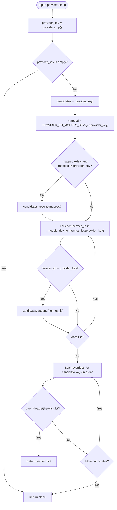
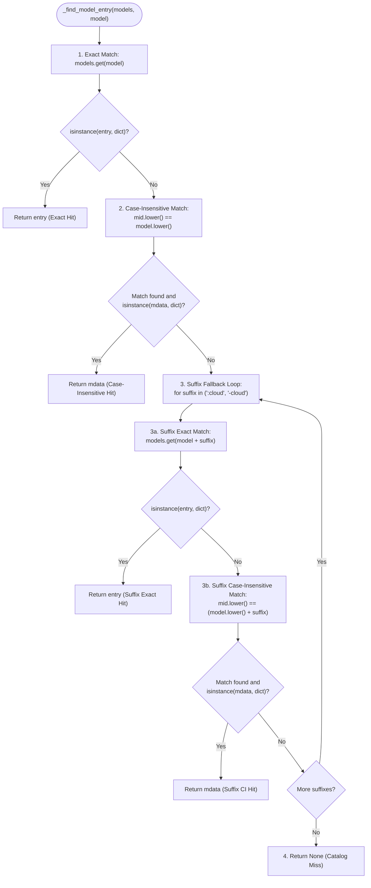
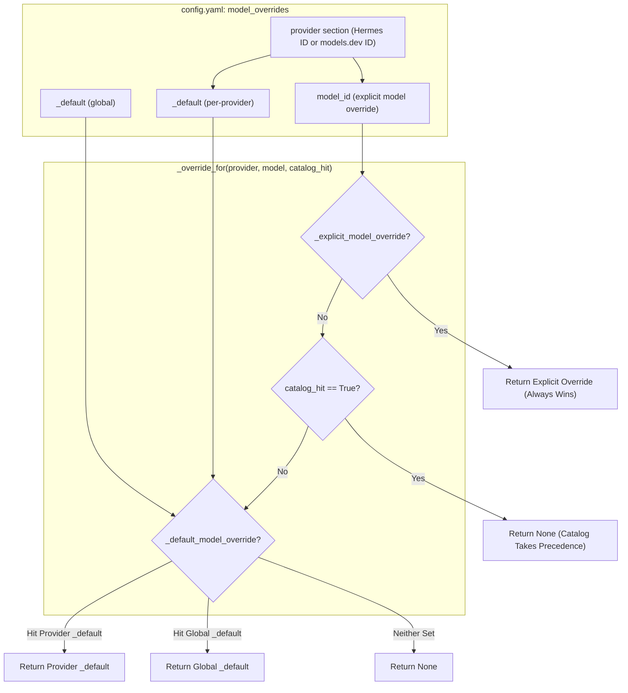
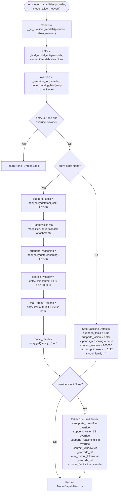

# Cloud Model Metadata (`models.dev`) Source Review

This document specifies the exact runtime semantics, resolution precedence, override hierarchy, field coercion, validation rules, and capability derivation of the cloud model metadata subsystem in [`agent/models_dev.py`](file:///home/eins0fx/development/hermes-agent-port/agent/models_dev.py). It provides verified findings for implementing cloud metadata query and override resolution in Rust without inventing substitutes.

---

## 1. Scope, Authority, and Source Mapping

### 1.1 Source Files and Line Ranges
- **Primary Integration**: [`agent/models_dev.py`](file:///home/eins0fx/development/hermes-agent-port/agent/models_dev.py)
  - Provider mapping constants & reverse lookup: [lines 164-236](file:///home/eins0fx/development/hermes-agent-port/agent/models_dev.py#L164-L236)
    - `PROVIDER_TO_MODELS_DEV`: [lines 169-220](file:///home/eins0fx/development/hermes-agent-port/agent/models_dev.py#L169-L220)
    - `_MODELS_DEV_TO_PROVIDER`: [lines 222-225](file:///home/eins0fx/development/hermes-agent-port/agent/models_dev.py#L222-L225)
    - `_models_dev_to_hermes_ids`: [lines 227-236](file:///home/eins0fx/development/hermes-agent-port/agent/models_dev.py#L227-L236)
  - Downstream context query & extraction helpers: [lines 740-844](file:///home/eins0fx/development/hermes-agent-port/agent/models_dev.py#L740-L844)
    - `lookup_models_dev_context`: [lines 740-821](file:///home/eins0fx/development/hermes-agent-port/agent/models_dev.py#L740-L821)
    - `_default_override_context`: [lines 823-829](file:///home/eins0fx/development/hermes-agent-port/agent/models_dev.py#L823-L829)
    - `_extract_context`: [lines 831-844](file:///home/eins0fx/development/hermes-agent-port/agent/models_dev.py#L831-L844)
  - Capability Dataclass: [lines 852-863](file:///home/eins0fx/development/hermes-agent-port/agent/models_dev.py#L852-L863)
    - `ModelCapabilities`: [lines 853-862](file:///home/eins0fx/development/hermes-agent-port/agent/models_dev.py#L853-L862)
  - Per-model override selectors & coercions: [lines 865-1100](file:///home/eins0fx/development/hermes-agent-port/agent/models_dev.py#L865-L1100)
    - Canonical override specification: [lines 865-885](file:///home/eins0fx/development/hermes-agent-port/agent/models_dev.py#L865-L885)
    - `_OVERRIDE_WARNED_KEYS`: [line 886](file:///home/eins0fx/development/hermes-agent-port/agent/models_dev.py#L886)
    - `_load_model_overrides`: [lines 889-904](file:///home/eins0fx/development/hermes-agent-port/agent/models_dev.py#L889-L904)
    - `_provider_override_section`: [lines 906-934](file:///home/eins0fx/development/hermes-agent-port/agent/models_dev.py#L906-L934)
    - `_explicit_model_override`: [lines 936-960](file:///home/eins0fx/development/hermes-agent-port/agent/models_dev.py#L936-L960)
    - `_default_model_override`: [lines 962-978](file:///home/eins0fx/development/hermes-agent-port/agent/models_dev.py#L962-L978)
    - `_override_for`: [lines 980-994](file:///home/eins0fx/development/hermes-agent-port/agent/models_dev.py#L980-L994)
    - `_override_int`: [lines 996-1015](file:///home/eins0fx/development/hermes-agent-port/agent/models_dev.py#L996-L1015)
    - `_override_context_window`: [lines 1017-1030](file:///home/eins0fx/development/hermes-agent-port/agent/models_dev.py#L1017-L1030)
    - `_override_to_catalog_shape`: [lines 1032-1068](file:///home/eins0fx/development/hermes-agent-port/agent/models_dev.py#L1032-L1068)
    - `_merge_catalog_entry_with_override`: [lines 1070-1100](file:///home/eins0fx/development/hermes-agent-port/agent/models_dev.py#L1070-L1100)
  - Catalog entry resolution & capability extraction: [lines 1102-1272](file:///home/eins0fx/development/hermes-agent-port/agent/models_dev.py#L1102-L1272)
    - `_get_provider_models`: [lines 1102-1133](file:///home/eins0fx/development/hermes-agent-port/agent/models_dev.py#L1102-L1133)
    - `_find_model_entry`: [lines 1135-1168](file:///home/eins0fx/development/hermes-agent-port/agent/models_dev.py#L1135-L1168)
    - `get_model_capabilities`: [lines 1170-1272](file:///home/eins0fx/development/hermes-agent-port/agent/models_dev.py#L1170-L1272)
  - Rich ModelInfo constructors & queries: [lines 1379-1556](file:///home/eins0fx/development/hermes-agent-port/agent/models_dev.py#L1379-L1556)
    - `_parse_model_info`: [lines 1379-1428](file:///home/eins0fx/development/hermes-agent-port/agent/models_dev.py#L1379-L1428)
    - `get_model_info`: [lines 1483-1556](file:///home/eins0fx/development/hermes-agent-port/agent/models_dev.py#L1483-L1556)

- **Interacting Callers**:
  - Context window pre-flight resolution: [`agent/model_metadata.py`](file:///home/eins0fx/development/hermes-agent-port/agent/model_metadata.py)
    - Step 0b (`_override_context_window` explicit override): [lines 3144-3151](file:///home/eins0fx/development/hermes-agent-port/agent/model_metadata.py#L3144-L3151)
    - Step 5f (`lookup_models_dev_context` catalog lookup): [lines 3531-3547](file:///home/eins0fx/development/hermes-agent-port/agent/model_metadata.py#L3531-L3547)
  - Vision capability lookup: [`agent/image_routing.py`](file:///home/eins0fx/development/hermes-agent-port/agent/image_routing.py)
    - `_lookup_supports_vision` calling `get_model_capabilities(allow_network=True)`: [lines 544-559](file:///home/eins0fx/development/hermes-agent-port/agent/image_routing.py#L544-L559)

- **Relevant Python Test Suites**:
  - Main test suite (capabilities, overrides, coercion, suffix hit): [`tests/agent/test_models_dev.py`](file:///home/eins0fx/development/hermes-agent-port/tests/agent/test_models_dev.py)
    - Provider mapping assertions: [lines 97-117](file:///home/eins0fx/development/hermes-agent-port/tests/agent/test_models_dev.py#L97-L117)
    - Vision detection tests: [lines 799-828](file:///home/eins0fx/development/hermes-agent-port/tests/agent/test_models_dev.py#L799-L828)
    - Override resolution & coercion tests: [lines 834-1308](file:///home/eins0fx/development/hermes-agent-port/tests/agent/test_models_dev.py#L834-L1308)
  - Meta/Muse Spark mapping: [`tests/agent/test_models_dev_meta_mapping.py`](file:///home/eins0fx/development/hermes-agent-port/tests/agent/test_models_dev_meta_mapping.py)
  - Preferred merge invariants: [`tests/hermes_cli/test_models_dev_preferred_merge.py`](file:///home/eins0fx/development/hermes-agent-port/tests/hermes_cli/test_models_dev_preferred_merge.py)
  - Image routing fallback: [`tests/agent/test_image_routing.py`](file:///home/eins0fx/development/hermes-agent-port/tests/agent/test_image_routing.py#L150-L180)

### 1.2 Separation of Concerns in the Rust Port
- **Existing Rust Registry Cache**: The multi-tiered caching state machine (memory, disk, background refresh worker, ETag conditional GETs, backoff, quarantine) is already implemented in [`rust/crates/hermes-gateway/src/models_dev.rs`](file:///home/eins0fx/development/hermes-agent-port/rust/crates/hermes-gateway/src/models_dev.rs).
- **Static vs Live Registry Discovery**: Live provider profile and plugin discovery (such as dynamic discovery under `providers/` or live endpoint queries) is strictly decoupled from `models.dev`'s static provider mapping dictionary (`PROVIDER_TO_MODELS_DEV`). `models.dev` operates purely on static string IDs.

---

## 2. Provider Mapping Architecture (Hermes ↔ models.dev)

### 2.1 Complete Static Mapping Table (`PROVIDER_TO_MODELS_DEV`)
The catalog is partitioned by `models.dev` provider ID. Hermes provider keys map to `models.dev` keys via [`PROVIDER_TO_MODELS_DEV`](file:///home/eins0fx/development/hermes-agent-port/agent/models_dev.py#L169-L220):

| Hermes Provider ID | `models.dev` Provider ID | Mapping Type | Rationale & Behavioral Notes |
| :--- | :--- | :--- | :--- |
| `openrouter` | `openrouter` | Identity (1:1) | Standard identity mapping |
| `novita` | `novita-ai` | Distinct (1:1) | Upstream provider rename |
| `anthropic` | `anthropic` | Identity (1:1) | Standard identity mapping |
| `openai` | `openai` | Many-to-One | Primary OpenAI endpoint |
| `openai-codex` | `openai` | Many-to-One | Codex OAuth shares the OpenAI model catalog |
| `zai` | `zai` | Identity (1:1) | Standard identity mapping |
| `kimi` | `kimi-for-coding` | Many-to-One | Moonshot / Kimi coding API endpoint |
| `kimi-coding` | `kimi-for-coding` | Many-to-One | Coding plan variant |
| `moonshot` | `kimi-for-coding` | Many-to-One | Legacy Moonshot naming |
| `kimi-coding-cn` | `kimi-for-coding` | Many-to-One | Domestic China Kimi coding relay |
| `stepfun` | `stepfun` | Identity (1:1) | Standard identity mapping |
| `minimax` | `minimax` | Many-to-One | Global MiniMax endpoint |
| `minimax-oauth` | `minimax` | Many-to-One | MiniMax OAuth authentication path |
| `minimax-cn` | `minimax-cn` | Distinct (1:1) | Domestic China endpoint with separate catalog |
| `deepseek` | `deepseek` | Identity (1:1) | Standard identity mapping |
| `alibaba` | `alibaba` | Many-to-One | DashScope / Alibaba Cloud endpoint |
| `qwen-oauth` | `alibaba` | Many-to-One | Qwen OAuth shares DashScope catalog |
| `copilot` | `github-copilot` | Distinct (1:1) | GitHub Copilot backend |
| `ai-gateway` | `vercel` | Distinct (1:1) | Vercel AI Gateway backend |
| `opencode-zen` | `opencode` | Many-to-One | Zen relay endpoint |
| `opencode-go` | `opencode-go` | Distinct (1:1) | Dedicated Go relay endpoint |
| `opencode-free` | `opencode` | Many-to-One | Zen-hosted free tier listing `*-contributor-free` SKUs |
| `kilocode` | `kilo` | Distinct (1:1) | Kilo Gateway backend |
| `fireworks` | `fireworks-ai` | Distinct (1:1) | Fireworks AI backend |
| `huggingface` | `huggingface` | Identity (1:1) | Standard identity mapping |
| `gemini` | `google` | Many-to-One | Google Gemini provider alias |
| `google` | `google` | Many-to-One | Google Gemini native key |
| `xai` | `xai` | Many-to-One | xAI endpoint |
| `xai-oauth` | `xai` | Many-to-One | xAI OAuth transport shares xAI catalog |
| `xiaomi` | `xiaomi` | Identity (1:1) | Standard identity mapping |
| `nvidia` | `nvidia` | Identity (1:1) | Standard identity mapping |
| `meta-ai` | `meta` | Many-to-One | Meta Model API (`api.meta.ai`, Muse Spark family) |
| `meta` | `meta` | Many-to-One | Direct `meta` identifier |
| `groq` | `groq` | Identity (1:1) | Standard identity mapping |
| `mistral` | `mistral` | Identity (1:1) | Standard identity mapping |
| `togetherai` | `togetherai` | Identity (1:1) | Standard identity mapping |
| `perplexity` | `perplexity` | Identity (1:1) | Standard identity mapping |
| `cohere` | `cohere` | Identity (1:1) | Standard identity mapping |
| `ollama-cloud` | `ollama-cloud` | Identity (1:1) | Ollama Cloud proxy |

Total entries: 39 Hermes provider keys mapping to 32 distinct `models.dev` provider IDs.

### 2.2 Lazy Reverse Mapping (`_models_dev_to_hermes_ids`)
Because the forward mapping is many-to-one, reverse resolution yields a list of Hermes IDs for a given `models.dev` ID. In Python, this is populated lazily on first access:

```python
_MODELS_DEV_TO_PROVIDER: Optional[Dict[str, List[str]]] = None

def _models_dev_to_hermes_ids(mdev_id: str) -> List[str]:
    global _MODELS_DEV_TO_PROVIDER
    if _MODELS_DEV_TO_PROVIDER is None:
        reverse: Dict[str, List[str]] = {}
        for hermes_id, mapped in PROVIDER_TO_MODELS_DEV.items():
            reverse.setdefault(mapped, []).append(hermes_id)
        _MODELS_DEV_TO_PROVIDER = reverse
    return _MODELS_DEV_TO_PROVIDER.get(mdev_id, [])
```

Examples of reverse mappings:
- `"kimi-for-coding"` $\rightarrow$ `["kimi", "kimi-coding", "moonshot", "kimi-coding-cn"]`
- `"google"` $\rightarrow$ `["gemini", "google"]`
- `"meta"` $\rightarrow$ `["meta-ai", "meta"]`
- `"openai"` $\rightarrow$ `["openai", "openai-codex"]`
- `"opencode"` $\rightarrow$ `["opencode-zen", "opencode-free"]`
- `"github-copilot"` $\rightarrow$ `["copilot"]`
- `"unknown-provider"` $\rightarrow$ `[]`

### 2.3 Provider Override Candidate Resolution
When reading user configuration from `config.yaml` (`model_overrides`), a user might key a section using either the Hermes provider name (e.g. `copilot`, `gemini`, `meta-ai`) or the upstream `models.dev` identifier (e.g. `github-copilot`, `google`, `meta`).

[`_provider_override_section(provider: str)`](file:///home/eins0fx/development/hermes-agent-port/agent/models_dev.py#L906-L934) constructs an ordered candidate list to look up the section in `model_overrides`:



#### Precedence Examples:
1. Caller passes `"copilot"`:
   - Candidates: `["copilot", "github-copilot"]`
   - Config keyed by `copilot` matches on index 0; config keyed by `github-copilot` matches on index 1.
2. Caller passes `"github-copilot"`:
   - Candidates: `["github-copilot", "copilot"]`
   - Config keyed by `github-copilot` matches on index 0; config keyed by `copilot` matches on index 1 via reverse alias.
3. Caller passes `"meta-ai"`:
   - Candidates: `["meta-ai", "meta"]`
4. Caller passes `"meta"`:
   - Candidates: `["meta", "meta-ai"]` (forward mapping `meta` $\rightarrow$ `meta` is skipped because `mapped == provider_key`; reverse mapping appends `meta-ai`).
5. Caller passes an unknown provider `"custom:my-vllm"`:
   - Candidates: `["custom:my-vllm"]` (no forward or reverse entries exist).

### 2.4 Behavior with Unknown Providers
- **In Catalog Retrieval ([`_get_provider_models`](file:///home/eins0fx/development/hermes-agent-port/agent/models_dev.py#L1102-L1133))**:
  ```python
  mdev_provider_id = PROVIDER_TO_MODELS_DEV.get(provider)
  if not mdev_provider_id:
      return None
  ```
  If `provider` is not in `PROVIDER_TO_MODELS_DEV`, `_get_provider_models` immediately returns `None`. Note: Even if a caller passes `"github-copilot"` directly into `_get_provider_models`, it returns `None` because `PROVIDER_TO_MODELS_DEV` is keyed by Hermes IDs.
- **In Rich Model Info ([`get_model_info`](file:///home/eins0fx/development/hermes-agent-port/agent/models_dev.py#L1502))**:
  ```python
  mdev_id = PROVIDER_TO_MODELS_DEV.get(provider_id, provider_id)
  ```
  `get_model_info` falls back to using `provider_id` directly, allowing queries directly in `models.dev` provider ID space.
- **In Override Resolution**:
  Unknown providers are fully valid in `model_overrides`. Lookups for unknown providers bypass catalog fetching and resolve directly via `_override_for(..., catalog_hit=False)`.

---

## 3. Model Lookup and Matching Precedence (`_find_model_entry`)

### 3.1 Precedence Algorithm
[`_find_model_entry(models: Dict[str, Any], model: str) -> Optional[Dict[str, Any]]`](file:///home/eins0fx/development/hermes-agent-port/agent/models_dev.py#L1135-L1168) executes a strict 4-step search:



### 3.2 Comparison Across All Model Resolution Functions

| Feature | `_find_model_entry` | `lookup_models_dev_context` | `get_model_info` | `_explicit_model_override` |
| :--- | :--- | :--- | :--- | :--- |
| **Exact Match** | Yes (`models.get(model)`) | Yes (`models.get(model)`) | Yes (`models.get(model_id)`) | Yes (`section.get(model_key)`) |
| **Case-Insensitive** | Yes (`mid.lower() == model_lower`) | Yes (`mid.lower() == model_lower`) | Yes (`mid.lower() == model_lower`) | Yes (`mid.lower() == model_lower`) |
| **`_default` Sentinel Skip** | N/A (catalog has no `_default`) | N/A (catalog has no `_default`) | N/A (catalog has no `_default`) | **Yes** (`if mid == "_default": continue`) |
| **Suffix Fallback (`:cloud`)** | **Yes** (Exact, then CI) | **Yes** (Exact, then CI) | **No** (Direct fallthrough) | **No** |
| **Suffix Fallback (`-cloud`)** | **Yes** (Exact, then CI) | **Yes** (Exact, then CI) | **No** (Direct fallthrough) | **No** |
| **Payload Validation** | `isinstance(entry, dict)` | `_extract_context(entry) > 0` | `isinstance(entry, dict)` | `isinstance(entry, dict)` |
| **Continuation on Invalid** | Returns dictionary immediately | Continues searching if `context <= 0` | Returns dictionary immediately | Returns dictionary immediately |

### 3.3 The Suffix Fallback Rationale and Fill-Gap Interaction
1. **Ollama Cloud Divergence**: Remote proxies like `ollama-cloud` return bare wire names (e.g. `kimi-k2.6`), but `models.dev` stores entries keyed as `kimi-k2.6:cloud`. Without suffix fallback, lookups for `kimi-k2.6` miss the catalog completely.
2. **Protection Against `_default` Clamping**:
   - `_override_for(..., catalog_hit=...)` receives `catalog_hit = (entry is not None)`.
   - When `_find_model_entry` resolves `kimi-k2.6` $\rightarrow$ `kimi-k2.6:cloud`, `entry` is non-null, establishing `catalog_hit = True`.
   - As a result, `_override_for` evaluates:
     ```python
     if catalog_hit:
         return None
     ```
   - This ensures a provider fill-gap default (e.g. `_default: {context_window: 1000}`) **never clamps** a suffix-keyed model in the catalog. The model retains its true catalog context (262,144 tokens) rather than being corrupted by the default (verified by `test_suffix_keyed_model_counts_as_catalog_hit`).

---

## 4. Configuration Override System (`model_overrides`)

### 4.1 Canonical Schema
The override system exposes **one canonical schema** across all consumers:

| Field Name | Type | Value Constraint | Catalog Mapping / Equivalent |
| :--- | :--- | :--- | :--- |
| `context_window` | `int` | Strictly $> 0$ (positive integer) | `limit.context` |
| `max_output_tokens` | `int` | Strictly $> 0$ (positive integer) | `limit.output` |
| `supports_tools` | `bool` | Coerced via `bool(val)` | `tool_call` |
| `supports_vision` | `bool` | Coerced via `bool(val)` | `attachment` and `modalities.input` |
| `supports_reasoning` | `bool` | Coerced via `bool(val)` | `reasoning` |
| `model_family` | `str` | String or empty string | `family` |

Internal catalog structures (such as `limit`, `cost`, `modalities`) are hidden from user configuration. The override subsystem translates this canonical schema into the catalog shape via [`_override_to_catalog_shape`](file:///home/eins0fx/development/hermes-agent-port/agent/models_dev.py#L1032-L1068).

### 4.2 Hierarchy of Override Selectors



#### Selector Functions:
1. **[`_load_model_overrides() -> Dict[str, Any]`](file:///home/eins0fx/development/hermes-agent-port/agent/models_dev.py#L889-L904)**:
   - Reads `cfg_get(load_config_readonly(), "model_overrides", default={})`.
   - Deliberately omits local in-memory memoization. `load_config_readonly()` is already cached by file modification time (`mtime`) and size. An `id(cfg)` cache would risk returning stale overrides when CPython reuses freed dictionary memory addresses.
   - Returns `{}` on any failure or missing configuration.
2. **[`_explicit_model_override(provider: str, model: str) -> Optional[Dict[str, Any]]`](file:///home/eins0fx/development/hermes-agent-port/agent/models_dev.py#L936-L960)**:
   - Trims `(model or "").strip()`; returns `None` if empty.
   - Resolves provider section via `_provider_override_section(provider)`.
   - Matches model key:
     1. Exact: `section.get(model_key)`
     2. Case-insensitive: `mid.lower() == model_lower`, explicitly skipping `mid == "_default"`.
   - Returns dictionary if found, else `None`.
3. **[`_default_model_override(provider: str) -> Optional[Dict[str, Any]]`](file:///home/eins0fx/development/hermes-agent-port/agent/models_dev.py#L962-L978)**:
   - Checks per-provider default: `section.get("_default")`.
   - Checks global default: `overrides.get("_default")`.
   - First non-empty dictionary wins; returns `None` if neither is defined.
4. **[`_override_for(provider: str, model: str, *, catalog_hit: bool) -> Optional[Dict[str, Any]]`](file:///home/eins0fx/development/hermes-agent-port/agent/models_dev.py#L980-L994)**:
   - If explicit override exists $\rightarrow$ always returns it.
   - If `catalog_hit` is `True` $\rightarrow$ returns `None` (fill-gap defaults never override catalog data).
   - If `catalog_hit` is `False` $\rightarrow$ returns `_default_model_override(provider)`.
5. **[`_override_context_window(provider: str, model: str) -> Optional[int]`](file:///home/eins0fx/development/hermes-agent-port/agent/models_dev.py#L1017-L1030)**:
   - **Explicit-only**: Calls `_explicit_model_override` and coerces `context_window` via `_override_int`.
   - Ignores all `_default` entries.
   - Executed early in [`agent/model_metadata.py`](file:///home/eins0fx/development/hermes-agent-port/agent/model_metadata.py#L3144-L3151) (Step 0b, before custom providers and live probes) so a default cannot preempt specific local/custom provider configurations.

---

## 5. Type Coercion and Validation (`_override_int`)

### 5.1 Validation Semantics
[`_override_int(override: Dict[str, Any], key: str) -> Optional[int]`](file:///home/eins0fx/development/hermes-agent-port/agent/models_dev.py#L996-L1015) governs all integer fields in overrides (`context_window`, `max_output_tokens`):

```python
def _override_int(override: Dict[str, Any], key: str) -> Optional[int]:
    raw = override.get(key)
    if raw is None:
        return None
    try:
        value = int(raw)
        if value > 0:
            return value
    except (TypeError, ValueError):
        pass
    warn_key = (key, repr(raw))
    if warn_key not in _OVERRIDE_WARNED_KEYS:
        _OVERRIDE_WARNED_KEYS.add(warn_key)
        logger.warning(
            "model_overrides: ignoring invalid %s value %r "
            "(expected a positive integer)", key, raw,
        )
    return None
```

### 5.2 Strict Rules
1. **Missing or `None`**: Returns `None` silently without logging warnings.
2. **Positive Integer Enforcement**:
   - `value > 0` is required.
   - Zero (`0`) or negative values (`-100`) are rejected and trigger a warning.
3. **Type Coercion**:
   - Valid integer types (`int`) or cleanly coercible numeric strings (e.g. `"128000"`) succeed.
   - Garbage strings (e.g. `"512k"`, `"large"`), lists, or dictionaries raise `ValueError`/`TypeError`, returning `None`.
4. **One-Shot Deduplication Warning**:
   - Keyed by `(key, repr(raw))` in `_OVERRIDE_WARNED_KEYS`.
   - Identical invalid values log exactly once across the process lifetime, preventing log flooding on hot execution paths.

---

## 6. Capability Derivation (`get_model_capabilities`)

### 6.1 Complete Execution Flow
[`get_model_capabilities(provider: str, model: str, *, allow_network: bool = False) -> Optional[ModelCapabilities]`](file:///home/eins0fx/development/hermes-agent-port/agent/models_dev.py#L1170-L1272):



### 6.2 Baseline Defaults for Catalog Misses
When a model is absent from the catalog but covered by an override (either explicit or fill-gap `_default`):
- `supports_tools`: `True` (agentic default)
- `supports_vision`: `False`
- `supports_reasoning`: `False`
- `context_window`: `200000`
- `max_output_tokens`: `8192`
- `model_family`: `""`

Fields not mentioned in the override dict retain these safe defaults. This guarantees that partial overrides (e.g. setting only `supports_reasoning: true`) do not result in zero context length or disabled tools (verified by `test_model_info_unknown_model_gets_safe_defaults`).

---

## 7. Modality vs Attachment Mechanics

### 7.1 Catalog Priority Order
`models.dev` historically used a single boolean field `attachment: bool` to signal vision capability. Newer catalog schemas represent multimodal capabilities in a structured dictionary: `modalities.input = ["text", "image"]`.

In [`get_model_capabilities`](file:///home/eins0fx/development/hermes-agent-port/agent/models_dev.py#L1214-L1222), resolution prioritizes `modalities.input`:

```python
input_mods = entry.get("modalities", {})
if isinstance(input_mods, dict):
    input_mods = input_mods.get("input")
else:
    input_mods = None

if isinstance(input_mods, list):
    supports_vision = "image" in input_mods
else:
    supports_vision = bool(entry.get("attachment", False))
```

#### Resolution Rules:
1. **Explicit Modalities Present**: If `entry["modalities"]["input"]` is a valid `list`, vision capability is determined strictly by `"image" in input_mods`. The legacy `attachment` flag is **completely ignored**.
   - Example 1: `attachment: true`, but `modalities: {"input": ["text"]}` $\rightarrow$ `supports_vision = False`. The stale `attachment` flag is discarded (regression test: `test_vision_aware_preprocessing`).
   - Example 2: `attachment: false`, but `modalities: {"input": ["text", "image"]}` $\rightarrow$ `supports_vision = True` (e.g. `gemma-4-31b-it`).
2. **Missing or Invalid Modalities**:
   - If `modalities` is missing, `None`, or not a `dict` (e.g. `"modalities": "text"`), falls back to `bool(entry.get("attachment", False))`.
   - If `modalities["input"]` is `None` or not a `list`, falls back to `bool(entry.get("attachment", False))`.

### 7.2 Override Translation to Catalog Shape
In [`_override_to_catalog_shape`](file:///home/eins0fx/development/hermes-agent-port/agent/models_dev.py#L1061-L1067) and [`_merge_catalog_entry_with_override`](file:///home/eins0fx/development/hermes-agent-port/agent/models_dev.py#L1087-L1097):
- An override with `"supports_vision": true/false`:
  - Directly sets `patch["attachment"] = vision`.
  - Transmits `vision` out-of-band to update `modalities.input`:
    - If `vision == True` and `"image"` is not in `input_mods` $\rightarrow$ appends `"image"`.
    - If `vision == False` and `"image"` is in `input_mods` $\rightarrow$ removes `"image"`.
- This ensures downstream consumers inspecting either `attachment` or `input_modalities` see synchronized state (verified by `test_model_info_vision_override_sets_input_modality`).

---

## 8. Tricky Cases and Edge Invariants

### 8.1 Suffix-Keyed Models Count as Catalog Hits
- **Scenario**: Catalog has `kimi-k2.6:cloud` under `ollama-cloud`. Caller queries `get_model_capabilities("ollama-cloud", "kimi-k2.6")`. User configured `model_overrides.ollama-cloud._default: {context_window: 1000}`.
- **Behavior**: `_find_model_entry` resolves `kimi-k2.6` $\rightarrow$ `kimi-k2.6:cloud`. `catalog_hit` is `True`. `_override_for` suppresses the `_default`.
- **Result**: Context window is 262,144 tokens (catalog value), NOT 1,000 tokens.

### 8.2 Partial Override Sub-Dict Merging
- **Scenario**: Catalog has `claude-sonnet-4-6` with `limit = {"context": 1000000, "output": 64000}`. User configures explicit override `{context_window: 500000}`.
- **Behavior**: [`_merge_catalog_entry_with_override`](file:///home/eins0fx/development/hermes-agent-port/agent/models_dev.py#L1070-L1100) merges `limit` rather than replacing the sub-dictionary.
- **Result**: `limit.context` becomes 500,000; `limit.output` remains 64,000.

### 8.3 Completely Unknown Providers
- **Scenario**: Provider `custom:my-vllm` queried.
- **Behavior**: `_get_provider_models` returns `None`. `entry` is `None`. If `model_overrides` has section `custom:my-vllm`, `_override_for` returns the override.
- **Result**: Baseline defaults (tools=True, vision=False, etc.) are seeded, and override fields are patched. Returns valid `ModelCapabilities` without network or catalog lookup.

### 8.4 Hot-Path Network Prohibition
- **Default Argument**: `allow_network=False` across `get_model_capabilities`, `lookup_models_dev_context`, `get_model_info`.
- **Reason**: Called synchronously during active conversation loops and token estimation. Must never block on DNS or HTTP latency.
- **Exceptions**: `agent/image_routing.py` explicitly passes `allow_network=True` because routing a real image attachment requires accurate catalog confirmation on cold starts.

---

## 9. Rust Implementation Specifications

For implementing metadata queries against the existing `ModelsDev` cache in [`rust/crates/hermes-gateway/src/models_dev.rs`](file:///home/eins0fx/development/hermes-agent-port/rust/crates/hermes-gateway/src/models_dev.rs):

### 9.1 Data Structures
```rust
#[derive(Debug, Clone, PartialEq, Eq)]
pub struct ModelCapabilities {
    pub supports_tools: bool,
    pub supports_vision: bool,
    pub supports_reasoning: bool,
    pub context_window: u64,
    pub max_output_tokens: u64,
    pub model_family: String,
}

impl Default for ModelCapabilities {
    fn default() -> Self {
        Self {
            supports_tools: true,
            supports_vision: false,
            supports_reasoning: false,
            context_window: 200_000,
            max_output_tokens: 8_192,
            model_family: String::new(),
        }
    }
}
```

### 9.2 Provider ID Mapping Table
```rust
pub static PROVIDER_TO_MODELS_DEV: &[(&str, &str)] = &[
    ("openrouter", "openrouter"),
    ("novita", "novita-ai"),
    ("anthropic", "anthropic"),
    ("openai", "openai"),
    ("openai-codex", "openai"),
    ("zai", "zai"),
    ("kimi", "kimi-for-coding"),
    ("kimi-coding", "kimi-for-coding"),
    ("moonshot", "kimi-for-coding"),
    ("stepfun", "stepfun"),
    ("kimi-coding-cn", "kimi-for-coding"),
    ("minimax", "minimax"),
    ("minimax-oauth", "minimax"),
    ("minimax-cn", "minimax-cn"),
    ("deepseek", "deepseek"),
    ("alibaba", "alibaba"),
    ("qwen-oauth", "alibaba"),
    ("copilot", "github-copilot"),
    ("ai-gateway", "vercel"),
    ("opencode-zen", "opencode"),
    ("opencode-go", "opencode-go"),
    ("opencode-free", "opencode"),
    ("kilocode", "kilo"),
    ("fireworks", "fireworks-ai"),
    ("huggingface", "huggingface"),
    ("gemini", "google"),
    ("google", "google"),
    ("xai", "xai"),
    ("xai-oauth", "xai"),
    ("xiaomi", "xiaomi"),
    ("nvidia", "nvidia"),
    ("meta-ai", "meta"),
    ("meta", "meta"),
    ("groq", "groq"),
    ("mistral", "mistral"),
    ("togetherai", "togetherai"),
    ("perplexity", "perplexity"),
    ("cohere", "cohere"),
    ("ollama-cloud", "ollama-cloud"),
];
```

### 9.3 Matching Logic Pseudo-Implementation
```rust
impl ModelsDev {
    pub fn find_model_entry<'a>(&self, models: &'a Value, model: &str) -> Option<&'a Value> {
        let obj = models.as_object()?;

        // 1. Exact match
        if let Some(entry) = obj.get(model).filter(|v| v.is_object()) {
            return Some(entry);
        }

        // 2. Case-insensitive match
        for (k, v) in obj {
            if k.eq_ignore_ascii_case(model) && v.is_object() {
                return Some(v);
            }
        }

        // 3. Suffix fallback (:cloud, -cloud)
        for suffix in &[":cloud", "-cloud"] {
            let suffixed = format!("{model}{suffix}");
            if let Some(entry) = obj.get(&suffixed).filter(|v| v.is_object()) {
                return Some(entry);
            }
            for (k, v) in obj {
                if k.eq_ignore_ascii_case(&suffixed) && v.is_object() {
                    return Some(v);
                }
            }
        }

        None
    }
}
```

---

## 10. Verification Matrix

| Test Suite / Target | Python Test Path | Invariants Verified |
| :--- | :--- | :--- |
| **Provider Mappings** | [`test_models_dev.py:97-117`](file:///home/eins0fx/development/hermes-agent-port/tests/agent/test_models_dev.py#L97-L117) | All strings, known providers, OAuth mappings, unmapped rejection |
| **Hot Path Network Prohibition** | [`test_models_dev.py:715-754`](file:///home/eins0fx/development/hermes-agent-port/tests/agent/test_models_dev.py#L715-L754) | `allow_network=False` by default; opt-in preserves zero-arg call |
| **Vision Modality vs Attachment** | [`test_models_dev.py:799-828`](file:///home/eins0fx/development/hermes-agent-port/tests/agent/test_models_dev.py#L799-L828) | `modalities.input` list overrides attachment; non-dict handles safely |
| **Override Resolution & Hierarchy** | [`test_models_dev.py:844-959`](file:///home/eins0fx/development/hermes-agent-port/tests/agent/test_models_dev.py#L844-L959) | Explicit beats `_default`; provider `_default` beats global; alias candidate resolution |
| **Fill-Gap `_default` Semantics** | [`test_models_dev.py:904-919`](file:///home/eins0fx/development/hermes-agent-port/tests/agent/test_models_dev.py#L904-L919) | `_default` never clamps catalog-known models |
| **Early Context Window Override** | [`test_models_dev.py:962-998`](file:///home/eins0fx/development/hermes-agent-port/tests/agent/test_models_dev.py#L962-L998) | Step 0b explicit-only; rejects 0; ignores `_default` |
| **One-Shot Malformed Warning** | [`test_models_dev.py:999-1015`](file:///home/eins0fx/development/hermes-agent-port/tests/agent/test_models_dev.py#L999-L1015) | Coercion failure warns once per `(key, repr(raw))` |
| **Unknown Model Defaults** | [`test_models_dev.py:1018-1038`](file:///home/eins0fx/development/hermes-agent-port/tests/agent/test_models_dev.py#L1018-L1038) | Partial override retains 200K context and tools enabled |
| **Suffix-Keyed Catalog Hit** | [`test_models_dev.py:1247-1273`](file:///home/eins0fx/development/hermes-agent-port/tests/agent/test_models_dev.py#L1247-L1273) | `kimi-k2.6:cloud` counts as catalog hit; resists `_default` clamping |
| **Modality Update on Override** | [`test_models_dev.py:1292-1308`](file:///home/eins0fx/development/hermes-agent-port/tests/agent/test_models_dev.py#L1292-L1308) | `supports_vision: true` updates `input_modalities` and `attachment` |
