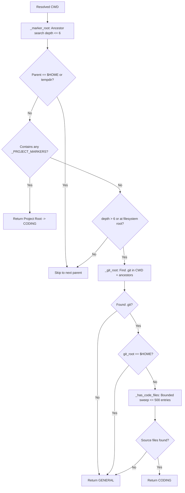
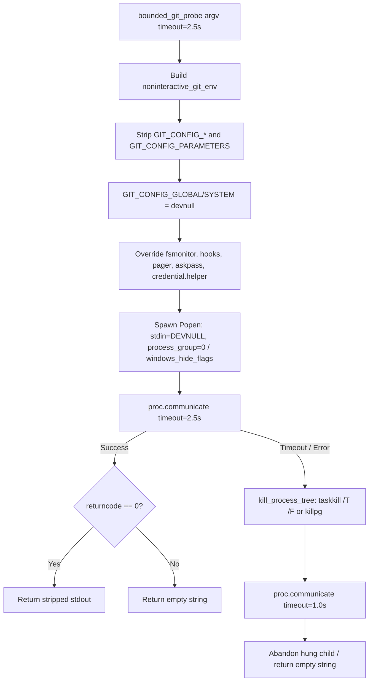
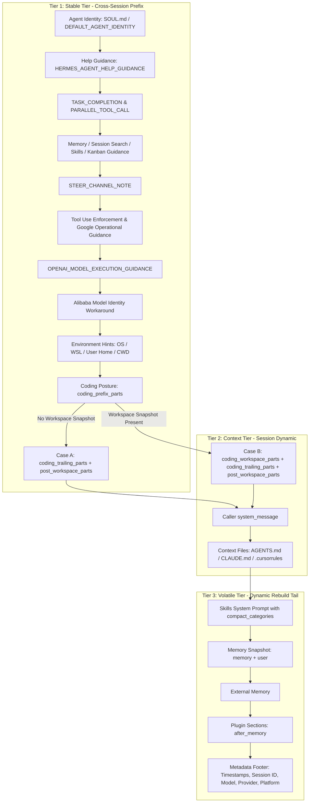
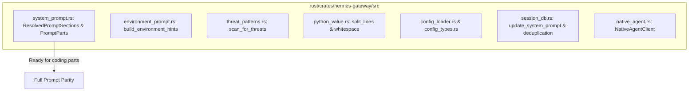

# Coding Context Mapping & Parity Architecture

**Target Document:** [`rust/analysis/coding-context-map.md`](file:///home/eins0fx/development/hermes-agent-port/rust/analysis/coding-context-map.md)
**Scope:** Deep architectural mapping of [`agent/coding_context.py`](file:///home/eins0fx/development/hermes-agent-port/agent/coding_context.py), specifically [`coding_system_prompt_parts`](file:///home/eins0fx/development/hermes-agent-port/agent/coding_context.py#L678-L690) and [`coding_compact_skill_categories`](file:///home/eins0fx/development/hermes-agent-port/agent/coding_context.py#L692-L709), their exact activation gates, loaders, prompt constants, git probes, system prompt assembly ordering, and cache behavior.
**Mode:** Read-only analysis. No code modified. No `cargo` commands run.

---

## 1. Executive Summary & Core Invariants

The coding context subsystem in [`agent/coding_context.py`](file:///home/eins0fx/development/hermes-agent-port/agent/coding_context.py) provides workspace awareness and pair-programming posture across all interactive surfaces (`cli`, `tui`, `acp`, `desktop`). It ensures that Hermes shifts into a coding posture when operating inside a code workspace, steering tool usage, prompt guidance, edit formats, and toolsets without scattering workspace detection across disparate modules.

```mermaid
flowchart TD
    Start([resolve_runtime_mode]) --> ReadMode[_coding_mode config]
    ReadMode --> CheckMode{Mode?}

    CheckMode -- "off" --> GeneralProfile[Return GENERAL_PROFILE]
    CheckMode -- "on" --> CodingProfile[Return CODING_PROFILE]
    CheckMode -- "auto" / "focus" --> CheckPlatform{Interactive Platform?}

    CheckPlatform -- No --> GeneralProfile
    CheckPlatform -- Yes --> CheckMarker{Project Marker in Ancestors <= 6?}

    CheckMarker -- Yes (Skip $HOME/temp) --> CodingProfile
    CheckMarker -- No --> CheckGit{Git Repo in Ancestors?}

    CheckGit -- No --> GeneralProfile
    CheckGit -- Yes (Dotfiles at $HOME?) --> DotfilesGuard{git_root == $HOME?}
    DotfilesGuard -- Yes --> GeneralProfile
    DotfilesGuard -- No --> CheckCodeFiles{_has_code_files <= 500 entries?}

    CheckCodeFiles -- Yes --> CodingProfile
    CheckCodeFiles -- No --> GeneralProfile

    CodingProfile --> AssembleParts[system_prompt_parts]
    AssembleParts --> Prefix[prefix_parts: Brief + Edit Nudge]
    AssembleParts --> Snapshot[workspace_parts: Git Status + Project Facts]
    AssembleParts --> Trailing[trailing_parts: Operator Instructions]

    Snapshot --> SnapshotCheck{Snapshot present?}
    SnapshotCheck -- No --> StableTail[coding_trailing + post_workspace -> STABLE TIER]
    SnapshotCheck -- Yes --> ContextTail[coding_workspace + coding_trailing + post_workspace -> CONTEXT TIER]
```

### Invariants & Non-Negotiable Boundaries

1. **Immutable Session Resolution (`RuntimeMode`):**
   The posture is resolved **once** per session via [`resolve_runtime_mode()`](file:///home/eins0fx/development/hermes-agent-port/agent/coding_context.py#L602-L630). It is frozen and immutable. Detection itself is intentionally unmemoized to prevent cross-session contamination across different directories in long-lived gateway processes, but callers store the resolved `RuntimeMode` for the session lifetime.
2. **Prompt-Only by Default:**
   Under default `auto` (and forced `on`), the coding posture affects **only the system prompt** (operating brief and workspace snapshot). Configured toolsets and the skill index are left completely untouched. Toolset collapse to `coding` (+ enabled MCP servers) and skill category demotion to names-only are strictly gated behind the explicit opt-in `focus` mode (`"focus"`, `"strict"`, `"lean"`).
3. **Session Snapshot Cache Stability:**
   The workspace snapshot ([`build_coding_workspace_block`](file:///home/eins0fx/development/hermes-agent-port/agent/coding_context.py#L881-L933)) is built once at session startup. It is **never** re-probed turn-by-turn. Re-probing on every turn would shatter LLM KV-cache reuse. The brief explicitly instructs the model to re-verify git state via tools before acting on the snapshot.
4. **Cache Tier Bifurcation:**
   In [`agent/system_prompt.py:704-709`](file:///home/eins0fx/development/hermes-agent-port/agent/system_prompt.py#L704-L709) and [`874-878`](file:///home/eins0fx/development/hermes-agent-port/agent/system_prompt.py#L874-L878), prompt assembly order is strictly preserved:
   - When a workspace snapshot is present: `coding_workspace_parts`, `coding_trailing_parts`, and all `post_workspace_parts` (Python probe, Bot Mode protocol, profile hint, platform hint) shift into the **Context Tier** (Tier 2).
   - When no workspace snapshot is present: `coding_trailing_parts` and all `post_workspace_parts` remain in the **Stable Tier** (Tier 1) immediately following `coding_prefix_parts`.
5. **Git Subprocess Isolation & Security (GHSA-7x36-8jrh-v4pw):**
   All git probes run automatically against the session's working directory prior to tool approval. Untrusted repositories could trigger arbitrary code execution via repository-configured git hooks, `core.fsmonitor`, custom pagers, or credential helpers. All git probes must run under [`noninteractive_git_env()`](file:///home/eins0fx/development/hermes-agent-port/hermes_cli/_subprocess_compat.py#L402-L480) with global/system configs redirected to `os.devnull`, execution sinks disabled, and bounded timeouts (`_GIT_TIMEOUT = 2.5s`).
6. **Windows Post-Kill Deadlock Prevention:**
   Killing a timed-out `git` launcher on Windows leaves suspended child processes holding inherited stdout/stderr pipe handles. Probes must use tree-killing (`taskkill /T /F` on Windows, process-group `killpg` on POSIX) followed by a bounded drain to prevent deadlocks (issues #68609, #66037).
7. **Dotfiles & Tempdir False-Positive Guards:**
   A `.git` repository located at `$HOME` (the common dotfiles pattern) must **never** flip sessions into the coding posture. Similarly, project markers in `$HOME` or `/tmp` (e.g. `~/Makefile` or `/tmp/package.json`) are ignored during project root discovery.
8. **Demotion vs. Hiding for Skills:**
   Under `focus` mode, non-coding skill categories are demoted to **names-only** (`category [names only]: name1, name2`), **never hidden**. Pruning skills entirely destroys project memory (runbooks, learned pitfalls), as models rarely discover unlisted skills via `skills_list`.

---

## 2. Python Reference Architecture & Entry Points

### 2.1 Entry Point: [`coding_system_prompt_parts`](file:///home/eins0fx/development/hermes-agent-port/agent/coding_context.py#L678-L690)

```python
def coding_system_prompt_parts(
    *,
    platform: Optional[str] = None,
    cwd: Optional[str | Path] = None,
    config: Optional[dict[str, Any]] = None,
    model: Optional[str] = None,
    valid_tool_names=None,
) -> tuple[list[str], list[str], list[str]]:
```

The function delegates to [`RuntimeMode.system_prompt_parts()`](file:///home/eins0fx/development/hermes-agent-port/agent/coding_context.py#L523-L568) and returns a 3-tuple `(prefix_parts, workspace_parts, trailing_parts)`:

```mermaid
flowchart TD
    Call([coding_system_prompt_parts]) --> Resolve[resolve_runtime_mode]
    Resolve --> CheckCoding{is_coding?}
    CheckCoding -- No --> ReturnEmpty[Return [], [], []]

    CheckCoding -- Yes --> InitLists[prefix = [], workspace_parts = [], trailing = []]
    InitLists --> CheckGuidance{profile.guidance non-empty?}

    CheckGuidance -- Yes --> FetchBrief[brief = CODING_AGENT_GUIDANCE]
    FetchBrief --> CheckTodo{valid_tool_names is not None and 'todo_list' not in valid_tool_names?}
    CheckTodo -- Yes --> StripTodo[Drop todo_list sentence from brief]
    CheckTodo -- No --> KeepTodo[Keep full brief]
    StripTodo --> CheckModelNudge[Nudge: _edit_format_line model]
    KeepTodo --> CheckModelNudge

    CheckModelNudge --> AppendNudge{edit_line non-empty?}
    AppendNudge -- Yes --> BriefWithNudge[brief = brief + '\n' + edit_line]
    AppendNudge -- No --> BriefPlain[brief unchanged]
    BriefWithNudge --> AddPrefix[prefix.append brief]
    BriefPlain --> AddPrefix

    AddPrefix --> BuildWorkspace[workspace = build_coding_workspace_block cwd]
    BuildWorkspace --> WorkspaceCheck{workspace non-empty?}
    WorkspaceCheck -- Yes --> AddWorkspace[workspace_parts.append workspace]
    WorkspaceCheck -- No --> SkipWorkspace[Skip workspace]

    AddWorkspace --> CheckInstructions{instructions non-empty?}
    SkipWorkspace --> CheckInstructions
    CheckInstructions -- Yes --> AddTrailing[trailing.append Operator instructions...]
    CheckInstructions -- No --> FinalReturn[Return prefix, workspace_parts, trailing]
    AddTrailing --> FinalReturn
```

#### Step-by-Step Logic
1. If `not self.is_coding`: immediately returns `([], [], [])`.
2. **Prefix Construction:**
   - Starts with `CODING_AGENT_GUIDANCE` ([L217-L265](file:///home/eins0fx/development/hermes-agent-port/agent/coding_context.py#L217-L265)).
   - **`todo_list` Dynamic Substitution Gate:** If `valid_tool_names is not None and "todo_list" not in valid_tool_names`, replaces:
     ```text
     - Track multi-step work with `todo_list`. Reference code as `path:line` instead of pasting whole files.
     ```
     with:
     ```text
     - Reference code as `path:line` instead of pasting whole files.
     ```
   - **Edit-Format Steering Nudge:** Classifies `model` via [`_model_family(model)`](file:///home/eins0fx/development/hermes-agent-port/agent/coding_context.py#L190-L203). If family is `"patch"` or `"replace"`, appends [`_edit_format_line(model)`](file:///home/eins0fx/development/hermes-agent-port/agent/coding_context.py#L206-L211) separated by a newline `\n`.
   - Appends the resulting `brief` string to `prefix`.
3. **Workspace Snapshot Construction:**
   - Calls [`build_coding_workspace_block(self.cwd)`](file:///home/eins0fx/development/hermes-agent-port/agent/coding_context.py#L881-L933). If non-empty, appends it to `workspace_parts`.
4. **Trailing Operator Instructions:**
   - If `self.instructions` is non-empty (loaded from `agent.coding_instructions`), appends:
     ```text
     Operator instructions (from config):
     {self.instructions}
     ```
     to `trailing`.
5. Returns `(prefix, workspace_parts, trailing)`.

---

### 2.2 Entry Point: [`coding_compact_skill_categories`](file:///home/eins0fx/development/hermes-agent-port/agent/coding_context.py#L692-L709)

```python
def coding_compact_skill_categories(
    *,
    platform: Optional[str] = None,
    cwd: Optional[str | Path] = None,
    config: Optional[dict[str, Any]] = None,
) -> frozenset[str]:
```

The function delegates to [`RuntimeMode.compact_skill_categories()`](file:///home/eins0fx/development/hermes-agent-port/agent/coding_context.py#L579-L600):

```python
if not self.is_coding or self.config_mode != "focus":
    return frozenset()
return frozenset(self.profile.compact_skill_categories)
```

#### Upstream Integration & Rendering in [`agent/prompt_builder.py`](file:///home/eins0fx/development/hermes-agent-port/agent/prompt_builder.py#L2155-L2230)
When `_compact_cats` is passed to [`build_skills_system_prompt()`](file:///home/eins0fx/development/hermes-agent-port/agent/prompt_builder.py#L1859-L2230):
1. **Category Matching:** A category is demoted if its root segment (`cat.split("/", 1)[0]`) is in `compact_categories`. This ensures nested categories (e.g. `social-media/twitter`) are demoted along with `social-media`.
2. **Names-Only Formatting:** Demoted categories emit a single line omitting skill descriptions:
   ```text
     {category} [names only]: {', '.join(sorted_skill_names)}
   ```
   Non-demoted categories emit the full category description and `- {name}: {description}` per skill.
3. **Footnote Appended:** If any category was demoted, the prompt appends:
   ```text
   (Categories marked [names only] are outside the current coding context, so their descriptions are omitted — the skills work normally and load with skill_view(name) as usual.)
   ```

---

## 3. Posture Resolution & Workspace Detection Gates

### 3.1 Mode Normalization: [`_coding_mode`](file:///home/eins0fx/development/hermes-agent-port/agent/coding_context.py#L336-L354)
Reads `agent.coding_context` from config (defaulting to `"auto"`):
- `"focus"`, `"strict"`, `"lean"` $\rightarrow$ `"focus"`
- `"on"`, `"true"`, `"yes"`, `"1"`, `"always"` $\rightarrow$ `"on"`
- `"off"`, `"false"`, `"no"`, `"0"`, `"never"` $\rightarrow$ `"off"`
- All other values $\rightarrow$ `"auto"`

### 3.2 Platform Filtering: [`INTERACTIVE_CODING_PLATFORMS`](file:///home/eins0fx/development/hermes-agent-port/agent/coding_context.py#L72)
```python
INTERACTIVE_CODING_PLATFORMS = {"cli", "tui", "acp", "desktop", ""}
```
Messaging surfaces (`telegram`, `discord`, `slack`, `whatsapp`, `signal`, `email`, `sms`, `matrix`, `feishu`, `wecom`, `qqbot`, `yuanbao`) and headless/automation surfaces (`api_server`, `cron`) are strictly excluded. Under `auto` and `focus`, non-interactive surfaces always resolve to `GENERAL_PROFILE`.

### 3.3 Workspace Root Discovery Gates



#### 1. Project Marker Search: [`_marker_root(cwd)`](file:///home/eins0fx/development/hermes-agent-port/agent/coding_context.py#L405-L432)
- Walks up `[current, *current.parents]`.
- **Depth Bound:** `if depth > 6: break`.
- **$HOME and Tempdir Guard:** If `parent == Path.home()` or `parent == Path(tempfile.gettempdir())`, skips that directory.
- Matches against [`_PROJECT_MARKERS`](file:///home/eins0fx/development/hermes-agent-port/agent/coding_context.py#L76-L83) (21 markers).

#### 2. Git Root Search: [`_git_root(cwd)`](file:///home/eins0fx/development/hermes-agent-port/agent/coding_context.py#L390-L395)
- Walks up `[current, *current.parents]` checking `(parent / ".git").exists()`.
- **Dotfiles Guard:** If `git_root == Path.home()`, `git_root` is reset to `None`.

#### 3. Bounded Source File Sweep: [`_has_code_files(root)`](file:///home/eins0fx/development/hermes-agent-port/agent/coding_context.py#L110-L139)
Ensures a `git init` in a prose/notes directory does not trigger coding posture:
- Scans root and its immediate subdirectories only (stack depth 2: `(root, True)`).
- **Entry Bound:** `seen > 500` $\rightarrow$ returns `False`.
- **Skip Directories:** Skips directories in [`_CODE_SCAN_SKIP_DIRS`](file:///home/eins0fx/development/hermes-agent-port/agent/coding_context.py#L101-L104) (`.git`, `node_modules`, `venv`, `.venv`, `__pycache__`, `dist`, `build`, `target`, `.next`, `.turbo`, `vendor`) and any directory starting with `.` (when not root).
- Matches file extensions against [`_CODE_EXTENSIONS`](file:///home/eins0fx/development/hermes-agent-port/agent/coding_context.py#L92-L98) (40 extensions). Returns `True` on the first match.

---

## 4. Git Probing & Workspace Snapshot Construction

### 4.1 Entry Point: [`build_coding_workspace_block`](file:///home/eins0fx/development/hermes-agent-port/agent/coding_context.py#L881-L933)

Constructs the session snapshot for the system prompt. If no workspace is detected, returns `""`.

```text
Workspace (snapshot at session start — re-check with `git` before acting on it):
- Root: {root}
```

If inside a git repository (`git_root is not None`), runs 3 bounded git probes:

#### Probe 1: Status & Branch ([`_parse_status`](file:///home/eins0fx/development/hermes-agent-port/agent/coding_context.py#L746-L768))
Executes: `git -C {root} status --porcelain=2 --branch`
- Branch head:
  - If `head != "(detached)"`: `- Branch: {head}`
    - If `upstream`: ` \u2192 {upstream}`
    - If `ahead != "0"` or `behind != "0"`: ` (ahead {ahead}, behind {behind})`
  - If `head == "(detached)"`: `- Branch: (detached HEAD)`
- Dirty status line:
  Counts `staged`, `modified`, `untracked`, `conflicts`.
  - If counts present: `- Status: {staged} staged, {modified} modified, {untracked} untracked, {conflicts} conflicts` (omits zero-count labels).
  - If all zero: `- Status: clean`.

#### Probe 2: Linked Worktree Detection
Executes:
1. `git -C {root} rev-parse --git-dir`
2. `git -C {root} rev-parse --git-common-dir`
If `Path(git_dir).resolve() != Path(common_dir).resolve()`:
```text
- Worktree: linked (git state shared with primary tree)
```
> [!IMPORTANT]
> **Primary Path Concealment:** The absolute path to the main git worktree is intentionally omitted. Exposing the primary path causes models to run commands in the wrong repository tree.

#### Probe 3: Recent Commits
Executes: `git -C {root} log -3 --pretty=%h %s`
If non-empty, appends:
```text
- Recent commits:
    {commit_1}
    {commit_2}
    {commit_3}
```

---

### 4.2 Project Facts Detection: [`detect_project_facts`](file:///home/eins0fx/development/hermes-agent-port/agent/coding_context.py#L796-L833)

Detects verify commands and manifests, shared between prompt generation and the gateway's `project.facts` API:

1. **Manifests:** Any marker in `_PROJECT_MARKERS` that is not in `_CONTEXT_FILES` and exists as a file.
2. **Package Managers:** Checked in priority order from lockfiles:
   - Python: `("uv.lock", "uv")`, `("poetry.lock", "poetry")`, `("Pipfile.lock", "pipenv")`
   - JavaScript: `("pnpm-lock.yaml", "pnpm")`, `("bun.lockb", "bun")`, `("bun.lock", "bun")`, `("yarn.lock", "yarn")`, `("package-lock.json", "npm")`
3. **Verify Commands (capped at 8):**
   - `scripts/run_tests.sh` if file exists.
   - `package.json` scripts: If present, parses JSON (capped at 256 KB read). Scans scripts against `_VERIFY_TARGETS = ("test", "tests", "lint", "typecheck", "check", "build", "fmt", "format")`. Commands formatted as `{js_pm} run {name}` where `js_pm` is detected lockfile PM or `"npm"`.
   - `pytest`: If `pytest.ini` exists or `"[tool.pytest"` is found in `pyproject.toml`.
   - `Makefile` targets: Reads `Makefile` (capped at 256 KB). For each target in `_VERIFY_TARGETS`, tests regex `rf"^{re.escape(name)}\s*:"` with `re.MULTILINE`. Appends `make {name}`.
4. **Context Files:** `AGENTS.md`, `CLAUDE.md`, `.cursorrules` if present.

#### Formatted Output in Snapshot ([`_project_facts`](file:///home/eins0fx/development/hermes-agent-port/agent/coding_context.py#L835-L857)):
```text
- Project: {manifests[:6]} [({package_managers joined by /})]
- Verify: {verify_commands joined by '; '}
- Context files: {context_files joined by ', '}
```

---

### 4.3 Subprocess & Git Security Architecture

In [`hermes_cli/_subprocess_compat.py`](file:///home/eins0fx/development/hermes-agent-port/hermes_cli/_subprocess_compat.py), all git probes are executed via [`bounded_git_probe`](file:///home/eins0fx/development/hermes-agent-port/hermes_cli/_subprocess_compat.py#L726-L776):



#### Security Hardening: [`noninteractive_git_env`](file:///home/eins0fx/development/hermes-agent-port/hermes_cli/_subprocess_compat.py#L402-L480)
To prevent host code execution (GHSA-7x36-8jrh-v4pw):
- `GIT_TERMINAL_PROMPT = "0"`
- `GCM_INTERACTIVE = "Never"`
- `GIT_CONFIG_GLOBAL = os.devnull`
- `GIT_CONFIG_SYSTEM = os.devnull`
- `GIT_CONFIG_NOSYSTEM = "1"`
- `GIT_PAGER = "cat"`, `PAGER = "cat"`, `GIT_EDITOR = "true"`
- Injected `GIT_CONFIG_KEY_<idx>` and `GIT_CONFIG_VALUE_<idx>` pairs:
  - `credential.helper = ""`
  - `core.askPass = ""`
  - `core.fsmonitor = "false"`
  - `core.untrackedCache = "false"`
  - `core.hooksPath = os.devnull`
  - `core.pager = "cat"`
  - `core.editor = "true"`
  - `sequence.editor = "true"`
  - `diff.external = ""`

---

## 5. System Prompt Assembly Ordering & Cache Tier Invariants

System prompt assembly in [`agent/system_prompt.py`](file:///home/eins0fx/development/hermes-agent-port/agent/system_prompt.py) partitions prompt components into 3 cache tiers:



### Exact Tier Ordering Specification

| Tier | Component | Source Reference | Conditions / Gates |
|---|---|---|---|
| **Tier 1: Stable** | Identity | [`system_prompt.py:476-488`](file:///home/eins0fx/development/hermes-agent-port/agent/system_prompt.py#L476-L488) | `load_soul_md` or `DEFAULT_AGENT_IDENTITY` |
| | Help Guidance | [`system_prompt.py:498, 655`](file:///home/eins0fx/development/hermes-agent-port/agent/system_prompt.py#L498) | Upgraded to skills variant if `hermes-agent` in index |
| | Task & Parallel Tool Guidance | [`system_prompt.py:506-518`](file:///home/eins0fx/development/hermes-agent-port/agent/system_prompt.py#L506-L518) | Tools loaded |
| | Tool Behavioral Guidance | [`system_prompt.py:521-552`](file:///home/eins0fx/development/hermes-agent-port/agent/system_prompt.py#L521-L552) | Gated on `memory`, `session_search`, `skill_manage`, `kanban` |
| | Steer Channel Note | [`system_prompt.py:556-557`](file:///home/eins0fx/development/hermes-agent-port/agent/system_prompt.py#L556-L557) | Tools loaded |
| | Enforcement & Operations | [`system_prompt.py:566-586`](file:///home/eins0fx/development/hermes-agent-port/agent/system_prompt.py#L566-L586) | Model family gate; Google directives for Gemini/Gemma |
| | Execution Discipline | [`system_prompt.py:601-617`](file:///home/eins0fx/development/hermes-agent-port/agent/system_prompt.py#L601-L617) | Model family gate |
| | Alibaba Identity | [`system_prompt.py:663-670`](file:///home/eins0fx/development/hermes-agent-port/agent/system_prompt.py#L663-L670) | `agent.provider == "alibaba"` |
| | Environment Hints | [`system_prompt.py:675-677`](file:///home/eins0fx/development/hermes-agent-port/agent/system_prompt.py#L675-L677) | `build_environment_hints()` |
| | **Coding Posture Prefix** | [`system_prompt.py:686-696`](file:///home/eins0fx/development/hermes-agent-port/agent/system_prompt.py#L686-L696) | `coding_prefix_parts` from `coding_system_prompt_parts` |
| | **Post-Workspace (Case A)** | [`system_prompt.py:704-709`](file:///home/eins0fx/development/hermes-agent-port/agent/system_prompt.py#L704-L709) | `coding_trailing_parts` + probe/bot/profile/platform hints **when `coding_workspace_parts` is empty** |
| **Tier 2: Context** | **Workspace & Tail (Case B)** | [`system_prompt.py:874-878`](file:///home/eins0fx/development/hermes-agent-port/agent/system_prompt.py#L874-L878) | `coding_workspace_parts` + `coding_trailing_parts` + `post_workspace_parts` **when snapshot present** |
| | Caller System Message | [`system_prompt.py:881-883`](file:///home/eins0fx/development/hermes-agent-port/agent/system_prompt.py#L881-L883) | `system_message is not None` |
| | Discovered Context Files | [`system_prompt.py:884-910`](file:///home/eins0fx/development/hermes-agent-port/agent/system_prompt.py#L884-L910) | `build_context_files_prompt` (`AGENTS.md`, `.cursorrules`, etc.) |
| **Tier 3: Volatile** | Skills System Prompt | [`system_prompt.py:925-926`](file:///home/eins0fx/development/hermes-agent-port/agent/system_prompt.py#L925-L926) | `build_skills_system_prompt(compact_categories=...)` |
| | Memory Snapshot | [`system_prompt.py:928-937`](file:///home/eins0fx/development/hermes-agent-port/agent/system_prompt.py#L928-L937) | `_memory_store.format_for_system_prompt("memory" / "user")` |
| | External Memory | [`system_prompt.py:943-954`](file:///home/eins0fx/development/hermes-agent-port/agent/system_prompt.py#L943-L954) | `_memory_manager.build_system_prompt` |
| | Plugin Sections | [`system_prompt.py:959-961`](file:///home/eins0fx/development/hermes-agent-port/agent/system_prompt.py#L959-L961) | Registered `after_memory` plugin hooks |
| | Metadata Footer | [`system_prompt.py:963-1027`](file:///home/eins0fx/development/hermes-agent-port/agent/system_prompt.py#L963-L1027) | Timestamps, Session ID, Model, Provider, Platform |

---

## 6. Prompt Constants Catalog

### 6.1 Coding Operating Brief: [`CODING_AGENT_GUIDANCE`](file:///home/eins0fx/development/hermes-agent-port/agent/coding_context.py#L217-L265)

```text
You are a coding agent pairing with the user inside their codebase. Operate like a careful senior engineer.

Gather context first:
- Read the relevant files with `read_file` and locate code with `search_files` before changing anything. Trace a symbol to its definition and usages rather than guessing its shape.
- Batch independent lookups: when several reads/searches don't depend on each other, issue them together in one turn instead of one at a time.
- Never invent files, symbols, APIs, or imports. If you haven't seen it in the repo, go look. Don't assume a library is available — check the project manifest (pyproject.toml / package.json / Cargo.toml / go.mod) and how neighbouring files import it.

Make changes through the tools, not the chat:
- Edit with `patch`/`write_file`. Do NOT print code blocks to the user as a substitute for editing — apply the change, then summarise it. Only show code when the user explicitly asks to see it.
- Match the project's existing style and conventions; AGENTS.md / CLAUDE.md / .cursorrules already in context win over your defaults. Touch only what the task needs — no drive-by refactors, renames, or reformatting — and add any imports/dependencies your code requires.
- If an edit fails to apply, re-read the file to get the current exact contents before retrying — don't repeat a stale patch. If the same region fails twice, rewrite the enclosing function or file with `write_file` instead of attempting a third patch.

Verify, and know when to stop:
- Use `terminal` for git, builds, tests, and inspection. Run the relevant tests/linter/build and confirm they pass before claiming the work is done.
- Terminal state persists across calls: current directory and exported environment variables carry forward. Activate a virtualenv or export setup vars once, then reuse that state instead of re-sourcing it before every test command.
- Fix root causes, not symptoms: when you find a bug, check sibling call paths for the same flaw and fix the class, not just the reported site.
- When fixing linter/type errors on a file, stop after about three attempts on the same file and ask the user rather than looping.
- Track multi-step work with `todo_list`. Reference code as `path:line` instead of pasting whole files.

Respect the user's repo: don't commit, push, or rewrite history unless asked, and never read, print, or commit secrets — leave `.env` and credential files alone unless the user explicitly asks. The Workspace block below is a snapshot from session start — re-check with `git status`/`git branch` before relying on it. Be concise: lead with the change or answer, not a preamble.
```

### 6.2 Edit Format Guidance Table: [`_EDIT_FORMAT_GUIDANCE`](file:///home/eins0fx/development/hermes-agent-port/agent/coding_context.py#L171-L187)

| Family Key | Model Needles (Substring Match) | Guidance Text |
|---|---|---|
| `"patch"` | `("gpt", "codex")` | `- Edit format: author new files with \`write_file\`; for edits to existing code use \`patch\` with \`mode='patch'\` (V4A diff) — including single-file edits. It's the edit format you handle most reliably.` |
| `"replace"` | `("claude", "sonnet", "opus", "haiku", "gemini", "gemma", "deepseek", "qwen", "kimi", "glm", "grok", "hermes", "llama", "mistral", "devstral", "minimax")` | `- Edit format: author new files with \`write_file\`; for edits to existing code prefer \`patch\` in \`mode='replace'\` — match a unique snippet and swap it. Reach for \`mode='patch'\` (V4A) only when an edit genuinely spans several files at once.` |

### 6.3 Demoted Categories: [`_NON_CODING_SKILL_CATEGORIES`](file:///home/eins0fx/development/hermes-agent-port/agent/coding_context.py#L304-L309)
```python
_NON_CODING_SKILL_CATEGORIES = (
    "apple", "communication", "cooking", "creative", "email", "finance",
    "gaming", "gifs", "health", "media", "music", "note-taking",
    "productivity", "shopping", "smart-home", "social-media", "travel",
    "yuanbao",
)
```

### 6.4 Project Markers, Code Extensions, & Skip Dirs
- **`_PROJECT_MARKERS` (21):** `pyproject.toml`, `setup.py`, `setup.cfg`, `requirements.txt`, `package.json`, `tsconfig.json`, `deno.json`, `Cargo.toml`, `go.mod`, `pom.xml`, `build.gradle`, `build.gradle.kts`, `Gemfile`, `composer.json`, `mix.exs`, `pubspec.yaml`, `CMakeLists.txt`, `Makefile`, `Dockerfile`, `AGENTS.md`, `CLAUDE.md`, `.cursorrules`.
- **`_CONTEXT_FILES` (3):** `AGENTS.md`, `CLAUDE.md`, `.cursorrules`.
- **`_CODE_EXTENSIONS` (40):** `.py`, `.pyi`, `.ipynb`, `.js`, `.jsx`, `.ts`, `.tsx`, `.mjs`, `.cjs`, `.go`, `.rs`, `.java`, `.kt`, `.kts`, `.scala`, `.rb`, `.php`, `.c`, `.h`, `.cc`, `.cpp`, `.hpp`, `.cs`, `.swift`, `.m`, `.mm`, `.dart`, `.ex`, `.exs`, `.lua`, `.sh`, `.bash`, `.zsh`, `.sql`, `.vue`, `.svelte`, `.r`, `.jl`, `.hs`, `.clj`, `.erl`, `.pl`.
- **`_CODE_SCAN_SKIP_DIRS` (11):** `.git`, `node_modules`, `venv`, `.venv`, `__pycache__`, `dist`, `build`, `target`, `.next`, `.turbo`, `vendor`.

---

## 7. Reusable Rust Implementations in Checkout

The existing Rust codebase contains several crucial primitives and data structures directly designed to integrate with the coding context:



### 1. [`ResolvedPromptSections`](file:///home/eins0fx/development/hermes-agent-port/rust/crates/hermes-gateway/src/system_prompt.rs#L384-L398) & [`assemble()`](file:///home/eins0fx/development/hermes-agent-port/rust/crates/hermes-gateway/src/system_prompt.rs#L400-L431)
In [`system_prompt.rs`](file:///home/eins0fx/development/hermes-agent-port/rust/crates/hermes-gateway/src/system_prompt.rs), `ResolvedPromptSections` already defines the exact fields required for coding posture:
```rust
pub struct ResolvedPromptSections {
    pub stable: Vec<String>,
    pub coding_prefix: Vec<String>,
    pub coding_workspace: Vec<String>,
    pub coding_tail: Vec<String>,
    pub post_workspace: Vec<String>,
    ...
}
```
Furthermore, `assemble()` implements the exact Python bifurcation logic:
```rust
let mut stable = self.stable;
stable.extend(self.coding_prefix);
let mut context = Vec::new();
let destination = if self.coding_workspace.is_empty() {
    &mut stable
} else {
    context.extend(self.coding_workspace);
    &mut context
};
destination.extend(self.coding_tail);
destination.extend(self.post_workspace);
```
Verified in unit test [`coding_workspace_preserves_prompt_boundaries`](file:///home/eins0fx/development/hermes-agent-port/rust/crates/hermes-gateway/src/system_prompt.rs#L571-L613).

### 2. [`PromptParts::from_sections`](file:///home/eins0fx/development/hermes-agent-port/rust/crates/hermes-gateway/src/system_prompt.rs#L433-L458)
Normalizes Python whitespace (`trim_matches(python_whitespace)`), filters empty parts, and joins with `\n\n`.

### 3. [`stored_prompt_matches_runtime`](file:///home/eins0fx/development/hermes-agent-port/rust/crates/hermes-gateway/src/system_prompt.rs#L486-L537)
Ensures runtime cwd drift or model/provider/platform mismatches trigger prompt invalidation while preserving cache hits across stable turns.

### 4. [`python_value.rs`](file:///home/eins0fx/development/hermes-agent-port/rust/crates/hermes-gateway/src/python_value.rs)
Provides Python 3.12-compatible string splitting (`split_lines`), Unicode whitespace detection, decimal digit parsing, and truthiness checks.

### 5. [`environment_prompt.rs`](file:///home/eins0fx/development/hermes-agent-port/rust/crates/hermes-gateway/src/environment_prompt.rs)
Implements OS detection, user home expansion, and cwd resolution anchored to the exact line formats Python's prompt validator expects.

### 6. [`config_loader.rs`](file:///home/eins0fx/development/hermes-agent-port/rust/crates/hermes-gateway/src/config_loader.rs) & [`config_types.rs`](file:///home/eins0fx/development/hermes-agent-port/rust/crates/hermes-gateway/src/config_types.rs)
Parses configuration hierarchy (`agent.coding_context`, `agent.coding_instructions`, `mcp_servers`).

---

## 8. Missing Rust Implementations & Parity Gaps

Despite the foundational types existing in `system_prompt.rs`, **no functional coding context resolution exists in Rust**:

1. **Missing `coding_context.rs` Module:**
   No implementation of `RuntimeMode`, `ContextProfile`, `get_profile()`, or `resolve_runtime_mode()`.
2. **Missing Catalog Guidance:**
   [`rust/tools/system-prompt-guidance.json`](file:///home/eins0fx/development/hermes-agent-port/rust/tools/system-prompt-guidance.json) contains default identity, platform hints, and operational guidance, but lacks `CODING_AGENT_GUIDANCE` and `_EDIT_FORMAT_GUIDANCE`.
3. **Missing Secure Git Probing Engine:**
   No Rust equivalent of [`bounded_git_probe`](file:///home/eins0fx/development/hermes-agent-port/hermes_cli/_subprocess_compat.py#L726-L776) or [`noninteractive_git_env`](file:///home/eins0fx/development/hermes-agent-port/hermes_cli/_subprocess_compat.py#L402-L480). Spawning raw `std::process::Command` or `tokio::process::Command` without git configuration isolation creates vulnerability GHSA-7x36-8jrh-v4pw and risks Windows pipe deadlocks.
4. **Missing Git Output Parsers:**
   No parser for `git status --porcelain=2 --branch`, linked worktree rev-parse comparison, or `git log -3`.
5. **Missing Workspace Scanner:**
   No implementation of `_marker_root` (depth $\le 6$, skipping `$HOME` and tempdir), `_git_root`, or `_has_code_files` (bounded 500 entry sweep).
6. **Missing Project Facts & Verify Command Sniffer:**
   No implementation of `detect_project_facts` (parsing lockfile priority, package.json scripts matching `_VERIFY_TARGETS`, `pytest.ini` detection, or `Makefile` regex target extraction via `fancy-regex`).
7. **Missing Model Steering:**
   No implementation of `_model_family` classifier or dynamic `_edit_format_line` string injection.
8. **Missing Skills Index Demotion:**
   The skills prompt builder in Rust gateway does not yet support `compact_categories` demotion to `[names only]` format.

---

## 9. Concrete Implementation Plan Toward Full Parity

To reach complete parity with Python without minimal substitutes, the following steps must be implemented in Rust:

### Phase 1: Guidance Catalog & Domain Modeling
1. **Extend Guidance Catalog:**
   Add `CODING_AGENT_GUIDANCE`, `EDIT_FORMAT_PATCH_GUIDANCE`, and `EDIT_FORMAT_REPLACE_GUIDANCE` to [`rust/tools/system-prompt-guidance.json`](file:///home/eins0fx/development/hermes-agent-port/rust/tools/system-prompt-guidance.json).
2. **Create `coding_context.rs`:**
   Implement `ContextProfile`, `RuntimeMode`, and the `_NON_CODING_SKILL_CATEGORIES` list in `rust/crates/hermes-gateway/src/coding_context.rs`.
3. **Add Model Family Classifier:**
   Implement substring matching for `"patch"` (`gpt`, `codex`) and `"replace"` (`claude`, `gemini`, `deepseek`, etc.) and the dynamic edit line selection.

### Phase 2: Secure Process Runner & Git Probe Engine
1. **Implement `noninteractive_git_env`:**
   Create a dedicated helper in `hermes-gateway` that builds an environment map with `GIT_TERMINAL_PROMPT=0`, `GCM_INTERACTIVE=Never`, configs pointed to `/dev/null`, and the full table of inert `GIT_CONFIG_KEY_*` overrides.
2. **Implement `bounded_git_probe`:**
   Use `tokio::process::Command` configured with:
   - `stdin(Stdio::null())`
   - Hidden window creation flags on Windows
   - Process group isolation (`libc::setpgid(0, 0)` via `pre_exec`) on Unix
   - 2.5s timeout via `tokio::time::timeout`
   - Tree-kill on timeout (`taskkill /T /F` on Windows, `killpg` on Unix) followed by bounded 1s drain.
3. **Implement Git Parsers:**
   Write unit-tested parsers for:
   - `git status --porcelain=2 --branch` (head, upstream, ahead/behind, staged, modified, untracked, conflicts)
   - Linked worktree check comparing canonicalized paths of `--git-dir` and `--git-common-dir`
   - Recent commit logs (`%h %s`).

### Phase 3: Project Root & Fact Detection Engine
1. **Implement `_marker_root`:**
   Walk up ancestors up to 6 levels, checking existence of `_PROJECT_MARKERS`. Explicitly skip user home directory and system temp directory.
2. **Implement `_has_code_files`:**
   Scan root and immediate subdirectories using `std::fs::read_dir`. Cap entries at 500. Skip `_CODE_SCAN_SKIP_DIRS` and hidden subdirectories. Match extensions against `_CODE_EXTENSIONS`.
3. **Implement `detect_project_facts`:**
   - Detect lockfiles in priority order (`uv.lock` > `poetry.lock` > `Pipfile.lock`; `pnpm-lock.yaml` > `bun.lock` > `yarn.lock` > `package-lock.json`).
   - Parse `package.json` scripts up to 256 KB.
   - Detect pytest configuration.
   - Parse Makefile targets using `fancy_regex::Regex::new(r"(?m)^([a-zA-Z0-9_-]+)\s*:")`.
   - Cap verify commands at 8.

### Phase 4: Dynamic Guidance & Dynamic Brief Formatting
1. **Dynamic Toolset Filtering:**
   If `valid_tool_names` is provided and does not contain `"todo_list"`, replace the todo tracking line in `CODING_AGENT_GUIDANCE`.
2. **Instruction Block Formatting:**
   If `agent.coding_instructions` is set in config (string or array), format `Operator instructions (from config):\n{instructions}`.
3. **Assemble `system_prompt_parts`:**
   Return `(coding_prefix, coding_workspace, coding_tail)` matching Python's exact strings and list shapes.

### Phase 5: Assembly Pipeline & Skills Prompt Integration
1. **Wire into `ResolvedPromptSections`:**
   Call `coding_system_prompt_parts` during system prompt construction and populate `coding_prefix`, `coding_workspace`, and `coding_tail` into `ResolvedPromptSections`.
2. **Integrate Skills Index Demotion:**
   Update the skills prompt builder to accept `compact_categories`. Format demoted categories as `  {category} [names only]: {names}` and append the explanation footnote.
3. **Wire Toolset Selection:**
   Under `focus` mode, collapse the active session toolset to `coding` + enabled MCP servers.

### Phase 6: Golden Verification & Parity Testing
1. **Generate Test Goldens:**
   Create JSON goldens executing Python's `coding_system_prompt_parts` and `coding_compact_skill_categories` across:
   - 10+ repository configurations (bare git, python repo with uv, js repo with pnpm, worktrees, detached HEAD, dirty git status, non-git project roots)
   - 10+ model families (`gpt-5.4`, `claude-opus-4.8`, `gemini-3-pro`, unknown models)
   - 4 config modes (`auto`, `focus`, `on`, `off`)
   - Empty vs populated `todo_list` and `valid_tool_names`
2. **Add Rust Parity Tests:**
   Verify exact byte-for-byte output against the generated goldens.
