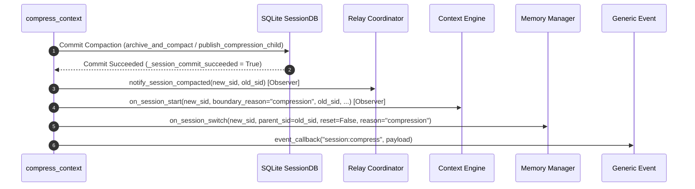

# Context-Engine Full-Compression Boundary Audit

## 1. Scope, Executive Summary, and Ordering Boundaries

### 1.1 Scope
This audit specifies the authoritative Python context-engine contract when a full conversation compression completes and commits. It provides the architectural and protocol basis for context-engine adoption in the Rust gateway (`hermes-gateway`), evaluating how the persistent Python compatibility child (`hermes_cli/rust_extension_host.py`) can observe compression boundaries without invalidating frozen conversation clients, system prompts, or tool definitions.

The scope is strictly limited to context-engine adoption at the full-compression boundary:
- Authoritative entry points, staging, and finalization routines in [`agent/conversation_compression.py`](file:///home/eins0fx/development/hermes-agent-port/agent/conversation_compression.py).
- Abstract interface requirements in [`agent/context_engine.py`](file:///home/eins0fx/development/hermes-agent-port/agent/context_engine.py).
- Built-in compression behavior in [`agent/context_compressor.py`](file:///home/eins0fx/development/hermes-agent-port/agent/context_compressor.py).
- Plugin context-engine requirements (notably the `hermes-lcm` boundary contract).
- Existing compatibility host responsibilities in [`hermes_cli/rust_extension_host.py`](file:///home/eins0fx/development/hermes-agent-port/hermes_cli/rust_extension_host.py).
- Rotation mode versus in-place mode mechanics, exact arguments, IDs, and ordering.
- Deferred notification staging, failure handling, state mutations, and crash recovery.
- Minimum JSONL IPC protocol specification and test verification matrix.

### 1.2 Executive Summary
In the reference Python implementation:
1. **Compaction is Committed Before Notification**: The context engine is notified only after the compacted transcript is committed to SQLite (either via `publish_compression_child` in rotation mode or `archive_and_compact` + `update_system_prompt` in in-place mode).
2. **Context Engine Precedes Memory Notification**: When a committed boundary occurs, the context engine is notified **before** external memory providers (`agent._memory_manager.on_session_switch`).
3. **Pure Observer Semantics**: Notification uses `on_session_start(new_session_id, boundary_reason="compression", old_session_id=..., platform=..., conversation_id=...)`. Any exception raised by the engine callback is caught, logged at `DEBUG`, and swallowed; it never unwinds SQLite, aborts the compression turn, or disrupts subsequent turn processing.
4. **Id Identicality in In-Place Mode**: In rotation mode, `new_session_id` is the freshly minted child ID while `old_session_id` is the archived parent ID. In in-place mode, `new_session_id` and `old_session_id` are **identical** (both equal the active `agent.session_id`).
5. **Deferred Staging for Outer Transactions**: Manual slash commands and gateway RPC routes pass `defer_context_engine_notification=True`. A closure is staged on `agent._pending_context_engine_compression_notification`. Outer transaction owners explicitly call `finalize_context_engine_compression_notification(agent, committed=True)` once auxiliary history locks or response events succeed, or `committed=False` if discarded or aborted. In-turn automatic compression executes synchronously without deferral.
6. **Persistence Compatibility**: The notification does not generate prompt tokens, render system prompt sections, or alter registered tool schemas. Therefore, it can safely execute within the persistent Python extension host process (`hermes_cli/rust_extension_host.py`), enabling Rust's `ConversationAgent` cache to retain the warm client across compression boundaries without rebuilding the prompt or tools.

### 1.3 Separate Ordering Boundaries
Per audit instructions, the following auxiliary notification paths are recognized strictly to record their ordering boundary relative to the context engine:
- **Relay Session Coordinator (`agent/relay_runtime.py:SESSION_COORDINATOR.notify_session_compacted`)**: Called inside `_notify_context_engine_compression_complete` ([`agent/conversation_compression.py:3291-3300`](file:///home/eins0fx/development/hermes-agent-port/agent/conversation_compression.py#L3291-L3300)) immediately before the context-engine callback. Observer semantics; failures are logged at `DEBUG` and ignored.
- **External Memory Provider (`MemoryManager.on_session_switch`)**: Called at [`agent/conversation_compression.py:5543-5553`](file:///home/eins0fx/development/hermes-agent-port/agent/conversation_compression.py#L5543-L5553) immediately **after** the context-engine notification.
- **Generic `session:compress` Event (`agent.event_callback("session:compress", ...)`)**: Called at [`agent/conversation_compression.py:5568-5584`](file:///home/eins0fx/development/hermes-agent-port/agent/conversation_compression.py#L5568-L5584) immediately **after** memory notification and warning checks, immediately preceding attempt rearm and return.

---

## 2. Authoritative Functions and Callers in `agent/conversation_compression.py`

### 2.1 Core Functions and Signatures

#### `_notify_context_engine_compression_complete`
- **Location**: [`agent/conversation_compression.py:3280-3321`](file:///home/eins0fx/development/hermes-agent-port/agent/conversation_compression.py#L3280-L3321)
- **Signature**:
  ```python
  def _notify_context_engine_compression_complete(
      agent: Any,
      *,
      new_session_id: str,
      old_session_id: str,
  ) -> bool:
  ```
- **Behavior**:
  1. Invokes relay session coordinator: `relay_runtime.SESSION_COORDINATOR.notify_session_compacted(...)` ([`:3294-3298`](file:///home/eins0fx/development/hermes-agent-port/agent/conversation_compression.py#L3294-L3298)).
  2. Inspects `agent.context_compressor` for an `on_session_start` attribute. If not callable, returns `False` ([`:3301-3303`](file:///home/eins0fx/development/hermes-agent-port/agent/conversation_compression.py#L3301-L3303)).
  3. Dispatches the callback:
     ```python
     callback(
         new_session_id,
         boundary_reason="compression",
         old_session_id=old_session_id,
         platform=getattr(agent, "platform", None) or "cli",
         conversation_id=getattr(agent, "_gateway_session_key", None),
     )
     ```
  4. Wraps callback invocation in `try...except Exception:` ([`:3312-3319`](file:///home/eins0fx/development/hermes-agent-port/agent/conversation_compression.py#L3312-L3319)). On exception, logs `logger.debug("context engine on_session_start (compression) failed", exc_info=True)` and returns `False`. On success, returns `True`.

#### `_queue_context_engine_compression_notification`
- **Location**: [`agent/conversation_compression.py:3323-3341`](file:///home/eins0fx/development/hermes-agent-port/agent/conversation_compression.py#L3323-L3341)
- **Signature**:
  ```python
  def _queue_context_engine_compression_notification(
      agent: Any,
      *,
      new_session_id: str,
      old_session_id: str,
  ) -> None:
  ```
- **Behavior**:
  1. Checks if `getattr(agent, _PENDING_CONTEXT_ENGINE_NOTIFICATION, None)` is callable. If so, raises `RuntimeError("a compression notification is already pending")` ([`:3330-3331`](file:///home/eins0fx/development/hermes-agent-port/agent/conversation_compression.py#L3330-L3331)).
  2. Creates a closure `_notify()` binding `new_session_id` and `old_session_id` and delegating to `_notify_context_engine_compression_complete` ([`:3333-3338`](file:///home/eins0fx/development/hermes-agent-port/agent/conversation_compression.py#L3333-L3338)).
  3. Assigns `setattr(agent, _PENDING_CONTEXT_ENGINE_NOTIFICATION, _notify)` where `_PENDING_CONTEXT_ENGINE_NOTIFICATION = "_pending_context_engine_compression_notification"` ([`:3275-3277, 3340`](file:///home/eins0fx/development/hermes-agent-port/agent/conversation_compression.py#L3275-L3277)).

#### `finalize_context_engine_compression_notification`
- **Location**: [`agent/conversation_compression.py:3343-3354`](file:///home/eins0fx/development/hermes-agent-port/agent/conversation_compression.py#L3343-L3354)
- **Signature**:
  ```python
  def finalize_context_engine_compression_notification(
      agent: Any,
      *,
      committed: bool,
  ) -> bool:
  ```
- **Behavior**:
  1. Pops `pending = getattr(agent, _PENDING_CONTEXT_ENGINE_NOTIFICATION, None)` and clears attribute: `setattr(agent, _PENDING_CONTEXT_ENGINE_NOTIFICATION, None)` ([`:3349-3350`](file:///home/eins0fx/development/hermes-agent-port/agent/conversation_compression.py#L3349-L3350)).
  2. If `not committed` or `not callable(pending)`, returns `False` ([`:3351-3352`](file:///home/eins0fx/development/hermes-agent-port/agent/conversation_compression.py#L3351-L3352)).
  3. If `committed` is `True`, executes `pending()` and returns its boolean outcome ([`:3353`](file:///home/eins0fx/development/hermes-agent-port/agent/conversation_compression.py#L3353)).
  4. Guarantees idempotent, exactly-once delivery: subsequent calls encounter `pending is None` and return `False`.

### 2.2 Execution Flow in `compress_context`
In `compress_context` ([`agent/conversation_compression.py:3356-5590`](file:///home/eins0fx/development/hermes-agent-port/agent/conversation_compression.py#L3356-L5590)):

1. **Attempt Initialization and Staging Guard** ([`:3414-3418`](file:///home/eins0fx/development/hermes-agent-port/agent/conversation_compression.py#L3414-L3418)):
   If `defer_context_engine_notification` is `True` and `callable(getattr(agent, _PENDING_CONTEXT_ENGINE_NOTIFICATION, None))`, raises `RuntimeError("a compression notification is already pending")`.
2. **Mode Resolution**:
   `in_place = bool(getattr(agent, "compression_in_place", True))` ([`:3545`](file:///home/eins0fx/development/hermes-agent-port/agent/conversation_compression.py#L3545)).
   `compacted_in_place = False` ([`:3548`](file:///home/eins0fx/development/hermes-agent-port/agent/conversation_compression.py#L3548)).
3. **Publication**:
   - **In-Place** ([`:4931-4999`](file:///home/eins0fx/development/hermes-agent-port/agent/conversation_compression.py#L4931-L4999)):
     Calls `agent._session_db.archive_and_compact(agent.session_id, compressed, ...)` ([`:4963-4972`](file:///home/eins0fx/development/hermes-agent-port/agent/conversation_compression.py#L4963-L4972)).
     Sets `split_status = "in_place_committed"` ([`:4973`](file:///home/eins0fx/development/hermes-agent-port/agent/conversation_compression.py#L4973)).
     Stamps markers: `stamp_db_persisted_markers(compressed)` ([`:4989`](file:///home/eins0fx/development/hermes-agent-port/agent/conversation_compression.py#L4989)).
     Sets `compacted_in_place = True` ([`:4999`](file:///home/eins0fx/development/hermes-agent-port/agent/conversation_compression.py#L4999)).
     Updates prompt in SQLite: `agent._session_db.update_system_prompt(agent.session_id, new_system_prompt)` ([`:5357-5359`](file:///home/eins0fx/development/hermes-agent-port/agent/conversation_compression.py#L5357-L5359)).
     Sets `_session_commit_succeeded = True` ([`:5364`](file:///home/eins0fx/development/hermes-agent-port/agent/conversation_compression.py#L5364)).
   - **Rotation** ([`:5000-5353`](file:///home/eins0fx/development/hermes-agent-port/agent/conversation_compression.py#L5000-L5353)):
     Binds `old_session_id = agent.session_id` ([`:5022`](file:///home/eins0fx/development/hermes-agent-port/agent/conversation_compression.py#L5022)).
     Flushes unpersisted history to parent: `agent._flush_messages_to_session_db(...)` ([`:5100`](file:///home/eins0fx/development/hermes-agent-port/agent/conversation_compression.py#L5100)).
     Generates `new_session_id = f"{datetime.now().strftime('%Y%m%d_%H%M%S')}_{uuid.uuid4().hex[:6]}"` ([`:5123-5125`](file:///home/eins0fx/development/hermes-agent-port/agent/conversation_compression.py#L5123-L5125)).
     Calls `agent._session_db.publish_compression_child(...)` ([`:5127-5148`](file:///home/eins0fx/development/hermes-agent-port/agent/conversation_compression.py#L5127-L5148)).
     Updates `agent.session_id = new_session_id` ([`:5268`](file:///home/eins0fx/development/hermes-agent-port/agent/conversation_compression.py#L5268)).
     Migrates goal, heartbeat, loop, and title ([`:5289-5353`](file:///home/eins0fx/development/hermes-agent-port/agent/conversation_compression.py#L5289-L5353)).
     Sets `_session_commit_succeeded = True` ([`:5364`](file:///home/eins0fx/development/hermes-agent-port/agent/conversation_compression.py#L5364)).
4. **Rollback on Commit Failure** ([`:5365-5480`](file:///home/eins0fx/development/hermes-agent-port/agent/conversation_compression.py#L5365-L5480)):
   If SQLite publication raises, catches exception, restores in-memory messages: `messages[:] = copy.deepcopy(messages_before_compression)`, restores proactive prune rearm runway, and records failure cooldown. `_session_commit_succeeded` remains `False`.
5. **Compaction-Boundary Variable Resolution** ([`:5485-5490`](file:///home/eins0fx/development/hermes-agent-port/agent/conversation_compression.py#L5485-L5490)):
   ```python
   _old_sid = locals().get("old_session_id")
   _is_boundary = bool(_old_sid) or in_place
   _context_engine_boundary_committed = _session_commit_succeeded and (
       bool(_old_sid) or compacted_in_place
   )
   _boundary_parent = _old_sid or agent.session_id or ""
   ```
6. **Context-Engine Notification Dispatch** ([`:5523-5536`](file:///home/eins0fx/development/hermes-agent-port/agent/conversation_compression.py#L5523-L5536)):
   ```python
   if _context_engine_boundary_committed:
       if defer_context_engine_notification:
           _queue_context_engine_compression_notification(
               agent,
               new_session_id=agent.session_id or "",
               old_session_id=_boundary_parent,
           )
       else:
           _notify_context_engine_compression_complete(
               agent,
               new_session_id=agent.session_id or "",
               old_session_id=_boundary_parent,
           )
   ```
7. **External Memory Notification** ([`:5543-5553`](file:///home/eins0fx/development/hermes-agent-port/agent/conversation_compression.py#L5543-L5553)):
   ```python
   if _is_boundary and agent._memory_manager:
       agent._memory_manager.on_session_switch(
           agent.session_id or "",
           parent_session_id=_boundary_parent,
           reset=False,
           reason="compression",
       )
   ```

### 2.3 Callers of `compress_context` and Forwarding Semantics

| Caller File & Line | Invocation Context | `defer_context_engine_notification` | Finalization Pattern |
| --- | --- | --- | --- |
| [`run_agent.py:8682`](file:///home/eins0fx/development/hermes-agent-port/run_agent.py#L8682) | `AIAgent._compress_context` wrapper method | Forwards caller's value (default `False`) | Owns thread isolation (`_snapshot_worker`) and `CompressionCommitFence` |
| [`agent/conversation_loop.py:3116, 5968, 6270, 6451, 6615, 8280`](file:///home/eins0fx/development/hermes-agent-port/agent/conversation_loop.py#L8280) | In-turn automatic full compression | `False` (default) | Synchronous notification inside `compress_context` |
| [`cli.py:14128`](file:///home/eins0fx/development/hermes-agent-port/cli.py#L14128) | Interactive CLI `/compress` command | `True` | Discards (`committed=False`) on lock contention ([`:14163`](file:///home/eins0fx/development/hermes-agent-port/cli.py#L14163)) or error ([`:14221`](file:///home/eins0fx/development/hermes-agent-port/cli.py#L14221)); commits (`committed=True`) at [`:14189`](file:///home/eins0fx/development/hermes-agent-port/cli.py#L14189) after session flush |
| [`tui_gateway/server.py:7360`](file:///home/eins0fx/development/hermes-agent-port/tui_gateway/server.py#L7360) | TUI Gateway `_compress_session_history` | `True` | Discards (`committed=False`) on error ([`:7372`](file:///home/eins0fx/development/hermes-agent-port/tui_gateway/server.py#L7372)), lock skip ([`:7387`](file:///home/eins0fx/development/hermes-agent-port/tui_gateway/server.py#L7387)), or history version mismatch ([`:7401`](file:///home/eins0fx/development/hermes-agent-port/tui_gateway/server.py#L7401)) |
| [`tui_gateway/methods_session.py:3116`](file:///home/eins0fx/development/hermes-agent-port/tui_gateway/methods_session.py#L3116) | TUI Gateway RPC `session.compress` | Staged by `_compress_session_history` | Commits (`committed=True`) at [`:3152`](file:///home/eins0fx/development/hermes-agent-port/tui_gateway/methods_session.py#L3152) after `_sync_session_key_after_compress` and UI summary |
| [`gateway/slash_commands.py:4545, 4794`](file:///home/eins0fx/development/hermes-agent-port/gateway/slash_commands.py#L4794) | Head & full `/compress` slash worker | `True` (via temporary agent) | Commits (`committed=True`) at [`:4888`](file:///home/eins0fx/development/hermes-agent-port/gateway/slash_commands.py#L4888); discards in `finally:` block at [`:4922`](file:///home/eins0fx/development/hermes-agent-port/gateway/slash_commands.py#L4922) |

---

## 3. Context Engine Interfaces and Built-in Implementation

### 3.1 The `ContextEngine` ABC Interface
Defined in [`agent/context_engine.py:89-490`](file:///home/eins0fx/development/hermes-agent-port/agent/context_engine.py#L89-L490).

Key lifecycle and operational methods:
- `name` (abstract property, [`:96`](file:///home/eins0fx/development/hermes-agent-port/agent/context_engine.py#L96)): Identifier (e.g., `"compressor"`, `"lcm"`).
- `on_session_start(self, session_id: str, **kwargs) -> None` ([`:387-392`](file:///home/eins0fx/development/hermes-agent-port/agent/context_engine.py#L387-L392)):
  Invoked when a session starts, resumes, or rotates across a compression boundary. Receives `boundary_reason="compression"`, `old_session_id`, `platform`, and `conversation_id`.
- `on_session_end(self, session_id: str, messages: List[Dict[str, Any]]) -> None` ([`:394-399`](file:///home/eins0fx/development/hermes-agent-port/agent/context_engine.py#L394-L399)):
  Called only at terminal session boundaries (exit, `/reset`, gateway expiry), never per-turn or on routine compaction.
- `on_session_reset(self) -> None` ([`:401-410`](file:///home/eins0fx/development/hermes-agent-port/agent/context_engine.py#L401-L410)):
  Resets token accounting and internal compaction counters.
- `get_tool_schemas(self) -> List[Dict[str, Any]]` ([`:413-419`](file:///home/eins0fx/development/hermes-agent-port/agent/context_engine.py#L413-L419)):
  Returns tools provided by the engine (e.g., `lcm_grep`, `lcm_describe`). Default returns `[]`.
- `handle_tool_call(self, name: str, args: Dict[str, Any], **kwargs) -> str` ([`:421-432`](file:///home/eins0fx/development/hermes-agent-port/agent/context_engine.py#L421-L432)):
  Executes an engine tool call and returns a JSON string.
- `compress(self, messages, current_tokens=None, focus_topic=None, force=False, memory_context="") -> List[Dict[str, Any]]` ([`:163-190`](file:///home/eins0fx/development/hermes-agent-port/agent/context_engine.py#L163-L190)):
  Compact message list to fit context budget.
- `update_from_response(self, usage: Dict[str, Any]) -> None` ([`:133-144`](file:///home/eins0fx/development/hermes-agent-port/agent/context_engine.py#L133-L144)):
  Updates tracked token metrics from normalized API responses.

### 3.2 Built-in `ContextCompressor` Implementation
Defined in [`agent/context_compressor.py`](file:///home/eins0fx/development/hermes-agent-port/agent/context_compressor.py).

`ContextCompressor.on_session_start` ([`agent/context_compressor.py:2710-2763`](file:///home/eins0fx/development/hermes-agent-port/agent/context_compressor.py#L2710-L2763)) implements explicit state inheritance when `boundary_reason == "compression"`:
1. **Parent State Lookup** ([`:2718-2748`](file:///home/eins0fx/development/hermes-agent-port/agent/context_compressor.py#L2718-L2748)):
   If `boundary_reason == "compression"` and `old_session_id` is present:
   - Queries parent's `get_compression_fallback_streak(old_session_id)` from `session_db`.
   - Queries parent's `get_compression_ineffective_count(old_session_id)` from `session_db`.
2. **Session Rebinding** ([`:2749`](file:///home/eins0fx/development/hermes-agent-port/agent/context_compressor.py#L2749)):
   Calls `self.bind_session_state(session_db, session_id)` ([`:2690-2709`](file:///home/eins0fx/development/hermes-agent-port/agent/context_compressor.py#L2690-L2709)), which sets `self._session_id = session_id`, clears volatile in-memory cooldowns, and loads baseline values for the new session ID.
3. **Streak and Strike Carry-Over** ([`:2750-2763`](file:///home/eins0fx/development/hermes-agent-port/agent/context_compressor.py#L2750-L2763)):
   - Restores `self._fallback_compression_streak = previous_fallback_streak`.
   - Restores `self._ineffective_compression_count = previous_ineffective_count`.
   - If `self._ineffective_compression_count != previous_ineffective_count`, writes the carried value onto the new child session row in SQLite via `self._persist_ineffective_compression_count()`. This ensures that a process restart occurring immediately after rotation cannot disarm an armed anti-thrash guard ([`:2757-2762`](file:///home/eins0fx/development/hermes-agent-port/agent/context_compressor.py#L2757-L2762)).

### 3.3 Plugin Context Engines (`hermes-lcm`)
- **Status in Repository**: `hermes-lcm` is **not present** as source code in this checkout (verified absent; only referenced in test suites, docs, ADR, and Nix packages).
- **The Contract**: Documented in [`tests/run_agent/test_compression_boundary_hook.py:1-12`](file:///home/eins0fx/development/hermes-agent-port/tests/run_agent/test_compression_boundary_hook.py#L1-L12) and [`agent/conversation_compression.py:5518-5520`](file:///home/eins0fx/development/hermes-agent-port/agent/conversation_compression.py#L5518-L5520):
  External engines (like `hermes-lcm`) maintain external DAG stores and vector indices across session boundaries. Prior to adding `boundary_reason="compression"`, rotation caused LCM to observe `on_session_start` as a brand new `/new` conversation, destroying DAG lineage and resetting counters (`hermes-lcm#68`).
  By observing `boundary_reason="compression"` and `old_session_id`, LCM links the new physical child session to the existing DAG root, retaining context history across physical SQLite session splits.

### 3.4 Context Engine Discovery and Selection
In [`agent/agent_init.py:2726-2823`](file:///home/eins0fx/development/hermes-agent-port/agent/agent_init.py#L2726-L2823):
1. Resolves `context.engine` from configuration (default `"compressor"`).
2. If non-default, attempts `plugins.context_engine.load_context_engine(name)` from `plugins/context_engine/<name>/` ([`:2743`](file:///home/eins0fx/development/hermes-agent-port/agent/agent_init.py#L2743)).
3. If not found, falls back to `hermes_cli.plugins.get_plugin_context_engine()` ([`:2752-2753`](file:///home/eins0fx/development/hermes-agent-port/agent/agent_init.py#L2752-L2753)).
4. If a candidate is found, deep-copies it and calls `update_model(...)` ([`:2765, 2813-2820`](file:///home/eins0fx/development/hermes-agent-port/agent/agent_init.py#L2765)).
5. Registers any tool schemas returned by `agent.context_compressor.get_tool_schemas()` into `agent.tools` and `agent._context_engine_tool_names` ([`:2983-3019`](file:///home/eins0fx/development/hermes-agent-port/agent/agent_init.py#L2983-L3019)).
6. Calls initial `on_session_start(agent.session_id, hermes_home=..., platform=..., model=..., context_length=..., conversation_id=...)` ([`:3023-3030`](file:///home/eins0fx/development/hermes-agent-port/agent/agent_init.py#L3023-L3030)) without `boundary_reason="compression"`.

---

## 4. Existing `hermes_cli/rust_extension_host.py` Ownership Surface

[`hermes_cli/rust_extension_host.py`](file:///home/eins0fx/development/hermes-agent-port/hermes_cli/rust_extension_host.py) is a persistent compatibility child process providing legacy Python plugin tools and external memory providers for a single conversation.

### 4.1 Host State and Lifecycle
- `self._plugin_manager`: Plugin manager discovering tools and prompt sections ([`:71, 133`](file:///home/eins0fx/development/hermes-agent-port/hermes_cli/rust_extension_host.py#L71)).
- `self._memory_manager`: Optional `MemoryManager` instance managing the active external-memory provider ([`:72, 158`](file:///home/eins0fx/development/hermes-agent-port/hermes_cli/rust_extension_host.py#L72)).
- `self._session_info`: Stores session identity (`session_id`, `model`, `provider`, `platform`, `profile_name`, `cwd`) ([`:73, 136-146`](file:///home/eins0fx/development/hermes-agent-port/hermes_cli/rust_extension_host.py#L73)).
- `self._plugin_tool_names` & `self._memory_tool_names`: Sets of registered tool names routed to Python handlers ([`:74-75, 232, 258`](file:///home/eins0fx/development/hermes-agent-port/hermes_cli/rust_extension_host.py#L74)).

### 4.2 Current IPC Methods

| Method | Protocol Purpose | Context-Engine Presence |
| --- | --- | --- |
| `initialize` ([`:80-269`](file:///home/eins0fx/development/hermes-agent-port/hermes_cli/rust_extension_host.py#L80-L269)) | Sets profile home, dotenv, loads plugins and memory provider | **Absent**. Does not instantiate or capture `_context_engine`. |
| `snapshot` ([`:271-286`](file:///home/eins0fx/development/hermes-agent-port/hermes_cli/rust_extension_host.py#L271-L286)) | Renders `plugin_sections` and `memory_prompt` | **Absent**. Context engines do not contribute to system prompt. |
| `call_tool` ([`:288-316`](file:///home/eins0fx/development/hermes-agent-port/hermes_cli/rust_extension_host.py#L288-L316)) | Dispatches plugin tools and memory provider tools | **Absent**. Does not route `_context_engine_tool_names`. |
| `turn_start` ([`:318-361`](file:///home/eins0fx/development/hermes-agent-port/hermes_cli/rust_extension_host.py#L318-L361)) | External memory prefetch and recall indicators | **Absent**. Does not invoke `select_context`. |
| `turn_complete` ([`:363-393`](file:///home/eins0fx/development/hermes-agent-port/hermes_cli/rust_extension_host.py#L363-L393)) | Syncs completed turn to external memory provider | **Absent**. Does not invoke `on_turn_complete`. |
| `session_switch` ([`:395-447`](file:///home/eins0fx/development/hermes-agent-port/hermes_cli/rust_extension_host.py#L395-L447)) | Updates `_session_info["session_id"]` and calls `_memory_manager.on_session_switch` | **Absent**. Only dispatches to `_memory_manager`. |
| `session_end` ([`:449-458`](file:///home/eins0fx/development/hermes-agent-port/hermes_cli/rust_extension_host.py#L449-L458)) | Calls `_memory_manager.on_session_end` | **Absent**. Does not invoke `_context_engine.on_session_end`. |
| `pre_compress` ([`:470-581`](file:///home/eins0fx/development/hermes-agent-port/hermes_cli/rust_extension_host.py#L470-L581)) | Pre-compression memory checkpointing | Uses `sanitize_memory_context` ([`:572`](file:///home/eins0fx/development/hermes-agent-port/hermes_cli/rust_extension_host.py#L572)), but no engine hook. |
| `shutdown` ([`:583-595`](file:///home/eins0fx/development/hermes-agent-port/hermes_cli/rust_extension_host.py#L583-L595)) | Shuts down memory and unloads plugin manager | **Absent**. |

---

## 5. Full-Compression Boundary Dynamics

### 5.1 Rotation Mode vs In-Place Mode

| Characteristic | Rotation Mode (`compression.in_place: false`) | In-Place Mode (`compression.in_place: true`, Default) |
| --- | --- | --- |
| **Session ID** | Rotates: `agent.session_id = new_session_id` (`agent/conversation_compression.py:5268`) | Retained: `agent.session_id` unchanged (`agent/conversation_compression.py:4931-4936`) |
| **SQLite Mutation** | Closes parent, publishes child via `publish_compression_child` (`:5127`) | Soft-archives pre-compaction rows via `archive_and_compact` (`:4963-4972`) |
| **Prompt Mutation** | Child row inserted with new prompt in transaction (`:5134`) | Current row updated via `update_system_prompt` (`:5357-5359`) |
| **`new_session_id` Value** | Freshly generated child ID (`:5123-5125`) | Current active session ID (`:5527`) |
| **`old_session_id` Value** | Parent session ID (`_boundary_parent = _old_sid`, `:5490, 5528`) | Current active session ID (`_boundary_parent = agent.session_id`, `:5490, 5528`) |
| **IDs Match?** | **`new_session_id != old_session_id`** | **`new_session_id == old_session_id`** |
| **Memory Rebind** | `on_session_switch(child, parent_session_id=parent, reset=False)` (`:5546-5550`) | `on_session_switch(same, parent_session_id=same, reset=False)` (`:5546-5550`) |
| **Rust Client Cache** | Atomically re-keys cache entry `old_key -> new_key` (`conversation_agent.rs:207`) | Retains existing cache entry key (`conversation_agent.rs:185`) |

### 5.2 Exact Arguments and Types

When `on_session_start` is called on the context engine at a compression boundary ([`agent/conversation_compression.py:3305-3311`](file:///home/eins0fx/development/hermes-agent-port/agent/conversation_compression.py#L3305-L3311)):
1. `session_id` (1st positional, `str`): The active continuation session ID.
   - Rotation: newly minted child session ID.
   - In-place: unchanged current session ID.
2. `boundary_reason` (`str`): Literal constant `"compression"`.
3. `old_session_id` (`str`): Pre-compaction anchor session ID.
   - Rotation: the archived parent session ID.
   - In-place: unchanged current session ID (identical to `session_id`).
4. `platform` (`str`): Normalized platform string from `agent.platform` or fallback `"cli"`.
5. `conversation_id` (`Optional[str]`): High-level conversation key from `agent._gateway_session_key` (e.g. `"agent:main:telegram:dm:42"`), or `None`.

### 5.3 Ordering Relative to SQLite Publication and Memory Notification
The execution sequence in [`agent/conversation_compression.py`](file:///home/eins0fx/development/hermes-agent-port/agent/conversation_compression.py) is deterministic:



1. **SQLite Publication First**: Compaction rows and system prompts are durably committed ([`:4963-5364`](file:///home/eins0fx/development/hermes-agent-port/agent/conversation_compression.py#L4963-L5364)). If this fails, rollback occurs; neither the context engine nor memory manager is notified.
2. **Context Engine Second**: `_notify_context_engine_compression_complete` fires ([`:5531`](file:///home/eins0fx/development/hermes-agent-port/agent/conversation_compression.py#L5531)) or `_queue_context_engine_compression_notification` stages ([`:5525`](file:///home/eins0fx/development/hermes-agent-port/agent/conversation_compression.py#L5525)).
3. **Memory Provider Third**: `agent._memory_manager.on_session_switch` fires ([`:5544-5550`](file:///home/eins0fx/development/hermes-agent-port/agent/conversation_compression.py#L5544-L5550)).
4. **Generic Event Fourth**: `agent.event_callback("session:compress", ...)` fires ([`:5569-5584`](file:///home/eins0fx/development/hermes-agent-port/agent/conversation_compression.py#L5569-L5584)).

### 5.4 Deferred Notification Behavior
Deferred notification exists to decouple compaction execution from outer host transactions (such as CLI terminal session updates or gateway history lock synchronization):
- **Staging**: When `defer_context_engine_notification=True`, `_queue_context_engine_compression_notification` saves a single callable closure in `agent._pending_context_engine_compression_notification` ([`:3340`](file:///home/eins0fx/development/hermes-agent-port/agent/conversation_compression.py#L3340)).
- **Safety Pre-Check**: If a second compaction attempt is made while a notification is pending, `compress_context` immediately raises `RuntimeError("a compression notification is already pending")` ([`:3414-3418`](file:///home/eins0fx/development/hermes-agent-port/agent/conversation_compression.py#L3414-L3418)).
- **Commit**: The host calls `finalize_context_engine_compression_notification(agent, committed=True)`. The pending closure executes `_notify_context_engine_compression_complete`, clearing the attribute ([`:3349-3353`](file:///home/eins0fx/development/hermes-agent-port/agent/conversation_compression.py#L3349-L3353)).
- **Discard / Rollback**: If the outer host transaction aborts or fails verification, the host calls `finalize_context_engine_compression_notification(agent, committed=False)`. The closure is discarded without executing ([`:3350-3352`](file:///home/eins0fx/development/hermes-agent-port/agent/conversation_compression.py#L3350-L3352)).
- **Idempotence**: A second call with either `committed=True` or `committed=False` is a safe no-op returning `False`.

### 5.5 Failure Handling and Observer Semantics
Context-engine notifications are strictly non-transactional observers:
- In `_notify_context_engine_compression_complete` ([`agent/conversation_compression.py:3312-3319`](file:///home/eins0fx/development/hermes-agent-port/agent/conversation_compression.py#L3312-L3319)), callback execution is wrapped in a generic `try...except Exception:` block.
- Any raised exception is logged at `DEBUG` level and returns `False`.
- A failure inside `on_session_start` does **not** re-raise, does **not** roll back SQLite, and does **not** revert the in-memory compressed message transcript.
- Tested in [`tests/run_agent/test_compression_boundary_hook.py:220-255`](file:///home/eins0fx/development/hermes-agent-port/tests/run_agent/test_compression_boundary_hook.py#L220-L255): `test_hook_failure_does_not_break_compression` verifies that even when `on_session_start` raises `RuntimeError("plugin exploded")`, compression successfully returns the compressed messages and child session ID.

### 5.6 State Mutations and SQLite Coherence
- **Built-in `ContextCompressor`**:
  - Updates its internal `_session_id`.
  - In rotation mode, reads the parent's fallback streak and ineffective count from SQLite, then calls `bind_session_state(session_db, new_session_id)`.
  - Re-applies the parent's fallback streak and persists the parent's ineffective count to the child session row via `_persist_ineffective_compression_count()` ([`agent/context_compressor.py:2760-2762`](file:///home/eins0fx/development/hermes-agent-port/agent/context_compressor.py#L2760-L2762)).
  - Internal transient cooldowns (`_summary_failure_cooldown_until`, `_last_summary_error`, `_anti_thrash_recovery_deadline`) are cleared.
- **Plugin Context Engines (`hermes-lcm`)**:
  - Rebind internal active session ID to `new_session_id`.
  - Append DAG continuation nodes linked to `old_session_id`.
  - Do not alter Hermes SQLite tables.

### 5.7 Restart, Crash, and Cold-Recovery Paths
1. **Pre-Commit Crash**: If a crash occurs before SQLite commit succeeds, no child row exists (rotation) or no turns are archived (in-place). The next run resumes the unmodified parent session. Preflight token estimation recalculates pressure from scratch.
2. **Post-Commit, Pre-Notification Crash**: SQLite is already committed. On cold resume:
   - Python initialization routes through `agent_init.py:3020-3032`, invoking `on_session_start(session_id, ...)` without `boundary_reason="compression"`.
   - `ContextCompressor.bind_session_state` reads the persisted `compression_ineffective_count` and `compression_fallback_streak` from the committed SQLite row.
   - Lineage continuity for plugin engines depends on whether the plugin flushes its state synchronously.
3. **Normal Cold Resume**: When resuming an ended or suspended session, `on_session_start` is called with `boundary_reason=None`. The engine binds to the existing session ID and restores state from SQLite.

### 5.8 Safety with Persistent Extension Host and Frozen Prompt/Tools
A core question for the Rust gateway is whether notifying the context engine through `rust_extension_host.py` can be done safely while keeping the conversation client alive and preserving the prompt-cache prefix:

1. **System Prompt Stability**:
   - `ContextEngine.on_session_start` does not return prompt text and has no mechanism to inject text into `system_prompt`.
   - In `rust_extension_host.py:271-286`, `snapshot()` renders only `plugin_sections` from `PluginManager` and `memory_prompt` from `MemoryManager`. The context engine has no presence in `snapshot()`.
   - Compaction modifies the conversation history and updates `system_prompt` via native Rust template re-rendering. The extension host's internal prompt sections are byte-identical before and after the notification.
2. **Tool Definition Stability**:
   - Context-engine tools are enumerated once at agent initialization via `get_tool_schemas()` ([`agent/agent_init.py:2999`](file:///home/eins0fx/development/hermes-agent-port/agent/agent_init.py#L2999)).
   - `on_session_start` does not register, remove, or modify tool definitions.
   - The tool definitions exposed to the model provider remain completely stable.
3. **Client Retention in Rust**:
   - Rust's `ConversationAgent` cache ([`rust/crates/hermes-gateway/src/conversation_agent.rs:888-915`](file:///home/eins0fx/development/hermes-agent-port/rust/crates/hermes-gateway/src/conversation_agent.rs#L888-L915)) checks out the initialized parent client cell, runs the boundary notification, and invokes `finish_compression_boundary` ([`:162-215`](file:///home/eins0fx/development/hermes-agent-port/rust/crates/hermes-gateway/src/conversation_agent.rs#L162-L215)).
   - In rotation mode, `finish_compression_boundary` moves the existing cell from `old_key` to `new_key` in `state.entries`. In in-place mode, `old_key == new_key`, and the cell is retained.
   - **Conclusion**: The persistent Python child process (`rust_extension_host.py`) does **not** need to be terminated, restarted, or rebuilt. The boundary notification is purely a state-rebinding event and safely executes across the persistent host pipe without mutating the frozen prompt or tool definitions.

---

## 6. Minimum JSONL Request and Response Contract for Rust Callers

### 6.1 Architectural Analysis: Dedicated RPC vs Overloaded `session_switch`

Two protocol designs exist for bridging the context-engine compression boundary across JSONL:

#### Option A: Overload `session_switch`
`rust_extension_host.py:395-447` already handles `session_switch` for memory providers:
- Current parameters: `new_session_id`, `parent_session_id`, `reset`, `rewound`, `reason`.
- At compression boundaries, Rust already sends `session_switch` with `reason="compression"`, `reset=false`, `rewound=false` ([`rust/crates/hermes-gateway/src/native_agent.rs:1959`](file:///home/eins0fx/development/hermes-agent-port/rust/crates/hermes-gateway/src/native_agent.rs#L1959)).
- *Defect*: `session_switch` is designed around `MemoryManager.on_session_switch`. It lacks `platform` and `conversation_id` (`_gateway_session_key`), which are required by the context-engine contract. Furthermore, `session_switch` is also used for `/resume` and `/reset` where the context engine requires completely different transitions (`on_session_reset` / `on_session_end`).

#### Option B: Dedicated `compression_boundary` RPC (Recommended)
Add a dedicated, unambiguous method to `rust_extension_host.py`:
- Explicitly models the full-compression boundary lifecycle.
- Eliminates ambiguity between external memory session switching and context-engine boundary observation.
- Enables the host to coordinate both `_context_engine.on_session_start` and `_memory_manager.on_session_switch` in the exact verified Python order under a single IPC round-trip.

### 6.2 Recommended Wire Specification: `compression_boundary`

#### JSONL Request
```json
{
  "id": 101,
  "method": "compression_boundary",
  "params": {
    "new_session_id": "20260909_120500_def456",
    "old_session_id": "20260909_120000_abc123",
    "in_place": false,
    "conversation_id": "agent:main:telegram:dm:42"
  }
}
```

#### Field Schema
- `new_session_id` (`string`, required, non-empty): The active session ID after publication.
- `old_session_id` (`string`, required, non-empty): The pre-compaction session ID. Equal to `new_session_id` when `in_place` is `true`.
- `in_place` (`boolean`, required): `true` if transcript compacted under same ID, `false` if rotated.
- `conversation_id` (`string`, optional, nullable): High-level gateway routing key (`agent._gateway_session_key`). Defaults to empty string or `null`.

#### JSONL Response (Success)
```json
{
  "id": 101,
  "ok": true,
  "result": null
}
```

#### JSONL Response (Validation Error)
```json
{
  "id": 101,
  "ok": false,
  "error": "compression_boundary requires a nonempty new_session_id"
}
```

### 6.3 Host-Side Processing Contract
When `compression_boundary` is handled inside `ExtensionHost`:
1. **Validation**: Validate that `new_session_id` and `old_session_id` are non-empty strings, and `in_place` is a boolean. If `in_place` is `true`, assert `new_session_id == old_session_id`.
2. **Session Info Rebind**: Update `self._session_info["session_id"] = new_session_id`.
3. **Context Engine Callback (First)**:
   If `self._context_engine` is active and implements `on_session_start`:
   ```python
   try:
       self._context_engine.on_session_start(
           new_session_id,
           boundary_reason="compression",
           old_session_id=old_session_id,
           platform=self._session_info.get("platform", "cli"),
           conversation_id=params.get("conversation_id") or self._session_info.get("gateway_session_key"),
       )
   except Exception:
       _LOG.exception("Context engine compression boundary callback failed (non-fatal)")
   ```
4. **Memory Manager Callback (Second)**:
   If `self._memory_manager` is active:
   ```python
   try:
       self._memory_manager.on_session_switch(
           new_session_id,
           parent_session_id=old_session_id,
           reset=False,
           reason="compression",
       )
   except Exception:
       _LOG.exception("Memory provider on_session_switch failed (non-fatal)")
   ```
5. **Return**: Always return `_response(request_id, result=None)`. Observer exceptions are logged but never fail the IPC request.

---

## 7. Proposed Verification and Integration Test Matrix

To prove compliance without breaking existing code, the following focused test matrix should be implemented when adopting this contract:

### 7.1 Python Unit and Subprocess Tests (`tests/cli/`)

1. **`test_rust_extension_host_compression_boundary_validation`**:
   - Verify that calling `compression_boundary` requires an initialized host.
   - Verify rejection of missing `new_session_id`, `old_session_id`, or `in_place`.
   - Verify rejection of non-boolean `in_place`.
   - Verify rejection when `in_place=True` but `new_session_id != old_session_id`.
2. **`test_rust_extension_host_compression_boundary_rotation_dispatch`**:
   - Configure a mock context engine implementing `on_session_start` and a `_RecordingProvider` on `MemoryManager`.
   - Dispatch `compression_boundary` with `new_session_id="child"`, `old_session_id="parent"`, `in_place=False`.
   - Assert `context_engine.on_session_start` called with `("child", boundary_reason="compression", old_session_id="parent", platform="cli", conversation_id=...)`.
   - Assert `memory_manager.on_session_switch` called with `("child", parent_session_id="parent", reset=False, reason="compression")`.
   - Assert exact ordering: context-engine callback precedes memory manager callback.
3. **`test_rust_extension_host_compression_boundary_in_place_dispatch`**:
   - Dispatch with `new_session_id="same-id"`, `old_session_id="same-id"`, `in_place=True`.
   - Assert `on_session_start` called with `("same-id", boundary_reason="compression", old_session_id="same-id", ...)`.
   - Assert `memory_manager.on_session_switch` called with `("same-id", parent_session_id="same-id", reset=False, reason="compression")`.
4. **`test_rust_extension_host_compression_boundary_observer_isolation`**:
   - Mock context engine where `on_session_start` raises `RuntimeError("DAG write failed")`.
   - Verify that the method does not raise, returns `{"ok": True, "result": None}`, logs the exception, and still proceeds to notify the memory manager.
5. **`test_rust_extension_host_compression_boundary_preserves_frozen_snapshot`**:
   - Assert that `host.snapshot()` outputs identical `plugin_sections` and `memory_prompt` before and after `compression_boundary`.
6. **`test_subprocess_compression_boundary_jsonl_dispatch`**:
   - Launch `hermes_cli.rust_extension_host` as a live subprocess over pipes.
   - Send `initialize` followed by `compression_boundary` in rotation and in-place modes.
   - Verify exact JSONL response format `{"id": N, "ok": true, "result": null}`.

### 7.2 Rust Integration Tests (`rust/crates/hermes-gateway/`)

1. **`test_extension_client_compression_boundary_rotation_wire_format`**:
   - Verify that `ExtensionClient::compression_boundary` formats exact JSON matching the schema in Section 6.2.
2. **`test_extension_client_compression_boundary_in_place_wire_format`**:
   - Verify wire format for same-ID in-place calls.
3. **`test_conversation_agent_compression_boundary_rekey_retains_process`**:
   - Verify that invoking `notify_compression_boundary` on `ConversationAgent` for a rotating compaction moves the cache entry to the child session ID without killing or restarting the underlying extension host subprocess.
4. **`test_automatic_compression_notifies_boundary_after_durable_commit`**:
   - Verify in `automatic_compression.rs` that `notify_compression_boundary` is called only after `publish_compression` (rotation) or `archive_and_compact` (in-place) succeeds.

---

## 8. Verified Facts, Inferred Design, and Open Questions

### 8.1 Verified Facts
1. **Staging & Finalization**: `_queue_context_engine_compression_notification` and `finalize_context_engine_compression_notification` enforce single-pending staging and idempotent execution via `_pending_context_engine_compression_notification` ([`agent/conversation_compression.py:3323-3354`](file:///home/eins0fx/development/hermes-agent-port/agent/conversation_compression.py#L3323-L3354)).
2. **Commit Prerequisite**: `_context_engine_boundary_committed` is strictly `_session_commit_succeeded and (bool(_old_sid) or compacted_in_place)` ([`:5487-5489`](file:///home/eins0fx/development/hermes-agent-port/agent/conversation_compression.py#L5487-L5489)). An uncommitted SQLite transaction never emits a notification.
3. **Ordering**: SQLite commit precedes context engine notification; context engine notification precedes memory manager notification ([`:5487-5553`](file:///home/eins0fx/development/hermes-agent-port/agent/conversation_compression.py#L5487-L5553)).
4. **Exact Arguments**: In rotation, `on_session_start` receives `new_session_id != old_session_id`. In in-place, `new_session_id == old_session_id` ([`:5490, 5527-5528`](file:///home/eins0fx/development/hermes-agent-port/agent/conversation_compression.py#L5490)). Both receive `boundary_reason="compression"`.
5. **Observer Isolation**: Context-engine callback exceptions are caught, logged at `DEBUG`, and swallowed ([`:3312-3319`](file:///home/eins0fx/development/hermes-agent-port/agent/conversation_compression.py#L3312-L3319)).
6. **Built-in Rebinding**: `ContextCompressor.on_session_start` extracts the parent's fallback streak and ineffective count from SQLite, calls `bind_session_state`, and writes `_persist_ineffective_compression_count()` to the child session row ([`agent/context_compressor.py:2710-2763`](file:///home/eins0fx/development/hermes-agent-port/agent/context_compressor.py#L2710-L2763)).
7. **Host Surface Today**: `rust_extension_host.py` currently manages plugins and memory providers, but has no `ContextEngine` instance, tool registration, or boundary dispatch ([`hermes_cli/rust_extension_host.py:67-269`](file:///home/eins0fx/development/hermes-agent-port/hermes_cli/rust_extension_host.py#L67-L269)).
8. **Client Cache Transfer**: Rust's `ConversationAgent` currently re-keys its client cache entry on rotation and keeps the persistent extension host process alive ([`rust/crates/hermes-gateway/src/conversation_agent.rs:162-215`](file:///home/eins0fx/development/hermes-agent-port/rust/crates/hermes-gateway/src/conversation_agent.rs#L162-L215)).

### 8.2 Inferred Design
1. **Single IPC Method for Boundary Observers**: Although Python executes context-engine and memory-manager notifications as separate calls in `conversation_compression.py`, running both sequentially inside a single Rust-to-Python `compression_boundary` RPC in `rust_extension_host.py` minimizes IPC round-trip latency over stdio pipes while preserving exact Python ordering.
2. **Extension Host Engine Instantiation**: When adopting plugin context engines (such as `hermes-lcm`), `ExtensionHost.initialize` should check `get_plugin_context_engine()` and `load_context_engine()`, storing the instance on `self._context_engine` and exposing its `get_tool_schemas()` in the initialization handshake.

### 8.3 Open Questions
1. **Rust vs Python Engine Responsibility**: Rust currently implements its own native compression logic (`automatic_compression.rs`, `compression_prompt.rs`). If an external context engine like `hermes-lcm` is active, does it perform compaction inside Python via `compress()`, or is it strictly an observer indexing the transcript that Rust compacted?
2. **Context Engine Tool Exposure**: When an external engine exposes tools (`lcm_grep`, `lcm_expand`), how should Rust's native tool router handle them? (Presumably by forwarding them to `rust_extension_host.py:call_tool` similar to plugin and memory tools).
3. **Deferred Notification Need in Rust Gateway**: Does Rust gateway require deferred notifications? In the current Rust gateway, `automatic_compression.rs` and `session_commands.rs` call `notify_compression_boundary` immediately after SQLite commit. Deferral was built in Python for CLI interactive loops and TUI gateway history version locks. Unless Rust implements a multi-phase outer transaction across gateways, synchronous post-commit notification in Rust is sufficient.

---

## 9. Rejected and Unsafe Approaches

1. **Notifying Before SQLite Publication Commit (Rejected)**:
   - *Danger*: If SQLite commit encounters a lease contention, locking timeout, or disk error, the transaction rolls back. If the context engine was already notified, its external DAG or persisted state will reference an orphaned, non-existent child session, permanently corrupting context history.
   - *Rule*: Context engine notification must strictly execute only after `_session_commit_succeeded` is true.
2. **Releasing and Rebuilding `ConversationAgent` on Rotation (Rejected)**:
   - *Danger*: Terminating and respawning `rust_extension_host.py` on session rotation forces a cold Python startup, re-executes dotenv and plugin imports, re-reads secret stores, and breaks the prompt cache prefix.
   - *Rule*: Follow `native-compression-boundary-rebind-resolution.md`: the client must be re-keyed in cache (`old_key -> new_key`), preserving the running child process and frozen prompt/tools.
3. **Failing Compression on Context-Engine Exception (Rejected)**:
   - *Danger*: If a plugin context engine fails or raises during `on_session_start`, treating it as a fatal error would abort or rollback a compression that has already been published to SQLite, or leave SQLite and memory out of sync.
   - *Rule*: Context-engine callbacks must be treated as pure observers with fail-open isolation.
4. **Re-rendering System Prompts or Tools at the Compression Boundary (Rejected)**:
   - *Danger*: Attempting to query the context engine for new prompt blocks or tools at the compaction boundary invalidates the frozen model prompt cache and violates the static initialization contract.
   - *Rule*: Context engines must not modify prompt sections or tool definitions after initialization.
5. **Overloading General Session Switch Without Reason Discrimination (Rejected)**:
   - *Danger*: Treating all `session_switch` RPC calls as compression boundaries would cause `/resume`, `/reset`, or `/new` commands to invoke `on_session_start(boundary_reason="compression")`, corrupting DAG state by treating a user reset as a continuation.
   - *Rule*: Use an explicit `boundary_reason="compression"` check or a dedicated `compression_boundary` RPC.
