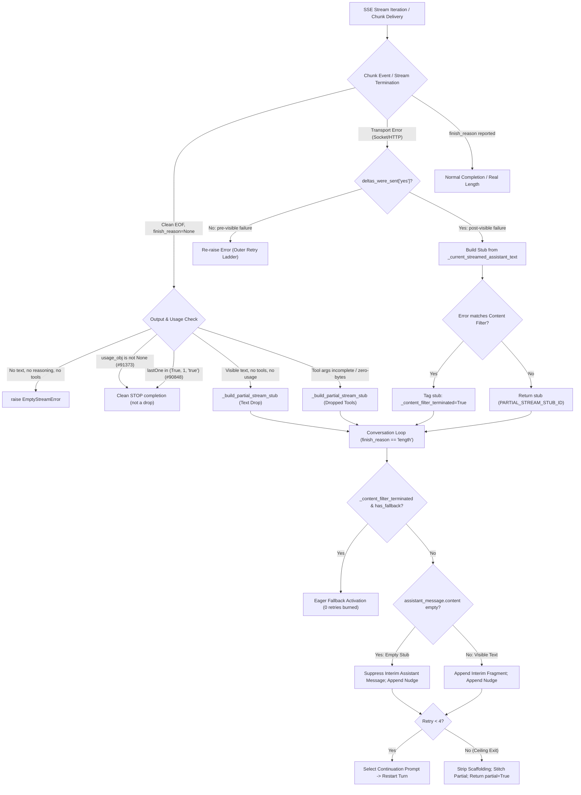

# Dropped Chat-Completions Stream Recovery Behavior Contract

**Document Target**: [`rust/analysis/dropped-stream-contract-agy.md`](file:///home/eins0fx/development/hermes-agent-port/rust/analysis/dropped-stream-contract-agy.md)
**Evidence Lane**: Live Python Chat-Completions Mid-Stream Drop and Partial Recovery Contract
**Primary Source Files**:
- [`agent/chat_completion_helpers.py`](file:///home/eins0fx/development/hermes-agent-port/agent/chat_completion_helpers.py)
- [`agent/conversation_loop.py`](file:///home/eins0fx/development/hermes-agent-port/agent/conversation_loop.py)
- [`hermes_constants.py`](file:///home/eins0fx/development/hermes-agent-port/hermes_constants.py)
- [`agent/error_classifier.py`](file:///home/eins0fx/development/hermes-agent-port/agent/error_classifier.py)
- [`tests/run_agent/test_partial_stream_finish_reason.py`](file:///home/eins0fx/development/hermes-agent-port/tests/run_agent/test_partial_stream_finish_reason.py)
- [`rust/tools/gen_dropped_stream_goldens.py`](file:///home/eins0fx/development/hermes-agent-port/rust/tools/gen_dropped_stream_goldens.py)
- [`rust/tools/dropped-stream-goldens.json`](file:///home/eins0fx/development/hermes-agent-port/rust/tools/dropped-stream-goldens.json)

---

## 1. Executive Summary and Scope Boundaries

This document formalizes the authoritative behavioral contract for recovering dropped chat-completions Server-Sent Events (SSE) streams in the Hermes Agent architecture.

### Scope Definition
The dropped stream recovery protocol addresses the specific scenario where a chat-completions SSE connection ends or breaks unexpectedly **without** a provider-reported `finish_reason`, or fails after visible deltas have already been delivered to the user. The runtime bridges these disruptions by generating a synthetic stub (`PARTIAL_STREAM_STUB_ID = "partial-stream-stub"`) tagged with `finish_reason = "length"`, prompting the conversation loop to continue generation from where the stream broke rather than silently accepting incomplete text as a complete turn or erroneously retrying from scratch.

### Explicit Non-Goals and Exclusions
Per design boundaries, the following adjacent lanes are strictly excluded:
- **Provider-reported `finish_reason = "length"`**: Real output token limit hit reported by upstream models; uses standard output-limit continuation rather than network drop stubs.
- **Ollama/GLM stop-to-length correction**: Heuristic rewrite of finish_reason="stop" for local GLM models.
- **Inactivity-timeout stalls**: Mid-stream silence watchdog triggers (handled by stale-stream circuit breakers).
- **Thinking exhaustion**: Token budget consumed entirely by reasoning scratchpads with no visible text.
- **Repetition guards**: Degenerate echo loop detectors (issue #86581).
- **Non-chat transports**: Anthropic Messages SDK, AWS Bedrock Converse, and Codex Responses streaming.
- **General pre-body retry policy**: Connection failures occurring before any HTTP response or stream initiation.

---

## 2. Architecture and Lifecycle Sequence



---

## 3. Producer Contract: Stream Accumulator and Stub Generation

The stream accumulator lives in [`agent/chat_completion_helpers.py`](file:///home/eins0fx/development/hermes-agent-port/agent/chat_completion_helpers.py) under `_call_chat_completions` and `interruptible_streaming_api_call`.

### 3.1 Stub Shape and Constant Identity
The stub response is constructed by [`_build_partial_stream_stub`](file:///home/eins0fx/development/hermes-agent-port/agent/chat_completion_helpers.py#L3608-L3637):
- `id`: `PARTIAL_STREAM_STUB_ID` (`"partial-stream-stub"` defined in [`hermes_constants.py:1761`](file:///home/eins0fx/development/hermes-agent-port/hermes_constants.py#L1761)).
- `choices[0].finish_reason`: `FINISH_REASON_LENGTH` (`"length"`).
- `choices[0].message.role`: `"assistant"`.
- `choices[0].message.content`: Accumulated visible prose (or `None` if empty).
- `choices[0].message.reasoning_content`: Accumulated reasoning text (or `None`).
- `choices[0].message.tool_calls`: Strictly `None`. Incomplete tool calls must never auto-execute.
- `usage`: Forwarded usage object or `None`.
- `_dropped_tool_names`: List of tool names whose argument generation was interrupted, or `None`.

### 3.2 Clean EOF Stream Recovery
When the SSE generator exhausts (`StopIteration`) without an explicit `finish_reason`:

1. **Text-Only Stream Drop** ([`chat_completion_helpers.py:4854-4869`](file:///home/eins0fx/development/hermes-agent-port/agent/chat_completion_helpers.py#L4854-L4869)):
   - Trigger: `finish_reason is None and content_parts and not tool_calls_acc and usage_obj is None`.
   - Behavior: Returns partial stub preserving accumulated prose. Without this, incomplete prose is falsely stamped `finish_reason="stop"`, truncating the agent turn (issue #32086).

2. **Mid Tool-Call Stream Drop** ([`chat_completion_helpers.py:4825-4842`](file:///home/eins0fx/development/hermes-agent-port/agent/chat_completion_helpers.py#L4825-L4842)):
   - Trigger: `has_truncated_tool_args and finish_reason is None`.
   - Incomplete Arguments: Tool call name arrived, but JSON argument payload was cut off (e.g. `{"cmd": "ls"` with no closing brace) and unrepairable by `_repair_tool_call_arguments`.
   - Zero-Byte Arguments (#80498): Tool call name arrived, but stream terminated before a single byte of argument deltas arrived (`arguments=""`).
   - Mixed Parallel Calls (#80498): If one tool call completed with valid arguments while a sibling call was dropped, the entire response is discarded as a single stub (`tool_calls=None`), and all tool names are listed in `_dropped_tool_names` to regenerate all calls cohesively.

### 3.3 Usage-Object Presence Discriminator (#91373)
OpenAI-compliant providers (vLLM, DeepSeek, OpenAI) streaming with `stream_options={"include_usage": True}` emit a trailing chunk with `choices=[]`, `usage` present, and `finish_reason=None`.
- **Presence, Not Magnitude**: The discriminator is `usage_obj is None`.
- **Zero-Token Usages**: Even when `prompt_tokens=0`, `completion_tokens=0`, and `total_tokens=0`, the presence of the usage object proves the provider completed generation and closed the stream cleanly.
- **Outcome**: `usage_obj is not None` forces `effective_finish_reason = "stop"`. It is NOT classified as a dropped stream stub.

### 3.4 Terminal lastOne Signals (#90848)
Nous Portal endpoints emit terminal chunks containing `choices=[]`, `finish_reason=None`, and `lastOne=True` (or integer `1`, or string `"true"`, or located inside `model_extra["lastOne"]`).
- **Outcome**: Sets `finish_reason = "stop"`, preventing false dropped-stream classification.

### 3.5 Zero-Output EOF Guard
If the stream closes cleanly without delivering any usable data:
- Condition: `finish_reason is None and not content_parts and not reasoning_parts and not tool_calls_acc`.
- Behavior: Raises [`EmptyStreamError`](file:///home/eins0fx/development/hermes-agent-port/agent/errors.py) with message:
  `"Provider returned an empty stream with no finish_reason (possible upstream error or malformed SSE response)."`.
- Contrast: If the provider explicitly reports `finish_reason="stop"` on an empty delta, it is treated as a valid completion with empty content, not an error.

### 3.6 Provider-Reported Finish Reason Exclusions
If the provider emits an explicit `finish_reason`, dropped stream recovery is excluded:
- `finish_reason="stop"`: Standard completion.
- `finish_reason="length"`: Real output limit reached; handled by output-limit length continuation.
- `finish_reason="tool_calls"`: Tool call completed; dispatched to tool execution.
- `finish_reason="content_filter"`: Upstream safety refusal.
- Merged-finish content chunks (#94614): Providers (such as vLLM >= 0.1.dev20051) merging `finish_reason="stop"` into the final content chunk are captured before content continuation filters.

### 3.7 Transport Error Boundary (Post-Worker Error Handling)
In [`interruptible_streaming_api_call`](file:///home/eins0fx/development/hermes-agent-port/agent/chat_completion_helpers.py#L5771-L5870):
- **Pre-Visible Failure (`deltas_were_sent["yes"] == False`)**:
  - The worker raised before any tokens were streamed to the platform/UI.
  - Action: `raise result["error"]` directly. Handled by outer retry / fallback ladders.
- **Post-Visible Failure (`deltas_were_sent["yes"] == True`)**:
  - Tokens were already delivered to the user interface. Re-raising would cause the outer retry loop to re-issue the entire request and re-stream duplicate text.
  - Action: Recovers `agent._current_streamed_assistant_text`.
  - Dropped Tool Warning: If tool calls were initiated before the disconnect, appends warning:
    `"\n\n⚠ Stream stalled mid tool-call ({names}); the action was not executed. Ask me to retry if you want to continue."`
    and fires it as an immediate stream delta.
  - Zero Recovered Chars: If deltas fired but 0 characters were recovered, the stub content remains empty (`None` or `""`). No synthetic placeholder is substituted at this layer.
  - Circuit Breaker: Invokes `_reset_stale_streak(agent)` because tokens were received.

### 3.8 Content-Filter Error Classification (#32421)
When a post-visible transport error occurs:
- The error is evaluated against [`classify_api_error`](file:///home/eins0fx/development/hermes-agent-port/agent/error_classifier.py).
- If `_cls.reason == FailoverReason.content_policy_blocked` (matching patterns like `"output new_sensitive"`, `"content_filter"`, `"violates our usage policies"`), the stub is stamped:
  `_stub._content_filter_terminated = True`.

---

## 4. Consumer Contract: Conversation Loop Recovery

The conversation loop in [`agent/conversation_loop.py`](file:///home/eins0fx/development/hermes-agent-port/agent/conversation_loop.py#L4149-L4580) consumes stubs under `if finish_reason == "length":`.

### 4.1 Empty-Stub Interim Suppression (#68041)
Strict providers (e.g. Moonshot/Kimi via OpenRouter) reject empty assistant turns with HTTP 400 (`"message ... with role 'assistant' must not be empty"`), permanently poisoning session replay:
- Detection: `_is_empty_partial_stub = (getattr(response, "id", "") == PARTIAL_STREAM_STUB_ID and not _interim_content)`.
- Action:
  - The interim assistant message is **NOT** appended to `messages`.
  - `_length_continuation_fragment` is not added.
  - `truncated_response_parts` is not extended.
  - `agent._ephemeral_reasoning_off` is **NOT** enabled (reasoning remains active, unlike thinking-only real-length truncations).
  - Only the continuation user nudge message is appended (`_length_continuation_nudge: True`).

### 4.2 Continuation Prompt Selection
Prompt selection is governed by [`_get_continuation_prompt`](file:///home/eins0fx/development/hermes-agent-port/agent/conversation_loop.py#L1329-L1348):

```python
def _get_continuation_prompt(is_partial_stub: bool, dropped_tools: Optional[List[str]] = None) -> str:
    if is_partial_stub and dropped_tools:
        tool_list = ", ".join(dropped_tools[:3])
        return (
            f"{_LENGTH_CONTINUATION_DROPPED_TOOLS_PREFIX}"
            f"({tool_list}) was too large and "
            "the stream timed out before it "
            "could be delivered. Do NOT retry "
            "the same tool call with the same "
            "large content. Instead, break the "
            "content into multiple smaller tool "
            "calls (e.g. use multiple patch calls "
            "or write smaller files). Each tool "
            "call's arguments must be under ~8K "
            "tokens to avoid stream timeouts.]"
        )
    elif is_partial_stub:
        return _LENGTH_CONTINUATION_NETWORK_STUB
    else:
        return _LENGTH_CONTINUATION_OUTPUT_LIMIT
```

#### Exact Prompt Constants
1. **Network Error Prompt** (`_LENGTH_CONTINUATION_NETWORK_STUB`):
   `"[System: The previous response was cut off by a network error mid-stream. Continue exactly where you left off. Do not restart or repeat prior text. Finish the answer directly.]"`
2. **Dropped Tools Prefix** (`_LENGTH_CONTINUATION_DROPPED_TOOLS_PREFIX`):
   `"[System: Your previous tool call "` (interpolates up to 3 tool names, instructs chunking under ~8K tokens).
3. **Output Limit Prompt** (`_LENGTH_CONTINUATION_OUTPUT_LIMIT`):
   `"[System: Your previous response was truncated by the output length limit. Continue exactly where you left off. Do not restart or repeat prior text. Finish the answer directly.]"`

### 4.3 Retry Budget and Escalation Ceiling
- Continuation passes are bounded by `length_continue_retries < 4`.
- On retries 0 through 3:
  - Assistant fragment is recorded (if non-empty).
  - Nudge message with `_length_continuation_nudge: True` is appended.
  - Sets `_retry.restart_with_length_continuation = True`.
- On the 4th attempt (Ceiling Exit):
  - Stitches `truncated_response_parts` using `_join_truncated_parts`.
  - Resets `agent._ephemeral_reasoning_off = False`.
  - Purges all intermediate scaffolding from the current turn (`_length_continuation_fragment` and `_length_continuation_nudge` messages are stripped).
  - Re-appends single settled assistant message with `content = partial_response` and `finish_reason = "length"`.
  - If zero visible text was accumulated, emits actionable guidance:
    `"⚠️ **No visible answer was produced.** The model hit its output-token limit on every continuation attempt..."`.
  - Returns `{"completed": False, "partial": True, "error": "Response remained truncated after 4 continuation attempts"}`.

### 4.4 Content-Filter Fallback Escalation
When `_cf_terminated = getattr(response, "_content_filter_terminated", False)` is `True`:
- If fallback providers are configured (`agent._fallback_index < len(agent._fallback_chain)`):
  - Triggers `agent._try_activate_fallback()` immediately on the first pass.
  - Zero continuation retries are burned (`length_continue_retries = 0`).
  - Rolls back messages to the last clean assistant turn (`_get_messages_up_to_last_assistant`).
  - Unmarks `_length_continuation_fragment` and `_length_continuation_nudge` tags.
  - Sets `_retry.restart_with_rebuilt_messages = True` to restart turn with fallback model.
- If no fallback is configured:
  - Logs warning and falls through to continuation retry.

---

## 5. Comprehensive Matrix Specification

| ID | Trigger Condition | Finish Reason | Usage Object | lastOne Frame | End Cause | Outcome Disposition | Prompt Injected | Interim Append |
|---|---|---|---|---|---|---|---|---|
| M01 | Pure text delivered | None | None | None | Clean EOF | Partial Stub | Network Error | Appended (`_length_continuation_fragment`) |
| M02 | Incomplete tool args | None | None | None | Clean EOF | Partial Stub (`_dropped_tool_names`) | Dropped Tools (capped at 3) | Appended if content non-empty |
| M03 | Zero-byte tool args (#80498) | None | None | None | Clean EOF | Partial Stub (`_dropped_tool_names`) | Dropped Tools | Suppressed if content empty |
| M04 | Mixed tool calls (1 ok, 1 drop) | None | None | None | Clean EOF | Partial Stub (all-or-nothing) | Dropped Tools | Per content |
| M05 | Text + usage chunk (nonzero) | None | Present (>0) | None | Clean EOF | Clean Stop (Complete) | None | Complete turn |
| M06 | Text + usage chunk (zero tokens) | None | Present (=0) | None | Clean EOF | Clean Stop (Complete) | None | Complete turn |
| M07 | Text + lastOne=True (#90848) | None | Any | True / 1 / "true" | Clean EOF | Clean Stop (Complete) | None | Complete turn |
| M08 | Zero usable chunks delivered | None | None | None | Clean EOF | Raise `EmptyStreamError` | None | None (Retry ladder) |
| M09 | Zero content with explicit stop | "stop" | Any | Any | Clean EOF | Clean Stop (Complete) | None | Complete turn |
| M10 | Provider sent "stop" | "stop" | Any | Any | Clean EOF | Clean Stop (Complete) | None | Complete turn |
| M11 | Provider sent "length" | "length" | Any | Any | Clean EOF | Real Output Limit Continuation | Output Limit | Appended (or reasoning off if empty) |
| M12 | Transport error pre-visible | Error | None | None | Socket Error | Re-raise Error | None | None (Outer retry) |
| M13 | Transport error post-visible text | Error | None | None | Socket Error | Partial Stub | Network Error | Appended |
| M14 | Transport error post-visible tools | Error | None | None | Socket Error | Partial Stub + Visible Warning | Dropped Tools | Appended with warning |
| M15 | Transport error 0 recovered chars | Error | None | None | Socket Error | Empty Partial Stub | Network Error | Suppressed (no assistant msg) |
| M16 | Content filter error post-visible | Error | None | None | Policy Error | Partial Stub (`_content_filter_terminated`) | Fallback Nudge | Rollback -> Eager Fallback |
| M17 | 4th continuation attempt | "length" | Any | Any | Ceiling Hit | Ceiling Exit (partial=True) | None | Strip fragments; append single partial |

---

## 6. Verification and Deterministic Oracle Evidence

### 6.1 Smallest Focused Python Test Suite
The dedicated regression suite for dropped chat-completions stream recovery is located in [`tests/run_agent/test_partial_stream_finish_reason.py`](file:///home/eins0fx/development/hermes-agent-port/tests/run_agent/test_partial_stream_finish_reason.py).

- **Execution Command**:
  ```bash
  .venv/bin/pytest tests/run_agent/test_partial_stream_finish_reason.py
  ```
- **Execution Result**:
  ```
  ============================== 25 passed in 5.80s ==============================
  ```
- **Coverage Breakdown**:
  - `TestPartialStreamStubFinishReason`: 1 test (text-only partial stub finish_reason).
  - `TestTerminalChunkFenceException`: 3 tests (fencing and merged finish handling).
  - `TestCleanStreamEndMidToolCall`: 1 test (clean stream end mid tool-call).
  - `TestCleanStreamEndBeforeAnyToolArgs`: 1 test (clean stream end before argument bytes arrived).
  - `TestMixedToolCallsOneDroppedOneComplete`: 1 test (parallel tool calls all-or-nothing discard).
  - `TestLengthContinuationPromptBranching`: 2 tests (network prompt vs length prompt).
  - `TestConversationLoopPartialStreamContinuation`: 1 test (loop continuation integration).
  - `TestContentFilterStreamStall`: 2 tests (content filter stub tagging and eager fallback).
  - `TestEmptyPartialStreamStubSuppressesInterimAppend`: 1 test (empty stub suppression).
  - `TestRepairEmptyNonFinalMessages`: 6 tests (sanitization of empty assistant messages).
  - `TestPortalLastOneWithoutDone`: 1 test (Portal lastOne clean stop).
  - `TestStreamIncludeUsageFinalChunk`: 2 tests (usage chunk completion vs missing usage drop).
  - `TestMergedFinishChunkSurvivesSSEGuard`: 2 tests (merged finish chunks).

### 6.2 Live Source Execution and Loop Harness Architecture
Addressing the primary review finding, all local `_simulate_*` approximations (`_simulate_loop_interim`, `_simulate_ceiling_exit`, `_simulate_content_filter_loop`) were completely removed from the oracle generator [`rust/tools/gen_dropped_stream_goldens.py`](file:///home/eins0fx/development/hermes-agent-port/rust/tools/gen_dropped_stream_goldens.py). Every section executes live source logic directly:

1. **Producer and Stream Boundaries (Sections 1-7)**:
   - Directly executes `agent.chat_completion_helpers.interruptible_streaming_api_call` and `_call_chat_completions`.
   - Passes simulated SSE chunk iterators into the real accumulator engine, observing the generated `ChatCompletion` or raised exceptions.
   - Evaluates real exceptions (`RuntimeError`, `ConnectionResetError`) through `agent.error_classifier.classify_api_error`.

2. **Continuation Prompt Selection (Section 8)**:
   - Directly invokes `agent.conversation_loop._get_continuation_prompt()` across combinations of `is_partial_stub` and `dropped_tools`.

3. **Live Conversation Loop Execution (Sections 9, 10, 11)**:
   - Employs `_make_loop_agent()` to instantiate genuine `AIAgent` instances configured with stubbed completion responses and drives `agent.run_conversation()` through the full runtime loop in [`agent/conversation_loop.py`](file:///home/eins0fx/development/hermes-agent-port/agent/conversation_loop.py).
   - **Section 9 (Empty-Stub Interim Suppression)**: Inspects live snapshots of `agent._session_messages` immediately after stub consumption. Proves that an empty partial stub records 0 assistant messages (preventing HTTP 400 replay errors on strict providers like Moonshot/Kimi), a non-empty stub appends an assistant fragment tagged with `_length_continuation_fragment`, and a genuine output-cap empty response sets and atomically consumes `_ephemeral_reasoning_off` (tracked via `_consume_ephemeral_reasoning_off`).
   - **Section 10 (Retry Budget and Ceiling Metadata)**: Drives `agent.run_conversation()` through the 4-retry continuation sequence. Asserts live API call count (4), complete purging of intermediate `_length_continuation_fragment` and `_length_continuation_nudge` messages upon ceiling hit, emission of the stitched partial response with `partial=True`, and emission of the actionable no-visible-text guidance when all fragments were empty.
   - **Section 11 (Content-Filter Fallback Escalation)**: Drives `agent.run_conversation()` with a stub stamped `_content_filter_terminated=True` and a configured fallback chain. Proves live eager activation of `_try_activate_fallback()` on the very first pass with 0 continuation retries burned and message history rolled back.

4. **Comprehensive Assertion Discipline**:
   - Every declared golden field across all 47 test cases in all 11 sections is strictly validated against the live execution return values or live agent session attributes at generation time. Any discrepancy causes an immediate assertion failure during generator execution.

### 6.3 Deterministic Generator Execution
The deterministic oracle generator [`rust/tools/gen_dropped_stream_goldens.py`](file:///home/eins0fx/development/hermes-agent-port/rust/tools/gen_dropped_stream_goldens.py) executes the live Python harness and dumps [`rust/tools/dropped-stream-goldens.json`](file:///home/eins0fx/development/hermes-agent-port/rust/tools/dropped-stream-goldens.json).

- **Execution Command**:
  ```bash
  .venv/bin/python3 rust/tools/gen_dropped_stream_goldens.py
  ```
- **Output**:
  ```
  Wrote 47 test cases across 11 sections to rust/tools/dropped-stream-goldens.json
  ```
- **Parity Check Command**:
  ```bash
  .venv/bin/python3 rust/tools/gen_dropped_stream_goldens.py --check
  ```
- **Output**:
  ```
  Parity check passed: rust/tools/dropped-stream-goldens.json is up to date (47 cases across 11 sections).
  ```

### 6.4 Proven Byte-for-Byte Determinism
To prove absolute byte-for-byte determinism across repeated executions, SHA256 hashes were taken before and after re-generating:

```bash
sha256sum rust/tools/dropped-stream-goldens.json && \
.venv/bin/python3 rust/tools/gen_dropped_stream_goldens.py && \
sha256sum rust/tools/dropped-stream-goldens.json
```

**Recorded Hash Values**:
- Run 1 SHA256: `8c4ad1dc221b688ed2e9481f624bbe20e9d2ee08da44707a632f37b12fa3e67d`
- Run 2 SHA256: `8c4ad1dc221b688ed2e9481f624bbe20e9d2ee08da44707a632f37b12fa3e67d`

Both runs produced byte-for-byte identical output.

### 6.5 Em Dash Character Absence
All three owned artifacts were strictly validated to contain zero em dash characters (`\u2014`):
- `rust/tools/gen_dropped_stream_goldens.py`: Verified 0 em dash characters.
- `rust/tools/dropped-stream-goldens.json`: Verified 0 em dash characters.
- `rust/analysis/dropped-stream-contract-agy.md`: Verified 0 em dash characters.
