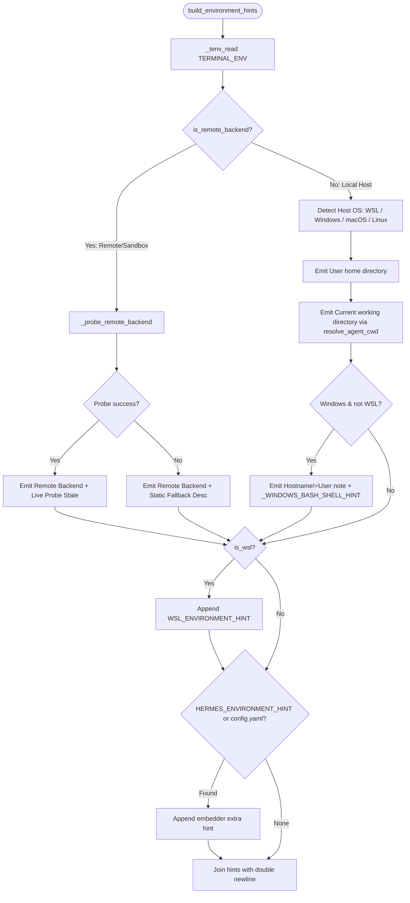
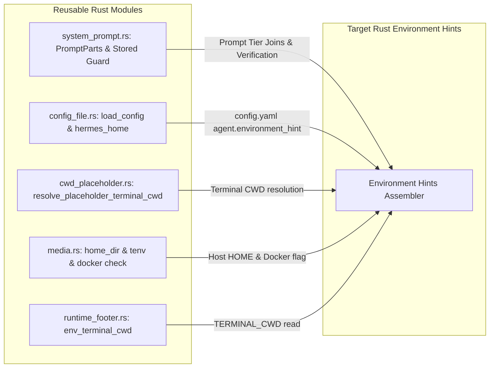

# Environment Prompt Mapping & Runtime Dependency Analysis

**Target Document:** [`rust/analysis/environment-prompt-map.md`](file:///home/eins0fx/development/hermes-agent-port/rust/analysis/environment-prompt-map.md)
**Scope:** Deep architectural mapping of [`agent/prompt_builder.py::build_environment_hints`](file:///home/eins0fx/development/hermes-agent-port/agent/prompt_builder.py#L1405-L1513) and its transitive helpers, exact input resolution, reusable Rust components in [`rust/`](file:///home/eins0fx/development/hermes-agent-port/rust), and missing runtime dependencies.
**Mode:** Read-only analysis. No code modified. No `cargo` commands run.

---

## 1. Executive Summary & Core Invariants

[`build_environment_hints()`](file:///home/eins0fx/development/hermes-agent-port/agent/prompt_builder.py#L1405-L1513) emits factual, environment-specific guidance for the system prompt. It describes the physical or virtual execution environment where the agent's tool surface (`terminal`, `read_file`, `write_file`, `patch`, `search_files`) actually executes.



### Invariants & Non-Negotiable Boundaries
1. **Tier Placement & Prefix Caching:**
   In [`agent/system_prompt.py:672-677`](file:///home/eins0fx/development/hermes-agent-port/agent/system_prompt.py#L672-L677), environment hints sit in the **Stable Tier** (cross-session prefix), immediately after model identification and before coding posture. They must remain deterministic across turns within a session to preserve KV-cache reuse.
2. **Host Suppression for Remote Backends:**
   When running under a container or remote sandbox backend (`docker`, `singularity`, `modal`, `daytona`, `ssh`, `vercel_sandbox`, `managed_modal`, or a plugin with `is_remote = True`), **host OS, host user home, and host cwd are strictly suppressed**. Tools run inside the remote sandbox, not on the host. Presenting host paths (e.g. `C:\Users\...` or `/home/user`) to an agent sandboxed in `/workspace` or `/root` causes hallucinated paths, cross-boundary contamination, and tool execution failures.
3. **Anchor Contract for Stored-Prompt Validation:**
   [`agent/conversation_loop.py:1250-1273`](file:///home/eins0fx/development/hermes-agent-port/agent/conversation_loop.py#L1250-L1273) (and its ported counterpart in [`rust/crates/hermes-gateway/src/system_prompt.rs:355-372`](file:///home/eins0fx/development/hermes-agent-port/rust/crates/hermes-gateway/src/system_prompt.rs#L355-L372)) anchors cwd drift detection on the exact `User home directory:` and `Current working directory:` lines emitted by `build_environment_hints()`. Any variation in these line prefixes or formats breaks runtime identity verification across turns.
4. **Rejection of Local-Only Shortcuts as Full Parity:**
   Treating `local` as the only backend, hardcoding host OS inspection, or replacing live remote backend probing with an empty string or permanent fallback is **not full parity**. Full parity requires multi-backend discrimination, container/sandbox introspection with fail-soft timeouts, and scope-aware configuration isolation.

---

## 2. Python Reference Architecture & Source References

### 2.1 Entrypoint: [`agent/prompt_builder.py::build_environment_hints`](file:///home/eins0fx/development/hermes-agent-port/agent/prompt_builder.py#L1405-L1513)

```python
def build_environment_hints() -> str:
```

The function executes the following sequence:

#### A. Backend & Remote Resolution ([`prompt_builder.py:1426-1428`](file:///home/eins0fx/development/hermes-agent-port/agent/prompt_builder.py#L1426-L1428))
1. Reads the configured backend via `_tenv_read("TERMINAL_ENV") or "local"`, trimmed and lowercased.
2. Evaluates `is_remote_backend = backend in _REMOTE_TERMINAL_BACKENDS or _plugin_backend_is_remote(backend)`.

#### B. Local Backend Branch ([`prompt_builder.py:1430-1461`](file:///home/eins0fx/development/hermes-agent-port/agent/prompt_builder.py#L1430-L1461))
When `not is_remote_backend`, tools run directly on the host machine:
1. **Host OS Line:**
   - If [`is_wsl()`](file:///home/eins0fx/development/hermes-agent-port/hermes_constants.py#L1573-L1588): `"Host: WSL (Windows Subsystem for Linux)"`
   - Else if `sys.platform == "win32"`: `f"Host: Windows ({_windows_marketing_version()})"`
   - Else if `sys.platform == "darwin"`: `f"Host: macOS ({platform.mac_ver()[0] or platform.release()})"`
   - Else: `f"Host: {platform.system()} ({platform.release()})"`
2. **User Home Directory:**
   - `f"User home directory: {os.path.expanduser('~')}"`
3. **Current Working Directory:**
   - `f"Current working directory: {resolve_agent_cwd()}"` (guarded by `try ... except OSError: pass`).
4. **Windows Hostname Notice:**
   - If `sys.platform == "win32" and not is_wsl()`:
     Appends: `"Note: on Windows, the machine hostname (e.g. from \`hostname\` or uname) is NOT the username. Use the 'User home directory' above to construct paths under C:\\Users\\<user>\\, never the hostname."`
5. **Windows MSYS/Bash Shell Guidance:**
   - If `sys.platform == "win32" and not is_wsl()`:
     Appends [`_WINDOWS_BASH_SHELL_HINT`](file:///home/eins0fx/development/hermes-agent-port/agent/prompt_builder.py#L1212-L1233).

#### C. Remote Backend Branch ([`prompt_builder.py:1462-1489`](file:///home/eins0fx/development/hermes-agent-port/agent/prompt_builder.py#L1462-L1489))
When `is_remote_backend`:
1. Calls [`_probe_remote_backend(backend)`](file:///home/eins0fx/development/hermes-agent-port/agent/prompt_builder.py#L1254-L1398).
2. **On Successful Probe:**
   ```text
   Terminal backend: {backend}. Your `terminal`, `read_file`, `write_file`, `patch`, and `search_files` tools all operate inside this {backend} environment — NOT on the machine where Hermes itself is running. The host OS, home, and cwd of the Hermes process are irrelevant; only the following backend state matters:
   {probe}
   ```
3. **On Probe Failure:**
   Falls back to [`_BACKEND_FALLBACK_DESCRIPTIONS.get(backend)`](file:///home/eins0fx/development/hermes-agent-port/agent/prompt_builder.py#L1173-L1181), then [`_plugin_backend_description(backend)`](file:///home/eins0fx/development/hermes-agent-port/agent/prompt_builder.py#L1160-L1170), then `f"a {backend} environment (likely Linux)"`:
   ```text
   Terminal backend: {backend}. Your `terminal`, `read_file`, `write_file`, `patch`, and `search_files` tools all operate inside {description} — NOT on the machine where Hermes itself runs. The backend probe didn't respond at prompt-build time, so the sandbox's current user, $HOME, and working directory are unknown from here. If you need them, probe directly with a terminal call like `uname -a && whoami && pwd`.
   ```

#### D. WSL Instruction Append ([`prompt_builder.py:1490-1492`](file:///home/eins0fx/development/hermes-agent-port/agent/prompt_builder.py#L1490-L1492))
If [`is_wsl()`](file:///home/eins0fx/development/hermes-agent-port/hermes_constants.py#L1573-L1588) is true, appends [`WSL_ENVIRONMENT_HINT`](file:///home/eins0fx/development/hermes-agent-port/agent/prompt_builder.py#L1117-L1126). (Note: This is evaluated regardless of backend branch).

#### E. Embedder Description Append ([`prompt_builder.py:1493-1511`](file:///home/eins0fx/development/hermes-agent-port/agent/prompt_builder.py#L1493-L1511))
Reads `HERMES_ENVIRONMENT_HINT` from the environment. If unset, reads `agent.environment_hint` from `config.yaml` via [`load_config_readonly()`](file:///home/eins0fx/development/hermes-agent-port/hermes_cli/config.py#L254). If present, appends verbatim.

#### F. Final Join ([`prompt_builder.py:1513`](file:///home/eins0fx/development/hermes-agent-port/agent/prompt_builder.py#L1513))
`"\n\n".join(hints)`

---

### 2.2 Deep Dive: Helper Implementations & Call Graph

#### 1. Scope-Aware Environment Read: [`_tenv_read`](file:///home/eins0fx/development/hermes-agent-port/agent/prompt_builder.py#L1236-L1252)
- Calls [`tools.terminal_scope::terminal_env(name, default)`](file:///home/eins0fx/development/hermes-agent-port/tools/terminal_scope.py#L102-L126).
- Checks ContextVar [`_terminal_scope_var`](file:///home/eins0fx/development/hermes-agent-port/tools/terminal_scope.py#L42).
- If `TerminalPolicyRefusal` is set, raises [`TerminalPolicyUnavailable`](file:///home/eins0fx/development/hermes-agent-port/tools/terminal_scope.py#L45-L52) (fail-closed security boundary preventing profile leakage).
- Only on `ImportError` does it fall back to `os.getenv(name, default)`.

#### 2. Remote Backend Classification: [`_REMOTE_TERMINAL_BACKENDS`](file:///home/eins0fx/development/hermes-agent-port/agent/prompt_builder.py#L1134-L1138) & [`_plugin_backend_is_remote`](file:///home/eins0fx/development/hermes-agent-port/agent/prompt_builder.py#L1144-L1157)
- In-tree set: `{"docker", "singularity", "modal", "daytona", "ssh", "vercel_sandbox", "managed_modal"}`.
- Plugin resolution: Calls [`agent.terminal_env_registry::provider_flag(backend, "is_remote", False)`](file:///home/eins0fx/development/hermes-agent-port/agent/terminal_env_registry.py#L128-L146).
- Registry queries registered [`TerminalEnvironmentProvider`](file:///home/eins0fx/development/hermes-agent-port/agent/terminal_env_provider.py#L72-L131) instances.

#### 3. WSL Detection: [`hermes_constants::is_wsl`](file:///home/eins0fx/development/hermes-agent-port/hermes_constants.py#L1573-L1588)
- Checks `/proc/version` for `"microsoft"` (case-insensitive).
- Caches detection in global `_wsl_detected: bool | None`.
- Fail-soft: returns `False` on any `OSError` / missing file.

#### 4. Windows Marketing Version: [`_windows_marketing_version`](file:///home/eins0fx/development/hermes-agent-port/agent/prompt_builder.py#L1192-L1210)
- Issue #51755: `platform.release()` returns `"10"` on Windows 11 because Windows NT 10.0 kernel version did not change.
- Evaluates `sys.getwindowsversion().build >= 22000` -> returns `"11"`, else `"10"`.
- Fallback: `platform.release()` on any lookup exception.

#### 5. Working Directory Resolution: [`agent.runtime_cwd::resolve_agent_cwd`](file:///home/eins0fx/development/hermes-agent-port/agent/runtime_cwd.py#L85-L99)
- Hierarchy:
  1. `_SESSION_CWD` ContextVar (`HERMES_SESSION_CWD`) if directory exists.
  2. `_terminal_cwd_env()` (`terminal_env("TERMINAL_CWD", "")`) if directory exists.
  3. `Path(os.getcwd())`.

#### 6. Remote Backend Probe: [`_probe_remote_backend`](file:///home/eins0fx/development/hermes-agent-port/agent/prompt_builder.py#L1254-L1398)
- **Process Cache:** [`_BACKEND_PROBE_CACHE`](file:///home/eins0fx/development/hermes-agent-port/agent/prompt_builder.py#L1189) keyed by `(env_type, cwd_hint)` where `cwd_hint = _tenv_read("TERMINAL_CWD", "")`.
- **Config Assembly:** Calls [`tools.terminal_tool::_get_env_config()`](file:///home/eins0fx/development/hermes-agent-port/tools/terminal_tool.py#L1800-L1935).
- **Environment Factory:** Calls [`tools.terminal_tool::_create_environment(...)`](file:///home/eins0fx/development/hermes-agent-port/tools/terminal_tool.py#L1988-L2201) with `task_id="prompt-backend-probe"`.
- **Probe Command:**
  ```sh
  printf 'os=%s\nkernel=%s\nhome=%s\ncwd=%s\nuser=%s\n' "$(uname -s 2>/dev/null || echo unknown)" "$(uname -r 2>/dev/null || echo unknown)" "$HOME" "$(pwd)" "$(whoami 2>/dev/null || id -un 2>/dev/null || echo unknown)"
  ```
- **Execution & Timeout:** Executes with `timeout=4`. Checks `returncode == 0` and non-empty output.
- **Teardown Contract:** `finally` block invokes [`tools.terminal_tool::_cleanup_env(env, force_remove=True)`](file:///home/eins0fx/development/hermes-agent-port/tools/terminal_tool.py#L2446-L2464) for all backends except `ssh` (SSH preserves its ControlMaster socket).
- **Output Parsing:** Splits lines on `=`, extracts `os`, `kernel`, `user`, `home`, `cwd`, formats as 2-space indented lines:
  - `OS: <os> <kernel>` (skips if unknown)
  - `User: <user>`
  - `Home: <home>`
  - `Working directory: <cwd>`

#### 7. Backend Fallback Descriptions: [`_BACKEND_FALLBACK_DESCRIPTIONS`](file:///home/eins0fx/development/hermes-agent-port/agent/prompt_builder.py#L1173-L1181)
- `"docker"`: `"a Docker container (Linux)"`
- `"singularity"`: `"a Singularity container (Linux)"`
- `"modal"`: `"a Modal sandbox (Linux)"`
- `"managed_modal"`: `"a managed Modal sandbox (Linux)"`
- `"daytona"`: `"a Daytona workspace (Linux)"`
- `"vercel_sandbox"`: `"a Vercel sandbox (Linux)"`
- `"ssh"`: `"a remote host reached over SSH (likely Linux)"`
- Plugin fallback: `provider.env_description` (default: `f"a {provider.display_name} environment (likely Linux)"`).

---

## 3. Exact Inputs Mapping

The following matrix documents every runtime input, type, resolution precedence, and source location:

| Input Category | Variable / Source | Data Type | Default Value | Precedence / Resolution Order | Source Reference |
|---|---|---|---|---|---|
| **Terminal Backend** | `TERMINAL_ENV` | `String` | `"local"` | 1. `terminal_scope` ContextVar<br>2. Process `TERMINAL_ENV`<br>3. `"local"` | [`prompt_builder.py:1426`](file:///home/eins0fx/development/hermes-agent-port/agent/prompt_builder.py#L1426), [`terminal_scope.py:102`](file:///home/eins0fx/development/hermes-agent-port/tools/terminal_scope.py#L102) |
| **Terminal CWD** | `TERMINAL_CWD` | `String` | `""` | 1. `_SESSION_CWD` ContextVar<br>2. `terminal_scope` ContextVar<br>3. Process `TERMINAL_CWD`<br>4. `os.getcwd()` | [`runtime_cwd.py:85-99`](file:///home/eins0fx/development/hermes-agent-port/agent/runtime_cwd.py#L85-L99), [`prompt_builder.py:1262`](file:///home/eins0fx/development/hermes-agent-port/agent/prompt_builder.py#L1262) |
| **Embedder Hint** | `HERMES_ENVIRONMENT_HINT` | `String` | `""` | 1. Process `HERMES_ENVIRONMENT_HINT`<br>2. `config.yaml:agent.environment_hint`<br>3. `""` | [`prompt_builder.py:1500-1507`](file:///home/eins0fx/development/hermes-agent-port/agent/prompt_builder.py#L1500-L1507) |
| **Host Kernel Info** | `/proc/version` | Filesystem | None | Case-insensitive search for `"microsoft"` | [`hermes_constants.py:1584`](file:///home/eins0fx/development/hermes-agent-port/hermes_constants.py#L1584) |
| **Host Platform OS** | `sys.platform` / `platform.system()` | Syscall | None | OS identification (`win32`, `darwin`, `linux`, etc.) | [`prompt_builder.py:1434-1440`](file:///home/eins0fx/development/hermes-agent-port/agent/prompt_builder.py#L1434-L1440) |
| **Windows Build** | `sys.getwindowsversion().build` | OS API | None | Build number: `>= 22000` -> `"11"`, else `"10"` | [`prompt_builder.py:1202`](file:///home/eins0fx/development/hermes-agent-port/agent/prompt_builder.py#L1202) |
| **macOS Version** | `platform.mac_ver()[0]` | OS API | None | Major.minor.patch string or `platform.release()` | [`prompt_builder.py:1437`](file:///home/eins0fx/development/hermes-agent-port/agent/prompt_builder.py#L1437) |
| **User Home Dir** | `os.path.expanduser('~')` | Environment | None | `$HOME` (Unix) or `%USERPROFILE%` (Windows) | [`prompt_builder.py:1442`](file:///home/eins0fx/development/hermes-agent-port/agent/prompt_builder.py#L1442) |
| **Docker Image** | `TERMINAL_DOCKER_IMAGE` | `String` | `"nikolaik/python-nodejs:python3.11-nodejs20"` | Environment variable via `_get_env_config()` | [`terminal_tool.py:1878`](file:///home/eins0fx/development/hermes-agent-port/tools/terminal_tool.py#L1878) |
| **Singularity Image** | `TERMINAL_SINGULARITY_IMAGE` | `String` | `"docker://nikolaik/python-nodejs:python3.11-nodejs20"` | Environment variable via `_get_env_config()` | [`terminal_tool.py:1880`](file:///home/eins0fx/development/hermes-agent-port/tools/terminal_tool.py#L1880) |
| **Modal Image** | `TERMINAL_MODAL_IMAGE` | `String` | `"nikolaik/python-nodejs:python3.11-nodejs20"` | Environment variable via `_get_env_config()` | [`terminal_tool.py:1881`](file:///home/eins0fx/development/hermes-agent-port/tools/terminal_tool.py#L1881) |
| **Daytona Image** | `TERMINAL_DAYTONA_IMAGE` | `String` | `"nikolaik/python-nodejs:python3.11-nodejs20"` | Environment variable via `_get_env_config()` | [`terminal_tool.py:1882`](file:///home/eins0fx/development/hermes-agent-port/tools/terminal_tool.py#L1882) |
| **SSH Host / User** | `TERMINAL_SSH_HOST`, `TERMINAL_SSH_USER` | `String` | `""` | Environment variables via `_get_env_config()` | [`terminal_tool.py:1890-1891`](file:///home/eins0fx/development/hermes-agent-port/tools/terminal_tool.py#L1890-L1891) |
| **SSH Port / Key** | `TERMINAL_SSH_PORT`, `TERMINAL_SSH_KEY` | `Integer`, `String` | `22`, `""` | Environment variables via `_get_env_config()` | [`terminal_tool.py:1892-1893`](file:///home/eins0fx/development/hermes-agent-port/tools/terminal_tool.py#L1892-L1893) |
| **Container Hardware** | `TERMINAL_CONTAINER_CPU`, `_MEMORY`, `_DISK` | `Float`, `Int`, `Int` | `1.0`, `5120`, `51200` | Environment variables via `_get_env_config()` | [`terminal_tool.py:1816-1818`](file:///home/eins0fx/development/hermes-agent-port/tools/terminal_tool.py#L1816-L1818) |
| **Docker Options** | `TERMINAL_DOCKER_VOLUMES`, `_ENV`, `_FORWARD_ENV`, `_EXTRA_ARGS`, `_SHM_SIZE` | `JSON`, `String` | `[]`, `{}`, `[]`, `[]`, `"1g"` | Environment variables via `_get_env_config()` | [`terminal_tool.py:1825-1829`](file:///home/eins0fx/development/hermes-agent-port/tools/terminal_tool.py#L1825-L1829) |
| **Probe Probe Cache** | In-process map | `Map<(String, String), String>` | Empty | Keyed by `(backend, cwd_hint)` | [`prompt_builder.py:1189`](file:///home/eins0fx/development/hermes-agent-port/agent/prompt_builder.py#L1189) |

---

## 4. Reusable Rust Implementations in [`rust/`](file:///home/eins0fx/development/hermes-agent-port/rust)

The existing Rust crates ([`hermes-core`](file:///home/eins0fx/development/hermes-agent-port/rust/crates/hermes-core) and [`hermes-gateway`](file:///home/eins0fx/development/hermes-agent-port/rust/crates/hermes-gateway)) contain foundational primitives that can be directly reused or integrated:



### 4.1 System Prompt Assembly & Stored Runtime Guard: [`hermes-gateway/src/system_prompt.rs`](file:///home/eins0fx/development/hermes-agent-port/rust/crates/hermes-gateway/src/system_prompt.rs)
- **Prompt Tier Join Engine ([lines 261-293](file:///home/eins0fx/development/hermes-agent-port/rust/crates/hermes-gateway/src/system_prompt.rs#L261-L293)):**
  `PromptParts::from_sections` and `PromptParts::joined` join stable, context, and volatile tiers with `\n\n` while stripping boundary whitespace. Environment hints belong at the end of the `stable` section slice.
- **Runtime Identity Guard ([lines 332-372](file:///home/eins0fx/development/hermes-agent-port/rust/crates/hermes-gateway/src/system_prompt.rs#L332-L372)):**
  `stored_prompt_matches_runtime` already scans the prompt text for:
  ```rust
  line.starts_with("User home directory:")
  ```
  followed within 3 lines by:
  ```rust
  line.strip_prefix("Current working directory:")
  ```
  This is the exact contract emitted by `build_environment_hints()`. When Rust generates environment hints, they will seamlessly pass this verification.

### 4.2 Configuration Loading: [`hermes-gateway/src/config_file.rs`](file:///home/eins0fx/development/hermes-agent-port/rust/crates/hermes-gateway/src/config_file.rs)
- **Hermes Home Resolution ([lines 68-91](file:///home/eins0fx/development/hermes-agent-port/rust/crates/hermes-gateway/src/config_file.rs#L68-L91)):**
  `hermes_home()` resolves `HERMES_HOME`, `%LOCALAPPDATA%\hermes` on Windows, and `~/.hermes` on Unix.
- **Config Parser ([lines 307-343](file:///home/eins0fx/development/hermes-agent-port/rust/crates/hermes-gateway/src/config_file.rs#L307-L343)):**
  `load_config()` loads `$HERMES_HOME/config.yaml` into a `serde_json::Value`. Reusable for extracting `config.get("agent").and_then(|a| a.get("environment_hint"))`.

### 4.3 CWD Placeholder Resolution: [`hermes-gateway/src/cwd_placeholder.rs`](file:///home/eins0fx/development/hermes-agent-port/rust/crates/hermes-gateway/src/cwd_placeholder.rs)
- **Placeholder Logic ([lines 29-100](file:///home/eins0fx/development/hermes-agent-port/rust/crates/hermes-gateway/src/cwd_placeholder.rs#L29-L100)):**
  `resolve_placeholder_terminal_cwd` maps placeholder cwds (`.`, `auto`, `cwd`) according to backend (`local` vs `docker` with workspace mount vs container sandboxes). Reusable to determine the initial `TERMINAL_CWD` value passed to prompt construction.

### 4.4 Media & Path Primitives: [`hermes-gateway/src/media.rs`](file:///home/eins0fx/development/hermes-agent-port/rust/crates/hermes-gateway/src/media.rs)
- **Home Directory Read ([line 155](file:///home/eins0fx/development/hermes-agent-port/rust/crates/hermes-gateway/src/media.rs#L155)):**
  `home_dir() -> Option<PathBuf>` reads `std::env::var_os("HOME")`.
- **Environment Variable Fallback ([line 376](file:///home/eins0fx/development/hermes-agent-port/rust/crates/hermes-gateway/src/media.rs#L376)):**
  `tenv(name, default)` helper reads process environment.
- **Docker Detection ([line 380](file:///home/eins0fx/development/hermes-agent-port/rust/crates/hermes-gateway/src/media.rs#L380)):**
  `terminal_is_docker()` tests whether `TERMINAL_ENV` is `"docker"`.

### 4.5 Runtime Footer: [`hermes-gateway/src/runtime_footer.rs`](file:///home/eins0fx/development/hermes-agent-port/rust/crates/hermes-gateway/src/runtime_footer.rs)
- **Terminal CWD Read ([line 173](file:///home/eins0fx/development/hermes-agent-port/rust/crates/hermes-gateway/src/runtime_footer.rs#L173)):**
  `env_terminal_cwd()` reads `TERMINAL_CWD` from process environment.

---

## 5. Missing Runtime Dependencies & Architecture Gaps

To achieve full parity with Python rather than a superficial local-only mock, the following dependencies and subsystems must be implemented:

### 5.1 Remote Sandbox Execution & Probing Engine
* **Gap:** Rust currently has no container or remote sandbox execution layer. There is no equivalent to `tools.terminal_tool::_create_environment` for Docker, Singularity, Modal, Daytona, Vercel Sandbox, or SSH.
* **Requirements for Parity:**
  - Docker API integration (e.g. via `bollard` or `std::process::Command` calling `docker exec / docker run`).
  - SSH client (e.g. `russh` or `ssh2` or system `ssh`).
  - Daytona / Modal / Vercel API clients for sandbox instantiation.
  - Ephemeral probe execution: Running the `printf 'os=...user=...'` one-liner with a strict 4-second timeout.
  - Immediate teardown: Cleaning up probe sandboxes (`task_id="prompt-backend-probe"`) with `force_remove=true` to prevent leaking idle containers.

### 5.2 Scope-Aware Context Isolation (`terminal_scope`)
* **Gap:** Rust's `tenv` reads `std::env::var` globally.
* **Risk:** In a multi-session or multi-profile gateway server, reading process-global environment variables allows one profile's backend setting (e.g. `docker`) to contaminate another profile's turn (e.g. `local`), creating sandbox escapes or silent failures.
* **Requirements for Parity:**
  - A profile-scoped terminal configuration structure passed explicitly or bound via `tokio::task_local!`.
  - Fail-closed policy handling (`TerminalPolicyUnavailable` / `TerminalPolicyRefusal`).

### 5.3 Pluggable Terminal Environment Registry
* **Gap:** Python supports pluggable sandbox backends via `agent.terminal_env_registry` and `agent.terminal_env_provider.TerminalEnvironmentProvider`.
* **Requirements for Parity:**
  - A backend registry mapping backend names to backend metadata (`is_remote: bool`, `env_description: String`).
  - Trait definition for terminal environment providers.

### 5.4 WSL Detection & Path Translation
* **Gap:** Missing in Rust.
* **Requirements for Parity:**
  - `/proc/version` reader checking for `"microsoft"` with process-lifetime caching.
  - Windows-to-WSL drive mapping: `C:\path` -> `/mnt/c/path`.
  - WSL UNC mapping: `\\wsl.localhost\distro\path` -> `/path`.
  - `translate_cwd_for_wsl_backend` to normalize cross-boundary paths.

### 5.5 Windows Marketing Version & MSYS Guidance
* **Gap:** Rust standard library `std::env::consts::OS` only reports `"windows"`.
* **Requirements for Parity:**
  - Windows API query (`GetVersionEx` / `RtlGetVersion` or reading registry `HKLM\SOFTWARE\Microsoft\Windows NT\CurrentVersion\CurrentBuildNumber`) to check if build >= 22000 (Windows 11 vs Windows 10).
  - Injecting `_WINDOWS_BASH_SHELL_HINT` and `WSL_ENVIRONMENT_HINT` constants into the prompt catalog.

---

## 6. Rust Implementation Blueprint

To port `build_environment_hints` with strict fidelity, the implementation should be structured in two tiers:

### 6.1 Data Types & Contract

```rust
pub struct EnvironmentHintsConfig<'a> {
    pub terminal_env: Option<&'a str>,
    pub terminal_cwd: Option<&'a str>,
    pub session_cwd: Option<&'a str>,
    pub embedder_hint: Option<&'a str>,
    pub config: &'a serde_json::Value,
}

pub struct RemoteProbeOutput {
    pub os: Option<String>,
    pub user: Option<String>,
    pub home: Option<String>,
    pub cwd: Option<String>,
}
```

### 6.2 Implementation Phases

#### Phase 1: Local Host Detection & Static Fallbacks
- **Host OS & WSL:**
  - Port `is_wsl()` via `/proc/version` reading.
  - Port Windows marketing version detection via Windows build number.
  - Format `Host: ...`, `User home directory: ...`, and `Current working directory: ...`.
  - Port `_WINDOWS_BASH_SHELL_HINT` and `WSL_ENVIRONMENT_HINT` into `tools/system-prompt-guidance.json`.
- **Remote Fallbacks:**
  - Map `_REMOTE_TERMINAL_BACKENDS` set.
  - When a remote backend is specified, emit the static fallback description matching Python's `_BACKEND_FALLBACK_DESCRIPTIONS`.
  - Append embedder hint from `HERMES_ENVIRONMENT_HINT` or `config.yaml:agent.environment_hint`.

#### Phase 2: Live Sandbox Probe Execution
- Wire container/SSH execution into a `probe_remote_backend` helper.
- Execute the POSIX introspection string with a 4-second timeout.
- Guarantee ephemeral container teardown via `Drop` or explicit cleanup.
- Cache results by `(backend, cwd_hint)` per session/process.

This architecture ensures complete parity with Python's security boundaries, cache stability, and multi-platform execution models.
