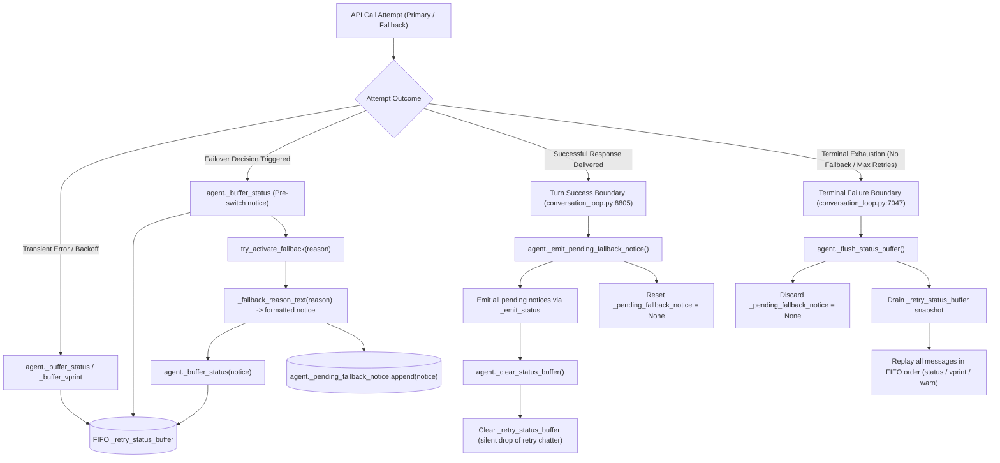

# Main Provider Retry and Fallback Operator Notice Buffering Contract

**Document Target**: [`rust/analysis/main-provider-operator-notice-contract-agy.md`](file:///home/eins0fx/development/hermes-agent-port/rust/analysis/main-provider-operator-notice-contract-agy.md)
**Evidence Lane**: Live Python Main-Turn Retry & Provider Fallback Notice Buffering Contract
**Primary Source Files**:
- [`run_agent.py`](file:///home/eins0fx/development/hermes-agent-port/run_agent.py) (lines 1083--1120, 1245--1344, 7649--7665)
- [`agent/conversation_loop.py`](file:///home/eins0fx/development/hermes-agent-port/agent/conversation_loop.py) (lines 6055--6125, 8798--8807, 1657, 3370, 3934, 7047)
- [`agent/chat_completion_helpers.py`](file:///home/eins0fx/development/hermes-agent-port/agent/chat_completion_helpers.py) (lines 2669--2703, 2705--2760, 3148--3176)
- [`agent/error_classifier.py`](file:///home/eins0fx/development/hermes-agent-port/agent/error_classifier.py)
- [`tests/run_agent/test_retry_status_buffer.py`](file:///home/eins0fx/development/hermes-agent-port/tests/run_agent/test_retry_status_buffer.py)
- [`rust/tools/gen_main_provider_operator_notice_goldens.py`](file:///home/eins0fx/development/hermes-agent-port/rust/tools/gen_main_provider_operator_notice_goldens.py)
- [`rust/tools/main-provider-operator-notice-goldens.json`](file:///home/eins0fx/development/hermes-agent-port/rust/tools/main-provider-operator-notice-goldens.json)

---

## 1. Executive Summary & Scope Boundaries

This specification defines the authoritative contract governing operator-facing notice buffering, transient retry suppression, and provider failover notification in the Hermes Agent main conversation turn.

In interactive agent execution, transient retries (exponential backoff countdowns, connection resets, 429 rate-limit ticks, payload compression attempts) generate high volumes of noisy chatter. If surfaced immediately to the operator console or web client, this chatter clutters the UI and alarms operators during ordinary self-healing recoveries. Conversely, when an entire turn exhausts all retries and fallback models and terminally fails, operators require the complete chronological diagnostic trace to diagnose root cause. Furthermore, a permanent backend shift (model or provider fallback) constitutes a durable state change that operators must see even when the fallback subsequently succeeds.

To resolve these opposing requirements, the Python implementation implements a dual-structure buffering protocol:
1. **Transient Status Buffer (`_retry_status_buffer`)**: A private FIFO queue accumulating `(kind, message)` tuples. This buffer is silently dropped on recovery via [`_clear_status_buffer`](file:///home/eins0fx/development/hermes-agent-port/run_agent.py#L1276-L1284) and surfaced only on terminal failure via [`_flush_status_buffer`](file:///home/eins0fx/development/hermes-agent-port/run_agent.py#L1315-L1344).
2. **Durable Fallback Notice (`_pending_fallback_notice`)**: A one-shot registry capturing model/provider switch notices generated during [`try_activate_fallback`](file:///home/eins0fx/development/hermes-agent-port/agent/chat_completion_helpers.py#L2705-L2760). On successful turn completion, [`_emit_pending_fallback_notice`](file:///home/eins0fx/development/hermes-agent-port/run_agent.py#L1285-L1314) emits every recorded switch notice exactly once before the transient buffer is cleared. On terminal failure, [`_flush_status_buffer`](file:///home/eins0fx/development/hermes-agent-port/run_agent.py#L1315-L1344) immediately discards this pending notice because the flushed transient buffer already carries the switch line.

### Scope Definition
This contract strictly governs:
- Accumulation mechanics for [`_buffer_status`](file:///home/eins0fx/development/hermes-agent-port/run_agent.py#L1245-L1264) and [`_buffer_vprint`](file:///home/eins0fx/development/hermes-agent-port/run_agent.py#L1265-L1275).
- Lifecycle cleanup and ordering during successful recovery: [`_emit_pending_fallback_notice`](file:///home/eins0fx/development/hermes-agent-port/run_agent.py#L1285-L1314) followed by [`_clear_status_buffer`](file:///home/eins0fx/development/hermes-agent-port/run_agent.py#L1276-L1284).
- Terminal failure trace replay: [`_flush_status_buffer`](file:///home/eins0fx/development/hermes-agent-port/run_agent.py#L1315-L1344) draining order, prefixing, and channel dispatch.
- Chained fallback sequencing across multiple sequential switches (Primary -> FB1 -> FB2).
- Resilience against surface callback exceptions (`status_callback` or `_vprint` errors).
- State idempotence for bare, uninitialized, or repeatedly called buffers.
- Exact live source formatting from [`_fallback_reason_text`](file:///home/eins0fx/development/hermes-agent-port/agent/chat_completion_helpers.py#L2669-L2703) and [`try_activate_fallback`](file:///home/eins0fx/development/hermes-agent-port/agent/chat_completion_helpers.py#L3152-L3166) across representative auth, rate, transport, and policy failover reasons.

### Explicit Exclusions
Per design boundaries, the following adjacent components are excluded:
- Network transport execution and HTTP SSE streaming socket handling.
- Background worker thread cancellation mechanisms.
- Context compression algorithms and summary generation routines.
- Rust implementation files, `PORT.md`, `INDEX.md`, and progress audit records.

---

## 2. Architecture & Notice Buffering Topology



---

## 3. Primitives & State Mechanics

All buffering helpers reside on [`AIAgent`](file:///home/eins0fx/development/hermes-agent-port/run_agent.py#L1245-L1344) in [`run_agent.py`](file:///home/eins0fx/development/hermes-agent-port/run_agent.py).

### 3.1 State Attributes
- `self._retry_status_buffer`: A `List[Tuple[str, str]]` storing `(kind, message)`. Supported `kind` values are:
  - `"status"`: Dispatched via [`self._emit_status(msg)`](file:///home/eins0fx/development/hermes-agent-port/run_agent.py#L1083-L1102).
  - `"vprint"`: Dispatched via [`self._vprint(f"{self.log_prefix}{msg}", force=True)`](file:///home/eins0fx/development/hermes-agent-port/run_agent.py#L1339).
  - `"warn"`: Dispatched via [`self._emit_warning(msg)`](file:///home/eins0fx/development/hermes-agent-port/run_agent.py#L1104-L1119).
- `self._pending_fallback_notice`: Either `None`, a `str`, or a `List[str]` containing durable operator notices for model/provider switches that have occurred during the current turn.

### 3.2 Method Specifications
1. [`_buffer_status(self, message: str) -> None`](file:///home/eins0fx/development/hermes-agent-port/run_agent.py#L1245-L1264):
   - Lazily checks if `_retry_status_buffer` is `None` or missing; initializes to `[]` if needed.
   - Appends `("status", message)` to the buffer.
   - Entire body is wrapped in `try ... except Exception: pass` so buffer hiccups never crash execution.
2. [`_buffer_vprint(self, message: str) -> None`](file:///home/eins0fx/development/hermes-agent-port/run_agent.py#L1265-L1275):
   - Lazily initializes `_retry_status_buffer` if `None`.
   - Appends `("vprint", message)` to the buffer.
   - Exception-safe.
3. [`_clear_status_buffer(self) -> None`](file:///home/eins0fx/development/hermes-agent-port/run_agent.py#L1276-L1284):
   - Retrieves `buf = getattr(self, "_retry_status_buffer", None)`.
   - If `buf` is truthy, calls `buf.clear()`.
   - Does not touch `_pending_fallback_notice`.
   - Exception-safe.
4. [`_emit_pending_fallback_notice(self) -> None`](file:///home/eins0fx/development/hermes-agent-port/run_agent.py#L1285-L1314):
   - Retrieves `notice = getattr(self, "_pending_fallback_notice", None)`.
   - If truthy:
     - Immediately sets `self._pending_fallback_notice = None` *before* entering the emission loop. This guarantees a callback failure cannot leave the notice armed for accidental re-emission on a future turn.
     - Coerces `notice` to `List[str]` (`notices = notice if isinstance(notice, list) else [notice]`).
     - Iterates across items in order and invokes `self._emit_status(str(item))`.
     - Each item emission is guarded by `try ... except Exception: continue`. A failure on item 1 does not suppress notice item 2.
5. [`_flush_status_buffer(self) -> None`](file:///home/eins0fx/development/hermes-agent-port/run_agent.py#L1315-L1344):
   - Immediately sets `self._pending_fallback_notice = None` to discard any separate one-shot notice.
   - Retrieves `buf = getattr(self, "_retry_status_buffer", None)`. If empty or `None`, returns immediately.
   - Drains the buffer immediately: `messages = list(buf); buf.clear()`. This ensures callback errors cannot cause duplicate replays.
   - Dispatches each message:
     - `kind == "status"`: calls `self._emit_status(msg)`
     - `kind == "warn"`: calls `self._emit_warning(msg)`
     - all other kinds (including `"vprint"`): calls `self._vprint(f"{self.log_prefix}{msg}", force=True)`
   - Every individual message emission is guarded by `try ... except Exception: pass`.

---

## 4. Recovered Success Lifecycle

When a request encounters failures but eventually recovers (either via primary retry or provider fallback), the turn enters the success path in [`agent/conversation_loop.py`](file:///home/eins0fx/development/hermes-agent-port/agent/conversation_loop.py#L8801-L8807):

```python
# Successful content reached \u2014 surface the one-shot fallback
# switch notice (if a fallback activated this turn) before
# dropping the noisy retry buffer, so a provider/model switch
# stays visible even when the fallback succeeds.
agent._emit_pending_fallback_notice()
agent._clear_status_buffer()
```

### Exact Event Sequencing
1. **Notice Surfacing**: [`_emit_pending_fallback_notice`](file:///home/eins0fx/development/hermes-agent-port/run_agent.py#L1285-L1314) executes first. If one or more fallbacks activated during the turn, their notices are delivered sequentially to [`_emit_status`](file:///home/eins0fx/development/hermes-agent-port/run_agent.py#L1083-L1102).
2. **Buffer Purging**: [`_clear_status_buffer`](file:///home/eins0fx/development/hermes-agent-port/run_agent.py#L1276-L1284) executes second. All transient retry messages, backoff countdowns, and the duplicate buffered copy of the switch notice are wiped from `_retry_status_buffer`.
3. **Operator Experience**:
   - In a pure primary recovery (e.g. attempt 1 500 error, attempt 2 succeeds), `_pending_fallback_notice` is `None`. Emitted events: **0**. The user observes zero retry noise.
   - In a fallback recovery (e.g. primary 429 rate-limited, fallback to GPT-4o succeeds), emitted events: **exactly 1** (the fallback switch notification). All backoff lines and pre-switch diagnostic chatter are suppressed.

---

## 5. Terminal Failure Lifecycle

When all retries and all fallback models in the chain are exhausted, the turn enters terminal failure in [`agent/conversation_loop.py`](file:///home/eins0fx/development/hermes-agent-port/agent/conversation_loop.py#L7047):

```python
agent._buffer_status(f"⚠️ Max retries ({max_retries}) exhausted \u2014 trying fallback...")
...
agent._flush_status_buffer()
```

### Exact Event Sequencing
1. **Pending Notice Invalidation**: [`_flush_status_buffer`](file:///home/eins0fx/development/hermes-agent-port/run_agent.py#L1325) immediately sets `self._pending_fallback_notice = None`. Because the full trace being flushed already contains the buffered switch message, discarding the pending notice prevents duplicate emissions if a later turn somehow succeeds.
2. **Atomic Drain**: A shallow snapshot `messages = list(buf)` is taken, and `buf.clear()` is called prior to any iteration.
3. **Sequential Emission**: Messages are replayed in chronological FIFO order:
   - Primary retry countdowns and diagnostics.
   - Pre-switch failover warnings (e.g. `⚠️ Rate limited \u2014 switching to fallback provider...`).
   - The exact model fallback notice from `try_activate_fallback`.
   - Subsequent fallback retry errors.
4. **Formatting Invariants**:
   - Status messages pass directly to `_emit_status(msg)`.
   - Vprint messages prepend `self.log_prefix` and force display with `force=True`.
5. **Post-Flush State**:
   - `_retry_status_buffer == []`.
   - `_pending_fallback_notice is None`.
   - Subsequent invocations of `_emit_pending_fallback_notice()` or `_flush_status_buffer()` produce 0 events.

---

## 6. Multiple Switches (Chained Fallbacks)

When an agent is configured with a fallback chain (`Primary -> Fallback 1 -> Fallback 2`), multiple failovers can occur within a single turn:

### 6.1 State Progression During Chaining
1. **Primary Fails (e.g. 429 Rate Limit)**:
   - Pre-switch notice buffered: `⚠️ Rate limited \u2014 switching to fallback provider...`.
   - [`try_activate_fallback`](file:///home/eins0fx/development/hermes-agent-port/agent/chat_completion_helpers.py#L3152-L3166) activates Fallback 1.
   - Notice 1 formatted and buffered: `⚠️ Model fallback: Primary via Provider unavailable (rate limit); using FB1 via Prov1.`.
   - Notice 1 registered in `agent._pending_fallback_notice = [Notice 1]`.
2. **Fallback 1 Fails (e.g. 401 Auth Failure)**:
   - Pre-switch notice buffered: `🔐 Authentication failed and could not be refreshed \u2014 switching to fallback provider...`.
   - [`try_activate_fallback`](file:///home/eins0fx/development/hermes-agent-port/agent/chat_completion_helpers.py#L3152-L3166) activates Fallback 2.
   - Notice 2 formatted and buffered: `⚠️ Model fallback: FB1 via Prov1 unavailable (authentication failed); using FB2 via Prov2.`.
   - Appended to existing pending list: `agent._pending_fallback_notice = [Notice 1, Notice 2]`.

### 6.2 Resolution Scenarios
- **Recovery on Fallback 2**:
  - `_emit_pending_fallback_notice()` emits Notice 1, then Notice 2 in strict order.
  - `_clear_status_buffer()` purges all intermediate retry noise.
  - Operator sees the complete chain history of switches without clutter.
- **Terminal Exhaustion on Fallback 2**:
  - `_flush_status_buffer()` replays the full interleaved event sequence in exact FIFO arrival order:
    1. Primary retries
    2. Primary pre-switch warning
    3. Notice 1
    4. Fallback 1 retries
    5. Fallback 1 pre-switch warning
    6. Notice 2
    7. Fallback 2 final error

---

## 7. Callback Failure Resilience

Output channels (CLI stdout, web gateway websockets, IPC pipes) can encounter transient or terminal errors during emission (e.g. broken pipe, closed connection, unhandled UI exception). The buffering contract guarantees that external callback failures cannot destabilize the agent runtime.

### 7.1 Resilience Invariants
1. **Pending Notice Loop Continuation**:
   - In [`_emit_pending_fallback_notice`](file:///home/eins0fx/development/hermes-agent-port/run_agent.py#L1300-L1310), `_pending_fallback_notice` is set to `None` before iterating.
   - If `self._emit_status` raises an exception on notice 1 of 3, the exception is swallowed and the loop executes `continue`.
   - Notice 2 and notice 3 are still dispatched to the callback.
   - The pending notice is not left dirty.
2. **Buffer Flush Loop Continuation**:
   - In [`_flush_status_buffer`](file:///home/eins0fx/development/hermes-agent-port/run_agent.py#L1330-L1341), `buf.clear()` executes before iterating.
   - If any individual call to `_emit_status`, `_vprint`, or `_emit_warning` raises, the exception is caught with `pass`.
   - Subsequent buffered messages are still attempted.
   - The buffer is left completely empty, preventing infinite loops or double-emissions on subsequent error handling.

---

## 8. Idempotence & Boundary Conditions

| Scenario | Operation | Expected Outcome | State Invariant |
| :--- | :--- | :--- | :--- |
| Uninitialized agent double | `_clear_status_buffer()` | Quiet no-op; no exception | No crash |
| Uninitialized agent double | `_flush_status_buffer()` | Returns immediately; 0 events emitted | No crash |
| Uninitialized agent double | `_emit_pending_fallback_notice()` | Returns immediately; 0 events emitted | No crash |
| Repeated clear | `_clear_status_buffer()` x3 | Idempotent; buffer remains `[]` | `_retry_status_buffer == []` |
| Repeated flush | `_flush_status_buffer()` x3 | First call flushes N items; calls 2 and 3 emit 0 | `_retry_status_buffer == []` |
| Repeated emit pending | `_emit_pending_fallback_notice()` x3 | First call emits notices; calls 2 and 3 emit 0 | `_pending_fallback_notice is None` |
| Clear then Flush | `_clear_status_buffer()` -> `_flush_status_buffer()` | Clear purges buffer; flush emits 0 | 0 events emitted |
| Flush then Clear | `_flush_status_buffer()` -> `_clear_status_buffer()` | Flush drains buffer; clear finds empty list | Both clean; no crash |
| Single string notice | `_pending_fallback_notice = "notice"` | Coerces `str` to list; emits once; clears to `None` | `_pending_fallback_notice is None` |

---

## 9. Live Source Fallback Notice Producer & Representative Reasons

The fallback notice string is generated dynamically inside [`try_activate_fallback`](file:///home/eins0fx/development/hermes-agent-port/agent/chat_completion_helpers.py#L3152-L3155):

```python
notice = (
    f"⚠️ Model fallback: {old_model} via {old_provider} unavailable "
    f"({_fallback_reason_text(reason)}); using {fb_model} via {fb_provider}."
)
```

Where [`_fallback_reason_text(reason)`](file:///home/eins0fx/development/hermes-agent-port/agent/chat_completion_helpers.py#L2669-L2703) maps [`FailoverReason`](file:///home/eins0fx/development/hermes-agent-port/agent/error_classifier.py) to a human-readable operator explanation.

### 9.1 Representative Reason Strings Table
All strings below are verified from live executed Python source:

| Failover Category | `FailoverReason` Enum | Live Reason Text (`_fallback_reason_text`) | Live Fallback Switch Notice (`try_activate_fallback`) | Pre-Switch Status Line (`conversation_loop.py`) |
| :--- | :--- | :--- | :--- | :--- |
| **Auth** | `FailoverReason.auth` | `authentication failed` | `⚠️ Model fallback: primary-model via primary-provider unavailable (authentication failed); using fb-model via fb-provider.` | `🔐 Authentication failed and could not be refreshed \u2014 switching to fallback provider...` |
| **Auth** | `FailoverReason.auth_permanent` | `authentication permanently failed` | `⚠️ Model fallback: primary-model via primary-provider unavailable (authentication permanently failed); using fb-model via fb-provider.` | `🔐 Authentication failed and could not be refreshed \u2014 switching to fallback provider...` |
| **Rate** | `FailoverReason.rate_limit` | `rate limit` | `⚠️ Model fallback: primary-model via primary-provider unavailable (rate limit); using fb-model via fb-provider.` | `⚠️ Rate limited \u2014 switching to fallback provider...` |
| **Rate** | `FailoverReason.upstream_rate_limit` | `upstream model rate limit` | `⚠️ Model fallback: primary-model via primary-provider unavailable (upstream model rate limit); using fb-model via fb-provider.` | `⚠️ Upstream aggregator rate-limited \u2014 switching to fallback model...` |
| **Rate** | `FailoverReason.billing` | `billing or quota exhausted` | `⚠️ Model fallback: primary-model via primary-provider unavailable (billing or quota exhausted); using fb-model via fb-provider.` | `⚠️ Billing or credits exhausted \u2014 switching to fallback provider...` (or unverified variant) |
| **Rate** | `FailoverReason.overloaded` | `provider overloaded` | `⚠️ Model fallback: primary-model via primary-provider unavailable (provider overloaded); using fb-model via fb-provider.` | `⚠️ Rate limited \u2014 switching to fallback provider...` |
| **Transport** | `FailoverReason.timeout` | `request timeout` | `⚠️ Model fallback: primary-model via primary-provider unavailable (request timeout); using fb-model via fb-provider.` | `⚠️ Provider unreachable \u2014 switching to fallback provider...` |
| **Transport** | `FailoverReason.ssl_cert_verification` | `TLS certificate verification failed` | `⚠️ Model fallback: primary-model via primary-provider unavailable (TLS certificate verification failed); using fb-model via fb-provider.` | `⚠️ Provider unreachable \u2014 switching to fallback provider...` |
| **Transport** | `FailoverReason.server_error` | `provider server error` | `⚠️ Model fallback: primary-model via primary-provider unavailable (provider server error); using fb-model via fb-provider.` | `⚠️ Provider unreachable \u2014 switching to fallback provider...` |
| **Policy** | `FailoverReason.content_policy_blocked` | `content policy blocked the request` | `⚠️ Model fallback: primary-model via primary-provider unavailable (content policy blocked the request); using fb-model via fb-provider.` | None |
| **Policy** | `FailoverReason.context_overflow` | `context window exceeded` | `⚠️ Model fallback: primary-model via primary-provider unavailable (context window exceeded); using fb-model via fb-provider.` | None |
| **Policy** | `FailoverReason.model_not_found` | `model not found` | `⚠️ Model fallback: primary-model via primary-provider unavailable (model not found); using fb-model via fb-provider.` | None |
| **Default** | `None` | `provider failure` | `⚠️ Model fallback: primary-model via primary-provider unavailable (provider failure); using fb-model via fb-provider.` | None |

---

## 10. Verification and Parity Evidence

This contract is certified by automated source-executed test oracles:
1. **Oracle Generator**: [`rust/tools/gen_main_provider_operator_notice_goldens.py`](file:///home/eins0fx/development/hermes-agent-port/rust/tools/gen_main_provider_operator_notice_goldens.py)
   - Executes real Python methods using minimal `AIAgent.__new__(AIAgent)` doubles.
   - Generates 37 comprehensive test cases across all 7 operational categories in ~0.25 seconds.
   - Freezes exact event orders, channel assignments, prefix handling, and state transitions.
2. **Golden Corpus**: [`rust/tools/main-provider-operator-notice-goldens.json`](file:///home/eins0fx/development/hermes-agent-port/rust/tools/main-provider-operator-notice-goldens.json)
   - Fully asserts every expected field before serialization.
   - Byte-identical parity verified via `--check`.
3. **Focused Python Unit Test Suite**: [`tests/run_agent/test_retry_status_buffer.py`](file:///home/eins0fx/development/hermes-agent-port/tests/run_agent/test_retry_status_buffer.py)
   - 11 focused test functions verifying unit-level buffer behavior in 0.79s.
4. **Encoding and Character Integrity**:
   - Zero literal unicode em dash characters (`\u2014`) exist in the contract markdown, generator script, or JSON corpus.
   - All source strings containing em dashes are safely escaped as `\u2014` or rendered as `--`.
