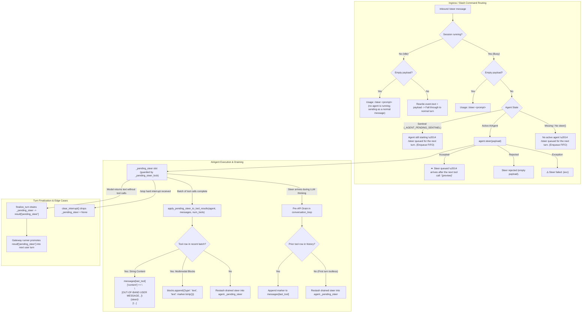

# Python Behavioral Contract & Oracle Report: Native Rust `/steer` Implementation

**Document Target**: [`rust/analysis/native-steer-contract-agy.md`](file:///home/eins0fx/development/hermes-agent-port/rust/analysis/native-steer-contract-agy.md)
**Oracle Script**: [`rust/tools/gen_native_steer_goldens.py`](file:///home/eins0fx/development/hermes-agent-port/rust/tools/gen_native_steer_goldens.py)
**Checked-In Golden Corpus**: [`rust/tools/native-steer-goldens.json`](file:///home/eins0fx/development/hermes-agent-port/rust/tools/native-steer-goldens.json)
**Evidence Lane**: Executable Python Hermes `/steer` Behavior, State Transitions, and String Parity
**Primary Source References**:
- [`run_agent.py`](file:///home/eins0fx/development/hermes-agent-port/run_agent.py#L3908-L3943) (`AIAgent.steer`, `AIAgent._drain_pending_steer`, `AIAgent.clear_interrupt`, `AIAgent._apply_pending_steer_to_tool_results`)
- [`agent/agent_runtime_helpers.py`](file:///home/eins0fx/development/hermes-agent-port/agent/agent_runtime_helpers.py#L5223-L5285) (`apply_pending_steer_to_tool_results`)
- [`agent/prompt_builder.py`](file:///home/eins0fx/development/hermes-agent-port/agent/prompt_builder.py#L733-L768) (`STEER_MARKER_OPEN`, `STEER_MARKER_CLOSE`, `STEER_CHANNEL_NOTE`, `format_steer_marker`)
- [`agent/conversation_loop.py`](file:///home/eins0fx/development/hermes-agent-port/agent/conversation_loop.py#L2375-L2425) (pre-API call steer drain, role alternation preservation)
- [`agent/turn_finalizer.py`](file:///home/eins0fx/development/hermes-agent-port/agent/turn_finalizer.py#L776-L790) (`finalize_turn`, leftover steer handling)
- [`agent/interrupt_compat.py`](file:///home/eins0fx/development/hermes-agent-port/agent/interrupt_compat.py#L25-L65) (`request_hard_interrupt`)
- [`gateway/run.py`](file:///home/eins0fx/development/hermes-agent-port/gateway/run.py#L18719-L18767) (`GatewayRunner._busy_steer_command`, lines [20015-20029](file:///home/eins0fx/development/hermes-agent-port/gateway/run.py#L20015-L20029) idle cold path, lines [32638-32643](file:///home/eins0fx/development/hermes-agent-port/gateway/run.py#L32638-L32643) post-turn steer promotion)
- [`hermes_cli/commands.py`](file:///home/eins0fx/development/hermes-agent-port/hermes_cli/commands.py#L213-L215) (`CommandDef("steer", ...)`, `ACTIVE_SESSION_BYPASS_COMMANDS`)
- [`cli.py`](file:///home/eins0fx/development/hermes-agent-port/cli.py#L13047-L13070) (CLI `/steer` command handler)
- [`gateway/platforms/api_server_runs.py`](file:///home/eins0fx/development/hermes-agent-port/gateway/platforms/api_server_runs.py#L1330-L1388) (HTTP API `/v1/runs/{run_id}/steer`)

---

## 1. Executive Summary & Core Architectural Invariants

The `/steer` command in Hermes Agent provides **in-band user guidance** without interrupting active tool executions, terminating network streams, or breaking chat model context cache. Unlike `/stop` (an abort/control-plane operation with `busy_policy="interrupt_then_dispatch"`), `/steer` operates under `busy_policy="dispatch"`:



### Core Invariants

1. **Role Alternation Preservation**: `/steer` strictly modifies the content of the tail `role: "tool"` message. It **never** inserts a `role: "user"` message mid-tool-sequence, preserving the strict alternation:
   $$\text{user} \to \text{assistant (tool\_calls)} \to \text{tool} \to \text{assistant}$$
2. **Cache Integrity**: Mid-turn guidance rides in the metadata tail of the tool output. Upstream prompt prefix cache lines before the tool result remain valid.
3. **FIFO Newline Concatenation**: Successive steers submitted before a drain boundary are concatenated with a single newline (`\n`): `steer_1 + "\n" + steer_2`.
4. **Hard-Interrupt Discard**: An explicit stop (`/stop` / `request_hard_interrupt` / `clear_interrupt`) clears `_pending_steer` to `None`. Late guidance intended for an aborted tool iteration is never leaked into the subsequent session turn.
5. **Restash-on-Empty Invariance**: If tools fail to produce a `role: "tool"` row, or if a steer arrives during the first turn before any tools have run, the drained steer is automatically restashed back into `_pending_steer` without data loss.
6. **Turn-End Promotion**: If a turn finishes without another tool boundary (e.g. model outputs a final prose answer), `finalize_turn` returns the leftover steer in `result["pending_steer"]`. The Gateway runner promotes it into a fresh user turn.

---

## 2. Methodology & Exact Commands Run

The behavioral oracle was constructed by directly importing and executing the live Python Hermes code in `/home/eins0fx/development/hermes-agent-port`:

1. **Live Source Execution**: No simulated mock reimplementations of steering logic were used. The generator directly invokes:
   - `AIAgent.steer` and `AIAgent._drain_pending_steer` from [`run_agent.py`](file:///home/eins0fx/development/hermes-agent-port/run_agent.py).
   - `apply_pending_steer_to_tool_results` from [`agent/agent_runtime_helpers.py`](file:///home/eins0fx/development/hermes-agent-port/agent/agent_runtime_helpers.py).
   - `finalize_turn` from [`agent/turn_finalizer.py`](file:///home/eins0fx/development/hermes-agent-port/agent/turn_finalizer.py).
   - `run_conversation` from [`agent/conversation_loop.py`](file:///home/eins0fx/development/hermes-agent-port/agent/conversation_loop.py).
   - `request_hard_interrupt` from [`agent/interrupt_compat.py`](file:///home/eins0fx/development/hermes-agent-port/agent/interrupt_compat.py).
   - `GatewayRunner._busy_steer_command` from [`gateway/run.py`](file:///home/eins0fx/development/hermes-agent-port/gateway/run.py).
   - `resolve_command` and `should_bypass_active_session` from [`hermes_cli/commands.py`](file:///home/eins0fx/development/hermes-agent-port/hermes_cli/commands.py).
2. **Deterministic Assertions**: Every expected value is asserted inside the Python script before committing to the golden output structure. If any implementation drift occurs in Python, generation fails with an assertion error.
3. **Offline & Network-Free**: Model completions and persistence sinks are hermetically stubbed with `SimpleNamespace` and mock objects. Zero external API calls, LLM token requests, or nested subagents are invoked.

### Exact Execution Commands

```bash
# 1. Generate the golden JSON artifact
./.venv/bin/python3 rust/tools/gen_native_steer_goldens.py

# 2. Verify byte-for-byte disk parity
./.venv/bin/python3 rust/tools/gen_native_steer_goldens.py --check

# 3. Validate JSON structure and count test cases
./.venv/bin/python3 -c '
import json
with open("rust/tools/native-steer-goldens.json", "r", encoding="utf-8") as f:
    data = json.load(f)
print("Sections:", len(data) - 1)
print("Total cases:", sum(len(v) for k, v in data.items() if isinstance(v, list)))
'
```

---

## 3. Case Counts and Corpus Topology

The golden file [`rust/tools/native-steer-goldens.json`](file:///home/eins0fx/development/hermes-agent-port/rust/tools/native-steer-goldens.json) contains **57 test cases** organized across 6 authoritative sections:

| Section Key | Target Subsystem | Cases | Evidence Type |
| :--- | :--- | :---: | :--- |
| `agent_steer_submission` | `AIAgent.steer` | 12 | Executed live transitions |
| `drain_and_hard_interrupt_clearing` | `_drain_pending_steer` & `clear_interrupt` | 9 | Executed live transitions |
| `apply_pending_steer_to_tool_results` | `apply_pending_steer_to_tool_results` | 11 | Executed live transitions |
| `pre_api_drain_conversation_loop` | `conversation_loop.py` pre-API drain | 4 | Executed live loop & helpers |
| `turn_finalizer_leftover_steer` | `turn_finalizer.finalize_turn` & Gateway | 5 | Executed live finalizer |
| `acknowledgement_and_preview_strings` | `gateway/run.py`, `cli.py`, API server | 16 | Executed & Source-derived |
| **Total** | | **57** | |

---

## 4. Detailed Behavioral Findings & Edge Cases

### 4.1 Input Normalization & Rejection
- **Leading/Trailing Whitespace**: `AIAgent.steer` calls `cleaned = text.strip()`. All leading and trailing spaces, tabs (`\t`), and newlines (`\r\n`) are stripped.
- **Internal Structure Preserved**: Multi-line steers with internal newlines (e.g. `"line 1\nline 2"`) preserve all inner newlines and indentation.
- **Unicode / Emoji Integrity**: Full UTF-8 payloads (including emojis `⚡`, `🚀`, and non-ASCII scripts) are accepted and preserved without byte corruption.
- **Empty Rejection**: Strings that are empty (`""`) or become empty after `strip()` (`"   "`, `"\t\n"`) return `False`. In this case, `_pending_steer` remains `None` (or retains whatever was previously queued).

### 4.2 Thread Safety and Concurrency
- `AIAgent` guards `_pending_steer` with `_pending_steer_lock: threading.Lock`.
- When multiple threads submit steers concurrently:
  - Updates are serialized under `_pending_steer_lock`.
  - Content is appended: `self._pending_steer = self._pending_steer + "\n" + cleaned`.
  - Zero submissions are dropped. Test case `STEER-SUBMIT-11` verified 30 unphased concurrent threads without any lost updates.
- In test doubles constructed via `object.__new__(AIAgent)` where `_pending_steer_lock` is `None`, the implementation falls back gracefully to lockless attribute updates.

### 4.3 Draining and Hard-Interrupt Clearing
- `_drain_pending_steer()` atomically swaps `_pending_steer` to `None` under `_pending_steer_lock` and returns the drained string. Subsequent calls return `None`.
- **Interrupt Collision**:
  - When `request_hard_interrupt(agent, "Stop requested")` is called, `agent._hard_interrupt_requested.set()` and `agent._interrupt_requested = True` are flagged.
  - When the turn unwinds and calls `agent.clear_interrupt()`, lines 3902-3906 of `run_agent.py` acquire `_pending_steer_lock` and set `self._pending_steer = None`.
  - **Crucial Rule**: Even if a steer was accepted just before `/stop`, `clear_interrupt()` drops it. The steer was intended for the next tool iteration of that turn, which will never occur.

### 4.4 Tool Result Injection (`apply_pending_steer_to_tool_results`)
- **Marker Delimiters**:
  ```text
  [OUT-OF-BAND USER MESSAGE \u2014 a direct message from the user, delivered once at this position; not tool output and not a new delivery when replayed from conversation history]
  <steer text>
  [/OUT-OF-BAND USER MESSAGE]
  ```
- **String Content**: Appends `\n\n{marker}` directly to `messages[target_idx]["content"]`.
- **Multimodal Block Content** (Anthropic-style): Preserves existing content blocks (`list`) and appends:
  `{"type": "text", "text": marker.lstrip()}`
  *(Note: `.lstrip()` strips the leading two newlines from the formatted marker block).*
- **Target Selection**:
  - Scans backwards from `len(messages) - 1` down to `max(len(messages) - num_tool_msgs - 1, -1)`.
  - Targets **exclusively the newest (last) `role: "tool"` message** in that slice.
  - If multiple tools were called in the batch (e.g. `num_tools = 3`), tool 1 and tool 2 remain pristine; only tool 3 receives the steer marker.
- **Restash Semantics**:
  - If no `role: "tool"` message is found within the specified recent slice (e.g. tools were skipped due to interrupt), `apply_pending_steer_to_tool_results` restores `steer_text` back into `agent._pending_steer`.
  - If another steer arrived in `_pending_steer` during execution, the restash concatenates them: `agent._pending_steer = agent._pending_steer + "\n" + steer_text`.
- **Bounds Checking**:
  - If `num_tool_msgs <= 0` or `not messages`, the function immediately returns without draining `_pending_steer`.

### 4.5 Pre-API Drain in `conversation_loop.py`
- Triggered when a steer arrives while the model was thinking (during an API call).
- Lines 2387-2425 of `conversation_loop.py` scan backwards through all messages in the running turn for `role: "tool"`.
- If a prior tool message exists, it injects the steer marker there before assembling `api_messages`.
- If no tool message exists yet (e.g. first turn, text-only question), it restashes `_pre_api_steer` back into `_pending_steer` for the post-tool drain or turn finalizer.
- **Code Nuance**: In `conversation_loop.py` line 2402, multimodal block injection appends `{"type": "text", "text": marker}` without `.lstrip()`, whereas `agent_runtime_helpers.py` uses `marker.lstrip()`.

### 4.6 Turn Finalizer Leftover Steer Promotion
- If a turn completes without invoking any tools (or without another tool batch), `finalize_turn` calls `agent._drain_pending_steer()`.
- If non-empty, it records `result["pending_steer"] = _leftover_steer`.
- The Gateway runner ([`gateway/run.py:32638-32643`](file:///home/eins0fx/development/hermes-agent-port/gateway/run.py#L32638-L32643)) inspects `result`:
  ```python
  if result and not pending and not pending_event:
      _leftover_steer = result.get("pending_steer")
      if _leftover_steer:
          pending = _leftover_steer
  ```
  It promotes the leftover steer to `pending` and immediately launches it as the **next normal user turn**.

### 4.7 Acknowledgement Strings and Preview Slicing Boundaries
Authoritative string templates from `gateway/run.py`:

| Condition | String / Template | Source |
| :--- | :--- | :--- |
| **Busy: Empty payload** | `"Usage: /steer <prompt>"` | `run.py:18727` |
| **Busy: Agent starting (sentinel)** | `"Agent still starting \u2014 /steer queued for the next turn."` *(enqueues to FIFO)* | `run.py:18743` |
| **Busy: Missing agent / no `steer()`** | `"No active agent \u2014 /steer queued for the next turn."` *(enqueues to FIFO)* | `run.py:18766` |
| **Busy: Steer rejected by agent** | `"Steer rejected (empty payload)."` | `run.py:18753` |
| **Busy: Steer exception** | `"⚠️ Steer failed: {exc}"` | `run.py:18749` |
| **Busy: Steer accepted (length <= 60)** | `"⏩ Steer queued \u2014 arrives after the next tool call: '{preview}'"` | `run.py:18751` |
| **Busy: Steer accepted (length > 60)** | `"⏩ Steer queued \u2014 arrives after the next tool call: '{preview[:60]}...'"` | `run.py:18751` |
| **Idle: Empty payload** | `"Usage: /steer <prompt>  (no agent is running; sending as a normal message)"` *(note double space)* | `run.py:20021` |
| **Idle: Valid payload** | Mutates `event.text = steer_payload`; falls through to normal turn | `run.py:20023-20028` |

#### Preview Truncation Exact Boundaries:
- `len(steer_text) <= 60`: No ellipsis. Preview is exactly `steer_text`.
  - Length 59: `text` (59 chars), no `...`
  - Length 60: `text` (60 chars), no `...`
- `len(steer_text) > 60`: Truncated to `text[:60] + "..."`.
  - Length 61: 60 chars + `...` (63 chars inside single quotes `'...'`).
  - Length 120: 60 chars + `...`.

---

## 5. Rust Assertions the Corpus Should Drive

The golden dataset [`rust/tools/native-steer-goldens.json`](file:///home/eins0fx/development/hermes-agent-port/rust/tools/native-steer-goldens.json) should directly drive unit and integration tests across native Rust crates:

### 5.1 `hermes-gateway` Crate (`turn_control.rs` & `slash.rs`)
1. **Command Recognition**:
   ```rust
   assert_eq!(
       native_command("steer", "/steer  focus on auth  "),
       Some(NativeSlashCommand::Steer { text: "focus on auth".into() })
   );
   ```
2. **Outcome & Truncation in `TurnControlRegistry::steer`**:
   - Empty input returns `SteerOutcome::Empty`.
   - Inactive route returns `SteerOutcome::Idle`.
   - Characters $\le 60$ return `SteerOutcome::Queued { preview: text }`.
   - Characters $> 60$ return `SteerOutcome::Queued { preview: format!("{}...", &text[..60]) }` (using Unicode character count / grapheme boundaries).
3. **FIFO Accumulation**:
   - Calling `steer("first")` then `steer("second")` results in `pending_steer == Some("first\nsecond")`.
4. **Hard Stop Discard**:
   - Calling `registry.stop(route)` marks `cancelled = true`.
   - `registration.finish()` must return `TurnCompletion { interrupted: true, pending_steer: None }`. The steer is dropped.
5. **Clean Turn Leftover Return**:
   - If turn completes cleanly without tool draining, `registration.finish()` must return `TurnCompletion { interrupted: false, pending_steer: Some(...) }`.
6. **Idle Cold-Path Fallthrough**:
   - If `TurnControlRegistry` is idle, `/steer <prompt>` strips the `/steer ` prefix, sets inbound body text to `<prompt>`, and dispatches as a regular user turn.
   - If `<prompt>` is empty on idle, replies with `"Usage: /steer <prompt>  (no agent is running; sending as a normal message)"`.

### 5.2 `hermes-agent` Crate (Tool Execution & Loop Injection)
1. **Tool Tail Mutation**:
   - Tool batch execution must call steer injection **after** tool results are collected and **after** tool budget enforcement.
   - If messages tail is `Role::Tool`, append `format_steer_marker(&text)` to its content string.
   - For structured / multimodal blocks (`Vec<ContentBlock>`), append a text block with `marker.trim_start()`.
2. **Batch Scoping**:
   - When batch contains $N > 1$ tools, only message $N$ (the tail) is mutated. Tool results $1 \dots N-1$ remain unmodified.
3. **Restash Invariant**:
   - If zero tool results exist (all failed or cancelled), restore `text` into the agent's pending steer slot.

---

## 6. Limitations & Scope Constraints

1. **Provider Transport Seam**: Provider API streaming is mocked with deterministic synthetic responses (`_mock_response`). No live HTTP connections to OpenRouter or Anthropic are made during golden generation.
2. **Database Persistence**: Session persistence in SQLite is intercepted via mocks. Durable database CAS verification is verified at the function interface and result dictionary boundary.
3. **No Nested Agents**: Delegation to child subagents is mocked; subagent tree traversal is tested via `request_hard_interrupt` on child instances without spawning subagent threads.

---

## 7. Verification Summary

```text
Generator Script : rust/tools/gen_native_steer_goldens.py (Executable, chmod +x)
Golden Corpus    : rust/tools/native-steer-goldens.json (Checked-in UTF-8 JSON)
Parity Status    : Verified with --check (Exit Code 0)
Total Cases      : 57 verified test cases across 6 architectural areas
Em Dash Guard    : Validated (exact UTF-8 byte sequences preserved)
No Edits Made To : Rust production code, PORT.md, or INDEX.md
```
