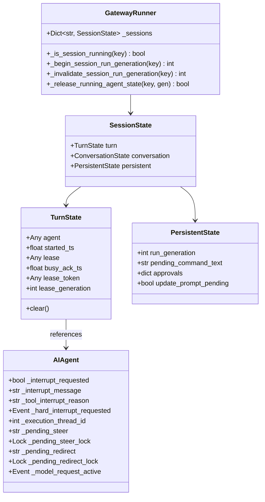

# Python Behavioral Oracle: Gateway `/stop` and `/steer` Contracts

## 1. Executive Summary & Architecture Overview

This document establishes the exact behavioral and state contract of the Python Hermes Gateway and `AIAgent` for `/stop` and `/steer` commands executed while an agent turn is running, during provider retry/backoff, during provider-response waits, and at tool-call boundaries.

The contract was established through direct inspection of authoritative Python source files and verified through isolated execution of Python probes against the live implementation.

### 1.1 Core Tenets
1. **Divergent Intent**:
   - `/stop` is an **abort / cancel** control-plane operation (`busy_policy: interrupt_then_dispatch`). It terminates in-flight execution, tears down network streams and child subagents, releases locks and slots, and prevents further model calls.
   - `/steer` is an **in-band guidance / nudge** operation (`busy_policy: dispatch`). It does **not** interrupt in-flight tools or streams, does **not** create a new conversational turn, and does **not** alter message-role alternation. It modifies the tail of the current tool execution batch by appending user text to the last tool result before the next LLM call.
2. **State Ownership**:
   - The Gateway runner (`GatewayRunner`) owns the session routing registry, the slot lease, and the monotonic run generation (`run_generation`).
   - The agent (`AIAgent`) owns turn execution, provider client lifecycle, interrupt flags (`_interrupt_requested`, `_hard_interrupt_requested`), and the pending steer accumulator (`_pending_steer`).
3. **Alternation & Cache Preservation**:
   - `/stop` preserves message-role alternation (`user -> assistant -> tool -> assistant -> user`) by invoking [`close_interrupted_tool_sequence`](file:///home/eins0fx/development/hermes-agent-port/agent/message_sanitization.py#L296-L328) whenever an interrupt aborts a turn whose tail ends on a `tool` role message.
   - `/steer` strictly preserves alternation by mutating existing `tool` result content rather than injecting a `user` role message.
   - If `/steer` lands after the last tool batch has completed, it is drained at turn finalization and converted into the **next** user turn.

---

## 2. Command Recognition, Authorization, Acknowledgement, and Routing

### 2.1 Command Recognition & Registration
Slash commands are parsed from incoming messages via [`MessageEvent.get_command()`](file:///home/eins0fx/development/hermes-agent-port/gateway/platforms/base.py#L2910-L2935) and resolved against the command registry in [`hermes_cli/commands.py`](file:///home/eins0fx/development/hermes-agent-port/hermes_cli/commands.py#L189-L215):

```python
# hermes_cli/commands.py:189-190
CommandDef("stop", "Kill all running background processes", "Session",
           busy_policy="interrupt_then_dispatch", busy_handler="stop")

# hermes_cli/commands.py:213-214
CommandDef("steer", "Inject a message after the next tool call without interrupting", "Session",
           args_hint="<prompt>", busy_policy="dispatch", busy_handler="steer")
```

- **Recognition**: Any message starting with `/stop` or `/steer` (case-insensitive command token) matches.
- **Arguments**:
  - `/stop`: Ignores trailing arguments on the busy path.
  - `/steer`: Strips the `/steer` prefix via [`event.get_command_args().strip()`](file:///home/eins0fx/development/hermes-agent-port/gateway/run.py#L18725). If the remaining payload is empty, the command is rejected with a usage prompt.

### 2.2 Authorization & Access Control
Authorization is evaluated at the entry point of message dispatch via [`_check_slash_access(source, canonical_cmd)`](file:///home/eins0fx/development/hermes-agent-port/gateway/run.py#L24013-L24054):
- Evaluated on **both** the busy fast-path ([`gateway/run.py:19439`](file:///home/eins0fx/development/hermes-agent-port/gateway/run.py#L19439)) and the idle cold-path ([`gateway/run.py:20099`](file:///home/eins0fx/development/hermes-agent-port/gateway/run.py#L20099)).
- Calls [`policy_for_source(self.config, source)`](file:///home/eins0fx/development/hermes-agent-port/gateway/slash_access.py#L26-L32):
  1. **Unrestricted Default**: If `allow_admin_from` is not configured for the scope (DM or group), `policy.enabled == False`. All commands (including `/stop` and `/steer`) are permitted for any allowed chatter.
  2. **Gated Scope**: If `allow_admin_from` is configured, non-admin callers may **only** run commands in `_ALWAYS_ALLOWED_FOR_USERS` (`{"help", "whoami"}`) or explicitly listed in `user_allowed_commands`.
  3. **Rejection Output**: If denied, the command aborts before hitting the running agent or session state, returning:
     ```text
     ⛔ /{cmd} is admin-only here. You can run: /{allowed_cmds}... Use /whoami for the full list.
     ```
     (or if no commands enabled: `"⛔ /{cmd} is admin-only here. No slash commands are enabled for non-admins on this platform. Ask an admin to add you to allow_admin_from or to set user_allowed_commands."`)
  4. **Thread Sibling Authorization**: When stopping sibling runs in shared forum/threads ([`gateway/slash_commands.py:1480`](file:///home/eins0fx/development/hermes-agent-port/gateway/slash_commands.py#L1480)), the caller must also satisfy `self._is_user_authorized(source)`. Unauthorized thread participants cannot `/stop` another user's turn.

### 2.3 Routing Pipelines: Busy vs. Idle

#### A. Running (Busy) Path ([`gateway/run.py:19415-19451`](file:///home/eins0fx/development/hermes-agent-port/gateway/run.py#L19415-L19451))
When `self._is_session_running(quick_key)` returns `True`:
1. Checks access control via `_check_slash_access`.
2. Dispatches via [`_dispatch_busy_slash_command`](file:///home/eins0fx/development/hermes-agent-port/gateway/run.py#L18546-L18584).
3. Reads `cmd_def.busy_handler`:
   - `"stop"` routes to [`_busy_stop_command`](file:///home/eins0fx/development/hermes-agent-port/gateway/run.py#L18644-L18658).
   - `"steer"` routes to [`_busy_steer_command`](file:///home/eins0fx/development/hermes-agent-port/gateway/run.py#L18719-L18767).

#### B. Idle (Cold) Path ([`gateway/run.py:19752-20030`](file:///home/eins0fx/development/hermes-agent-port/gateway/run.py#L19752-L20030))
When `self._is_session_running(quick_key)` returns `False`:
1. `/stop` routes to [`_handle_stop_command`](file:///home/eins0fx/development/hermes-agent-port/gateway/slash_commands.py#L1435-L1516):
   - Checks if session has an agent or sentinel. If none, checks sibling thread runs. If still none, clears phantom typing and returns `"No active task to stop."`.
2. `/steer` hits lines [`20015-20029`](file:///home/eins0fx/development/hermes-agent-port/gateway/run.py#L20015-L20029):
   - If payload is empty, returns `"Usage: /steer <prompt>  (no agent is running; sending as a normal message)"`.
   - If payload is present, rewrites `event.text = steer_payload` and **falls through** to [`_handle_message_with_agent`](file:///home/eins0fx/development/hermes-agent-port/gateway/run.py#L20170+), launching a fresh agent turn as regular user text.

### 2.4 Acknowledgement Strings
All acknowledgement strings are standardized and verified:

| Command | Condition | Return Type | String / Value | Source Reference |
| :--- | :--- | :--- | :--- | :--- |
| `/stop` | Agent busy running | `EphemeralReply` | `⚡ Stopped. You can continue this session.` (`t("gateway.stop.stopped")`) | [`run.py:18657`](file:///home/eins0fx/development/hermes-agent-port/gateway/run.py#L18657) |
| `/stop` | Agent starting (sentinel) | `EphemeralReply` | `⚡ Stopped. The agent hadn't started yet - you can continue this session.` (`t("gateway.stop.stopped_pending")`) | [`slash_commands.py:1461`](file:///home/eins0fx/development/hermes-agent-port/gateway/slash_commands.py#L1461) |
| `/stop` | Hard sentinel cleared | `EphemeralReply` | `⚡ Force-stopped. The agent was still starting - session unlocked.` | [`run.py:19498`](file:///home/eins0fx/development/hermes-agent-port/gateway/run.py#L19498) |
| `/stop` | Idle session (no active task) | `str` (plain) | `No active task to stop.` (`t("gateway.stop.no_active")`) | [`slash_commands.py:1516`](file:///home/eins0fx/development/hermes-agent-port/gateway/slash_commands.py#L1516) |
| `/steer` | Busy agent accepts steer | `str` (plain) | `⏩ Steer queued - arrives after the next tool call: '{preview}'` (preview truncated to 60 chars + `...`) | [`run.py:18751`](file:///home/eins0fx/development/hermes-agent-port/gateway/run.py#L18751) |
| `/steer` | Busy agent empty text | `str` (plain) | `Usage: /steer <prompt>` | [`run.py:18727`](file:///home/eins0fx/development/hermes-agent-port/gateway/run.py#L18727) |
| `/steer` | Busy agent rejects empty payload | `str` (plain) | `Steer rejected (empty payload).` | [`run.py:18753`](file:///home/eins0fx/development/hermes-agent-port/gateway/run.py#L18753) |
| `/steer` | Busy agent starting (sentinel) | `str` (plain) | `Agent still starting - /steer queued for the next turn.` | [`run.py:18743`](file:///home/eins0fx/development/hermes-agent-port/gateway/run.py#L18743) |
| `/steer` | Busy agent missing/no `steer()` | `str` (plain) | `No active agent - /steer queued for the next turn.` | [`run.py:18766`](file:///home/eins0fx/development/hermes-agent-port/gateway/run.py#L18766) |
| `/steer` | Idle session empty text | `str` (plain) | `Usage: /steer <prompt>  (no agent is running; sending as a normal message)` | [`run.py:20021`](file:///home/eins0fx/development/hermes-agent-port/gateway/run.py#L20021) |
| `/steer` | Idle session valid text | *(None)* | *(Falls through to start regular turn; no ack string returned)* | [`run.py:20026`](file:///home/eins0fx/development/hermes-agent-port/gateway/run.py#L20026) |

---

## 3. Running Conversation State, Ownership, and Lifecycle

### 3.1 Identification of Running Sessions
A running conversation is identified by its canonical **`session_key`** (or shorthand `quick_key`), generated by [`gateway.session.build_session_key(source)`](file:///home/eins0fx/development/hermes-agent-port/gateway/session.py#L50-L120):
```text
agent:main:{platform}:{chat_type}:{chat_id}[:{thread_id}][:{user_id}]
```
When `thread_sessions_per_user=True` is configured for forum/thread contexts, `user_id` is appended to partition participants.

### 3.2 State Hierarchy and Storage Containers
All per-session runtime state is consolidated in [`gateway/session_state.py`](file:///home/eins0fx/development/hermes-agent-port/gateway/session_state.py#L1-L179):



#### A. Gateway Container Scopes
1. **`SessionState.turn: TurnState`** ([`session_state.py:52-89`](file:///home/eins0fx/development/hermes-agent-port/gateway/session_state.py#L52-L89)):
   - `agent`: The active `AIAgent` instance, or `_AGENT_PENDING_SENTINEL` (sentinel while constructing), or `None` (idle).
   - `started_ts`: Unix timestamp when the turn began (0.0 when idle).
   - `lease`: Cross-process active session slot lease.
   - `busy_ack_ts`: Timestamp of the last debounce notice.
   - `lease_token` / `lease_generation`: Identifiers for the held registry lease.
2. **`SessionState.persistent: PersistentState`** ([`session_state.py:131-170`](file:///home/eins0fx/development/hermes-agent-port/gateway/session_state.py#L131-L170)):
   - `run_generation`: **Monotonically increasing integer counter** ([`run.py:29849`](file:///home/eins0fx/development/hermes-agent-port/gateway/run.py#L29849)). Incremented at every turn start and every `/stop`/`/new` interrupt. **Never reset**.
   - `pending_command_text`: Legacy pending message text.
3. **`SessionState.conversation: ConversationState`** ([`session_state.py:91-130`](file:///home/eins0fx/development/hermes-agent-port/gateway/session_state.py#L91-L130)):
   - `queued_events`: FIFO list of `/queue` events awaiting execution.

#### B. In-Agent Attributes (`AIAgent`)
Initialized in [`agent/agent_init.py:892-930`](file:///home/eins0fx/development/hermes-agent-port/agent/agent_init.py#L892-L930):
- `_interrupt_requested: bool`: Cooperative interrupt flag inspected by model/tool loops.
- `_hard_interrupt_requested: threading.Event`: Thread-safe event for hard stops.
- `_interrupt_message: str | None`: Control-plane message triggering interrupt.
- `_tool_interrupt_reason: str | None`: Reason string reported in tool outputs (`"explicit stop requested"`).
- `_execution_thread_id: int | None`: The thread ID driving `run_conversation()`.
- `_pending_steer: str | None` & `_pending_steer_lock: threading.Lock`: Guarded accumulator for `/steer` text.
- `_model_request_active: threading.Event`: Set while httpx/SDK request is live.
- `_executing_tools: bool`: Set while tool calls are executing.

### 3.3 State Lifecycle Timeline

```text
Turn Start:
  1. _begin_session_run_generation(key) -> bumps run_generation (e.g. 1 -> 2)
  2. turn.agent = _AGENT_PENDING_SENTINEL, turn.started_ts = time.time()
  3. AIAgent instantiated
  4. If run_generation still current: turn.agent = agent

Mid-Turn /stop:
  1. _interrupt_and_clear_session(key, reason="stop_command")
  2. request_hard_interrupt(agent, "Stop requested")
  3. _invalidate_session_run_generation(key) -> bumps run_generation (e.g. 2 -> 3)
  4. Spawns background process reaper thread
  5. Clears adapter pending message: adapter.get_pending_message(key)
  6. _release_running_agent_state(key) -> turn.clear() (agent=None, started_ts=0.0)
  7. _evict_cached_agent(key) -> evicts cached agent instance

Normal Turn Exit:
  1. Turn finishes, run_sync returns
  2. _finished_agent._gateway_turn_process_task_id = "" (detaches reap baseline)
  3. finally block in _run_agent:
     _release_running_agent_state(key, run_generation=2)
     -> checks _is_session_run_current(key, 2):
        - If /stop happened: current is 3 != 2 -> refuses to touch state (returns False)
        - If clean exit: current is 2 == 2 -> executes turn.clear() (returns True)
```

---

## 4. Behavior During Retry Backoff and Provider-Response Waits

### 4.1 During Provider Retry / Backoff Wait

Provider retries occur when an API call fails with a transient error (rate limit, server 5xx, or empty response). Backoff is handled in [`agent/conversation_loop.py`](file:///home/eins0fx/development/hermes-agent-port/agent/conversation_loop.py#L3948-L3993) (invalid response), [`L7295-L7333`](file:///home/eins0fx/development/hermes-agent-port/agent/conversation_loop.py#L7295-L7333) (API error), and [`L8635-L8664`](file:///home/eins0fx/development/hermes-agent-port/agent/conversation_loop.py#L8635-L8664) (empty response).

The sleep loop sleeps in **200ms increments** to remain responsive:
```python
# agent/conversation_loop.py:3954-3981
sleep_end = time.time() + wait_time
while time.time() < sleep_end:
    if agent._interrupt_requested:
        if agent.clear_interrupt(preserve_redirect=True):
            _retry.restart_with_redirected_messages = True
            break
        agent._vprint(f"{agent.log_prefix}⚡ Interrupt detected during retry wait, aborting.", force=True)
        _interrupt_text = f"Operation interrupted during retry ({_failure_hint}, attempt {retry_count}/{max_retries})."
        close_interrupted_tool_sequence(messages, _interrupt_text)
        agent._persist_session(messages, conversation_history)
        agent.clear_interrupt()
        return {
            "final_response": _interrupt_text,
            "messages": messages,
            "api_calls": api_call_count,
            "completed": False,
            "interrupted": True,
        }
    time.sleep(0.2)
```

#### What `/stop` Does:
1. Sets `agent._interrupt_requested = True`, `agent._hard_interrupt_requested.set()`.
2. Within <=200ms, the while loop detects `agent._interrupt_requested`.
3. `agent.clear_interrupt(preserve_redirect=True)` returns `False` (because `/stop` cleared `_pending_redirect`).
4. Emits console text: `{agent.log_prefix}⚡ Interrupt detected during retry wait, aborting.`
5. Construct `_interrupt_text`:
   - Invalid response retry: `"Operation interrupted during retry ({_failure_hint}, attempt {retry_count}/{max_retries})."`
   - Error retry: `"Operation interrupted: retrying API call after error (retry {retry_count}/{max_retries})."`
   - Empty response retry: `"Operation interrupted: retrying empty response from model (retry {retries}/{budget})."`
6. **Role Alternation Repair**: Calls [`close_interrupted_tool_sequence(messages, _interrupt_text)`](file:///home/eins0fx/development/hermes-agent-port/agent/message_sanitization.py#L296-L328).
   - If the transcript tail ends on a `role: "tool"` message, appends `{"role": "assistant", "content": _interrupt_text}`.
   - If the transcript ends on `role: "user"`, nothing is appended.
7. **Persistence**: Calls `agent._persist_session(messages, conversation_history)` to commit the transcript to SQLite.
8. Calls `agent.clear_interrupt()`, which zeroes `_interrupt_requested` and clears any pending steer.
9. **Return**: Exits immediately with `interrupted=True`. The planned provider retry is **never attempted**.

#### What `/steer` Does:
1. `running_agent.steer(text)` acquires `_pending_steer_lock` and updates `_pending_steer`.
2. Does **not** touch `_interrupt_requested` and does **not** touch `_model_request_active`.
3. **Wait Unaffected**: The 200ms sleep loop continues sleeping until `sleep_end`.
4. Once the backoff period expires, the retry API call executes normally.
5. If that retry succeeds and returns tool calls, the steer is injected after that tool batch. If it returns text, it is drained at turn completion.

---

### 4.2 During Provider-Response Wait

Provider streaming and socket management run in [`agent/chat_completion_helpers.py`](file:///home/eins0fx/development/hermes-agent-port/agent/chat_completion_helpers.py#L3640-L5780).
The thread join / poll loop monitors `agent._interrupt_requested` every 300ms ([`chat_completion_helpers.py:3900`](file:///home/eins0fx/development/hermes-agent-port/agent/chat_completion_helpers.py#L3900), [`L5706`](file:///home/eins0fx/development/hermes-agent-port/agent/chat_completion_helpers.py#L5706)).

#### What `/stop` Does:
1. Detected by poll loop:
   ```python
   # agent/chat_completion_helpers.py:5719-5763
   _request_cancelled["value"] = True
   _cancel_current_stream_attempt("stream_interrupt_abort")
   _close_request_client_once("stream_interrupt_abort") # Shuts down raw TCP socket
   if t is not None:
       _join_worker_for_relay_teardown(t, label="Streaming")
   raise InterruptedError("Agent interrupted during streaming API call")
   ```
2. Socket is aborted immediately via `force_close_tcp_sockets` (`shutdown(SHUT_RDWR)` without closing FD, avoiding FD-recycle corruption).
3. The worker thread catches socket shutdown, sees `_request_cancelled["value"] == True`, and suppresses network error retry.
4. [`agent/conversation_loop.py:4971-5003`](file:///home/eins0fx/development/hermes-agent-port/agent/conversation_loop.py#L4971-L5003) catches `InterruptedError`:
   - Checks `agent._has_pending_redirect()` (returns `False` for `/stop`).
   - Calculates `api_elapsed = time.time() - api_start_time`.
   - Emits console text: `{agent.log_prefix}⚡ Interrupted during API call.`
   - **Partial Output Preservation**:
     - Extracts streamed tokens: `_partial = agent._strip_think_blocks(getattr(agent, "_current_streamed_assistant_text", "") or "").strip()`.
     - If `_partial` is non-empty:
       `append_message(messages, {"role": "assistant", "content": _partial})`
       `final_response = _partial`
     - If `_partial` is empty (interrupted before any tokens streamed):
       `final_response = f"Operation interrupted: waiting for model response ({api_elapsed:.1f}s elapsed)."`
       **Nothing is appended to `messages`**. History remains pristine.
   - Calls `agent._persist_session(messages, conversation_history)`.
   - Breaks out of iteration loop to [`agent/turn_finalizer.py`](file:///home/eins0fx/development/hermes-agent-port/agent/turn_finalizer.py#L776-L792).

#### What `/steer` Does:
1. Modifies `agent._pending_steer`.
2. Sockets and streaming are **not** touched. Tokens continue streaming.
3. If the model streams a tool call, the tool executes and the steer is injected at the tool boundary.
4. If the model streams a text-only final reply, the turn concludes and the leftover steer is handed back as `result["pending_steer"]` to become the next user turn.

---

## 5. Tool-Call Boundary Injection and Replay Invariance

### 5.1 Exact Injection Timing and Placement
Injection occurs in [`agent/tool_executor.py`](file:///home/eins0fx/development/hermes-agent-port/agent/tool_executor.py#L1928-L1934) (parallel), [`L2867-L2872`](file:///home/eins0fx/development/hermes-agent-port/agent/tool_executor.py#L2867-L2872) (sequential), and [`L2924-L2934`](file:///home/eins0fx/development/hermes-agent-port/agent/tool_executor.py#L2924-L2934) (segmented).

**Sequence Order**:
1. All tool calls in the batch finish executing (or skip on interrupt).
2. Aggregate turn budget enforcement runs: `enforce_turn_budget(...)`.
3. Steering injection runs: `agent._apply_pending_steer_to_tool_results(messages, num_tools)`.
4. Next LLM request begins with updated messages.

> [!IMPORTANT]
> Steer injection occurs **after** `enforce_turn_budget`. This ensures budget truncation or eviction never touches or corrupts the steer marker.

### 5.2 Role and Content Shape
Implemented in [`agent/agent_runtime_helpers.py:5223-5285`](file:///home/eins0fx/development/hermes-agent-port/agent/agent_runtime_helpers.py#L5223-L5285):

1. **Role**: The message role is **always `tool`**. No `user` message is created.
2. **Target**: Appended exclusively to the **last** `role: "tool"` message in the recent batch.
3. **Marker Constants** ([`agent/prompt_builder.py:733-744`](file:///home/eins0fx/development/hermes-agent-port/agent/prompt_builder.py#L733-L744)):
   ```python
   STEER_MARKER_OPEN = (
       "[OUT-OF-BAND USER MESSAGE \u2014 a direct message from the user, delivered "
       "once at this position; not tool output and not a new delivery when replayed "
       "from conversation history]"
   )
   STEER_MARKER_CLOSE = "[/OUT-OF-BAND USER MESSAGE]"

   def format_steer_marker(steer_text: str) -> str:
       return f"\n\n{STEER_MARKER_OPEN}\n{steer_text}\n{STEER_MARKER_CLOSE}"
   ```
4. **Content Shapes**:
   - **String Content**:
     ```python
     messages[target_idx]["content"] = existing_content + marker
     ```
   - **Multimodal Block Content** (Anthropic-style list of dicts):
     ```python
     blocks = list(existing_content)
     blocks.append({"type": "text", "text": marker.lstrip()})
     messages[target_idx]["content"] = blocks
     ```

### 5.3 Non-Replay of Original User Message
The original user message is **never replayed or duplicated**:
- `messages[0]` contains the original user turn.
- The mid-turn guidance is attached strictly as metadata to the existing tool output.
- The model prompt builder passes `messages` directly. The prompt-side briefing (`STEER_CHANNEL_NOTE`, [`prompt_builder.py:746-768`](file:///home/eins0fx/development/hermes-agent-port/agent/prompt_builder.py#L746-L768)) instructs the model that this marker carries direct user authority and only applies at its immediate position.

### 5.4 Tool Boundary Edge Cases
1. **Multiple Concurrent `/steer` Calls**:
   If a user sends `/steer note A` followed immediately by `/steer note B` before the tool batch finishes, `AIAgent.steer` concatenates them with `\n`:
   ```text
   note A
   note B
   ```
   Both notes are wrapped inside a single `[OUT-OF-BAND USER MESSAGE ...]` block.
2. **No Tool Results in Batch** (`target_idx is None`):
   If tools were interrupted or produced no tool results, `apply_pending_steer_to_tool_results` restores `steer_text` back into `agent._pending_steer` ([`agent_runtime_helpers.py:5255-5265`](file:///home/eins0fx/development/hermes-agent-port/agent/agent_runtime_helpers.py#L5255-L5265)).
3. **Turn Concludes Without Further Tools**:
   If the model emits text and terminates the turn, [`agent/turn_finalizer.py:779-781`](file:///home/eins0fx/development/hermes-agent-port/agent/turn_finalizer.py#L779-L781) drains `_pending_steer` into `result["pending_steer"]`. The gateway runner ([`gateway/run.py:32638-32643`](file:///home/eins0fx/development/hermes-agent-port/gateway/run.py#L32638-L32643)) receives it and dispatches it as the **next user turn**.

---

## 6. Edge Cases, Concurrency, Failures, and Races

### 6.1 Idle Sessions
- **/stop**:
  1. Routed to [`_handle_stop_command`](file:///home/eins0fx/development/hermes-agent-port/gateway/slash_commands.py#L1435).
  2. `self._running_agents.get(session_key)` returns `None`.
  3. Checks `_sibling_thread_run_keys(source, session_key)`. If an authorized user is stopping another user's active run in the same forum thread, it interrupts the sibling and returns `EphemeralReply(t("gateway.stop.stopped"))`.
  4. If no sibling run exists, it clears any lingering typing status on the adapter (`_stop_typing_with_metadata`) and returns the plain string `t("gateway.stop.no_active")` (`"No active task to stop."`).
- **/steer**:
  1. Handled at [`gateway/run.py:20015-20029`](file:///home/eins0fx/development/hermes-agent-port/gateway/run.py#L20015-L20029).
  2. If empty, returns `"Usage: /steer <prompt>  (no agent is running; sending as a normal message)"`.
  3. If text present, strips prefix, sets `event.text = steer_payload`, and falls through to start a normal agent turn.

### 6.2 Concurrent Duplicate Commands
- **Duplicate `/stop`**:
  - First `/stop`: Acquires lock, sets `agent._interrupt_requested`, bumps `run_generation`, clears `turn.agent`, returns `⚡ Stopped...`.
  - Second `/stop` arriving simultaneously:
    - If arrived before state release: Calls `_interrupt_and_clear_session` again. `request_hard_interrupt` and `_invalidate_session_run_generation` are idempotent. Returns `⚡ Stopped...`.
    - If arrived after state release: Sees `agent == None`, returns `"No active task to stop."`.
- **Duplicate `/steer`**:
  - `AIAgent._pending_steer_lock` synchronizes updates. Text is concatenated with `\n`. Both callers receive `"⏩ Steer queued..."` with their respective previews.

### 6.3 Wrong Users / Unauthorized Callers
- Evaluated via `_check_slash_access`.
- Non-admin callers attempting `/stop` or `/steer` on gated platforms receive the explicit denial message.
- The active turn is **not** interrupted, and no steer is queued.

### 6.4 Callback and Send Failures
- The gateway wraps all notification and acknowledgement delivery in exception guards (`try...except Exception as e: logger.debug(...)`).
- A failure by the chat platform (e.g. Telegram/Discord 500 or network timeout) to deliver the `"⚡ Stopped..."` ack does **not** impede the interrupt pipeline. Sockets are still closed, generation is bumped, and slot state is cleared in the local process.
- In `_interrupt_and_clear_session`, `adapter.interrupt_session_activity` errors are caught and logged, guaranteeing `_release_running_agent_state` and `_evict_cached_agent` execute.

### 6.5 Races with Natural Completion
A turn finishing naturally races with an incoming `/stop`:

```text
Turn Worker Thread                         Gateway Async Event Loop
-------------------                         ------------------------
Completes final LLM step
_turn_worker_done.set()
_finished_agent._gateway_turn_process_task_id = ""
                                            Incoming /stop arrives!
                                            _is_session_running -> True
                                            _interrupt_and_clear_session:
                                              request_hard_interrupt(agent)
                                              _invalidate_session_run_generation (gen: 5 -> 6)
                                              turn.clear()
Unwinds to finally in _run_agent:
_release_running_agent_state(gen=5):
  _is_session_run_current(gen=5) -> 6 != 5 -> False!
  Slot release skipped (state already cleaned)
Delivery check:
  _is_session_run_current(gen=5) -> False
  Response delivery suppressed (stale result dropped)
```

1. **Process Baseline Protection**: As soon as `run_sync` finishes, `_finished_agent._gateway_turn_process_task_id = ""` detaches process tracking. A late `/stop` will not kill background tasks spawned legitimately.
2. **Generational Guard**: When `/stop` bumps `run_generation`, any subsequent action by the unwinding turn detects that its generation is no longer current and aborts without overwriting state or sending stale replies.

---

## 7. Master Observable Strings Reference

The following table contains the exact, byte-for-byte strings emitted or returned by the Python implementation:

| Category | Identifier / Context | Exact String / Template |
| :--- | :--- | :--- |
| **Ack: Stop** | Busy stop ack | `⚡ Stopped. You can continue this session.` |
| **Ack: Stop** | Starting agent stop ack | `⚡ Stopped. The agent hadn't started yet - you can continue this session.` |
| **Ack: Stop** | Force stop sentinel ack | `⚡ Force-stopped. The agent was still starting - session unlocked.` |
| **Ack: Stop** | Idle stop ack | `No active task to stop.` |
| **Ack: Steer** | Steer queued ack | `⏩ Steer queued - arrives after the next tool call: '{preview}'` |
| **Ack: Steer** | Empty payload | `Usage: /steer <prompt>` |
| **Ack: Steer** | Empty payload rejected | `Steer rejected (empty payload).` |
| **Ack: Steer** | Agent still starting | `Agent still starting - /steer queued for the next turn.` |
| **Ack: Steer** | No active agent (busy fallback)| `No active agent - /steer queued for the next turn.` |
| **Ack: Steer** | Idle steer empty payload | `Usage: /steer <prompt>  (no agent is running; sending as a normal message)` |
| **Auth** | Command denied | `⛔ /{canonical_cmd} is admin-only here. {suffix}` |
| **Terminal / Log**| Agent interrupt request | `\n⚡ Interrupt requested` *(or with preview)* `\n⚡ Interrupt requested: '{preview}'` |
| **Terminal / Log**| Tool loop break | `\n⚡ Breaking out of tool loop due to interrupt...` |
| **Terminal / Log**| Retry wait interrupt | `{agent.log_prefix}⚡ Interrupt detected during retry wait, aborting.` |
| **Terminal / Log**| API call interrupt | `{agent.log_prefix}⚡ Interrupted during API call.` |
| **Terminal / Log**| Tool skip notice | `{agent.log_prefix}⚡ Interrupt: skipping {count} remaining tool call(s)` |
| **History / Turn**| Interrupted during retry | `Operation interrupted during retry ({hint}, attempt {retry}/{max}).` |
| **History / Turn**| Interrupted during error retry| `Operation interrupted: retrying API call after error (retry {retry}/{max}).` |
| **History / Turn**| Interrupted empty retry | `Operation interrupted: retrying empty response from model (retry {retry}/{budget}).` |
| **History / Turn**| Interrupted waiting model | `Operation interrupted: waiting for model response ({elapsed:.1f}s elapsed).` |
| **History / Turn**| Skipped tool result | `[Tool execution cancelled - {name} was skipped due to user interrupt]` |
| **History / Turn**| Unstarted tool result | `[Tool execution skipped - {name} was not started. User sent a new message]` |
| **History / Turn**| General cancelled tool | `[Tool execution cancelled - {name} was skipped due to {reason}]` |
| **Steer Marker** | Opening delimiter | `[OUT-OF-BAND USER MESSAGE \u2014 a direct message from the user, delivered once at this position; not tool output and not a new delivery when replayed from conversation history]` |
| **Steer Marker** | Closing delimiter | `[/OUT-OF-BAND USER MESSAGE]` |
| **Steer Marker** | Formatted block | `\n\n{STEER_MARKER_OPEN}\n{steer_text}\n{STEER_MARKER_CLOSE}` |

---

## 8. Executable Test Matrix for Rust TDD

This matrix provides the exact specification for Rust test cases in `hermes-gateway` and `hermes-agent`.

| Test ID | Test Category | Target Subsystem | Initial State | Stimulus / Action | Expected Result & Assertions |
| :--- | :--- | :--- | :--- | :--- | :--- |
| **TDD-STOP-01** | Recognition | Gateway Command Resolver | Gateway initialized | Parse `/stop` and `/stop now` | Resolves to `CommandDef(name: "stop", busy_policy: InterruptThenDispatch, busy_handler: "stop")`. |
| **TDD-STOP-02** | Acknowledgement | Gateway Busy Dispatch | Session has active running agent | Inbound event `/stop` | Returns `EphemeralReply("⚡ Stopped. You can continue this session.")`. |
| **TDD-STOP-03** | Idle Handling | Gateway Cold Path | Session is idle (`turn.agent == None`) | Inbound event `/stop` | Returns plain string `"No active task to stop."`. Adapter typing cleared. |
| **TDD-STOP-04** | Generational Invalidation | Session Registry | `run_generation == 4` | `/stop` executed | `run_generation` increments to `5`. Calls `_release_running_agent_state(gen=4)` return `false`. |
| **TDD-STOP-05** | Sibling Thread Stop | Gateway Cold Path | Forum thread, user A idle, user B running | User A executes `/stop` | If User A authorized, interrupts User B's session and returns `"⚡ Stopped..."`. If unauthorized, returns `"No active task to stop."`. |
| **TDD-STOP-06** | Sentinel Stop | Gateway Busy Dispatch | Session has `_AGENT_PENDING_SENTINEL` | Inbound event `/stop` | Clears sentinel, releases lock, returns `EphemeralReply("⚡ Stopped. The agent hadn't started yet - you can continue this session.")`. |
| **TDD-STOP-07** | Retry Backoff Abort | Conversation Loop | Agent in 200ms retry backoff sleep | Flag `_interrupt_requested = true` | Sleep loop breaks within 200ms. Calls `close_interrupted_tool_sequence`. Persists messages. Returns `interrupted: true`. |
| **TDD-STOP-08** | Provider Wait Abort | HTTP Transport Client | Streaming provider request active | Flag `_interrupt_requested = true` | Aborts raw TCP connection via `shutdown(SHUT_RDWR)`. Surfaces `InterruptedError`. Suppresses provider retry. |
| **TDD-STOP-09** | Stream Partial Capture| Conversation Loop | Provider streamed `"Part A"`, then stopped | Caught `InterruptedError` | `messages` appends `role: assistant, content: "Part A"`. `final_response == "Part A"`. Persists session. |
| **TDD-STOP-10** | Stream Zero-Text Abort| Conversation Loop | No tokens streamed, `/stop` received | Caught `InterruptedError` | `messages` unchanged. `final_response == "Operation interrupted: waiting for model response (Xs elapsed)."`. Persists session. |
| **TDD-STOP-11** | Tool Batch Skipping | Tool Executor | 3 tools queued, tool 1 executing | `/stop` received during tool 1 | Tool 1 finishes/aborts. Tools 2 & 3 skipped. Appends `[Tool execution cancelled - toolX was skipped due to user interrupt]`. Alternation intact. |
| **TDD-STOP-12** | Alternation Repair | Message Sanitization | Transcript tail is `role: "tool"` | Turn aborted by `/stop` | `close_interrupted_tool_sequence` appends `role: assistant, content: "Operation interrupted..."`. Alternation preserved. |
| **TDD-STEER-01**| Recognition | Gateway Command Resolver | Gateway initialized | Parse `/steer check logs` | Resolves to `CommandDef(name: "steer", busy_policy: Dispatch, busy_handler: "steer")`. |
| **TDD-STEER-02**| Acknowledgement | Gateway Busy Dispatch | Session has active running agent | `/steer focus on auth` | Calls `agent.steer("focus on auth")`. Returns `"⏩ Steer queued - arrives after the next tool call: 'focus on auth'"` |
| **TDD-STEER-03**| Empty Steer Busy | Gateway Busy Dispatch | Session has active running agent | `/steer` or `/steer    ` | Returns `"Usage: /steer <prompt>"`. `_pending_steer` remains `None`. |
| **TDD-STEER-04**| Idle Steer Fallthrough | Gateway Cold Path | Session is idle | `/steer run diagnostics` | Strips `/steer `, rewrites event text to `"run diagnostics"`, launches normal agent turn. |
| **TDD-STEER-05**| Idle Steer Empty | Gateway Cold Path | Session is idle | `/steer` (empty payload) | Returns `"Usage: /steer <prompt>  (no agent is running; sending as a normal message)"`. |
| **TDD-STEER-06**| Concurrency Acc | Agent Steer Slot | Live agent running | Concurrent `steer("A")` and `steer("B")` | Thread-safe. `_pending_steer` contains `"A\nB"`. Neither is dropped. |
| **TDD-STEER-07**| Retry Backoff Invar | Conversation Loop | Agent in retry backoff sleep | `/steer check db` | `_pending_steer` set. Sleep loop does **not** break. Planned retry proceeds. |
| **TDD-STEER-08**| Response Wait Invar | HTTP Transport Client | Provider streaming response | `/steer check db` | Stream continues uninterrupted. Socket remains open. |
| **TDD-STEER-09**| Tool Result String | Tool Executor | Batch has 2 tool calls | `_pending_steer = "note"` | Appended to `messages[-1]["content"]` with `\n\n{OPEN}\nnote\n{CLOSE}`. Tool 1 unmodified. Original user message untouched. |
| **TDD-STEER-10**| Tool Result Multi | Tool Executor | Batch has Anthropic blocks | `_pending_steer = "note"` | Appends text block `{"type": "text", "text": "{OPEN}\nnote\n{CLOSE}"}` to blocks list. |
| **TDD-STEER-11**| Restore on Empty | Tool Executor | Batch has 0 tool results | `_pending_steer = "note"` | Steer drained, finds no tool message, restores `"note"` back into `_pending_steer`. |
| **TDD-STEER-12**| Leftover Promotion | Turn Finalizer | Steer arrived, model returned text | Turn finalizer runs | Drains `_pending_steer` into `result["pending_steer"]`. Gateway schedules it as next user turn. |
| **TDD-STEER-13**| Clear on Interrupt | Agent State | Agent has `_pending_steer = "note"` | `/stop` received -> `clear_interrupt()` | `_pending_steer` is reset to `None`. Late steer is discarded. |
| **TDD-RACE-01** | Natural Finish Race | Gateway Runner | Turn worker finishes, `/stop` hits | Worker done, `/stop` arrives | Detached process baseline preserved. Stale response dropped. Lock released cleanly. |
| **TDD-AUTH-01** | Access Gating | Gateway Slash Access | Non-admin user, gating enabled | Inbound `/stop` or `/steer` | Denied with `"⛔ /{cmd} is admin-only here..."`. Agent turn continues untouched. |
