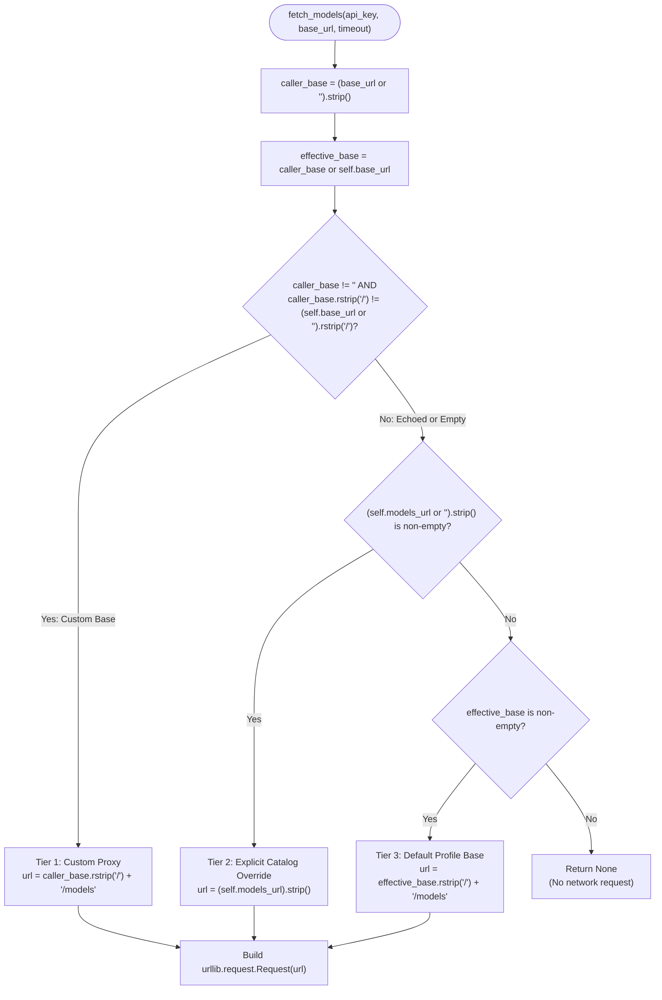
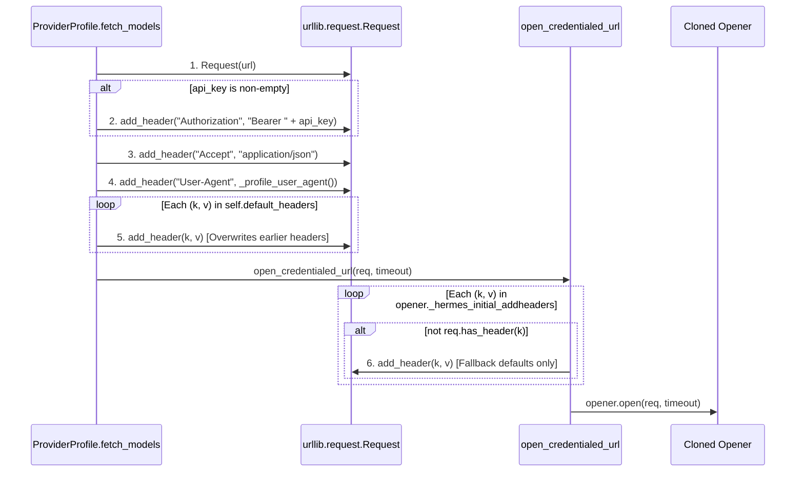
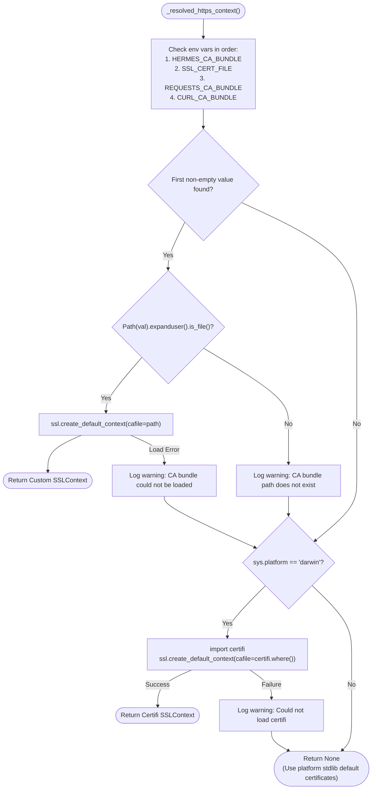

# Provider Model Fetch and Secure Redirect Source Review

This document provides a comprehensive, read-only architectural audit and exact behavioral specification of:
1. Model listing URL resolution, request construction, response handling, and error contracts in [`providers/base.py::ProviderProfile.fetch_models`](file:///home/eins0fx/development/hermes-agent-port/providers/base.py#L262-L332).
2. Origin normalization, credential stripping, multi-hop redirect invariants, and late-injection neutralization in [`hermes_cli/urllib_security.py`](file:///home/eins0fx/development/hermes-agent-port/hermes_cli/urllib_security.py).
3. Test suite coverage and behavioral contracts in [`tests/providers/test_fetch_models_base_url.py`](file:///home/eins0fx/development/hermes-agent-port/tests/providers/test_fetch_models_base_url.py) and [`tests/hermes_cli/test_urllib_security.py`](file:///home/eins0fx/development/hermes-agent-port/tests/hermes_cli/test_urllib_security.py).
4. Remaining TLS, CA bundle resolution, and ambient installed-opener dependencies, detailing concrete implementation guidance for the Rust gateway port.

---

## 1. Executive Summary & Source Mapping

### 1.1 Scope and Authority
- **Model Fetch Core**: [`providers/base.py`](file:///home/eins0fx/development/hermes-agent-port/providers/base.py)
  - `_profile_user_agent()`: [lines 24-36](file:///home/eins0fx/development/hermes-agent-port/providers/base.py#L24-L36)
  - `ProviderProfile` definition & defaults: [lines 38-112](file:///home/eins0fx/development/hermes-agent-port/providers/base.py#L38-L112)
  - `ProviderProfile.fetch_models()`: [lines 262-332](file:///home/eins0fx/development/hermes-agent-port/providers/base.py#L262-L332)
- **Security & Redirect Subsystem**: [`hermes_cli/urllib_security.py`](file:///home/eins0fx/development/hermes-agent-port/hermes_cli/urllib_security.py)
  - Constants & Safe Headers: [lines 20-28](file:///home/eins0fx/development/hermes-agent-port/hermes_cli/urllib_security.py#L20-L28)
  - Origin Tuple Parser (`url_origin`): [lines 30-42](file:///home/eins0fx/development/hermes-agent-port/hermes_cli/urllib_security.py#L30-L42)
  - Safe Redirect Handler (`SafeCredentialRedirectHandler`): [lines 44-72](file:///home/eins0fx/development/hermes-agent-port/hermes_cli/urllib_security.py#L44-L72)
  - Cross-Origin Request Sanitizer (`_CrossOriginRequestSanitizer`): [lines 74-97](file:///home/eins0fx/development/hermes-agent-port/hermes_cli/urllib_security.py#L74-L97)
  - TLS CA Context Resolver (`_resolved_https_context`): [lines 99-139](file:///home/eins0fx/development/hermes-agent-port/hermes_cli/urllib_security.py#L99-L139)
  - Opener Cloner & Header Isolator (`_secure_opener_from_installed_policy`): [lines 141-186](file:///home/eins0fx/development/hermes-agent-port/hermes_cli/urllib_security.py#L141-L186)
  - Credentialed Request Entrypoint (`open_credentialed_url`): [lines 189-218](file:///home/eins0fx/development/hermes-agent-port/hermes_cli/urllib_security.py#L189-L218)
- **Call Sites & Integration Context**:
  - Model Picker CLI Bridge: [`hermes_cli/models.py:4695-4725`](file:///home/eins0fx/development/hermes-agent-port/hermes_cli/models.py#L4695-L4725)
  - Custom Provider Override: [`plugins/model-providers/custom/__init__.py:117-128`](file:///home/eins0fx/development/hermes-agent-port/plugins/model-providers/custom/__init__.py#L117-L128)
  - OpenRouter Public Catalog Override: [`plugins/model-providers/openrouter/__init__.py:98-123`](file:///home/eins0fx/development/hermes-agent-port/plugins/model-providers/openrouter/__init__.py#L98-L123)
  - Anthropic Custom Header Override: [`plugins/model-providers/anthropic/__init__.py:17-42`](file:///home/eins0fx/development/hermes-agent-port/plugins/model-providers/anthropic/__init__.py#L17-L42)
  - Bedrock & Copilot ACP No-Op Overrides: [`plugins/model-providers/bedrock/__init__.py:10-12`](file:///home/eins0fx/development/hermes-agent-port/plugins/model-providers/bedrock/__init__.py#L10-L12), [`plugins/model-providers/copilot-acp/__init__.py:27-36`](file:///home/eins0fx/development/hermes-agent-port/plugins/model-providers/copilot-acp/__init__.py#L27-L36)
- **Test Suites**:
  - Base URL Resolution & Redirect Tests: [`tests/providers/test_fetch_models_base_url.py`](file:///home/eins0fx/development/hermes-agent-port/tests/providers/test_fetch_models_base_url.py)
  - Wire-Level urllib Security Tests: [`tests/hermes_cli/test_urllib_security.py`](file:///home/eins0fx/development/hermes-agent-port/tests/hermes_cli/test_urllib_security.py)

---

## 2. URL Resolution Hierarchy & Precedence Rules

The method [`ProviderProfile.fetch_models`](file:///home/eins0fx/development/hermes-agent-port/providers/base.py#L262-L332) resolves the target models catalog endpoint URL via a strict three-tier precedence model.

### 2.1 Formal Precedence Ladder



### 2.2 The Three Tiers in Detail

#### Tier 1: User-Customized Inference Base URL (`custom_base == True`)
- **Predicate**: `bool(caller_base) and (caller_base.rstrip("/") != (self.base_url or "").rstrip("/"))`
- **Resulting Endpoint**: `caller_base.rstrip("/") + "/models"`
- **Precedence Rule**: When a caller provides a `base_url` that differs from the profile's declared `self.base_url` (ignoring trailing slashes), the caller has configured a custom proxy or private endpoint (e.g. local proxy, liteLLM relay, vLLM, or Ollama). **This custom proxy URL strictly overrides `self.models_url`**.
- **Historical Rationale (Issue #47009)**: In CommandCode and third-party setups, users set custom gateway proxies via `model.base_url`. If `self.models_url` had higher precedence, the agent would query the public upstream catalog rather than the user's proxy, breaking air-gapped and custom proxy deployments.

#### Tier 2: Explicit Profile Models URL (`models_url`)
- **Predicate**: `custom_base == False` AND `(self.models_url or "").strip()` is truthy.
- **Resulting Endpoint**: `(self.models_url or "").strip()`
- **Precedence Rule**: Used when the caller did not customize the base URL (i.e. `caller_base` is empty or echoes the profile default `self.base_url`), and the profile declares an explicit `models_url`.
- **Architectural Purpose**: Used by providers where the model catalog endpoint does not live under the inference path. For example, OpenRouter serves inference at `https://openrouter.ai/api/v1` but exposes a distinct catalog endpoint at `https://openrouter.ai/api/v1/models`.
- **Path Behavior**: Suffix `"/models"` is **not** appended; `models_url` is assumed to be the complete, authoritative catalog URL.

#### Tier 3: Standard Default Fallback (`effective_base + "/models"`)
- **Predicate**: `custom_base == False` AND `(self.models_url or "").strip()` is empty/None.
- **Gate Check**: `if not effective_base: return None`. If `effective_base` is falsy (both `caller_base` and `self.base_url` are empty), the method aborts immediately and returns `None` without initiating any network connection.
- **Resulting Endpoint**: `effective_base.rstrip("/") + "/models"`.
- **Standard Behavior**: Appends `"/models"` to the profile's default base URL after trimming trailing slashes.

### 2.3 The "Echoed Default" Non-Shadowing Invariant
In [`hermes_cli/models.py:4695-4703`](file:///home/eins0fx/development/hermes-agent-port/hermes_cli/models.py#L4695-L4703), the CLI picker unconditionally forwards `base_url` to `fetch_models`:
```python
if not base_url:
    base_url = _p.base_url
if api_key:
    live = _p.fetch_models(api_key=api_key, base_url=base_url or None)
```
Because the caller passes `base_url` unconditionally, falling back to `_p.base_url` when the user configured nothing, a naive check like `if base_url:` would treat every call as a customized base URL.
- **Contract**: `caller_base.rstrip("/") == (self.base_url or "").rstrip("/")` evaluates to equality. `custom_base` evaluates to `False`.
- **Guarantee**: Passing the profile's own `base_url` (with or without trailing slashes) **must not shadow** `self.models_url`.

---

## 3. Whitespace Normalization & Character Semantics

Exact string stripping behavior differs subtly between variables and must be replicated precisely to prevent subtle routing mismatches.

| Variable | Normalization Expression | Trailing Slash Stripping | Behavior on Empty/None |
| :--- | :--- | :--- | :--- |
| `caller_base` | `(base_url or "").strip()` | No (only whitespace) | Becomes `""` |
| `self.models_url` | `(self.models_url or "").strip()` | No | Becomes `""` |
| `custom_base` (comparison) | `caller_base.rstrip("/") != (self.base_url or "").rstrip("/")` | Yes | `bool(caller_base)` is checked first |
| `url` (Tier 1) | `caller_base.rstrip("/") + "/models"` | Yes | N/A (guaranteed non-empty) |
| `url` (Tier 3) | `effective_base.rstrip("/") + "/models"` | Yes | Evaluated only if `effective_base` is truthy |

### 3.1 Asymmetry in Profile Base Normalization
In Python:
```python
caller_base = (base_url or "").strip()
effective_base = caller_base or self.base_url
custom_base = bool(caller_base) and (
    caller_base.rstrip("/") != (self.base_url or "").rstrip("/")
)
```
- `caller_base` has `.strip()` applied immediately.
- `self.base_url` has `.rstrip("/")` applied, but **not `.strip()`**.
- If `self.base_url` in an uncurated profile contains leading whitespace or trailing spaces before the slash (e.g. `" https://api.com/ "`), `self.base_url.rstrip("/")` retains the trailing space.
- In `Tier 3`, if `caller_base` was empty, `effective_base` is `self.base_url`. `effective_base.rstrip("/") + "/models"` will preserve any leading whitespace from `self.base_url`.

### 3.2 Python Whitespace vs Unicode Whitespace
In CPython, `str.strip()` strips all characters categorized as Unicode `White_Space` plus the ASCII C0 control characters:
- `\x1c` (File Separator - `FS`)
- `\x1d` (Group Separator - `GS`)
- `\x1e` (Record Separator - `RS`)
- `\x1f` (Unit Separator - `US`)

Standard Rust `char::is_whitespace()` does **not** treat `\x1c`..`\x1f` as whitespace. In this repository, gateway modules use the established helper:
```rust
fn python_whitespace(c: char) -> bool {
    c.is_whitespace() || ('\u{1c}'..='\u{1f}').contains(&c)
}
```
All URL trimming in the Rust port must adhere to `python_whitespace`.

---

## 4. Request Header Assembly & Override Order

The request is constructed using stdlib `urllib.request.Request(url)`. Header mutation order establishes strict precedence.



### 4.1 Step-by-Step Construction Order

1. **`Authorization` Header**:
   - Condition: `if api_key:` (truthiness check; non-empty string).
   - Value: `f"Bearer {api_key}"`.
   - If `api_key` is `None` or `""`, the header is **omitted**.
2. **`Accept` Header**:
   - Injected unconditionally: `"Accept": "application/json"`.
3. **`User-Agent` Header**:
   - Injected unconditionally: `"User-Agent": _profile_user_agent()`.
   - Function `_profile_user_agent()` returns:
     - `f"hermes-cli/{_ver}"` if `hermes_cli.__version__` is importable.
     - `"hermes-cli"` as fallback on any exception.
   - **Critical Rationale**: Standard Python urllib defaults to `Python-urllib/<version>`. Cloudflare and WAFs fronting various providers (notably OpenCode Zen) return HTTP 403 Forbidden when served the default urllib User-Agent.
4. **`self.default_headers` (Profile Overrides)**:
   - Iterated in dictionary insertion order: `for k, v in self.default_headers.items(): req.add_header(k, v)`.
   - In Python stdlib `urllib.request.Request.add_header(key, val)`, the dictionary key is normalized via `key.capitalize()` (e.g. `"authorization"` and `"AUTHORIZATION"` map to `"Authorization"`).
   - **Override Rule**: Any header defined in `self.default_headers` **overwrites** previous headers.
     - If a profile defines `default_headers={"x-api-key": "secret"}`, it adds `x-api-key`.
     - If a profile defines `default_headers={"Authorization": "Basic abc"}`, it replaces the Bearer token.
     - If a profile defines `default_headers={"Accept": "application/vnd.api+json"}`, it replaces `application/json`.
5. **Opener Default Addheaders (`_hermes_initial_addheaders`)**:
   - In `open_credentialed_url`:
     ```python
     for name, value in getattr(opener, "_hermes_initial_addheaders", ()):
         if not request.has_header(name):
             request.add_header(name, value)
     ```
   - Headers defined on an ambient installed opener apply **only if** `request.has_header(name)` is false.
   - All headers added in steps 1-4 take precedence over opener defaults.

---

## 5. Wire Execution, JSON Acceptance & Model ID Extraction

Lines 325-332 of [`providers/base.py`](file:///home/eins0fx/development/hermes-agent-port/providers/base.py#L325-L332) handle wire transmission and parsing:

```python
try:
    with open_credentialed_url(req, timeout=timeout) as resp:
        data = json.loads(resp.read().decode())
    items = data if isinstance(data, list) else data.get("data", [])
    return [m["id"] for m in items if isinstance(m, dict) and "id" in m]
except Exception as exc:
    logger.debug("fetch_models(%s): %s", self.name, exc)
    return None
```

### 5.1 JSON Payload Shape Acceptance Matrix

| Payload Shape | Python Evaluation | Extraction Result | Return Value |
| :--- | :--- | :--- | :--- |
| `{"data": [{"id": "m1"}, {"id": "m2"}]}` | Standard OpenAI format. `data.get("data", [])` is a list. | Collects `m["id"]`. | `["m1", "m2"]` |
| `[{"id": "m1"}, {"id": "m2"}]` | Bare JSON array (`isinstance(data, list)` is True). | Collects `m["id"]`. | `["m1", "m2"]` |
| `{"data": []}` | Empty data list. | Empty loop. | `[]` (empty list, not `None`) |
| `[]` | Empty array. | Empty loop. | `[]` (empty list, not `None`) |
| `{"data": [{"id": "m1"}, "str", 42, {"other": 1}]}` | Mixed list. `isinstance(m, dict) and "id" in m` filters non-dicts and dicts missing `"id"`. | Only `{"id": "m1"}` matches. | `["m1"]` |
| `{"data": [{"id": 12345}]}` | Non-string `"id"` value. | `m["id"]` is evaluated without typecasting. | `[12345]` (Python returns raw value) |
| `{"other_key": [{"id": "m1"}]}` | Object without `"data"` key. `data.get("data", [])` returns `[]`. | Empty loop. | `[]` |
| `{"data": null}` | `data.get("data", [])` returns `None`. | `for m in None` raises `TypeError`. | Caught $\to$ `None` |
| `null` / `"string"` / `123` / `true` | JSON primitive. `data.get(...)` raises `AttributeError`. | Exception raised. | Caught $\to$ `None` |
| HTML / Invalid JSON | `json.loads` raises `json.JSONDecodeError`. | Exception raised. | Caught $\to$ `None` |
| Non-UTF-8 bytes | `.decode()` raises `UnicodeDecodeError`. | Exception raised. | Caught $\to$ `None` |

### 5.2 The Semantics of `[]` vs `None`
- `None`: Signifies fetch failure, unparseable payload, network/HTTP error, or provider catalog absence.
- `[]`: Signifies a successful HTTP 200 response and valid JSON parsing, but no models matching `{"id": ...}` were present in `items`.
- **Contract Boundary**: Callers fall back to static or curated catalogs when `fetch_models` returns `None` (or falsy). In `hermes_cli/models.py:4704`, `if live:` treats both `None` and `[]` as falsy, falling back to curated models.

---

## 6. Failure Modes, Error Swallowing & Logging Contract

### 6.1 Total Exception Swallowing
- All exceptions occurring within the `try` block (`open_credentialed_url`, `resp.read()`, `decode()`, `json.loads()`, and comprehension evaluation) are intercepted by:
  ```python
  except Exception as exc:
      logger.debug("fetch_models(%s): %s", self.name, exc)
      return None
  ```
- **Never Raises**: `fetch_models` never bubbles exceptions to the caller.
- **Log Level**: Strictly logged at `DEBUG` level using format `"fetch_models(%s): %s"` with `self.name` and the exception object. It never logs at `WARNING` or `ERROR`, avoiding user-facing console noise when an optional discovery probe fails.

### 6.2 HTTP Status Failures
- In `urllib`, any non-2xx status code (e.g. 401 Unauthorized, 403 Forbidden, 404 Not Found, 429 Rate Limit, 500 Internal Server Error) raises `urllib.error.HTTPError`.
- `HTTPError` inherits from `urllib.error.URLError`, which inherits from `OSError` $\to$ `Exception`.
- All non-2xx responses are swallowed, logged at `DEBUG`, and return `None`.

---

## 7. Origin Normalization & Safe Redirect Policy (`urllib_security.py`)

The security boundary in [`hermes_cli/urllib_security.py`](file:///home/eins0fx/development/hermes-agent-port/hermes_cli/urllib_security.py) ensures credentials never follow redirects to external origins.

### 7.1 Origin Definition (`url_origin`)
The origin is a 3-tuple `(scheme, hostname, effective_port)`:
```python
def url_origin(url: str) -> tuple[str, str, int | None]:
    parsed = urllib.parse.urlparse(url)
    scheme = (parsed.scheme or "").lower()
    port = parsed.port
    return (
        scheme,
        (parsed.hostname or "").lower().rstrip("."),
        port if port is not None else _DEFAULT_PORTS.get(scheme),
    )
```

#### Normalization Invariants
1. **Scheme**: Lowercased (`(parsed.scheme or "").lower()`).
2. **Hostname**:
   - Lowercased.
   - Trailing dot stripped (`.rstrip(".")`), normalizing FQDNs (e.g. `"api.openai.com."` $\to$ `"api.openai.com"`).
   - **Strict Host Boundary**: `localhost` and `127.0.0.1` are **distinct hostnames**. A redirect from `127.0.0.1` to `localhost` is cross-origin.
3. **Effective Port**:
   - `parsed.port` parses the numeric port.
   - **Fail-Closed Port Validation**: Accessing `parsed.port` raises `ValueError` if the port is non-numeric or out of range (e.g. `http://example.com:abc`). The code intentionally does not catch `ValueError`, failing the request immediately rather than collapsing to a default.
   - Default Port Mapping: If port is `None`:
     - `"http"` $\to$ `80`
     - `"https"` $\to$ `443`
     - Any other scheme $\to$ `None`
   - Explicit port matches default port: `http://example.com:80` and `http://example.com` produce the exact same origin `("http", "example.com", 80)`.

### 7.2 Redirect Handler (`SafeCredentialRedirectHandler`)
- Inherits from `urllib.request.HTTPRedirectHandler`.
- Anchored to the initial origin:
  ```python
  self._original_origin = url_origin(original_url)
  ```
- **Allowlist Policy**:
  ```python
  _CROSS_ORIGIN_SAFE_HEADERS = frozenset({"accept", "user-agent"})
  ```
  Instead of attempting to denylist credential header names (which fails when providers use custom names like `CF-Access-Client-Secret` or `X-Custom-Auth`), it enforces a strict allowlist: only `accept` and `user-agent` survive cross-origin redirects.

#### Exact Redirect Processing Steps
1. Calls `super().redirect_request(req, fp, code, msg, headers, newurl)`.
   - Urllib handles status code semantics (301, 302, 303, 307, 308).
   - If urllib rejects the redirect (or for 307/308 POST requests with body), urllib returns `None` or raises `HTTPError`.
2. Resolves target URL relative to current request:
   ```python
   resolved_url = urllib.parse.urljoin(req.full_url, newurl)
   ```
3. Origin Check:
   ```python
   if url_origin(resolved_url) != self._original_origin:
       for name, _value in list(redirected.header_items()):
           if name.lower() not in self._cross_origin_safe_headers:
               redirected.remove_header(name)
   ```
   - Headers are evaluated case-insensitively (`name.lower()`).
   - Every header not in `self._cross_origin_safe_headers` is purged from `redirected`.

### 7.3 Multi-Hop Irreversibility Invariant
The origin comparison is **always evaluated against `self._original_origin`**, never the intermediate hop:
- Hop 1: Origin $A \to$ Origin $A$ (Same origin) $\implies$ All credentials preserved.
- Hop 2: Origin $A \to$ Origin $B$ (Cross origin) $\implies$ All headers except `accept` and `user-agent` stripped from the `Request`.
- Hop 3: Origin $B \to$ Origin $A$ (Redirect back to initial origin) $\implies$ Credentials were removed on Hop 2. The `Request` object does not resurrect stripped headers. Once dropped, secrets remain dropped for all subsequent hops.

---

## 8. Defense-in-Depth Sanitization & Late Injection Prevention

Python's `urllib.request.OpenerDirector` contains architecture quirks that require explicit mitigation in `hermes_cli/urllib_security.py`.

### 8.1 Post-Processor Sanitization (`_CrossOriginRequestSanitizer`)
In `OpenerDirector`, request processors implement `http_request(req)` / `https_request(req)` hooks.
- **Vulnerability**: An ambient installed handler (such as `HTTPCookieProcessor` or an instrumentation agent) could inspect the redirected request and re-inject a `Cookie` or `Authorization` header after `SafeCredentialRedirectHandler` has already sanitized it.
- **Countermeasure**:
  ```python
  class _CrossOriginRequestSanitizer(urllib.request.BaseHandler):
      handler_order = float("inf")
      def _sanitize(self, request: urllib.request.Request):
          if url_origin(request.full_url) != self._original_origin:
              for name, _value in list(request.header_items()):
                  if name.lower() not in _CROSS_ORIGIN_SAFE_HEADERS:
                      request.remove_header(name)
          return request
  ```
- Handlers are executed in ascending `handler_order`. Setting `handler_order = float("inf")` guarantees `_CrossOriginRequestSanitizer` executes last in the chain. Python's stable sort preserves insertion order even if another handler also uses `float("inf")`, ensuring the sanitizer owns the final boundary immediately prior to socket transmission.

### 8.2 Late Header Injection Neutralization
In standard Python `OpenerDirector.open(self, fullurl, data)`:
```python
# Standard library behavior in urllib/request.py:
for header in self.addheaders:
    if not req.has_header(header[0]):
        req.add_unredirected_header(header[0], header[1])
```
`OpenerDirector` injects its `addheaders` **after** request processors run. If a cloned opener retained `addheaders`, urllib would late-inject those headers on cross-origin redirects, bypassing `_CrossOriginRequestSanitizer`.
- **Mitigation in `_secure_opener_from_installed_policy`**:
  ```python
  setattr(
      secured,
      "_hermes_initial_addheaders",
      list(getattr(installed, "addheaders", ())),
  )
  secured.addheaders = []
  ```
- The opener's `addheaders` list is cleared to empty `[]`.
- In `open_credentialed_url`, `_hermes_initial_addheaders` are explicitly transferred to `request` before calling `opener.open()`. Because they are now part of the initial `request`, they are properly tracked and stripped by `SafeCredentialRedirectHandler` and `_CrossOriginRequestSanitizer` upon redirect.

---

## 9. TLS Certificate Resolution & Installed Opener Dependencies

### 9.1 CA Bundle Resolution Waterfall (`_resolved_https_context`)
When building an opener without an explicit `ssl_context`, Hermes resolves TLS CA certificates via [`_resolved_https_context()`](file:///home/eins0fx/development/hermes-agent-port/hermes_cli/urllib_security.py#L99-L139):



1. **Environment Variables**:
   Checked sequentially:
   - `HERMES_CA_BUNDLE`
   - `SSL_CERT_FILE`
   - `REQUESTS_CA_BUNDLE`
   - `CURL_CA_BUNDLE`
   The first non-empty variable (after `.strip()`) is selected.
2. **Path Resolution**:
   - Resolves user home directories via `Path(ca_bundle).expanduser()`.
   - Verifies `ca_path.is_file()`.
   - If valid, constructs `ssl.create_default_context(cafile=str(ca_path))`.
   - If loading fails with `OSError` or `ssl.SSLError`, logs a warning and falls through.
3. **Platform-Specific macOS Fallback**:
   - macOS Python distributions often lack system root certificates in OpenSSL.
   - If `sys.platform == "darwin"` and no environment bundle is present, it attempts to import `certifi` and load `certifi.where()`.
   - On Linux and other platforms, it returns `None`, relying on system default certificate stores.

### 9.2 Installed Opener Cloning
In `_secure_opener_from_installed_policy`:
- Inspects `urllib.request._opener`.
- If an application-installed opener exists:
  - All handlers are cloned via `copy.copy(handler)`.
  - Existing `HTTPRedirectHandler` instances are removed.
  - If `ssl_context` is explicitly passed, existing `HTTPSHandler` instances are replaced with `HTTPSHandler(context=ssl_context)`.
  - If `ssl_context` is `None`, the installed opener's `HTTPSHandler` and its configured TLS context are preserved intact.

### 9.3 Invocations from `ProviderProfile.fetch_models`
In `ProviderProfile.fetch_models`:
```python
with open_credentialed_url(req, timeout=timeout) as resp:
    data = json.loads(resp.read().decode())
```
`fetch_models` calls `open_credentialed_url` **without passing `ssl_context`**.
- It uses `_resolved_https_context()`, honoring `HERMES_CA_BUNDLE`, `SSL_CERT_FILE`, `REQUESTS_CA_BUNDLE`, `CURL_CA_BUNDLE`, and macOS `certifi`.
- It does not pass provider-specific `ssl_ca_cert` / `ssl_verify` options directly (those are passed in auxiliary client or custom client initialization).

---

## 10. Verification Test Suite Matrix

### 10.1 `tests/providers/test_fetch_models_base_url.py`

| Test Class & Method | Mock Setup | Test Scenario | Verified Invariant |
| :--- | :--- | :--- | :--- |
| `TestFetchModelsBaseUrlOverride::test_base_url_override_used` | `_FakeModelHandler` on dynamic port. `base_url="http://127.0.0.1:1"` (unreachable). | Calls `profile.fetch_models(base_url=f"http://127.0.0.1:{port}")`. | Caller-passed `base_url` overrides profile's `self.base_url`. |
| `TestFetchModelsBaseUrlOverride::test_custom_base_url_beats_models_url` | `base_url="http://127.0.0.1:1"`, `models_url="http://127.0.0.1:1/models"`. | Calls `profile.fetch_models(base_url=f"http://127.0.0.1:{port}")`. | Custom `base_url` overrides `models_url` (Issue #47009). |
| `TestFetchModelsBaseUrlOverride::test_default_base_url_does_not_shadow_models_url` | `base_url="http://127.0.0.1:1"`, `models_url=f"http://127.0.0.1:{port}/models"`. | Calls `profile.fetch_models(base_url="http://127.0.0.1:1/")` (trailing slash). | Passing profile default base back in does NOT shadow `models_url`. |
| `TestCustomProviderBaseUrlPassthrough::test_custom_passes_base_url` | `CustomProfile(name="custom", base_url="http://127.0.0.1:1")`. | Calls `profile.fetch_models(base_url=f"http://127.0.0.1:{port}")`. | Custom provider subclasses forward `base_url` to `super().fetch_models`. |
| `TestFetchModelsRedirectCredentialStripping::test_cross_host_redirect_strips_credentials` | Redirects `127.0.0.1:{port}/models` to `localhost:{port}/redirected`. `default_headers={"x-api-key": ...}`, `api_key="bearer-secret"`. | Profile executes `fetch_models`. | Cross-host redirect strips `Authorization` and `x-api-key`. Fetch succeeds. |
| `TestFetchModelsRedirectCredentialStripping::test_same_origin_redirect_keeps_credentials` | Redirects `127.0.0.1:{port}/models` to `127.0.0.1:{port}/redirected`. | Profile executes `fetch_models`. | Same-origin redirect preserves `Authorization` and `x-api-key`. |
| `TestModelPickerBaseUrlIntegration::test_picker_passes_base_url` | Mocks `get_provider_profile` and `resolve_api_key_provider_credentials`. | Calls `provider_model_ids("test-provider")`. | Picker resolves `base_url` from credentials and passes it to `fetch_models`. |

### 10.2 `tests/hermes_cli/test_urllib_security.py`

| Test Function | Invariant Tested |
| :--- | :--- |
| `test_cross_host_redirect_drops_arbitrary_credentials_on_wire` | Redirect from `127.0.0.1` to `localhost` drops `Authorization`, `Cookie`, `CF-Access-Client-Secret`, `X-Custom-Auth`, while preserving `Accept` and `User-Agent`. |
| `test_same_host_different_port_drops_credentials_on_wire` | Redirect between distinct ports on same IP drops credentials. |
| `test_post_307_remains_rejected_by_urllib` | Urllib's rejection of POST 307 with body remains enforced. |
| `test_explicit_opener_factory_is_instrumentable_without_security_bypass` | `opener_factory` parameter allows mock/testing instrumentation while enforcing `SafeCredentialRedirectHandler`. |
| `test_installed_request_processor_cannot_resurrect_cross_origin_secret` | Late request processors (`handler_order = inf`) cannot re-inject headers stripped by the sanitizer. |
| `test_multihop_redirects_never_resurrect_credentials` | $A \to A \to B \to A$ redirect sequence permanently strips credentials upon entering $B$; never restores on return to $A$. |
| `test_probe_api_models_drops_custom_credentials_on_wire` | Higher-level catalog probe helper strips custom headers on cross-origin redirect. |
| `test_anthropic_profile_drops_x_api_key_on_redirect` | Anthropic profile (`x-api-key` header) strips key on redirect. |
| `test_azure_catalog_probe_drops_api_key_and_bearer_on_redirect` | Azure catalog probe strips `api-key` and `Authorization` on redirect. |
| `test_azure_anthropic_probe_drops_api_key_and_bearer_on_redirect` | Azure Anthropic probe strips credentials on redirect. |
| `test_hermes_owned_opener_uses_resolved_https_context` | Opener adopts context resolved from `_resolved_https_context()`. |
| `test_resolved_https_context_prefers_configured_ca_bundle` | `HERMES_CA_BUNDLE` file path loads custom CA bundle. |
| `test_resolved_https_context_uses_certifi_on_macos` | macOS falls back to `certifi` when no CA bundle env var is set. |
| `test_invalid_ca_bundle_falls_back_to_certifi_on_macos` | Missing CA bundle path logs warning and falls back to certifi on macOS. |
| `test_resolved_https_context_keeps_stdlib_default_off_macos` | Linux / non-macOS returns `None` (standard OS root certificates). |
| `test_installed_https_context_is_preserved` | Application-installed opener TLS context is preserved when `ssl_context` is None. |

---

## 11. Architectural Differences & Rust Gateway Port Implementation Guide

The Rust gateway rewrite (`rust/crates/hermes-gateway/`) uses `reqwest` (with `rustls-tls` feature) rather than `urllib.request`. Several critical structural differences must be handled to achieve full parity.

### 11.1 Redirect Policy Architecture: Manual Loop vs Reqwest Policy
- **Reqwest Default Behavior**: `reqwest::redirect::Policy::default()` follows redirects up to 10 hops, but its credential stripping only checks the standard `Authorization` header across domain changes. It does **not** strip custom credential headers (`x-api-key`, `CF-Access-Client-Secret`, `Cookie`, etc.).
- **Reqwest Custom Policy Limitation**: `reqwest::redirect::Policy::custom` cannot inspect or mutate `Request` headers directly during redirect execution.
- **Port Strategy (Verified in [`provider_registry.rs`](file:///home/eins0fx/development/hermes-agent-port/rust/crates/hermes-gateway/src/provider_registry.rs#L143-L192))**:
  1. Configure `reqwest::Client` with `.redirect(reqwest::redirect::Policy::none())`.
  2. Implement an explicit manual redirect loop in async Rust:
     - Check for HTTP 301, 302, 303, 307, 308.
     - Extract `Location` header; resolve relative URLs via `url.join(location)`.
     - Evaluate `origin(&target) != original_origin`.
     - If cross-origin: filter `HeaderMap` to only `ACCEPT` and `USER_AGENT`.
     - Track visited URLs to detect redirect loops (max 10 total redirects, max 4 visits per target).
     - Continue loop with updated URL and sanitized headers.

### 11.2 Origin Normalization Parity
In Rust, `url_origin` must match Python's `url_origin`:
```rust
fn origin(url: &reqwest::Url) -> (String, String, Option<u16>) {
    (
        url.scheme().to_lowercase(),
        url.host_str()
            .unwrap_or("")
            .to_lowercase()
            .trim_end_matches('.')
            .to_owned(),
        url.port_or_known_default(),
    )
}
```
- `url.port_or_known_default()` returns `Some(80)` for HTTP and `Some(443)` for HTTPS, exactly matching `_DEFAULT_PORTS.get(scheme)`.
- Trailing dots are stripped from hostnames (`.trim_end_matches('.')`).
- Hostname and scheme are lowercased.

### 11.3 Remaining TLS & CA Bundle Dependencies in Rust
- In Python, `_resolved_https_context()` inspects `HERMES_CA_BUNDLE`, `SSL_CERT_FILE`, `REQUESTS_CA_BUNDLE`, and `CURL_CA_BUNDLE`.
- In Rust, `reqwest` with `rustls-tls` reads native OS certificates via `rustls-native-certs` or `webpki-roots`, but **does not automatically read `HERMES_CA_BUNDLE` or `SSL_CERT_FILE`**.
- **Requirement for Rust Port**:
  - Implement a CA bundle loader helper that checks `HERMES_CA_BUNDLE`, `SSL_CERT_FILE`, `REQUESTS_CA_BUNDLE`, and `CURL_CA_BUNDLE`.
  - If set and the file exists, read PEM certificate bytes and inject via `reqwest::ClientBuilder::add_root_certificate(Certificate::from_pem(&bytes)?)`.
  - On macOS, `webpki-roots` provides the bundled root set, eliminating the need for `certifi`.

### 11.4 Ambient Installed-Opener Isolation
- Python's `_secure_opener_from_installed_policy` had to contend with global mutable state (`urllib.request._opener`).
- In Rust, `reqwest::Client` instances are immutable and scoped. There is no ambient global opener that can accidentally re-inject headers or mutate handlers behind the scenes.
- Eliminating the ambient opener drastically simplifies the Rust implementation: the complex `_CrossOriginRequestSanitizer` with `handler_order = float("inf")` and `secured.addheaders = []` are Python urllib-specific workarounds that are completely unnecessary in Rust.

### 11.5 Header Case Sensitivity & Parsing
- `reqwest::header::HeaderMap` uses case-insensitive header names (adhering to HTTP/1.1 and HTTP/2 RFCs).
- Adding `HeaderName` from `default_headers` automatically replaces existing case-insensitive keys.
- The override order in Rust must match:
  1. `Authorization: Bearer <token>` (if `api_key` non-empty).
  2. `Accept: application/json`.
  3. `User-Agent: <hermes-ua>`.
  4. `default_headers` entries (overwrites keys from steps 1-3).
