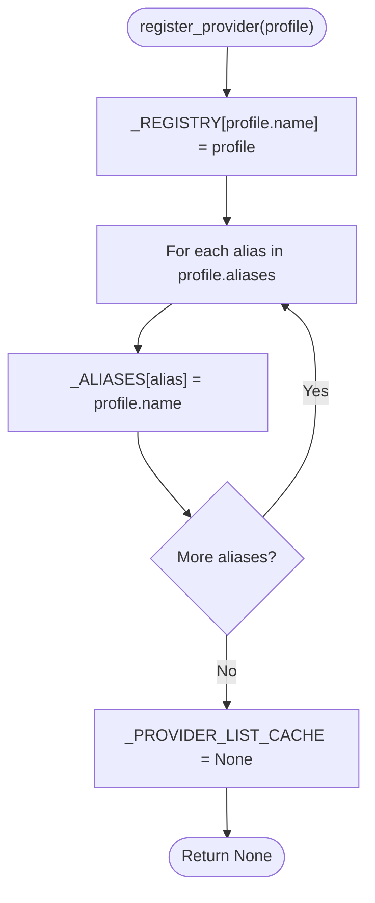
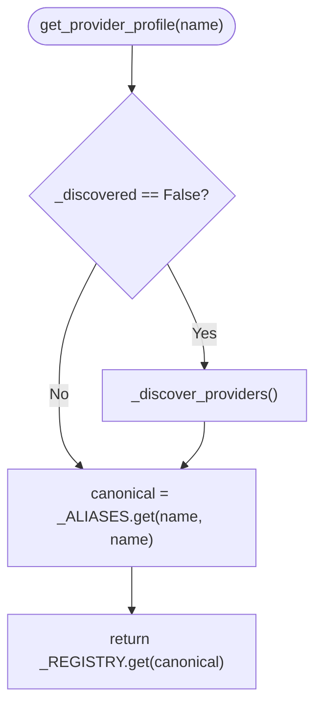
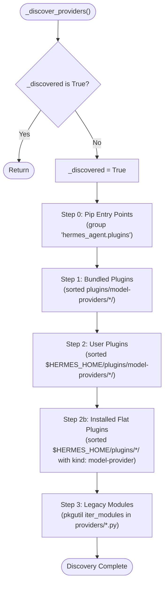
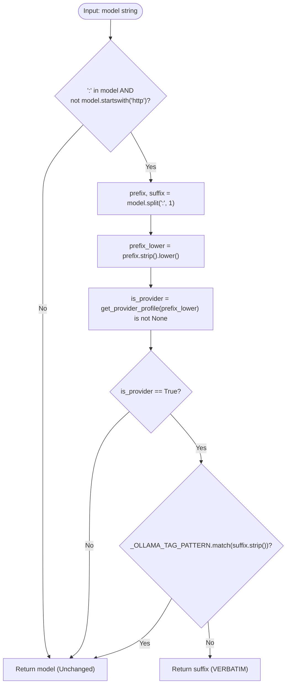

# Provider Registration and Prefix Resolution Source Review

This document specifies the exact runtime semantics, registration contracts, alias lookup precedence, cache and list identity behavior, discovery ordering, prefix stripping mechanics, and regex/Unicode edge cases in [`providers/__init__.py`](file:///home/eins0fx/development/hermes-agent-port/providers/__init__.py) and [`agent/model_metadata.py`](file:///home/eins0fx/development/hermes-agent-port/agent/model_metadata.py). It provides verified reference findings for the Rust port without confusing static catalog defaults with dynamic plugin discovery.

---

## 1. Scope, Authority, and Source Mapping

### 1.1 Source Files and Line Ranges
- **Provider Registry Subsystem**: [`providers/__init__.py`](file:///home/eins0fx/development/hermes-agent-port/providers/__init__.py)
  - Module state & constants: [lines 45-54](file:///home/eins0fx/development/hermes-agent-port/providers/__init__.py#L45-L54)
    - `_REGISTRY: dict[str, ProviderProfile]`
    - `_ALIASES: dict[str, str]`
    - `_PROVIDER_LIST_CACHE: list[ProviderProfile] | None`
    - `_discovered: bool`
    - `_BUNDLED_PLUGINS_DIR: Path`
  - Public registration & lookup API: [lines 56-98](file:///home/eins0fx/development/hermes-agent-port/providers/__init__.py#L56-L98)
    - `register_provider`: [lines 56-68](file:///home/eins0fx/development/hermes-agent-port/providers/__init__.py#L56-L68)
    - `get_provider_profile`: [lines 70-79](file:///home/eins0fx/development/hermes-agent-port/providers/__init__.py#L70-L79)
    - `list_providers`: [lines 81-98](file:///home/eins0fx/development/hermes-agent-port/providers/__init__.py#L81-L98)
  - Discovery directory locators: [lines 100-125](file:///home/eins0fx/development/hermes-agent-port/providers/__init__.py#L100-L125)
    - `_user_plugins_dir`: [lines 100-109](file:///home/eins0fx/development/hermes-agent-port/providers/__init__.py#L100-L109)
    - `_installed_plugins_dir`: [lines 111-125](file:///home/eins0fx/development/hermes-agent-port/providers/__init__.py#L111-L125)
  - Manifest inspection & plugin loader: [lines 127-198](file:///home/eins0fx/development/hermes-agent-port/providers/__init__.py#L127-L198)
    - `_declares_model_provider_kind`: [lines 127-160](file:///home/eins0fx/development/hermes-agent-port/providers/__init__.py#L127-L160)
    - `_import_plugin_dir`: [lines 162-198](file:///home/eins0fx/development/hermes-agent-port/providers/__init__.py#L162-L198)
  - Entry-point provider discovery: [lines 200-320](file:///home/eins0fx/development/hermes-agent-port/providers/__init__.py#L200-L320)
    - `_discover_entry_point_providers`: [lines 200-296](file:///home/eins0fx/development/hermes-agent-port/providers/__init__.py#L200-L296)
    - `_requires_arguments`: [lines 298-320](file:///home/eins0fx/development/hermes-agent-port/providers/__init__.py#L298-L320)
  - Discovery orchestrator: [lines 322-415](file:///home/eins0fx/development/hermes-agent-port/providers/__init__.py#L322-L415)
    - `_discover_providers`: [lines 322-411](file:///home/eins0fx/development/hermes-agent-port/providers/__init__.py#L322-L411)

- **Provider Base Class**: [`providers/base.py`](file:///home/eins0fx/development/hermes-agent-port/providers/base.py)
  - `OMIT_TEMPERATURE`: [line 21](file:///home/eins0fx/development/hermes-agent-port/providers/base.py#L21)
  - `ProviderProfile` dataclass definition: [lines 38-112](file:///home/eins0fx/development/hermes-agent-port/providers/base.py#L38-L112)

- **Model Metadata & Prefix Stripping**: [`agent/model_metadata.py`](file:///home/eins0fx/development/hermes-agent-port/agent/model_metadata.py)
  - Eager import-time registry queries: [lines 90-101](file:///home/eins0fx/development/hermes-agent-port/agent/model_metadata.py#L90-L101)
  - Ollama tag regular expression: [lines 104-107](file:///home/eins0fx/development/hermes-agent-port/agent/model_metadata.py#L104-L107)
  - Prefix stripping function: [lines 117-143](file:///home/eins0fx/development/hermes-agent-port/agent/model_metadata.py#L117-L143)
  - Import-time URL map auto-extension: [lines 837-845](file:///home/eins0fx/development/hermes-agent-port/agent/model_metadata.py#L837-L845)
  - Call sites for `_strip_provider_prefix`:
    - `_invalidate_cached_context_length`: [line 1747](file:///home/eins0fx/development/hermes-agent-port/agent/model_metadata.py#L1747)
    - `_query_ollama_num_ctx`: [line 2088](file:///home/eins0fx/development/hermes-agent-port/agent/model_metadata.py#L2088)
    - `query_ollama_supports_vision`: [line 2151](file:///home/eins0fx/development/hermes-agent-port/agent/model_metadata.py#L2151)
    - `_query_ollama_api_show`: [line 2222](file:///home/eins0fx/development/hermes-agent-port/agent/model_metadata.py#L2222)
    - `_query_local_context_length`: [line 2392](file:///home/eins0fx/development/hermes-agent-port/agent/model_metadata.py#L2392)
    - `_query_local_context_length_uncached`: [line 2416](file:///home/eins0fx/development/hermes-agent-port/agent/model_metadata.py#L2416)
    - `_probe_codex_oauth_context_length`: [line 2923](file:///home/eins0fx/development/hermes-agent-port/agent/model_metadata.py#L2923)
    - `get_model_context_length`: [line 3197](file:///home/eins0fx/development/hermes-agent-port/agent/model_metadata.py#L3197)

- **Test Suites**:
  - Registry cache, copy, and alias deduplication: [`tests/providers/test_provider_registry.py`](file:///home/eins0fx/development/hermes-agent-port/tests/providers/test_provider_registry.py)
  - Bundled & user directory plugin discovery: [`tests/providers/test_plugin_discovery.py`](file:///home/eins0fx/development/hermes-agent-port/tests/providers/test_plugin_discovery.py)
  - Flat installed plugins with `kind: model-provider`: [`tests/providers/test_installed_plugin_discovery.py`](file:///home/eins0fx/development/hermes-agent-port/tests/providers/test_installed_plugin_discovery.py)
  - Pip entry-point discovery: [`tests/providers/test_entry_point_discovery.py`](file:///home/eins0fx/development/hermes-agent-port/tests/providers/test_entry_point_discovery.py)
  - Prefix stripping test suite: [`tests/agent/test_model_metadata.py:1248-1308`](file:///home/eins0fx/development/hermes-agent-port/tests/agent/test_model_metadata.py#L1248-L1308)

---

## 2. Registration Architecture (`register_provider`)

### 2.1 State Representation
Module [`providers/__init__.py`](file:///home/eins0fx/development/hermes-agent-port/providers/__init__.py) manages four global module-level variables:

```python
_REGISTRY: dict[str, ProviderProfile] = {}
_ALIASES: dict[str, str] = {}
_PROVIDER_LIST_CACHE: list[ProviderProfile] | None = None
_discovered = False
```

1. `_REGISTRY`: Maps canonical provider name (`str`) to `ProviderProfile` instance.
2. `_ALIASES`: Maps alias string (`str`) to canonical provider name (`str`).
3. `_PROVIDER_LIST_CACHE`: Holds a memoized `list[ProviderProfile]` for `list_providers()`.
4. `_discovered`: Boolean flag indicating whether the lazy discovery waterfall has executed.

### 2.2 Registration Logic
```python
def register_provider(profile: ProviderProfile) -> None:
    global _PROVIDER_LIST_CACHE
    _REGISTRY[profile.name] = profile
    for alias in profile.aliases:
        _ALIASES[alias] = profile.name
    _PROVIDER_LIST_CACHE = None
```



### 2.3 Exact Invariants of Registration
1. **No Case or Whitespace Normalization**: Neither `profile.name` nor any string in `profile.aliases` is trimmed or converted to lowercase. They are inserted as verbatim string keys into `_REGISTRY` and `_ALIASES`.
2. **Replacement Semantics (Last-Writer-Wins)**: If `profile.name` already exists in `_REGISTRY`, the new `profile` replaces the old instance in `_REGISTRY`.
3. **No Unregister API**: There is no public unregister function. Registrations persist for the lifetime of the process unless module globals are cleared by test fixtures.
4. **Cache Reset**: Every invocation of `register_provider()` sets `_PROVIDER_LIST_CACHE = None`, forcing the next `list_providers()` call to rebuild the list.
5. **No Discovery State Change**: `register_provider()` does **not** check `_discovered` and does **not** set `_discovered = True`.

---

## 3. Alias Lookup, Stale Aliases, and Name Collisions

### 3.1 Lookup Precedence (`get_provider_profile`)
```python
def get_provider_profile(name: str) -> ProviderProfile | None:
    if not _discovered:
        _discover_providers()
    canonical = _ALIASES.get(name, name)
    return _REGISTRY.get(canonical)
```



### 3.2 Stale Aliases on Profile Replacement
When a provider is re-registered under an existing canonical name, `register_provider` inserts new alias mappings but **never deletes existing entries from `_ALIASES`**:

```python
# Registration 1:
p1 = ProviderProfile(name="gmi", aliases=("gmi-cloud", "gmi-serving"))
register_provider(p1)
# _REGISTRY["gmi"] = p1
# _ALIASES["gmi-cloud"] = "gmi"
# _ALIASES["gmi-serving"] = "gmi"

# Registration 2 (e.g. user plugin override):
p2 = ProviderProfile(name="gmi", aliases=("gmi-custom",))
register_provider(p2)
# _REGISTRY["gmi"] = p2
# _ALIASES["gmi-custom"] = "gmi"
# _ALIASES["gmi-cloud"] STILL points to "gmi"!
# _ALIASES["gmi-serving"] STILL points to "gmi"!
```

#### Behavioral Impact:
- `"gmi-cloud"` and `"gmi-serving"` become **stale aliases**.
- Calling `get_provider_profile("gmi-cloud")` resolves `"gmi-cloud"` $\to$ `"gmi"` $\to$ `p2`.
- The overriding profile `p2` inherits all previously registered aliases for that canonical name, even though `p2.aliases` did not declare them.

### 3.3 Alias Hijacking of Canonical Names (Shadow Collisions)
Because `get_provider_profile` evaluates `canonical = _ALIASES.get(name, name)` **before** querying `_REGISTRY`:

1. Provider $A$ registers with canonical name `"gemini"`.
   - `_REGISTRY["gemini"] = ProfileA`
2. Provider $B$ registers with canonical name `"google"` and aliases `("gemini",)`.
   - `_REGISTRY["google"] = ProfileB`
   - `_ALIASES["gemini"] = "google"`
3. A caller asks for `get_provider_profile("gemini")`:
   - `_ALIASES.get("gemini", "gemini")` evaluates to `"google"`.
   - `_REGISTRY.get("google")` returns `ProfileB`.
   - `ProfileA` is **completely shadowed** and cannot be retrieved by its canonical name `"gemini"`.

> [!WARNING]
> Alias lookup strictly takes precedence over canonical name lookup. An alias that collides with another provider's canonical name will hijack that canonical name across all `get_provider_profile` lookups.

### 3.4 Cross-Provider Alias Overwriting
If two distinct providers declare the same alias:
1. Provider $A$ registers alias `"fast-model"`.
   - `_ALIASES["fast-model"] = "ProviderA"`
2. Provider $B$ registers alias `"fast-model"`.
   - `_ALIASES["fast-model"] = "ProviderB"`
3. `_ALIASES` follows last-writer-wins. `"fast-model"` now points exclusively to `"ProviderB"`. Provider $A$ silently loses resolution under that alias.

### 3.5 Case-Sensitivity Asymmetry
There is an asymmetry between registration/lookup in `providers/__init__.py` and prefix stripping in `agent/model_metadata.py`:
- `register_provider` does **not** lowercase names or aliases.
- `get_provider_profile(name)` does **not** lowercase `name`.
- `_strip_provider_prefix(model)` computes `prefix_lower = prefix.strip().lower()` and passes `prefix_lower` to `get_provider_profile`.
- **Consequence**: If a provider is registered with mixed or uppercase casing (e.g. `name="Ollama-Cloud"` and `aliases=("OllamaCloud",)`), direct lookup `get_provider_profile("Ollama-Cloud")` succeeds, but `_strip_provider_prefix("Ollama-Cloud:model")` passes `"ollama-cloud"`, which misses both `_ALIASES` and `_REGISTRY`, returning the unstripped string!

---

## 4. List Identity, Cache Behavior, and Reference Semantics

### 4.1 Implementation of `list_providers`
```python
def list_providers() -> list[ProviderProfile]:
    """Return all registered provider profiles (one per canonical name)."""
    global _PROVIDER_LIST_CACHE
    if not _discovered:
        _discover_providers()
    if _PROVIDER_LIST_CACHE is not None:
        return list(_PROVIDER_LIST_CACHE)
    # Deduplicate: _REGISTRY has canonical names; _ALIASES points to same objects
    seen: set[int] = set()
    result: list[ProviderProfile] = []
    for profile in _REGISTRY.values():
        pid = id(profile)
        if pid not in seen:
            seen.add(pid)
            result.append(profile)
    _PROVIDER_LIST_CACHE = result
    return list(result)
```

### 4.2 Cache Mechanism and Copy Semantics
1. **Lazy Initialization**: On the first call, `_discover_providers()` executes, builds the `result` list, and stores it in `_PROVIDER_LIST_CACHE`.
2. **Container Copy**: Both the cached path (`return list(_PROVIDER_LIST_CACHE)`) and the uncached path (`return list(result)`) return a **new shallow copy** of the list (`list(...)`).
3. **Container Mutation Safety**:
   - Mutating the returned list container does **not** mutate `_PROVIDER_LIST_CACHE`.
   - Verified by `tests/providers/test_provider_registry.py:44-53`:
     ```python
     listed = providers.list_providers()
     listed.clear()
     assert providers.list_providers() == [first]
     ```
4. **Cache Invalidation**:
   - `_PROVIDER_LIST_CACHE` is cleared to `None` **only** inside `register_provider()`.
   - Directly mutating `_REGISTRY` or `_ALIASES` does not invalidate the cache.

### 4.3 Element Reference Identity and In-Place Mutation Hazard
While the list container is copied, the **elements inside the list are shared references** to the exact same `ProviderProfile` dataclass instances:

```python
profiles = list_providers()
# profiles[0] is the exact reference stored in _REGISTRY and _PROVIDER_LIST_CACHE
profiles[0].supports_vision = True
```

- `ProviderProfile` is an un-frozen dataclass.
- Modifying any attribute of a profile returned by `list_providers()` mutates the canonical profile in `_REGISTRY` and in the cached snapshot.
- Furthermore:
  ```python
  get_provider_profile(profiles[0].name) is profiles[0]  # Evaluates to True
  ```

### 4.4 Deduplication Logic and Misleading Code Comments
Notice lines 88-95:
```python
    # Deduplicate: _REGISTRY has canonical names; _ALIASES points to same objects
    seen: set[int] = set()
    result: list[ProviderProfile] = []
    for profile in _REGISTRY.values():
        pid = id(profile)
        if pid not in seen:
            seen.add(pid)
            result.append(profile)
```

- **Source Comment Inaccuracy**: The comment claims `_ALIASES points to same objects`. This is factually incorrect in the code: `_ALIASES` is a `dict[str, str]` mapping alias strings to canonical name strings. `_ALIASES` holds zero `ProviderProfile` instances.
- **Actual Effect of `seen`**: The loop iterates strictly over `_REGISTRY.values()`. The `id(profile)` check only prevents duplicates if the **exact same `ProviderProfile` instance** was registered under two distinct canonical keys in `_REGISTRY` (for example, `_REGISTRY["a"] = obj` and `_REGISTRY["b"] = obj`).

---

## 5. Discovery Ordering and Precedence Waterfall

### 5.1 The Multi-Step Discovery Sequence
`_discover_providers()` executes five sequential discovery phases:



### 5.2 Detailed Steps and Precedence Rationale

| Step | Discovery Source | Location / Mechanism | Traversal Order | Precedence Rank | Overwrite Rationale |
| :--- | :--- | :--- | :--- | :--- | :--- |
| **0** | Pip entry points | `hermes_agent.plugins` via `importlib.metadata` | System/metadata order | **Lowest (1)** | Runs first so bundled/user profiles overwrite third-party packages on name collision (`openrouter` cannot be hijacked). |
| **1** | Bundled plugins | `<repo>/plugins/model-providers/<name>/` | `sorted(iterdir())` (lexicographical) | **Baseline (2)** | Official in-tree profiles shipped with hermes-agent. |
| **2** | User plugins | `$HERMES_HOME/plugins/model-providers/<name>/` | `sorted(iterdir())` (lexicographical) | **High (3)** | Last-writer-wins in `register_provider` allows user profiles to replace bundled profiles. |
| **2b**| Flat installed plugins| `$HERMES_HOME/plugins/<name>/` (`kind: model-provider`) | `sorted(iterdir())` (lexicographical) | **Higher (4)** | Discovers plugins installed via `hermes plugins install` that clone into flat directories. |
| **3** | Legacy modules | `<repo>/providers/<name>.py` (except `base`, `__init__`) | `pkgutil.iter_modules` (filesystem order) | **Highest (5)** | Backward compatibility for single-file drop-ins in editable installs. |

### 5.3 Dictionary Insertion Order Behavior
Python 3.7+ dictionaries guarantee insertion order:
1. When a key is inserted for the first time, it is placed at the end of the dictionary.
2. When an existing key is reassigned (e.g. `_REGISTRY[name] = new_profile`), the value is updated **in-place**. In Python, updating an existing key does **not** change its insertion position.
3. **Ordering Consequence**:
   - If a user plugin in Step 2 overrides a bundled plugin from Step 1, its key was already inserted during Step 1. It **retains its Step 1 alphabetical slot** in `list_providers()`.
   - If a user plugin in Step 2 introduces a completely new provider name, it is appended to the end of `_REGISTRY` after all bundled plugins.
   - `list_providers()` order is **not** strictly alphabetical: it reflects dictionary insertion order resulting from the phased waterfall.

### 5.4 Directory Manifest vs Execution Contract
A directory name or `plugin.yaml` manifest does **not** determine provider identity:
1. Discovery imports the plugin's `__init__.py`.
2. Execution of `__init__.py` calls `register_provider(profile)`.
3. **Many-to-One Directory Mappings**:
   - Directory `plugins/model-providers/opencode-zen/` registers **two** profiles:
     - `name="opencode-zen"`
     - `name="opencode-go"`
   - Directory `plugins/model-providers/minimax/` registers **three** profiles:
     - `name="minimax"`
     - `name="minimax-cn"`
     - `name="minimax-oauth"`
   - Directory `plugins/model-providers/qwen-oauth/` registers:
     - `name="qwen-oauth"`, `aliases=("qwen", "qwen-portal", "qwen-cli")`
   - Directory `plugins/model-providers/copilot/` registers:
     - `name="copilot"`, `aliases=("github-copilot", "github-models", "github-model", "github")`
4. Directory `plugin.yaml` manifests may omit aliases or declare a different name from what `register_provider` receives.
5. In Step 2b, `_declares_model_provider_kind` reads `plugin.yaml` only as a gate to decide whether to import the plugin; the manifest is not used to register names.

---

## 6. Lazy Discovery Mechanics and Import-Time Pitfalls

### 6.1 Pre-Discovery Manual Registration Hazard
Because `register_provider` does not set `_discovered = True`:

```python
# Application setup:
custom = ProviderProfile(name="my-provider", base_url="https://custom.test")
register_provider(custom)
# _REGISTRY["my-provider"] = custom
# _discovered is still False!

# Later, during request processing:
profile = get_provider_profile("openrouter")
# Triggers _discover_providers()!
# Step 1, 2, 2b run...
```

If a discovered plugin in Step 1 or Step 2 has `name="my-provider"`, the discovery scan **overwrites** `custom` in `_REGISTRY`! Manual registrations prior to the first query are vulnerable to being clobbered by discovery.

### 6.2 Module Import-Time Discovery Breakage in `agent/model_metadata.py`
In `agent/model_metadata.py`:

```python
# Lines 97-101:
_PROVIDER_PREFIXES: frozenset[str] = frozenset(
    value.lower()
    for profile in _list_providers()
    for value in (profile.name, *profile.aliases)
)

# Lines 840-844:
try:
    for _pp in _list_providers():
        _host = _pp.get_hostname()
        if _host and _host not in _URL_TO_PROVIDER:
            _URL_TO_PROVIDER[_host] = _pp.name
except Exception:
    pass
```

#### Behavioral Consequences:
1. **Eager Discovery Execution**: Importing `agent.model_metadata` eagerly invokes `_list_providers()`, which triggers `_discover_providers()`. In practice, discovery is **never lazy** in any process that imports `model_metadata`.
2. **Snapshot Freezing**: `_PROVIDER_PREFIXES` and `_URL_TO_PROVIDER` freeze a snapshot of the provider set at module import time.
3. **Late-Registration Desynchronization**: Any provider registered dynamically *after* `agent/model_metadata.py` is imported:
   - Will **not** appear in `_PROVIDER_PREFIXES`.
   - Will **not** appear in `_URL_TO_PROVIDER`.
   - **Will** be visible to `get_provider_profile()` (which queries `_REGISTRY` live).
   - **Will** be visible to `_strip_provider_prefix()` (which calls `get_provider_profile()` live, ignoring `_PROVIDER_PREFIXES`).

---

## 7. Provider Prefix Stripping (`_strip_provider_prefix`)

### 7.1 Complete Reference Algorithm
Source in [`agent/model_metadata.py:117-143`](file:///home/eins0fx/development/hermes-agent-port/agent/model_metadata.py#L117-L143):

```python
def _strip_provider_prefix(model: str) -> str:
    if ":" not in model or model.startswith("http"):
        return model
    prefix, suffix = model.split(":", 1)
    prefix_lower = prefix.strip().lower()
    try:
        from providers import get_provider_profile

        is_provider = get_provider_profile(prefix_lower) is not None
    except Exception:
        is_provider = False
    if is_provider:
        # Don't strip if suffix looks like an Ollama tag (e.g. "7b", "latest", "q4_0")
        if _OLLAMA_TAG_PATTERN.match(suffix.strip()):
            return model
        return suffix
    return model
```



### 7.2 Step-by-Step Contract and Edge Cases
1. **Colon & HTTP Guard**:
   - If `":" not in model`: returns `model` immediately without string splits or lookups.
   - If `model.startswith("http")`: returns `model` immediately.
     - Note: Lowercase `"http"` only. `"HTTP://localhost"` has a colon, does not start with `"http"`, and splits into `prefix="HTTP"`, `suffix="//localhost"`. `prefix_lower="http"` is looked up; because `"http"` is not a provider, it falls through and returns `"HTTP://localhost"`.
2. **Single Colon Split (`split(":", 1)`)**:
   - Splits on the first colon only.
   - Suffix preserves any subsequent colons intact (e.g. `openrouter:anthropic/claude-3:beta` $\to$ `anthropic/claude-3:beta`).
3. **Prefix Normalization**:
   - `prefix.strip().lower()` strips whitespace and applies Unicode case folding.
4. **Live Registry Query**:
   - Queries `get_provider_profile(prefix_lower)`. Checks live `_ALIASES` and `_REGISTRY`.
5. **Ollama Tag Match Check**:
   - Evaluates `_OLLAMA_TAG_PATTERN.match(suffix.strip())`.
   - If match succeeds: returns `model` unchanged.
6. **Verbatim Suffix Return**:
   - If prefix is a recognized provider and suffix is not an Ollama tag:
   - Returns `suffix` **verbatim**.
   - **Critical**: It does **not** return `suffix.strip()`. Any whitespace present after the colon is strictly preserved:
     - `"local:  my-model "` $\to$ `"  my-model "`
     - `"openrouter:anthropic/claude-sonnet-4"` $\to$ `"anthropic/claude-sonnet-4"`

---

## 8. Ollama Tag Pattern and Regex / Unicode Nuances

### 8.1 Pattern Specification
[`agent/model_metadata.py:104-107`](file:///home/eins0fx/development/hermes-agent-port/agent/model_metadata.py#L104-L107):

```python
_OLLAMA_TAG_PATTERN = re.compile(
    r"^(\d+\.?\d*b|latest|stable|q\d|fp?\d|instruct|chat|coder|vision|text)",
    re.IGNORECASE,
)
```

### 8.2 Why the Pattern Exists
Ollama models use colon syntax for tags: `<model>:<tag>` (e.g. `qwen:0.5b`, `deepseek:latest`, `mistral:instruct`, `codellama:7b-instruct-q4_0`).
- Several model family names collide directly with Hermes provider names or aliases:
  - `deepseek` is a bundled provider.
  - `qwen` is an alias for bundled provider `qwen-oauth`.
- Without `_OLLAMA_TAG_PATTERN`, `_strip_provider_prefix("deepseek:latest")` would recognize `"deepseek"` as a provider and strip it to `"latest"`, corrupting the model name for local Ollama probes.
- The pattern ensures that when the suffix starts with an Ollama tag, the entire string remains unstripped.

### 8.3 Branch-by-Branch Breakdown

| Branch | Regex Snippet | Matches (Case-Insensitive) | Non-Matching Examples | Notes |
| :--- | :--- | :--- | :--- | :--- |
| **Model Size** | `\d+\.?\d*b` | `7b`, `0.5b`, `13B`, `32.b`, `70b-instruct`, `0.5b-chat` | `.5b`, `7`, `b`, `70m` | Requires $\ge 1$ leading digit before optional dot. Suffix `b` is mandatory. |
| **Latest** | `latest` | `latest`, `LATEST`, `latest-2025` | `late`, `lat` | Prefix match on `latest`. |
| **Stable** | `stable` | `stable`, `STABLE`, `stable-v2` | `stab` | Prefix match on `stable`. |
| **Quantization**| `q\d` | `q4`, `Q8`, `q4_k_m`, `q5_1`, `q4_0` | `q`, `quant` | Requires `q` immediately followed by digit. |
| **Float Precision**| `fp?\d` | `fp16`, `FP32`, `fp8`, `f16`, `f32`, `F8` | `f`, `fp`, `float16` | Letter `p` is optional: matches `f` followed directly by a digit. |
| **Instruct** | `instruct` | `instruct`, `INSTRUCT`, `instruct-v0.1` | `inst` | Prefix match on `instruct`. |
| **Chat** | `chat` | `chat`, `CHAT`, `chat-q4` | `ch` | Prefix match on `chat`. |
| **Coder** | `coder` | `coder`, `CODER`, `coder-instruct` | `code` | Prefix match on `coder`. |
| **Vision** | `vision` | `vision`, `VISION`, `vision-preview` | `vis` | Prefix match on `vision`. |
| **Text** | `text` | `text`, `TEXT`, `text-embedding` | `txt` | Prefix match on `text`. |

### 8.4 Prefix Matching Semantics
The regex uses `^` without a trailing `$`. It is a **prefix match** on `suffix.strip()`:
- `suffix = "7b-instruct-q4_0"` $\to$ matches branch `\d+\.?\d*b` on `"7b"`.
- `suffix = "visionary"` $\to$ matches branch `vision` on `"vision"`.
- `suffix = "chatterbox"` $\to$ matches branch `chat` on `"chat"`.

### 8.5 Unicode Regex and Whitespace Divergence (Python vs Rust)

#### 1. Decimal Digits (`\d`)
- In Python 3, `re.compile(..., re.IGNORECASE)` without `re.ASCII` evaluates `\d` across all Unicode decimal digits (General Category `Nd`).
  - Fullwidth digits: `０１２３４５６７８９` (`U+FF10`..`U+FF19`)
  - Arabic-Indic digits: `٠١٢٣٤٥٦٧８９` (`U+0660`..`U+0669`)
  - Devanagari digits: `०१२३४५६७८९` (`U+0966`..`U+096F`)
- In Rust's `regex` crate, `\d` matches Unicode `Nd` by default (unless `(?-u:\d)` or `[0-9]` is set). Both engines match Unicode decimal digits.

#### 2. Python `str.strip()` vs Rust `str::trim()`
- In Python, `suffix.strip()` strips every code point where `unicode_isspace(c)` is true.
  - Standard ASCII whitespace: `\t` (`0x09`), `\n` (`0x0A`), `\v` (`0x0B`), `\f` (`0x0C`), `\r` (`0x0D`), space (`0x20`).
  - **ASCII C0 Control Separators**: `\x1c` (FS), `\x1d` (GS), `\x1e` (RS), `\x1f` (US). Python treats these as whitespace!
  - Unicode space separators: `\u00A0` (NBSP), `\u1680`, `\u2000`..`\u200A`, `\u2028`, `\u2029`, `\u202F`, `\u205F`, `\u3000`.
- In Rust, standard `.trim()` uses `char::is_whitespace()`, which implements the Unicode Standard `White_Space` property.
  - The Unicode `White_Space` property **excludes** `\x1c`..`\x1f` (classifying them as `Cc` control codes).
  - In Rust: `" \x1c ".trim()` leaves `"\x1c"`. In Python: `" \x1c ".strip()` returns `""`.
  - For exact parity, Rust implementations must use a custom whitespace predicate:
    ```rust
    fn python_whitespace(c: char) -> bool {
        c.is_whitespace() || ('\u{1c}'..='\u{1f}').contains(&c)
    }
    ```

#### 3. String Lowercasing and Allocation
- Python `prefix.strip().lower()` allocates an intermediate lowercased string.
- In Rust, `split_once(':')` yields borrowed sub-slices `(&'a str, &'a str)`.
- If prefix lookup requires case-folding, Rust can either lowercase the prefix slice or perform case-insensitive map lookups.
- However, when stripping succeeds, the returned suffix slice `&'a str` can be returned **with zero heap allocation**, preserving the original lifetime `'a` from the caller.

---

## 9. Architectural Boundary: Static Catalog vs Plugin Discovery

> [!IMPORTANT]
> A static catalog snapshot does NOT equal plugin discovery. Do not present a compile-time static array of 48 bundled providers as completing the provider discovery subsystem in Rust.

### 9.1 Fundamental Differences

| Dimension | Static Catalog Snapshot | Dynamic Plugin Discovery |
| :--- | :--- | :--- |
| **Execution Model** | Static JSON / hardcoded tables compiled into binary. | Dynamic filesystem scans and Python/WASM module execution. |
| **Extensibility** | Closed: cannot discover third-party or user-installed providers. | Open: discovers `$HERMES_HOME/plugins/` and pip entry points. |
| **Identity Resolution** | Fixed string matching based on compile-time inventory. | Dynamic code execution: `register_provider` receives arbitrary names/aliases. |
| **Precedence / Overrides** | Static, unable to reflect user runtime overrides. | Dynamic last-writer-wins: user plugins override bundled plugins. |
| **Provider Quirks & Hooks** | Limited to declarative JSON data fields. | Arbitrary executable code (`resolve_aux_model`, request transformers). |
| **Test Mocking** | Rejects ad-hoc test fixtures (`fake-provider:org/model`). | Dynamically accepts runtime registrations via `register_provider`. |

### 9.2 Proper Layering for the Rust Port
To avoid architectural regression while maintaining incremental progress:
1. **Layer 1: Bundled Profile Baseline**:
   - A static snapshot of bundled providers (e.g. `provider-profile-defaults.json`) is valid **only** as a fallback default baseline.
   - It provides known built-in names and aliases for offline prefix stripping and default base URLs.
2. **Layer 2: In-Memory Mutable Registry (`ProviderRegistry`)**:
   - Must support dynamic `register(profile)` at runtime.
   - Must replicate the Python `_REGISTRY` and `_ALIASES` last-writer-wins precedence, stale alias survival, and insertion-ordered listing.
   - Allows unit tests and dynamic providers to register mocks without recompiling the binary.
3. **Layer 3: Plugin Discovery Runtime (Future Work)**:
   - True discovery requires executing plugin code or declarative manifests in the supported plugin runtime.
   - The boundary between static catalog baseline and runtime discovery must remain explicitly documented.

---

## 10. Call-Site Inventory in `agent/model_metadata.py`

Every call site of `_strip_provider_prefix` in [`agent/model_metadata.py`](file:///home/eins0fx/development/hermes-agent-port/agent/model_metadata.py) has a specific functional responsibility:

| Line Number | Enclosing Function | Exact Call Expression | Functional Role & Behavioral Consequence |
| :--- | :--- | :--- | :--- |
| [L1747](file:///home/eins0fx/development/hermes-agent-port/agent/model_metadata.py#L1747) | `_invalidate_cached_context_length` | `bare = _strip_provider_prefix(model)` | Clears in-memory TTL probe keys `(bare, stripped)` and `("ollama_show", bare, stripped)` from `_LOCAL_CTX_PROBE_CACHE` when dropping disk cache. |
| [L2088](file:///home/eins0fx/development/hermes-agent-port/agent/model_metadata.py#L2088) | `_query_ollama_num_ctx` | `bare_model = _strip_provider_prefix(model)` | Normalizes model for L2 disk key `f"{server_url}\|{bare_model}"` and HTTP POST body `{"name": bare_model}` sent to Ollama `/api/show`. |
| [L2151](file:///home/eins0fx/development/hermes-agent-port/agent/model_metadata.py#L2151) | `query_ollama_supports_vision` | `bare_model = _strip_provider_prefix(model)` | Normalizes model name before calling `detect_local_server_type` and querying `/api/show` for vision capabilities. |
| [L2222](file:///home/eins0fx/development/hermes-agent-port/agent/model_metadata.py#L2222) | `_query_ollama_api_show` | `cache_key = ("ollama_show", _strip_provider_prefix(model), base_url.rstrip("/"))` | Keys the namespaced TTL probe cache for Ollama `/api/show` calls. |
| [L2392](file:///home/eins0fx/development/hermes-agent-port/agent/model_metadata.py#L2392) | `_query_local_context_length` | `cache_key = (_strip_provider_prefix(model), base_url.rstrip("/"))` | Keys the general local probe TTL cache. |
| [L2416](file:///home/eins0fx/development/hermes-agent-port/agent/model_metadata.py#L2416) | `_query_local_context_length_uncached` | `model = _strip_provider_prefix(model)` | Normalizes model before querying local LM Studio, Ollama, llama.cpp, or vLLM endpoints. |
| [L2923](file:///home/eins0fx/development/hermes-agent-port/agent/model_metadata.py#L2923) | `_probe_codex_oauth_context_length` | `model_bare = _strip_provider_prefix(model).strip()` | Strips provider prefix before checking verified 900k Codex OAuth slugs. |
| [L3197](file:///home/eins0fx/development/hermes-agent-port/agent/model_metadata.py#L3197) | `get_model_context_length` | `model = _strip_provider_prefix(model)` | Normalizes model name between Step 0 (config overrides) and Step 1-9 (cache, probes, catalog). |

> [!NOTE]
> In `get_model_context_length`:
> - Step 0b (`_override_context_window(provider, model)`) at [line 3147](file:///home/eins0fx/development/hermes-agent-port/agent/model_metadata.py#L3147) runs **before** `_strip_provider_prefix`.
> - Step 0c (`get_custom_provider_context_length(model=model...)`) at [line 3160](file:///home/eins0fx/development/hermes-agent-port/agent/model_metadata.py#L3160) runs **before** `_strip_provider_prefix`.
> - `_strip_provider_prefix` executes at [line 3197](file:///home/eins0fx/development/hermes-agent-port/agent/model_metadata.py#L3197) immediately before Step 0d/1, ensuring downstream probes receive bare IDs.

---

## 11. Verification Matrix

| Verification Target | Python Source Reference | Verified Invariant |
| :--- | :--- | :--- |
| **Known Prefix Stripping** | [`test_model_metadata.py:1253-1256`](file:///home/eins0fx/development/hermes-agent-port/tests/agent/test_model_metadata.py#L1253-L1256) | `local:my-model` $\to$ `my-model`, `openrouter:anthropic/claude-sonnet-4` $\to$ `anthropic/claude-sonnet-4`. |
| **HTTP URL Preservation** | [`test_model_metadata.py:1260-1261`](file:///home/eins0fx/development/hermes-agent-port/tests/agent/test_model_metadata.py#L1260-L1261) | `http://example.com` and `https://example.com` are returned unmodified. |
| **Dynamic Runtime Registration** | [`test_model_metadata.py:1263-1276`](file:///home/eins0fx/development/hermes-agent-port/tests/agent/test_model_metadata.py#L1263-L1276) | Mocks registered via `register_provider` at runtime are recognized by `_strip_provider_prefix`. |
| **Unknown Prefix Unchanged** | [`test_model_metadata.py:1284-1286`](file:///home/eins0fx/development/hermes-agent-port/tests/agent/test_model_metadata.py#L1284-L1286) | `not-a-provider:org/model` remains `not-a-provider:org/model`. |
| **Ollama Tag Collision Guard** | [`test_model_metadata.py:1289`](file:///home/eins0fx/development/hermes-agent-port/tests/agent/test_model_metadata.py#L1289) | `qwen3.5:27b` is preserved intact and not stripped to `27b`. |
| **Context Lookup Intact Delivery** | [`test_model_metadata.py:1292-1307`](file:///home/eins0fx/development/hermes-agent-port/tests/agent/test_model_metadata.py#L1292-L1307) | `qwen3.5:27b` reaches endpoint metadata probe intact. |
| **List Cache Isolation** | [`test_provider_registry.py:39-58`](file:///home/eins0fx/development/hermes-agent-port/tests/providers/test_provider_registry.py#L39-L58) | Calling `.clear()` on `list_providers()` return does not wipe the cached snapshot. |
| **List Cache Invalidation** | [`test_provider_registry.py:54-58`](file:///home/eins0fx/development/hermes-agent-port/tests/providers/test_provider_registry.py#L54-L58) | Calling `register_provider` invalidates `_PROVIDER_LIST_CACHE` so subsequent `list_providers()` includes new provider. |
| **Alias Resolution & Deduplication**| [`test_provider_registry.py:60-67`](file:///home/eins0fx/development/hermes-agent-port/tests/providers/test_provider_registry.py#L60-L67) | Resolves `moonshot` alias to `kimi` profile; `list_providers()` deduplicates aliases. |
| **User Plugin Precedence** | [`test_plugin_discovery.py:78-120`](file:///home/eins0fx/development/hermes-agent-port/tests/providers/test_plugin_discovery.py#L78-L120) | User plugin in `$HERMES_HOME/plugins/model-providers/gmi` overrides bundled `gmi`. |
| **Flat Installed Discovery** | [`test_installed_plugin_discovery.py:57-67`](file:///home/eins0fx/development/hermes-agent-port/tests/providers/test_installed_plugin_discovery.py#L57-L67) | Discovers flat plugins declaring `kind: "model-provider"` in `$HERMES_HOME/plugins/<name>/`. |
| **Flat Directory Kind Filtering** | [`test_installed_plugin_discovery.py:69-79`](file:///home/eins0fx/development/hermes-agent-port/tests/providers/test_installed_plugin_discovery.py#L69-L79) | Ignores standalone/manifestless/invalid plugins in flat directory. |
| **Pip Entry Point Precedence** | [`test_entry_point_discovery.py:195-226`](file:///home/eins0fx/development/hermes-agent-port/tests/providers/test_entry_point_discovery.py#L195-L226) | Entry points run first (Step 0) so bundled/user profiles override them on collision. |
