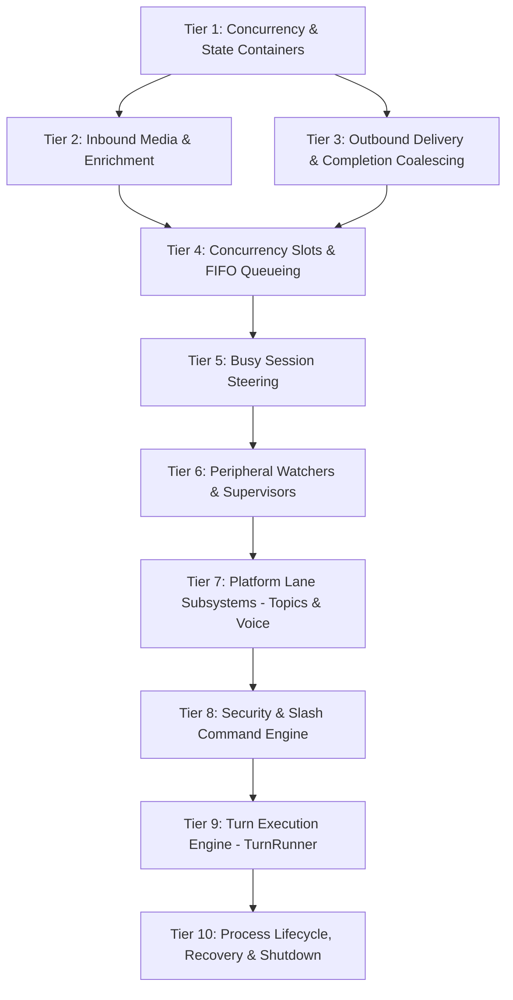

# Port-Order Map: `gateway/run.py` (GatewayRunner Hub)

This document provides a comprehensive structural, state, method, seam, and risk analysis of `gateway/run.py` (34,847 LOC) to guide an incremental, bottom-up rewrite into the Rust gateway crate (`crates/hermes-gateway`).

---

> **Verification status (checked by the main session, 2026-09-05).** This map was
> produced by the `agy` helper and then spot-checked against the source. VERIFIED
> EXACT: `gateway/run.py` is 34,847 lines; every class line number in 1.1
> (2456, 2465, 2469, 3395, 4832, 7450) and every entrypoint line number in 1.3
> (`start_gateway` 33851, `main` 34682, `_exit_after_graceful_shutdown` 34775);
> `slash_commands.py` at 6,576 LOC. WRONG, do not trust: the LOC column in 1.2
> for two mixins - `authz_mixin.py` is 1,084 lines (not 163) and
> `kanban_watchers.py` is 1,849 lines (not 432). The derived "references N self
> attributes" counts are unverified and should be re-derived before being relied
> on. Treat line ranges as trustworthy and derived counts as estimates.

## 1. STRUCTURE

### 1.1 Classes Defined in `gateway/run.py`

| Class | Line Range | Base Classes | Purpose & Role |
| :--- | :--- | :--- | :--- |
| `MultiplexConfigError` | L2456–2462 | `RuntimeError` | Raised when profile multiplexer configuration in `config.yaml` is invalid. Propagates directly to startup guards instead of being caught as transient retryable adapter noise. |
| `SecondaryPortBindingConfigError` | L2465–2466 | `MultiplexConfigError` | Subclass raised when a secondary profile attempts to bind to a port that conflicts with the multiplexer's shared listener. |
| `HygieneTurnHoldExceeded` | L2469–2478 | `Exception` | Raised when session hygiene compaction exceeds its turn-hold budget while the summary model is still streaming. Availability boundary that avoids triggering the idle-timeout failure ladder. |
| `_GatewayModelContext` | L3395–3402 | `None` (frozen dataclass) | Immutable value object holding effective gateway model routing and context-window metadata: `model: str`, `provider: str`, `base_url: str`, `context_length: int`, `context_source: str`. |
| `TurnRunner` | L4832–7438 | `None` (plain object) | Per-turn execution engine extracted from `_run_agent_inner`. Holds `(self, runner, ctx)` and drives the sync agent thread, streaming progress messages, native task-card UI (Slack), tool lifecycle callbacks, session title renaming, and step/event hooks. |
| `GatewayRunner` | L7450–33187 | `GatewayAuthorizationMixin`, `GatewayKanbanWatchersMixin`, `GatewaySlashCommandsMixin` | Central coordinator of the gateway process. Manages adapter lifecycle, session states, turn leases, message queues, execution threading, and shutdown/restart coordination. |

---

### 1.2 Mixin Base Classes of `GatewayRunner`

`GatewayRunner` uses Python multiple inheritance to partition authorization, background kanban event processing, and slash-command routing into mixin files. All three mixins rely heavily on duck-typed access to `self` attributes owned by `GatewayRunner`.

| Mixin Class | Source File | LOC | Purpose & Inter-dependencies |
| :--- | :--- | :--- | :--- |
| `GatewayAuthorizationMixin` | `gateway/authz_mixin.py` | 163 | Handles message sender authorization. Checks DM policies, group policies, allowlists, pairing store entries, and distinguishes upstream platform authorization from gateway-enforced policies. References 11 `self` attributes (e.g. `_adapter_for_source`, `_pairing_store_for`, `adapters`). |
| `GatewayKanbanWatchersMixin` | `gateway/kanban_watchers.py` | 432 | Subscribes to kanban task events and dispatches notifications or synthetic wakes. Manages the flock-based kanban dispatcher lock, cursor advancement, rewind, unsubscribing, and artifact delivery. References 13 `self` attributes (e.g. `_kanban_dispatcher_lock_handle`, `_kanban_notifier_profile`, `_running`). |
| `GatewaySlashCommandsMixin` | `gateway/slash_commands.py` | 6,576 | Implements handlers for 75 distinct slash commands (`/reset`, `/model`, `/session`, `/whoami`, `/status`, `/mcp`, `/compact`, `/skills`, etc.). Extremely tightly coupled: references 118 attributes/methods on `self`, directly mutating agent cache, session state, and model overrides. |

---

### 1.3 Key Top-Level Non-Class Entrypoints & Helpers

Beyond the class definitions, `gateway/run.py` contains roughly 5,500 lines of top-level helper routines and process entrypoints:
- **Hygiene & Compaction Helpers (L177–508, L754–778):** `run_codex_hygiene_compaction`, `_hygiene_cooldown_for_failure`, `_reset_hygiene_failure_streak`, `hygiene_compaction_recovered`.
- **Status & Message Formatting (L511–1289):** `_prepare_gateway_status_message`, `render_notice_line`, `_telegramize_command_mentions`, `_sanitize_gateway_final_response`.
- **Startup Warmup & Restoration (L1386–1633):** `_startup_warmup_timeout_secs`, `_warm_turn_machinery_sync`, `build_resume_recovery_note`, `_prepare_resume_pending_message`.
- **Session Context & History Assembly (L1826–2229):** `_build_gateway_agent_history`, `_select_cached_agent_history`, `_collect_auto_append_media_tags`, `_collect_history_media_paths`.
- **Multiplex & Secret Scope Bridges (L2481–2710):** `_profile_runtime_scope`, `_async_profile_runtime_scope`, `load_gateway_config_for_runner`, `_discover_gateway_mcp_tools`.
- **Process Entrypoints & Lifecycle Runners (L33190–34843):**
  - `_run_planned_stop_watcher` (L33190–33276)
  - `_drain_restart_safe_cron_deliveries` (L33279–33304)
  - `_start_gateway_housekeeping` (L33307–33536)
  - `_start_cron_ticker` / `_stop_cron_provider` (L33539–33564)
  - `_shutdown_mcp_servers_nonblocking` (L33609–33645)
  - `start_gateway` (L33851–34657) — top-level async server loop
  - `main` (L34682–34772) — CLI entrypoint, signal handling setup, process exit code propagation
  - `_exit_after_graceful_shutdown` (L34775–34843)

---

## 2. STATE: Instance Attributes Owned by `GatewayRunner`

`GatewayRunner` owns 87 long-lived instance attributes. The table below categorizes them by architectural concern and specifies their target representation in Rust.

### 2.1 Configuration & Policy Defaults

| Attribute | Line Initialized | Python Type | Target Rust Type | Lifecycle & Purpose |
| :--- | :--- | :--- | :--- | :--- |
| `config` | L7575 | `GatewayConfig` | `Arc<GatewayConfig>` | Loaded at boot; immutable configuration for the process. |
| `_prefill_messages` | L7602 | `Dict[str, str]` | `Arc<HashMap<String, String>>` | Cached per-platform prefill text prompts. |
| `_reasoning_config` | L7603 | `ReasoningConfig` | `Option<ReasoningConfig>` | Default reasoning effort / budget configuration. |
| `_service_tier` | L7604 | `Optional[str]` | `Option<String>` | Service tier override (e.g. OpenAI priority). |
| `_show_reasoning` | L7605 | `bool` | `bool` | Flag whether reasoning steps render to the user. |
| `_busy_input_mode` | L7606 | `str` | `BusyInputMode` enum | Default mode for incoming messages when agent is busy (`interrupt`, `queue`, `drop`). |
| `_busy_text_mode` | L7607 | `str` | `BusyTextMode` enum | Default mode for text input during busy turns. |
| `_busy_input_modes_by_profile` | L7611 | `Dict[str, str]` | `HashMap<String, BusyInputMode>` | Per-profile busy input mode overrides. |
| `_busy_text_modes_by_profile` | L7612 | `Dict[str, str]` | `HashMap<String, BusyTextMode>` | Per-profile busy text mode overrides. |
| `_restart_drain_timeout` | L7613 | `float` | `Duration` | Seconds to wait for active turns to drain before restart. |
| `_restart_after_turn_timeout` | L7614 | `float` | `Duration` | Timeout for trailing cleanup after turn completes. |
| `_cron_drain_timeout` | L7615 | `float` | `Duration` | Seconds allowed for active cron turns before restart. |
| `_signal_interrupt_grace_timeout` | L7616 | `float` | `Duration` | Grace period on SIGINT before forceful abort. |
| `_provider_routing` | L7619 | `Dict[str, Any]` | `ProviderRouting` | Model routing table loaded from config. |
| `_fallback_model` | L7620 | `Optional[str]` | `Arc<RwLock<Option<String>>>` | Fallback model route if primary fails repeatedly. |
| `_primary_profile_name` | L7803 | `str` | `String` | Identifier of the active root profile. |
| `_kanban_notifier_profile` | L7799 | `str` | `String` | Profile assigned to own the kanban notification lane. |
| `_agent_cache_bounds_cache` | L30421 | `AgentCacheBounds` | `OnceLock<AgentCacheBounds>` | Cached memory bounds for agent transcript eviction. |

---

### 2.2 Adapters & Transport Registry

| Attribute | Line Initialized | Python Type | Target Rust Type | Lifecycle & Purpose |
| :--- | :--- | :--- | :--- | :--- |
| `adapters` | L7585 | `Dict[Platform, BasePlatformAdapter]` | `Arc<RwLock<HashMap<Platform, Arc<dyn PlatformAdapter>>>>` | Primary registered platform adapters. |
| `_profile_adapters` | L7596 | `Dict[str, Dict[Platform, BasePlatformAdapter]]` | `Arc<RwLock<HashMap<String, HashMap<Platform, Arc<dyn PlatformAdapter>>>>>` | Profile multiplexing: nested map of secondary profile adapters. |
| `_failed_platforms` | L7811 | `Dict[Platform, asyncio.Task]` | `Arc<Mutex<HashMap<Platform, JoinHandle<()>>>>` | Active retry tasks for crashed or disconnected primary platforms. |
| `_profile_failed_platforms` | L7653 | `Dict[str, Dict[Platform, asyncio.Task]]` | `Arc<Mutex<HashMap<String, HashMap<Platform, JoinHandle<()>>>>>` | Active retry tasks for crashed secondary profile platforms. |
| `_fatal_handler_tasks` | L7815 | `Set[asyncio.Task]` | `Arc<Mutex<HashSet<TaskId>>>` | Tracks active detached fatal-error handlers to prevent premature garbage collection. |
| `_platform_lock_takeover_on_start` | L7753 | `bool` | `bool` | Flag whether gateway startup should steal existing platform locks. |

---

### 2.3 Session Maps & Turn Serialization

`GatewayRunner` consolidates per-session state in `self._sessions`. In Python, L7492–7517 define 18 `legacy_dict_property` adapters (`_running_agents`, `_active_session_leases`, `_session_model_overrides`, `_queued_events`, etc.) to expose views into `_sessions`. In Rust, these are unified under `SessionState` (`session_state.rs`).

| Attribute | Line Initialized | Python Type | Target Rust Type | Lifecycle & Purpose |
| :--- | :--- | :--- | :--- | :--- |
| `_sessions` | L7702 | `Dict[str, SessionState]` | `Arc<RwLock<HashMap<SessionKey, SessionState>>>` | Canonical in-memory registry of all active session states (`turn`, `conversation`, `persistent`). |
| `_turn_leases` | L7709 | `SessionTurnLeaseRegistry` | `Arc<SessionTurnLeaseRegistry>` | Serializes execution per session key. Prevents concurrent turns on the same session. |
| `_session_sources` | L7761 | `OrderedDict[str, SessionSource]` | `Arc<Mutex<LruCache<String, SessionSource>>>` | LRU cache mapping session key -> session source (bounded by `_session_sources_max = 512`). |
| `_session_sources_max` | L7762 | `int` | `usize` (const: 512) | Maximum size of `_session_sources` LRU cache. |
| `_session_stall_notified` | L7744 | `Dict[str, float]` | `Arc<Mutex<HashMap<String, Instant>>>` | Timestamps of emitted session stall warnings to prevent spam. |
| `session_store` | L7634 | `SessionStore` | `Arc<SessionStore>` | File-based transcript and metadata storage. |
| `_async_session_store` | L7643 | `AsyncSessionStore` | `Arc<AsyncSessionStore>` | Async facade over `SessionStore`. |
| `_session_db_pinned` | L7877 | `Any` | `Option<SessionDb>` | Cached process-pinned `SessionDb` instance. |
| `_session_db_handles` | L7878 | `Dict[str, Any]` | `HashMap<PathBuf, Connection>` | Pool of opened SQLite connections keyed by path. |
| `_session_db_handles_lock` | L7879 | `threading.Lock` | `std::sync::Mutex<()>` | Mutex guarding opening/closing `_session_db_handles`. |
| `_session_db_handle_cache` | L7882 | `RecoverableHandleCache` | `Arc<RecoverableHandleCache>` | Self-healing SQLite connection cache with backoff recovery. |
| `_session_db_init_error` | L7590 | `Optional[str]` | `Option<String>` | Stored initialization failure if `state.db` failed to open at boot. |

---

### 2.4 Agent Cache & Memory Pressure Control

| Attribute | Line Initialized | Python Type | Target Rust Type | Lifecycle & Purpose |
| :--- | :--- | :--- | :--- | :--- |
| `_agent_cache` | L7792 | `OrderedDict[str, AIAgent]` | `Arc<Mutex<LruCache<String, AgentHandle>>>` | In-memory LRU cache of live agent instances to preserve prompt prefix and conversation cache. |
| `_agent_cache_lock` | L7793 | `threading.Lock` | `std::sync::Mutex<()>` | Mutex guarding eviction, insertions, and memory pressure sweeps. |
| `_last_session_store_prune_ts` | L15652 | `float` | `AtomicU64` | Timestamp of the last disk transcript cleanup pass. |

---

### 2.5 Execution Thread Pool & Background Workers

| Attribute | Line Initialized | Python Type | Target Rust Type | Lifecycle & Purpose |
| :--- | :--- | :--- | :--- | :--- |
| `_executor` | L7694 | `Optional[ThreadPoolExecutor]` | `Arc<tokio::runtime::Handle>` / `rayon` | Dedicated thread pool for running sync agent turns without starving the async loop. |
| `_executor_lock` | L7693 | `threading.Lock` | `std::sync::Mutex<()>` | Synchronizes executor creation and shutdown. |
| `_executor_closing` | L7697 | `bool` | `AtomicBool` | Set during shutdown to refuse newly submitted blocking work. |
| `_deferred_agent_workers` | L9524 | `Set[threading.Thread]` | `Arc<Mutex<HashSet<WorkerId>>>` | Tracks background threads running deferred post-turn work (e.g. memory consolidation). |
| `_deferred_agent_cleanup_tasks` | L12273 | `Set[asyncio.Task]` | `Arc<Mutex<HashSet<TaskId>>>` | Tracks async tasks cleaning up evicted or interrupted agents. |

---

### 2.6 Outbound Delivery, Completion Ledgers & Routing

| Attribute | Line Initialized | Python Type | Target Rust Type | Lifecycle & Purpose |
| :--- | :--- | :--- | :--- | :--- |
| `delivery_router` | L7644 | `DeliveryRouter` | `Arc<DeliveryRouter>` | Resolves outbound delivery targets and formats replies. |
| `_completion_delivery_lock` | L7768 | `threading.Lock` | `std::sync::Mutex<()>` | Guards deduplication and claim logic for async completions. |
| `_completion_deliveries_inflight` | L7769 | `Set[str]` | `HashSet<ObligationId>` | Delivery obligations currently being sent to adapters. |
| `_completion_deliveries_delivered` | L7770 | `OrderedDict[str, float]` | `LruCache<ObligationId, Instant>` | History of successfully delivered completions (bounded by `_completion_delivery_retention = 2048`). |
| `_completion_delivery_retention` | L7771 | `int` | `usize` (const: 2048) | Maximum entries in `_completion_deliveries_delivered`. |
| `_completion_notification_batches` | L7775 | `Dict[str, List[Notification]]` | `HashMap<BatchKey, Vec<Notification>>` | Buffer for coalescing rapid completion notifications sharing the same chat target. |
| `_completion_notification_batch_tasks` | L7776 | `Dict[str, asyncio.Task]` | `HashMap<BatchKey, JoinHandle<()>>` | Delayed timers that flush each completion notification batch. |
| `_completion_notification_batch_flush_tasks` | L7777 | `Set[asyncio.Task]` | `HashSet<TaskId>` | In-flight batch delivery tasks. |
| `_completion_notification_batch_window` | L7778 | `float` | `Duration` (const: 100ms) | Window duration for coalescing concurrent background completions. |
| `_completion_notification_batches_stopping` | L7779 | `bool` | `AtomicBool` | Prevents accepting new completion batches during gateway shutdown. |

---

### 2.7 Process Lifecycle, Draining & Shutdown Coordination

| Attribute | Line Initialized | Python Type | Target Rust Type | Lifecycle & Purpose |
| :--- | :--- | :--- | :--- | :--- |
| `_running` | L7645 | `bool` | `AtomicBool` | Master run flag; flipped false to terminate event loops. |
| `_gateway_loop` | L7646 | `Optional[asyncio.AbstractEventLoop]` | `tokio::runtime::Handle` | Reference to the primary async event loop. |
| `_shutdown_event` | L7647 | `asyncio.Event` | `tokio::sync::Notify` / `watch` | Signals all background watchers that shutdown has begun. |
| `_exit_cleanly` | L7648 | `bool` | `AtomicBool` | Set when stopping due to intentional operator command (`/stop`, SIGTERM). |
| `_exit_with_failure` | L7649 | `bool` | `AtomicBool` | Set when terminating due to fatal, unrecoverable adapter error. |
| `_exit_reason` | L7650 | `Optional[str]` | `Arc<RwLock<Option<String>>>` | Diagnostic string recorded in status file on exit. |
| `_exit_code` | L7651 | `Optional[int]` | `AtomicI32` | Process exit status code passed to `std::process::exit`. |
| `_draining` | L7652 | `bool` | `AtomicBool` | When true, new turns are rejected while in-flight turns complete. |
| `_external_drain_active` | L7664 | `bool` | `AtomicBool` | Set when `.drain_request.json` is detected on disk. |
| `_stop_task` | L7691 | `Optional[asyncio.Task]` | `Option<JoinHandle<()>>` | Holds the executing `stop()` coroutine task to prevent duplicate teardown. |
| `_shutdown_watchdog_done` | L16508 | `Optional[threading.Event]` | `Arc<std::sync::atomic::AtomicBool>` | Synchronizes graceful shutdown timeout guard. |
| `_systemd_watchdog` | L7654 | `Optional[Any]` | `Option<SystemdWatchdog>` | Periodically pings systemd notify watchdog (`WATCHDOG=1`). |

---

### 2.8 Supervised Restart & Detached Supervisor State

| Attribute | Line Initialized | Python Type | Target Rust Type | Lifecycle & Purpose |
| :--- | :--- | :--- | :--- | :--- |
| `_restart_requested` | L7665 | `bool` | `AtomicBool` | True if gateway was asked to restart via `/restart` or signal. |
| `_restart_task_started` | L7676 | `bool` | `AtomicBool` | Guard preventing multiple restart tasks from spawning. |
| `_restart_detached` | L7677 | `bool` | `AtomicBool` | True if restarting under external supervisor (detached exec). |
| `_restart_via_service` | L7678 | `bool` | `AtomicBool` | True if delegating restart to `systemctl restart`. |
| `_detached_restart_helper_started` | L7679 | `bool` | `AtomicBool` | Latch marking detached helper invocation. |
| `_restart_command_source` | L7680 | `Optional[SessionSource]` | `Option<SessionSource>` | Chat origin that issued `/restart`, to receive post-boot notification. |
| `_restart_task` | L7692 | `Optional[asyncio.Task]` | `Option<JoinHandle<()>>` | Background task executing the restart sequence. |
| `_booted_from_restart` | L7690 | `bool` | `bool` | Detected on startup via sentinel file. |
| `_signal_initiated_shutdown` | L7675 | `bool` | `AtomicBool` | Set when SIGINT/SIGTERM was the shutdown trigger. |

---

### 2.9 Crash Recovery & Obligation Replay

| Attribute | Line Initialized | Python Type | Target Rust Type | Lifecycle & Purpose |
| :--- | :--- | :--- | :--- | :--- |
| `_startup_restore_in_progress` | L7749 | `bool` | `AtomicBool` | True while replaying un-settled messages from prior crash. |
| `_startup_restore_queue` | L7754 | `List[MessageEvent]` | `VecDeque<MessageEvent>` | Messages loaded from recovery files awaiting replay into adapters. |
| `_startup_restore_tasks` | L7755 | `List[asyncio.Task]` | `Vec<JoinHandle<()>>` | Active background replay tasks. |
| `_startup_warmup_task` | L12998 | `Optional[asyncio.Task]` | `Option<JoinHandle<()>>` | Asynchronous pre-warming of model clients and tool registries. |

---

### 2.10 Watchdogs, Heartbeats & Loop Liveness

| Attribute | Line Initialized | Python Type | Target Rust Type | Lifecycle & Purpose |
| :--- | :--- | :--- | :--- | :--- |
| `_gateway_started_at` | L7983 | `float` | `Instant` | Monotonic startup timestamp for uptime and telemetry. |
| `_startup_time` | L7684 | `float` | `SystemTime` | Wall-clock startup timestamp. |
| `_loop_heartbeat_task` | L7984 | `Optional[asyncio.Task]` | `Option<JoinHandle<()>>` | Periodic task writing event-loop timestamp into `lifecycle_ledger`. |
| `_loop_floor_timer_handle` | L7985 | `Optional[TimerHandle]` | `Option<tokio::time::Sleep>` | Low-level timer detecting event-loop lag. |
| `_loop_liveness_watchdog` | L7986 | `Optional[Any]` | `Option<JoinHandle<()>>` | OS thread monitoring event loop responsiveness. |
| `_heartbeat_poll_task` | L24428 | `Optional[asyncio.Task]` | `Option<JoinHandle<()>>` | Background poller for registered agent heartbeats. |
| `_heartbeat_watch` | L24370 | `Optional[Dict[str, Any]]` | `Option<HeartbeatWatch>` | Metadata for the active heartbeat watcher. |
| `_reconnect_watcher_task` | L16054 | `Optional[asyncio.Task]` | `Option<JoinHandle<()>>` | Long-lived task monitoring disconnected platforms and attempting backoff reconnects. |

---

### 2.11 Scale-to-Zero & Activity Tracking

| Attribute | Line Initialized | Python Type | Target Rust Type | Lifecycle & Purpose |
| :--- | :--- | :--- | :--- | :--- |
| `_last_inbound_at` | L7994 | `float` | `Arc<AtomicU64>` | Timestamp of last received real inbound user message. |
| `_scale_to_zero_cooldown_until` | L7997 | `float` | `AtomicU64` | Earliest timestamp before idle self-suspend may trigger. |
| `_scale_to_zero_no_suspend_logged` | L7999 | `bool` | `AtomicBool` | Prevents repeated log spam when suspension is disallowed. |

---

### 2.12 Voice, Channel & Platform Subsystems

| Attribute | Line Initialized | Python Type | Target Rust Type | Lifecycle & Purpose |
| :--- | :--- | :--- | :--- | :--- |
| `_voice_mode` | L7971 | `Dict[str, bool]` | `Arc<RwLock<HashMap<String, bool>>>` | Tracks auto-TTS / voice mode per channel. |
| `_recent_voice_transcripts` | L7975 | `Dict[str, float]` | `LruCache<String, Instant>` | De-duplicates repetitive incoming STT transcripts. |
| `_telegram_lobby_reminder_ts` | L8707 | `Dict[str, float]` | `HashMap<String, Instant>` | Debounce timestamps for Telegram forum topic lobby hints. |
| `_telegram_capability_hint_ts` | L26231 | `Dict[str, float]` | `HashMap<String, Instant>` | Debounce timestamps for Telegram forum capability hints. |
| `_update_notification_task` | L26925 | `Optional[asyncio.Task]` | `Option<JoinHandle<()>>` | Background task watching `hermes update --gateway` progress. |
| `_background_tasks` | L7978 | `Set[asyncio.Task]` | `Arc<Mutex<HashSet<TaskId>>>` | General registry of spawned background tasks to prevent garbage collection. |
| `_slash_confirm_counter` | L7826 | `itertools.count` | `AtomicU64` | Generator of unique IDs for two-step destructive slash confirmation. |
| `pairing_store` | L7963 | `PairingStore` | `Arc<PairingStore>` | Salted-hash pairing code store for DM authorization. |
| `pairing_stores` | L7964 | `Dict[str, PairingStore]` | `HashMap<String, Arc<PairingStore>>` | Profile-scoped pairing stores. |
| `hooks` | L7968 | `HookRegistry` | `Arc<HookRegistry>` | Gateway lifecycle and step hook registry (`hooks.rs`). |
| `_teams_pipeline_runtime` | L7805 | `Optional[Any]` | `Option<TeamsPipelineRuntime>` | Runtime bridge for MS Teams pipeline. |
| `_teams_pipeline_runtime_error` | L7806 | `Optional[str]` | `Option<String>` | Error message if Teams pipeline failed to initialize. |
| `_gateway_health_export_runtime` | L13985 | `Optional[Any]` | `Option<HealthExportHandle>` | Internal HTTP health exporter runtime. |

---

## 3. METHOD INVENTORY

`GatewayRunner` directly defines 395 methods, while `TurnRunner` defines 13. The methods are grouped below into 21 coherent functional domains.

### Group 1: Startup, Warmup & Boot Notifications (20 methods)
Responsible for starting event loops, warming caches, initializing database handles, and notifying configured channels.

- `__init__` (L7569–7999): Initializes runner state, config, stores, locks, and watchdogs.
- `start` (L13831–14854): Main startup orchestration sequence; initializes adapters, recovery, and background loops.
- `_start_loop_liveness_guards` (L13656–13699): Spawns floor timer and liveness watchdog task.
- `_start_loop_heartbeat_task` (L13801–13829): Starts the 30s heartbeat writer for unclean shutdown detection.
- `_start_systemd_watchdog` (L16384–16398): Starts systemd `WATCHDOG=1` notification loop.
- `_start_startup_warmup` (L12986–13000): Launches background warmup of agent models/tools.
- `_warm_turn_prerequisites` (L13002–13025): Warms local CLI binaries and runtime toolsets.
- `_await_startup_warmup` (L13027–13056): Waits for the warmup task to settle.
- `_warm_goals_session_db` (L24281–24296): Opens and warms goals database connection off-loop.
- `_startup_should_abort` (L13623–13628): Checks if shutdown was requested during boot.
- `_abort_startup_if_shutdown_requested` (L13630–13654): Aborts boot sequence and triggers teardown if flagged.
- `_send_home_channel_startup_notifications` (L27383–27464): Emits boot notice to home channels.
- `_send_session_db_warning_notifications` (L27466–27560): Broadcasts warning if `state.db` failed to open cleanly.
- `_await_startup_boot_sends` (L13149–13208): Waits for initial startup messages to be delivered.
- `_log_background_boot_send_result` (L13211–13215): Logs result of startup broadcasts.
- `_open_session_db_for_active_scope` (L8002–8078): Opens SQLite database for the active profile scope.
- `_session_db` (L8081–8096): Resolves pinned or profile-scoped `SessionDb` instance.
- `close_all_session_db_handles` (L8098–8121): Closes all pooled SQLite connections.
- `_wire_teams_pipeline_runtime` (L8123–8151): Configures Teams pipeline plugin runtime if enabled.
- `_warn_if_docker_media_delivery_is_risky` (L8154–8199): Audits Docker volume paths against media security rules.

---

### Group 2: Shutdown, Draining & Clean Exit (22 methods)
Coordinates graceful draining of turns, background task cancellation, MCP shutdown, and exit codes.

- `stop` (L16408–17146): Core teardown orchestrator; drains turns, disconnects adapters, flushes state.
- `wait_for_shutdown` (L17148–17150): Awaits the shutdown event.
- `_stop_loop_liveness_guards` (L13701–13731): Cancels heartbeat and floor timer handles.
- `_stop_systemd_watchdog` (L16400–16406): Stops systemd watchdog pinging and sends `STOPPING=1`.
- `_request_clean_exit` (L9434–9437): Sets clean exit flags and trips shutdown event.
- `should_exit_cleanly` (L8581–8582): Accessor for clean exit status.
- `should_exit_with_failure` (L8585–8586): Accessor for failure exit status.
- `exit_reason` (L8589–8590): Accessor for exit reason string.
- `exit_code` (L8593–8594): Accessor for exit code int.
- `_enter_external_drain` (L10184–10202): Flips runner to draining state when marker file appears.
- `_exit_external_drain` (L10204–10226): Clears draining state when marker file is removed.
- `_drain_control_watcher` (L10228–10263): Periodic watcher for `.drain_request.json`.
- `_queue_during_drain_enabled` (L9952–9959): Evaluates if inbound events may queue during a drain.
- `_drain_active_agents` (L11719–11805): Awaits completion of in-flight turns within budget.
- `_interrupt_running_agents` (L11807–11827): Aborts running agents when drain budget expires.
- `_notify_interrupted_cron_jobs` (L11829–11926): Notifies channels of cron turns interrupted by shutdown.
- `_notify_active_sessions_of_shutdown` (L11928–12125): Sends shutdown warnings to active chat sessions.
- `_finalize_shutdown_agents` (L12127–12201): Forces cleanup of agent resources during shutdown.
- `_shutdown_executor` (L27636–27675): Closes the gateway thread pool executor.
- `_await_thread_exit` (L33586–33606): Joins non-daemon worker threads.
- `_shutdown_mcp_servers_nonblocking` (L33609–33645): Signals attached MCP servers to exit.
- `_shutdown_gateway_health_export` (L33648–33657): Terminates health exporter server.

---

### Group 3: Supervised & Detached Restart (12 methods)
Implements `/restart` execution, timeout budgeting, and handoff to external supervisors.

- `request_restart` (L12864–12903): Public trigger to begin graceful restart sequence.
- `_await_active_work_before_restart` (L12766–12862): Waits for active turns to finish before execing.
- `_launch_detached_restart_command` (L12535–12720): Forks detached child process or triggers systemd service restart.
- `_send_restart_notification` (L27304–27381): Sends confirmation to the user who requested `/restart`.
- `_increment_restart_failure_counts` (L12436–12461): Records crash count in state database to prevent respawn loops.
- `_clear_restart_failure_count` (L12512–12533): Resets crash count upon stable uptime.
- `_load_restart_drain_timeout` (L10755–10771): Resolves configured drain timeout.
- `_load_restart_after_turn_timeout` (L10774–10794): Resolves post-turn settling timeout.
- `_load_cron_drain_timeout` (L10797–10817): Resolves cron drain timeout.
- `_load_signal_interrupt_grace_timeout` (L10820–10839): Resolves signal grace timeout.
- `_run_planned_stop_watcher` (L33190–33276): Watches for scheduled restart deadlines.
- `_drain_restart_safe_cron_deliveries` (L33279–33304): Flushes pending cron deliverables prior to exec.

---

### Group 4: Crash Recovery & Obligation Replay (15 methods)
Detects unclean termination, claims pending delivery obligations from SQLite, and replays unacknowledged turns.

- `_consume_clean_shutdown_marker` (L13733–13742): Checks and deletes clean shutdown marker file.
- `_recover_unclean_sessions` (L13744–13762): Identifies sessions left dirty by an unclean termination.
- `_claim_pending_obligations` (L13246–13308): Adopts delivery obligations left un-acked by dead PID.
- `_redeliver_claimed_obligations` (L13310–13405): Re-transmits claimed obligations through live adapters.
- `_redeliver_pending_obligations` (L13407–13418): Sweeps and redelivers all pending obligations.
- `_redeliver_failed_obligations_for_platform` (L13420–13479): Retries obligations when an adapter reconnects.
- `_schedule_resume_pending_sessions` (L13481–13621): Spawns tasks to resume interrupted agent conversations.
- `_run_startup_resume_event` (L12914–12942): Re-injects a single recovered turn into the dispatcher.
- `_queue_startup_restore_event` (L12944–12958): Buffers an event while adapters are initializing.
- `_drain_startup_restore_queue` (L12960–12984): Drains buffered restore events once adapters connect.
- `_finish_startup_restore` (L13058–13117): Marks recovery phase complete and opens gate to live traffic.
- `_clear_resume_pending_for_claimed_obligations` (L13217–13244): Clears recovered state markers.
- `_log_background_resume_result` (L13120–13129): Logs recovery task outcome.
- `_log_late_background_failure` (L13132–13147): Logs late-arriving background recovery failure.
- `_is_stale_restart_redelivery` (L24103–24182): Filters duplicate redeliveries already seen by the client.

---

### Group 5: Adapter Lifecycle, Connection & Profile Multiplexing (18 methods)
Instantiates, connects, tears down, and profiles platform adapters.

- `_instantiate_adapter` (L18082–18199): Instantiates adapter class with configured credentials.
- `_create_adapter` (L18066–18080): Factory resolving platform enum to adapter instance.
- `_configure_profile_adapter` (L17471–17520): Applies profile-specific env and credentials to adapter.
- `_start_secondary_profile_adapters` (L17152–17244): Iterates configured multiplex profiles and connects adapters.
- `_start_one_profile_adapters` (L17246–17469): Connects all enabled adapters for a single profile.
- `_connect_adapter_with_timeout` (L8520–8560): Connects adapter with timeout guard.
- `_connect_initial_adapter_with_timeout` (L8562–8578): Connects initial adapter during boot.
- `_platform_connect_timeout_secs` (L8491–8518): Resolves platform connection timeout.
- `_adapter_disconnect_timeout_secs` (L8476–8489): Resolves platform disconnect timeout.
- `_safe_adapter_disconnect` (L8395–8422): Safely calls `disconnect()` with exception suppression.
- `_await_adapter_cleanup_with_timeout` (L8366–8393): Awaits adapter teardown.
- `_bounded_adapter_teardown` (L8424–8474): Enforces upper bound on adapter shutdown time.
- `_dispose_unused_adapter` (L4737–4788): Cleans up and disconnects unreferenced adapter instance.
- `_adapter_credential_claim` (L17976–17983): Validates token ownership to prevent multi-profile collision.
- `_adapter_listener_claim` (L17986–18005): Verifies port-binding ownership.
- `_adapter_credential_fingerprint` (L18008–18064): Hashes credentials to detect duplicate configurations.
- `_iter_gateway_adapters` (L15665–15684): Generator yielding all active adapters across all profiles.
- `_dispose_unused_adapter` (L4737–4788): Releases disconnected adapter handles.

---

### Group 6: Platform Reconnection & Fatal Error Recovery (20 methods)
Handles network loss, backoff scheduling, and supervisor loops for failed adapters.

- `_handle_adapter_fatal_error` (L9182–9208): Ingress callback when an adapter reports an unrecoverable failure.
- `_handle_adapter_fatal_error_impl` (L9344–9432): Evaluates whether error is retryable or fatal to the process.
- `_handle_adapter_fatal_error_detached` (L9264–9342): Executes error handling in detached task.
- `_handle_profile_adapter_fatal_error` (L17763–17794): Handles fatal error on secondary profile adapter.
- `_make_profile_fatal_error_handler` (L17754–17761): Builds closure bound to specific profile.
- `_queue_retryable_fatal_platform` (L9210–9262): Schedules failed platform for reconnection attempt.
- `_pause_failed_platform` (L10297–10333): Marks platform paused and suspends inbound dispatch.
- `_resume_paused_platform` (L10335–10359): Restores paused platform once reconnected.
- `_schedule_secondary_profile_reconnect` (L17729–17752): Schedules reconnection for secondary profile.
- `_schedule_secondary_profile_startup_reconnect` (L17640–17727): Schedules reconnect if boot-time connect failed.
- `_run_secondary_profile_reconnect` (L17522–17638): Executes secondary profile reconnection attempt.
- `_cancel_secondary_profile_reconnect_tasks` (L16352–16382): Cancels active reconnect tasks on shutdown.
- `_platform_reconnect_watcher` (L16085–16350): Long-running supervisor loop executing exponential backoff reconnects.
- `_ensure_reconnect_watcher_running` (L16062–16083): Restarts supervisor loop if dead.
- `_spawn_reconnect_watcher` (L16046–16060): Spawns the reconnect supervisor task.
- `_schedule_slow_reconnect_watcher_respawn` (L16003–16044): Delays respawn of crashed watcher.
- `_on_reconnect_watcher_gave_up` (L15964–16001): Terminal callback when reconnect retries are exhausted.
- `_reconnect_backoff` (L4809–4811): Pure backoff interval calculator.
- `_reconnect_needs_attention` (L4814–4829): Evaluates if repeated reconnect failure requires user alert.
- `_update_platform_runtime_status` (L10265–10290): Writes platform state into status file.

---

### Group 7: Inbound Message Handling & Pre-Processing (22 methods)
The main ingress pipeline: routes events, manages STT transcription, image vision, and text normalization.

- `_handle_message` (L18798–20469): The 1,671-line inbound ingress pipeline and router.
- `_primary_message_handler` (L17889–17893): Bound message handler for default profile.
- `_make_default_profile_message_handler` (L17841–17887): Builds default profile message handler closure.
- `_make_profile_message_handler` (L17798–17824): Builds secondary profile message handler closure.
- `_handle_gateway_platform_event` (L17895–17907): Handles non-message platform events (e.g. member join).
- `_primary_platform_event_handler` (L17970–17973): Bound event handler for default profile.
- `_make_default_profile_platform_event_handler` (L17928–17937): Builds default profile event closure.
- `_make_profile_platform_event_handler` (L17909–17926): Builds secondary profile event closure.
- `_handle_reaction_event` (L9166–9180): Dispatches emoji reaction events.
- `_prepare_inbound_message_text` (L20504–20924): Expands quick commands, skills, aliases, and mentions.
- `_prepare_profile_scoped_inbound_message_text` (L20926–20950): Scopes text preprocessing to profile.
- `_prepare_clarify_reply_text` (L20952–20964): Handles interactive disambiguation selections.
- `_consume_pending_native_image_paths` (L20966–20972): Extracts images attached via native client.
- `_decide_image_input_mode` (L27677–27748): Decides whether image is passed natively or via vision tool.
- `_enrich_message_with_vision` (L27750–27819): Executes pre-turn vision description on attached photos.
- `_enrich_message_with_transcription` (L27821–27961): Executes STT transcription on incoming voice/audio notes.
- `_pending_event_audio_paths` (L27963–27970): Extracts audio file paths from event.
- `_transcribe_pending_audio_event_once` (L27972–28000): Transcribes audio and caches result on event.
- `_echo_pending_stt_transcripts_once` (L28002–28041): Echoes transcribed voice text back to chat bubble.
- `_transcribe_and_echo_pending_voice` (L28043–28086): Orchestrates STT transcription and echo.
- `_install_plugin_message_injector` (L21070–21077): Registers plugin message injection hook.
- `_clear_plugin_message_injector` (L21079–21083): Removes plugin message injection hook.

---

### Group 8: Concurrency Slots, Event Queueing & Drain Gating (16 methods)
Enforces concurrency limits, per-session FIFO queueing, and orphan rescue.

- `_enqueue_fifo` (L9972–9984): Appends incoming event to per-session FIFO queue.
- `_promote_queued_event` (L9986–10015): Promotes next queued event to run as a new turn.
- `_queue_depth` (L10017–10023): Returns number of events queued for a session.
- `_rescue_orphaned_overflow` (L10025–10089): Rescues events trapped in queue if an agent turn exited abnormally.
- `_queue_or_replace_pending_event` (L11180–11234): Buffers event according to effective busy policy.
- `_claim_active_session_slot` (L11033–11066): Reserves concurrent execution slot or refuses turn.
- `_get_max_concurrent_sessions` (L11010–11017): Reads process concurrent session limit from config.
- `_active_session_limit_message` (L11019–11031): Formats refusal message when concurrency is saturated.
- `_snapshot_running_agents` (L11003–11008): Returns point-in-time snapshot of active sessions.
- `_running_agent_count` (L9439–9440): Returns count of active agent turns.
- `_active_work_count` (L9442–9449): Returns aggregate count of running turns + queued events.
- `_awaitable_work_count` (L12762–12764): Returns count of turns that must finish before restart.
- `_wedged_agent_count` (L12722–12760): Counts turns exceeding inactivity timeouts.
- `_agent_has_active_subagents` (L11069–11104): Checks if session agent has delegated running subagents.
- `_session_has_compression_in_flight` (L11106–11161): Checks if background context compression is active.
- `_drain_gateway_watch_events` (L4511–4541): Drains queued file-watcher events.

---

### Group 9: Busy Session Handling & Mid-Turn Steering (12 methods)
Processes messages that arrive while a session already holds an active turn lease.

- `_make_profile_busy_session_handler` (L17826–17839): Builds busy handler closure for profile.
- `_handle_active_session_busy_message` (L11273–11717): Evaluates busy policy (`interrupt`, `queue`, `steer`, `drop`).
- `_prepare_busy_steer_text` (L11236–11271): Formats injected user text for mid-turn steering.
- `_dispatch_busy_slash_command` (L18546–18600): Handles slash commands arriving during an active turn.
- `_busy_start_command` (L18632–18637): Handles `/start` on busy session.
- `_busy_egress_command` (L18639–18642): Handles `/egress` on busy session.
- `_busy_stop_command` (L18644–18657): Aborts running turn when `/stop` is received.
- `_busy_new_command` (L18659–18676): Resets session when `/new` arrives mid-turn.
- `_busy_queue_command` (L18678–18717): Enqueues message behind active turn.
- `_busy_steer_command` (L18719–18766): Steers in-flight turn with new instruction.
- `_busy_goal_command` (L18768–18787): Updates active goal during execution.
- `_busy_loop_command` (L18789–18796): Updates loop execution parameters during turn.

---

### Group 10: Turn Execution & Orchestration (`GatewayRunner` + `TurnRunner`) (25 methods)
The heart of the gateway: leases sessions, runs agents in thread pool, streams progress, handles interruptions.

- `_handle_message_with_agent` (L21234–23947): The 2,713-line agent turn orchestrator.
- `_run_agent` (L31135–31188): Scopes environment to profile and calls `_run_agent_inner`.
- `_run_agent_inner` (L31314–33187): Sets up `TurnContext`, instantiates `TurnRunner`, and runs agent thread.
- `_run_agent_via_proxy` (L30850–31131): Forwards turn to remote Hermes API server if configured.
- `_get_proxy_url` (L30754–30768): Resolves proxy URL if active.
- `_build_stream_consumer_config` (L30770–30848): Configures streaming chunk consumer.
- `_run_in_executor_with_context` (L27606–27615): Runs blocking agent work in thread pool with contextvars preserved.
- `_get_executor` (L27617–27634): Returns process thread pool executor.
- `_mark_durable_active_turn` (L21004–21025): Writes durable active-turn marker to `state.db`.
- `_clear_durable_active_turn` (L21027–21068): Clears durable active-turn marker upon turn completion.
- `_begin_session_run_generation` (L29837–29850): Claims monotonic generation token for session turn.
- `_invalidate_session_run_generation` (L29852–29862): Bumps token to invalidate in-flight turns on interrupt.
- `_is_session_run_current` (L29864–29870): Checks if running turn still matches active generation.
- `_bind_adapter_run_generation` (L29872–29886): Attaches generation token to adapter active event.
- `_release_turn_lease` (L29682–29709): Releases turn lease acquired by session.
- `_rebind_turn_lease` (L29711–29738): Updates lease when session ID rotates mid-turn.
- `_release_running_agent_state` (L29625–29680): Clears running agent handles from session map.
- `_interrupt_and_clear_session` (L29888–29970): Forces abort of current turn and flushes queued state.
- `_clear_conversation_scope` (L29740–29791): Clears ephemeral conversation state on reset.
- `_clear_session_boundary_security_state` (L29793–29835): Wipes security state across session boundaries.
- `_finalize_session_off_loop` (L12283–12332): Executes blocking session finalization in thread pool.
- `_cleanup_agent_resources_off_loop` (L12334–12372): Cleans up agent memory/subprocesses off-loop.
- `_cleanup_agent_resources` (L12374–12431): Synchronous cleanup of agent handles.
- `_defer_agent_cleanup_until_future_done` (L12237–12275): Schedules deferred cleanup when worker thread finishes.
- **`TurnRunner` Methods (L4832–7438):**
  - `__init__` (L4844–4846): Binds runner and turn context.
  - `progress_callback` (L4848–5162): Bridges agent tool start/complete events to gateway progress queue.
  - `_send_native_task_card_progress` (L5164–5358): Updates Slack-native task/plan cards.
  - `send_progress_messages` (L5360–5719): Buffers, throttles, and edits progress messages in chat.
  - `voice_ack_callback` (L5721–5740): Emits immediate voice acknowledgment when tool starts.
  - `native_tool_start_callback` (L5748–5771): Correlates tool call start.
  - `native_tool_complete_callback` (L5773–5794): Correlates tool call finish.
  - `combined_tool_start_callback` (L5796–5802): Composes voice ack and native card callbacks.
  - `_step_callback_sync` (L5804–5829): Schedules `agent:step` lifecycle hooks thread-safely.
  - `_event_callback_sync` (L5831–5839): Schedules arbitrary agent lifecycle events thread-safely.
  - `_attach_session_title_callback` (L5841–5896): Attaches thread renaming hook to agent.
  - `_status_callback_sync` (L5898–5932): Updates live status line in chat.
  - `run_sync` (L5934–7438): The 1,500-line synchronous execution loop running inside thread pool.

---

### Group 11: Agent Cache, Bounds & Memory Pressure Management (18 methods)
Maintains the per-session `AIAgent` LRU cache and sheds transcripts under memory pressure.

- `_evict_cached_agent` (L30197–30266): Removes cached agent on `/new` or `/model`.
- `_init_cached_agent_for_turn` (L30269–30294): Resets per-turn variables on cached agent before reuse.
- `_commit_memory_before_soft_evict` (L30296–30349): Triggers session end memory extraction before eviction.
- `_commit_then_release_soft` (L30351–30360): Commits memory and soft-releases agent.
- `_release_evicted_agent_soft` (L30362–30397): Drops agent reference while preserving persisted state.
- `_agent_cache_bounds` (L30399–30422): Computes effective cache cap and TTL from config/cgroups.
- `_agent_cache_cap` (L30424–30427): Returns max LRU entries.
- `_agent_cache_idle_ttl` (L30429–30432): Returns idle TTL in seconds.
- `_sweep_agent_cache_under_pressure` (L30434–30547): Evicts cached agents when process RSS exceeds budget.
- `_release_pressure_batch` (L30549–30576): Releases a batch of evicted agents to OS memory.
- `_enforce_agent_cache_cap` (L30578–30659): Evicts oldest agents when entry count exceeds limit.
- `_sweep_idle_cached_agents` (L30661–30748): Evicts agents idle longer than TTL.
- `_extract_cache_busting_config` (L29362–29402): Extracts parameters that must invalidate cached agent.
- `_extract_honcho_cache_busting_config` (L29332–29359): Honcho-specific cache invalidation rules.
- `_empty_honcho_cache_busting_config` (L29328–29329): Fallback empty Honcho config.
- `_agent_config_signature` (L29405–29477): Computes cache hash signature from agent settings.
- `_refresh_agent_cache_message_count` (L29972–30045): Re-syncs message count after turn.
- `_reclaim_stale` (L2553–2584): Sweeps orphaned agent subprocesses.

---

### Group 12: Session State, DB Handles & Context Resolution (28 methods)
Resolves models, prompts, context windows, and manages per-session state.

- `_sessions_map` (L7519–7526): Lazily returns `_sessions` dictionary.
- `_session_state` (L7528–7535): Get-or-creates `SessionState` for session key.
- `_peek_session_state` (L7537–7542): Returns `SessionState` without inserting if missing.
- `_is_session_running` (L7544–7547): True if session holds an active turn.
- `_running_agent_items` (L7549–7557): Returns all active session key and agent pairs.
- `async_session_store` (L20996–21002): Property returning async session store facade.
- `_cache_session_source` (L20974–20993): Inserts session source into LRU cache.
- `_get_cached_session_source` (L21220–21232): Retrieves cached session source.
- `_session_key_for_source` (L8596–8624): Generates canonical session key from source.
- `_normalize_source_for_session_key` (L8848–8874): Canonicalizes platform identifiers.
- `_resolve_session_agent_runtime` (L8876–9045): Resolves model, prompt, and tool kwargs for session.
- `_resolve_turn_agent_config` (L9047–9116): Resolves effective configuration for upcoming turn.
- `_sync_session_model_from_agent` (L9118–9164): Syncs model name back to session state.
- `_rehydrate_session_model_override` (L29479–29545): Restores `/model` override from SQLite after reboot.
- `_apply_session_model_override` (L29547–29594): Applies session model override to kwargs.
- `_snapshot_session_model_override` (L29596–29603): Snapshots model override before one-turn switch.
- `_restore_session_model_override` (L29605–29617): Restores snapshotted override.
- `_is_intentional_model_switch` (L29619–29623): Distinguishes intentional `/model` switch from config drift.
- `_restore_moa_one_shot` (L20471–20487): Reverts Mixture-of-Agents one-shot setting after turn.
- `_restore_pending_one_turn_model_override` (L20489–20502): Reverts one-turn model override.
- `_set_session_env` (L27562–27599): Sets session context variables for task.
- `_clear_session_env` (L27601–27604): Clears task context variables.
- `_set_pending_turn_sidecar_notes` (L30047–30051): Attaches sidecar notes to next turn.
- `_consume_pending_turn_sidecar_notes` (L30053–30061): Pops sidecar notes for delivery.
- `_pinned_session_context_prompt` (L30093–30116): Renders and pins session context prompt.
- `_ephemeral_change_key` (L30119–30195): Hashes prompt inputs to detect context drift.
- `_session_expiry_watcher` (L15470–15659): Background task cleaning up expired sessions from disk.
- `_check_session_stalls` (L15703–15885): Evaluates idle sessions and emits stall warnings.
- `_session_stall_watcher` (L15913–15935): Long-running loop calling `_check_session_stalls`.
- `_session_stall_timeout_seconds` (L15661–15663): Resolves stall threshold.
- `_session_activity_for_stall` (L15686–15701): Reads last activity timestamp.

---

### Group 13: Outbound Delivery, Media & Notification Fan-In (26 methods)
Routes output to adapters, delivers media files, and batches completion notices.

- `_deliver_platform_notice` (L18288–18328): Sends ephemeral status or error notice to chat.
- `_deliver_media_from_response` (L25235–25351): Extracts and delivers generated files, images, and audio.
- `_deliver_queued_first_response` (L25353–25425): Delivers preliminary text response while processing continues.
- `_classify_completion_target` (L28418–28483): Validates target chat before sending async completion.
- `_deliver_completion_notification` (L28485–28639): Delivers background process completion notice.
- `_completion_delivery_identity` (L28398–28416): Computes deduplication ID for completion.
- `_completion_notification_batch_key` (L28642–28651): Computes routing key for completion fan-in batch.
- `_format_coalesced_process_completions` (L28654–28691): Combines multiple process completions into single message.
- `_record_coalesced_completion_siblings` (L28693–28706): Marks all sibling completions delivered.
- `_flush_process_completion_batch` (L28708–28762): Flushes buffered completion batch to adapter.
- `_cancel_process_completion_batch_tasks` (L28764–28787): Cancels pending batch timers during shutdown.
- `_enqueue_process_completion_notification` (L28789–28830): Buffers completion into 100ms fan-in window.
- `_enrich_async_delegation_routing` (L28832–28851): Resolves origin metadata for subagent completion.
- `_async_delegation_group_key` (L28854–28869): Groups concurrent subagent completions.
- `_format_coalesced_async_delegations` (L28872–28881): Formats combined subagent completion turn.
- `_deliver_async_delegation_group` (L28883–28986): Injects combined subagent completions as a single turn.
- `_async_delegation_watcher` (L28988–29050): Background task consuming completed subagent results.
- `_resolve_async_delegation_session` (L18330–18498): Resolves origin session for subagent task.
- `_drain_watch_notifications` (L28182–28200): Injects queued background notifications.
- `_inject_watch_notification` (L28202–28395): Formats and feeds watch notification as synthetic event.
- `_build_process_event_source` (L28088–28180): Builds synthetic session source for process completion.
- `_schedule_update_notification_watch` (L26918–26929): Spawns update watcher task.
- `_watch_update_progress` (L26931–27183): Monitors CLI update command and streams output.
- `_send_update_notification` (L27185–27302): Sends final update success/failure report.
- `_thread_metadata_for_source` (L26778–26820): Extracts platform thread metadata from source.
- `_thread_metadata_for_target` (L26822–26856): Formats thread metadata for delivery target.
- `_is_telegram_dm_topic_target` (L26859–26888): Checks if target is a private Telegram topic lane.
- `_reply_anchor_for_event` (L26891–26893): Extracts message ID to anchor threaded reply.

---

### Group 14: Background Tasks, Process Watchers, Goals & Loops (22 methods)
Orchestrates autonomous goals, periodic loops, background shell tasks, and heartbeat monitoring.

- `_run_background_task` (L25427–25452): Spawns background task wrapper.
- `_run_background_task_inner` (L25489–25706): Executes background agent task off-loop.
- `_resolve_enabled_toolsets_for_source` (L25454–25487): Filters tools allowed for background task.
- `_run_process_watcher` (L29052–29274): Watches long-running background command and pushes progress.
- `_get_goal_manager_for_event` (L24298–24328): Resolves autonomous goal manager for session.
- `_goal_max_turns_from_config` (L24260–24279): Reads goal turn budget from config.
- `_is_goal_continuation_event` (L10092–10100): Checks if event is synthetic continuation.
- `_clear_goal_pending_continuations` (L10102–10127): Clears pending continuation turns.
- `_goal_still_active_for_session` (L10129–10138): Verifies goal is still running.
- `_send_goal_status_notice` (L24443–24460): Emits goal progress notice.
- `_defer_goal_status_notice_after_delivery` (L24462–24503): Defers goal notice until agent response delivers.
- `_post_turn_goal_continuation` (L24505–24599): Schedules next goal step upon turn completion.
- `_post_turn_loop_completion` (L24661–24702): Advances periodic loop state after turn.
- `_loop_wakeup_watcher` (L24704–24824): Background watcher firing periodic loop triggers.
- `_suspend_stuck_loop_sessions` (L12463–12510): Suspends loops exceeding error thresholds.
- `_active_cron_job_count` (L9451–9469): Counts running cron tasks.
- `_active_api_run_count` (L9471–9483): Counts active API runs.
- `_interrupt_api_server_runs` (L9485–9500): Interrupts active API runs on shutdown.
- `_active_deferred_agent_worker_count` (L9502–9513): Counts background consolidation workers.
- `_track_deferred_agent_worker` (L9515–9539): Registers background consolidation thread.
- `_interrupt_deferred_agent_workers` (L9541–9560): Aborts consolidation threads on shutdown.
- `_get_heartbeat_manager_for_event` (L24330–24356): Resolves heartbeat monitor instance.
- `_register_heartbeat_watch` (L24358–24372): Registers session for heartbeat monitoring.
- `_unregister_heartbeat_watch` (L24374–24377): Unregisters session from heartbeat monitoring.
- `_start_heartbeat_poller` (L24379–24439): Spawns heartbeat polling loop.

---

### Group 15: Voice Channels & Audio Processing (17 methods)
Integrates live voice channels (Discord/Telegram), audio input callbacks, and TTS delivery.

- `_voice_key` (L8217–8232): Generates lookup key for voice channel.
- `_voice_key_for_source` (L8234–8246): Extracts voice key from session source.
- `_bind_voice_input_callback` (L8248–8253): Hooks voice listener callback into adapter.
- `_load_voice_modes` (L8255–8279): Loads persisted auto-TTS preferences.
- `_save_voice_modes` (L8281–8288): Persists auto-TTS preferences.
- `_set_adapter_auto_tts_disabled` (L8290–8302): Disables auto-TTS on adapter.
- `_set_adapter_auto_tts_enabled` (L8304–8320): Enables auto-TTS on adapter.
- `_sync_voice_mode_state_to_adapter` (L8322–8364): Synchronizes runner voice state to adapter.
- `_handle_voice_channel_join` (L24841–24899): Handles bot joining a voice room.
- `_handle_voice_channel_leave` (L24901–24922): Handles bot disconnecting from voice room.
- `_handle_voice_timeout_cleanup` (L24924–24937): Cleans up state after voice channel inactivity timeout.
- `_is_duplicate_voice_transcript` (L24939–24978): Deduplicates repeated voice transcripts.
- `_handle_voice_channel_input` (L24980–25062): Dispatches transcribed voice input to agent.
- `_should_send_voice_reply` (L25064–25138): Decides whether reply should be spoken via TTS.
- `_should_echo_stt_transcripts` (L25140–25142): Checks if STT text should echo to chat.
- `_send_voice_reply` (L25144–25233): Synthesizes audio and transmits to voice channel.
- `_voice_channel_sidecar_note` (L30063–30091): Generates context note when voice channel status changes.

---

### Group 16: Platform-Specific Lanes (Telegram Topics & Discord Auto-Threads) (32 methods)
Manages advanced forum topic lanes on Telegram and automatic thread creation on Discord.

- `_telegram_topic_profile_name` (L8627–8636): Resolves profile owning Telegram topic.
- `_telegram_topic_mode_enabled` (L8638–8659): Checks if Telegram forum topic mode is enabled.
- `_is_telegram_topic_root_lobby` (L8666–8673): Identifies root "General" topic lobby.
- `_is_telegram_topic_lane` (L8675–8684): Checks if message belongs to dedicated topic lane.
- `_telegram_topic_cooldown_key` (L8688–8697): Computes rate limit key for topic lobby hints.
- `_should_send_telegram_lobby_reminder` (L8699–8717): Debounces lobby guidance messages.
- `_telegram_topic_root_lobby_message` (L8719–8726): Formats lobby welcome guidance.
- `_telegram_topic_root_new_message` (L8728–8735): Formats notice explaining new session topics.
- `_telegram_topic_new_header` (L8737–8745): Formats topic header banner.
- `_record_telegram_topic_binding` (L8747–8765): Saves session ID -> topic ID mapping to SQLite.
- `_sync_telegram_topic_binding` (L8767–8791): Synchronizes topic binding state.
- `_recover_telegram_topic_thread_id` (L8793–8846): Looks up topic thread ID from database.
- `_get_telegram_topic_capabilities` (L25714–25740): Queries bot permissions in Telegram supergroup.
- `_ensure_telegram_system_topic` (L25742–25781): Creates system status topic if missing.
- `_send_telegram_topic_setup_image` (L25783–25799): Uploads setup diagram to forum group.
- `_sanitize_telegram_topic_title` (L25801–25810): Truncates and sanitizes topic titles.
- `_rename_telegram_topic_for_session_title` (L26076–26160): Updates topic name to match conversation summary.
- `_telegram_topic_auto_rename_disabled` (L26162–26183): Checks if auto-renaming is disabled.
- `_schedule_telegram_topic_title_rename` (L26185–26220): Spawns background task to rename topic.
- `_should_send_telegram_capability_hint` (L26224–26241): Debounces missing permission warnings.
- `_telegram_topic_help_text` (L26243–26263): Formats forum topic help documentation.
- `_disable_telegram_topic_mode_for_chat` (L26265–26305): Reverts group to single-channel mode.
- `_telegram_topic_root_status_message` (L26308–26353): Updates sticky status post in General topic.
- `_restore_telegram_topic_session` (L26355–26413): Restores prior conversation history when entering existing topic.
- `_is_discord_auto_thread_lane` (L25812–25820): Checks if Discord channel uses auto-threading.
- `_is_relay_discord_channel_lane` (L25822–25835): Checks relay auto-thread rules.
- `_relay_auto_thread_info` (L25837–25882): Resolves thread metadata over relay connection.
- `_await_relay_auto_thread_info` (L25884–25909): Awaits thread metadata over relay.
- `_sanitize_discord_thread_title` (L25911–25923): Sanitizes Discord thread title string.
- `_rename_discord_auto_thread_for_session_title` (L25925–26022): Renames Discord thread to match conversation title.
- `_schedule_discord_semantic_thread_rename` (L26024–26074): Spawns task to rename Discord thread.
- `_sibling_thread_run_keys` (L24061–24098): Discovers active turn keys in sibling threads.
- `_get_guild_id` (L24827–24838): Extracts guild/server ID from event.

---

### Group 17: Scale-to-Zero & Dormancy (10 methods)
Monitors gateway inactivity and triggers cloud machine suspension (e.g. Fly.io).

- `_scale_to_zero_has_live_background_work` (L9568–9606): Verifies no background tasks, cron, or subagents are active.
- `_scale_to_zero_idle_timeout_seconds` (L9608–9620): Reads configured idle timeout threshold.
- `_scale_to_zero_active_messaging_platforms` (L9655–9681): Checks if registered platforms support wake on message.
- `_scale_to_zero_should_arm` (L9683–9701): Determines if gateway environment is eligible for suspension.
- `_log_scale_to_zero_not_armed_reason` (L9703–9739): Logs diagnostic reason if suspension cannot be armed.
- `_scale_to_zero_is_idle` (L9741–9791): Evaluates if elapsed idle time exceeds timeout.
- `_scale_to_zero_note_real_inbound` (L9793–9808): Resets idle timer when real user message arrives.
- `_relay_adapter_for_dormancy` (L9810–9816): Checks relay connection dormancy status.
- `_scale_to_zero_watcher` (L9818–9918): Periodic loop polling idle state.
- `_scale_to_zero_self_suspend` (L9920–9944): Executes suspension POST to Fly machine API.

---

### Group 18: Authorization & Access Control (`GatewayAuthorizationMixin` & `run.py`) (15 methods)
Enforces operator allowlists, DM pairing, and source-level access policies.

- `_is_user_authorized_for_source` (L17939–17968): Top-level authorization check.
- `_make_adapter_auth_check` (L18201–18281): Injects authorization callback into adapter instance.
- `_check_slash_access` (L24013–24053): Enforces slash command permissions for sender.
- **`GatewayAuthorizationMixin` Methods (`gateway/authz_mixin.py` L1–163):**
  - `_authorization_adapter` (L23–38): Resolves adapter responsible for sender auth.
  - `_adapter_for_source` (L40–47): Looks up adapter by `SessionSource`.
  - `_registered_transport_adapter` (L49–55): Resolves transport adapter for relay/virtual sources.
  - `_adapter_profile_for_source` (L57–65): Resolves profile owning the source.
  - `_adapter_authorization_is_upstream` (L67–76): True if platform handles its own auth (e.g. Discord server roles).
  - `_adapter_enforces_own_access_policy` (L78–86): True if adapter filters unauthorized senders.
  - `_adapter_dm_policy` (L88–97): Returns effective DM policy (`open`, `pairing`, `allowlist`).
  - `_adapter_group_policy` (L99–108): Returns effective group policy (`open`, `allowlist`, `disabled`).
  - `_adapter_group_has_sender_allowlist` (L110–120): Checks if group sender allowlist is active.
  - `_pairing_store_for` (L122–132): Resolves pairing store for profile.
  - `_is_user_authorized` (L134–162): Canonical authorization decision logic.

---

### Group 19: Kanban Watchers (`GatewayKanbanWatchersMixin`) (8 methods)
Connects kanban board task mutations to gateway notifications and synthetic wakes.

- `_owns_kanban_dispatcher_lock` (L52–70): Verifies ownership of kanban flock.
- `_release_kanban_dispatcher_lock` (L72–88): Releases kanban dispatcher flock.
- `_kanban_notifier_watcher` (L90–154): Consumes kanban task events and emits user notices.
- `_kanban_advance` (L156–218): Advances task to next column.
- `_kanban_unsub` (L220–272): Unsubscribes session from task updates.
- `_kanban_rewind` (L274–326): Rewinds task to prior status.
- `_deliver_kanban_artifacts` (L328–375): Transmits generated task files to chat.
- `_kanban_dispatcher_watcher` (L377–432): Background loop watching for unassigned board tasks.

---

### Group 20: Slash Commands Coordination (`GatewaySlashCommandsMixin` & `run.py`) (80+ methods)
Interprets leading `/` commands, handles destructive confirmations, and mutates session state.

- `_gateway_plain_command_handlers` (L18520–18544): Returns map of built-in fast commands.
- `_handle_pause_command` (L18602–18630): Handles `/pause`.
- `_handle_suggestions_command` (L24192–24220): Handles `/suggestions`.
- `_handle_blueprint_command` (L24222–24255): Handles `/blueprint`.
- `_maybe_confirm_destructive_slash` (L26585–26695): Intercepts destructive commands (`/reset`, `/compact`) for confirmation.
- `_request_slash_confirm` (L26697–26763): Formats interactive button prompt or confirmation code.
- **Key Handlers in `GatewaySlashCommandsMixin` (`gateway/slash_commands.py` L1–6576):**
  - `_handle_reset_command`: Wipes transcript and resets session state.
  - `_handle_profile_command`: Switches active user profile.
  - `_handle_whoami_command`: Displays sender platform ID and permissions.
  - `_handle_status_command`: Renders gateway status card.
  - `_handle_context_command`: Displays current token counts and context-window headroom.
  - `_handle_model_command`: Sets per-session model override.
  - `_handle_compact_command`: Triggers manual context compaction.
  - `_handle_skills_command`: Lists or installs skills.
  - `_handle_mcp_command`: Inspects and restarts MCP tool servers.
  - `_handle_session_command`: Switches or renames session branches.

---

### Group 21: Configuration Resolution, Fallback Chains & Introspection (35 methods)
Parses channel-specific model overrides, reasoning budgets, and fallback provider chains.

- `_load_prefill_messages` (L10362–10393): Loads prefill message map from config.
- `_load_ephemeral_system_prompt` (L10396–10408): Reads dynamic system prompt override.
- `_resolve_model_for_channel` (L10410–10445): Evaluates channel-specific model overrides.
- `_get_system_prompt_for_channel` (L10447–10479): Evaluates channel-specific prompt overrides.
- `_load_reasoning_config` (L10482–10496): Loads default reasoning parameters.
- `_parse_reasoning_command_args` (L10499–10522): Parses `/reasoning` arguments.
- `_resolve_session_reasoning_config` (L10524–10551): Resolves effective reasoning settings.
- `_set_session_reasoning_override` (L10553–10566): Sets per-session reasoning override.
- `_resolve_session_service_tier` (L10568–10594): Resolves session service tier.
- `_set_session_service_tier_override` (L10596–10615): Sets session service tier override.
- `_load_service_tier` (L10618–10636): Reads service tier setting from config.
- `_load_show_reasoning` (L10639–10645): Reads show reasoning flag.
- `_load_busy_input_mode` (L10648–10658): Reads default busy input mode.
- `_load_busy_text_mode` (L10661–10682): Reads default busy text mode.
- `_busy_modes_from_config` (L10685–10710): Resolves profile busy mode mappings.
- `_snapshot_profile_busy_modes` (L10712–10722): Caches busy modes per profile.
- `_busy_profile_name_for_source` (L10724–10734): Identifies profile for busy mode lookup.
- `_effective_busy_input_mode` (L10736–10743): Returns active busy input mode.
- `_effective_busy_text_mode` (L10745–10752): Returns active busy text mode.
- `_post_interrupt_grace_timeout` (L10841–10857): Timeout for post-interrupt settling.
- `_load_background_notifications_mode` (L10860–10887): Resolves background notification routing.
- `_load_provider_routing` (L10890–10899): Loads provider routing table.
- `_load_fallback_model` (L10902–10918): Reads fallback model setting.
- `_refresh_fallback_model` (L10920–10965): Dynamically refreshes fallback model.
- `_apply_fallback_chain_to_agent` (L10968–11001): Injects fallback provider chain into agent.
- `_profile_name_for_source` (L31190–31253): Maps source to profile name.
- `_resolve_profile_home_for_source` (L31255–31312): Resolves profile `HERMES_HOME` path.
- `_active_profile_name` (L15937–15943): Returns primary active profile name.
- `_has_setup_skill` (L8205–8211): Checks if setup skill is installed.
- `_update_runtime_status` (L10140–10150): Writes runner telemetry to status file.
- `_persist_active_agents` (L10152–10172): Writes active turn metadata to status file.
- `_status_action_label` (L9946–9947): Returns human-readable status label.
- `_status_action_gerund` (L9949–9950): Returns gerund form for status updates.
- `_reset_notice_session_info` (L23949–23967): Resets session info banner state.
- `_format_session_info` (L23969–24008): Formats session info card.
- `_model_catalog_refresh_watcher` (L15887–15911): Periodic task refreshing provider model catalogs.
- `_execute_mcp_reload` (L26421–26565): Reloads MCP tool definitions dynamically.
- `_spawn_supervised` (L14879–15018): Generic supervisor loop spawning and restarting background tasks.
- `_supervised_backoff` (L14868–14877): Backoff calculator for supervised tasks.

---

## 4. SEAMS: Decomposition Boundaries & Existing Rust Counterparts

To avoid porting a monolithic 34k-line struct, `GatewayRunner` must be split along natural decoupling seams.

### 4.1 Standalone Rust Modules (Explicit State Struct Passed In)

These modules contain business logic that can be extracted cleanly into independent files in `crates/hermes-gateway/src/`. They take narrow, dedicated state structs or function arguments and do not need the full `GatewayRunner`.

| Planned Subsystem | Extracted Logic | Input State Struct / Dependencies | Existing Rust Counterpart |
| :--- | :--- | :--- | :--- |
| `concurrency_queue` | Session slot acquisition, FIFO queueing, orphan rescue (`Group 8`) | `Arc<RwLock<SessionQueueMap>>`, `concurrency_limit: usize` | New module. Data models ready in `session_state.rs`. |
| `busy_router` | Busy policy decision, `/steer`, `/stop`, `/queue` dispatch (`Group 9`) | `&SessionState`, `&MessageEvent`, `BusyPolicyConfig` | New module. |
| `media_pipeline` | Vision enrichment, STT audio transcription, duration probing (`Group 7`) | `Arc<dyn MediaAdapter>`, `VisionConfig`, `SttConfig` | `media.rs`, `media_policy.rs`, `media_repair.rs` exist. Needs STT/vision pipeline wrapper. |
| `completion_batcher` | 100ms fan-in window, coalescing completions & subagent delegations (`Group 13`) | `Arc<DeliveryLedger>`, `mpsc::Sender<DeliveryObligation>` | `delivery.rs`, `delivery_ledger.rs` exist. Batcher is new. |
| `session_stall` | Periodic stall detection and warning generation (`Group 12`) | `&SessionStateMap`, `timeout_secs: f64` | `session_stall.rs` exists (pure logic ported; needs runner wiring). |
| `scale_to_zero` | Idle timeout calculation, arming preconditions, Fly suspend POST (`Group 17`) | `Arc<AtomicU64>` (last inbound), `PlatformSet`, `FlyApiConfig` | `scale_to_zero.rs` exists (pure predicate ported; HTTP POST needs deploy wiring). |
| `agent_cache` | LRU cap, idle TTL sweep, cgroup memory-pressure shedding (`Group 11`) | `Arc<Mutex<LruCache<SessionKey, AgentHandle>>>`, `AgentCacheBounds` | `agent_cache_pressure.rs` exists (pure bounds/cgroup logic ported). |
| `reconnect_supervisor` | Exponential backoff, paused platform tracking, retry loop (`Group 6`) | `Arc<RwLock<PlatformRegistry>>`, `mpsc::Sender<PlatformEvent>` | New module. Reuses `retry_utils.rs`. |
| `telegram_topics` | Forum topic bindings, lobby hints, auto-rename tasks (`Group 16`) | `Arc<SessionDb>`, `Arc<TelegramAdapter>` | New module. |
| `discord_threads` | Auto-thread lane detection, semantic thread renaming (`Group 16`) | `Arc<DiscordAdapter>` | New module. |
| `voice_coordinator` | Voice channel join/leave, STT deduplication, auto-TTS sync (`Group 15`) | `Arc<RwLock<HashMap<String, bool>>>` (voice modes) | New module. |
| `authz_engine` | Sender allowlists, pairing checks, group policy evaluation (`Group 18`) | `Arc<PairingStore>`, `&UserConfig` | `authz.rs`, `pairing.rs` exist (primitives ported; full runner decision pending). |
| `kanban_dispatcher` | Board event watching, flock ownership, cursor advance (`Group 19`) | `Arc<SessionDb>`, `FlockLockHandle` | `kanban_watchers.rs` exists (constants/parsers ported; loops pending). |
| `slash_dispatcher` | Slash parsing, authorization gating, confirmation flow (`Group 20`) | `Arc<UserConfig>`, `&mut SessionState` | `slash.rs`, `slash_access.rs` exist. Handlers need incremental porting. |
| `recovery_engine` | Crash detection, un-acked obligation claims, replay dispatch (`Group 4`) | `Arc<DeliveryLedger>`, `Arc<SessionDb>` | `delivery_ledger.rs`, `shutdown_flush.rs`, `lifecycle_ledger.rs` exist. |

---

### 4.2 Irreducibly Coupled Hub Core (`Dispatcher` / `GatewayRunner`)

A minimal core cannot be factored out because it binds the lifecycle of adapters, turns, and process exit:
1. **The Ingress Pipeline (`_handle_message`, L18798–20469):** Coordinates cross-session contextvar resets, profile routing, authorization, slash intercept, sentinel acquisition, FIFO queueing, and dispatch.
2. **Turn Execution Core (`_handle_message_with_agent` / `_run_agent_inner` / `TurnRunner`):** Manages run generation tokens, lease acquisition/rebinding, sync thread pool handoff, progress streaming, and post-turn continuation loops.
3. **Master Lifecycle State Machine (`start`, `stop`, `request_restart`):** Coordinates drain flags, shutdown events, systemd notifications, clean exit codes, and detached supervisor processes.
4. **Adapter Registry & Central Multiplexer:** Owns `adapters` and `_profile_adapters` and routes inbound messages from tokio channels to the dispatcher.

---

## 5. PORT ORDER: Incremental Bottom-Up Plan

To ensure the Rust gateway builds, passes tests, and remains operable at every step, port the method groups bottom-up in 10 sequential tiers.



### Tier 1: Concurrency & State Containers (Prerequisites: None)
- **Target Modules:** `crates/hermes-gateway/src/session_state.rs` (extend), `turn_lease.rs`.
- **Method Groups:** Parts of `Group 12` (`_session_state`, `_sessions_map`, `_begin_session_run_generation`, `_invalidate_session_run_generation`).
- **Dependency Rationale:** All execution and queueing logic depends on atomic generation tokens, session leases, and the `SessionState` container.

### Tier 2: Inbound Media & Normalization Pipeline (Prerequisites: Tier 1)
- **Target Modules:** `media_pipeline.rs` (new, composing `media.rs`, `media_policy.rs`, `media_repair.rs`).
- **Method Groups:** `Group 7` (`_prepare_inbound_message_text`, `_decide_image_input_mode`, `_enrich_message_with_vision`, `_enrich_message_with_transcription`, `_pending_event_audio_paths`).
- **Dependency Rationale:** Pure transformations on incoming events before they touch the turn loop or acquire execution locks.

### Tier 3: Outbound Delivery & Completion Coalescing (Prerequisites: Tier 1)
- **Target Modules:** `completion_batcher.rs` (new), `delivery.rs` (extend).
- **Method Groups:** `Group 13` (`_deliver_platform_notice`, `_deliver_media_from_response`, `_enqueue_process_completion_notification`, `_flush_process_completion_batch`, `_deliver_async_delegation_group`).
- **Dependency Rationale:** Decouples outbound sending from turn execution. Existing `delivery_ledger.rs` is wired here to ensure durable delivery obligations.

### Tier 4: Concurrency Slots & FIFO Event Queue (Prerequisites: Tiers 1, 2)
- **Target Modules:** `concurrency_queue.rs` (new).
- **Method Groups:** `Group 8` (`_claim_active_session_slot`, `_enqueue_fifo`, `_promote_queued_event`, `_rescue_orphaned_overflow`, `_queue_depth`).
- **Dependency Rationale:** Implements the arrival-order FIFO queue and concurrency bounds without needing the agent execution engine.

### Tier 5: Busy-Session Steering & Interruption Logic (Prerequisites: Tier 4)
- **Target Modules:** `busy_router.rs` (new).
- **Method Groups:** `Group 9` (`_handle_active_session_busy_message`, `_prepare_busy_steer_text`, `_dispatch_busy_slash_command`, `_busy_stop_command`, `_busy_steer_command`, `_busy_queue_command`).
- **Dependency Rationale:** Determines what happens when a message arrives for an occupied session slot.

### Tier 6: Peripheral Watchers & Supervisors (Prerequisites: Tiers 1, 3)
- **Target Modules:** `session_stall.rs` (wire), `scale_to_zero.rs` (wire), `agent_cache.rs` (wire `agent_cache_pressure.rs`), `reconnect_supervisor.rs` (new).
- **Method Groups:** `Group 6` (reconnect watcher), `Group 11` (agent cache sweep), `Group 12` (stall watcher, expiry watcher), `Group 17` (scale-to-zero watcher).
- **Dependency Rationale:** Long-running background tokio tasks that monitor health and memory; they read hub state but do not head-of-line block the turn pipeline.

### Tier 7: Platform-Specific Lane Subsystems (Prerequisites: Tiers 3, 5)
- **Target Modules:** `telegram_topics.rs` (new), `discord_threads.rs` (new), `voice_coordinator.rs` (new).
- **Method Groups:** `Group 15` (voice channels & auto-TTS), `Group 16` (Telegram forum topics & Discord auto-threads).
- **Dependency Rationale:** Encapsulates complex platform chat routing behind clean traits before wiring them into the message handler.

### Tier 8: Security & Slash Command Execution Engine (Prerequisites: Tiers 1, 5)
- **Target Modules:** `authz.rs` (wire), `slash.rs` (extend), `kanban_watchers.rs` (wire).
- **Method Groups:** `Group 18` (`_is_user_authorized_for_source`), `Group 19` (kanban watchers), `Group 20` (slash command execution & confirmation).
- **Dependency Rationale:** Gating and intercept layer. Connects `slash_access.rs` and `authz.rs` to real session state mutations.

### Tier 9: Turn Execution Engine (`TurnRunner` & Agent Loop) (Prerequisites: Tiers 1–8)
- **Target Modules:** `dispatch.rs` (major expansion replacing prototype `Dispatcher`), `turn_runner.rs` (new).
- **Method Groups:** `Group 10` (`_handle_message_with_agent`, `_run_agent_inner`, `TurnRunner` methods), `Group 14` (goals & loops).
- **Dependency Rationale:** The core execution spine. Wires together session leases, streaming progress messages, native task cards, agent cancellation, and post-turn continuation hooks.

### Tier 10: Master Lifecycle, Crash Recovery & Detached Restart (Prerequisites: Tiers 1–9)
- **Target Modules:** `main.rs`, `recovery_engine.rs` (new), `restart.rs` (wire).
- **Method Groups:** `Group 1` (startup sequence), `Group 2` (graceful shutdown), `Group 3` (restart & detached handoff), `Group 4` (crash recovery & obligation replay).
- **Dependency Rationale:** Top-level coordinator that starts all components, runs the recovery sweep on startup, and drives graceful draining on shutdown.

---

## 6. RISKS: Python Dynamism vs. Rust Static Typing

The following patterns in `gateway/run.py` cannot be translated directly to Rust and require architectural redesign.

### 6.1 ContextVars & Cross-Task Scope Bleed
- **Python Pattern:** In Python, `contextvars` emulate thread/task-local storage. In L18813–18828, `_handle_message` contains an explicit bugfix for contextvar leakage:
  ```python
  # 🔴 Cross-session leak guard. This handler runs inside a per-message
  # asyncio task created via create_task(), which snapshots the spawning
  # context with copy_context(). If a *concurrent* message had already
  # bound its session via set_session_vars() when this task was created,
  # we inherited ITS HERMES_SESSION_* ContextVars.
  reset_session_vars()
  ```
  Furthermore, `_run_in_executor_with_context` (L27606–27615) explicitly snapshots contextvars before dispatching to thread pools:
  ```python
  ctx = copy_context()
  return await loop.run_in_executor(
      self._get_executor(),
      lambda: ctx.run(func, *args),
  )
  ```
- **Rust Translation:**
  - Do NOT use process globals or implicit task-local inheritance for session state.
  - Explicitly thread `SessionContext` and `SessionKey` as parameters through every function call.
  - For secret scoping (`secret_scope.rs`), use Tokio's explicit `tokio::task_local!` with `with_secret_scope(...)` closures, which never leak across independent `tokio::spawn` boundaries.

---

### 6.2 Dynamic Monkeypatching on Message Events & Runner
- **Python Pattern:** Python attaches ad-hoc attributes to `MessageEvent` instances at runtime to track state across processing stages:
  - `setattr(event, "_gateway_active_turn_session_key", session_key)` (L21023)
  - `setattr(event, "_gateway_active_turn_token", token)` (L21024)
  - `setattr(event, "_gateway_pending_stt_text", enriched_text)` (L27998)
  - `setattr(event, "_gateway_pending_stt_transcripts", list(successful_transcripts))` (L27999)
  - `setattr(event, "_gateway_pending_stt_echoed", already_echoed + len(unsent))` (L28032)
  - `setattr(event, "_hermes_startup_restore_replay", True)` (L12979)
  - `setattr(interrupt_event, "_hermes_run_generation", int(generation))` (L29884)
  - `setattr(self, "_reconnect_watcher_task", t)` (L16057)
- **Rust Translation:**
  - `MessageEvent` in Rust must be a strictly typed struct.
  - Runtime processing state must not be monkeypatched onto the event. Instead, wrap the event in a typed pipeline envelope:
    ```rust
    pub struct InboundEnvelope {
        pub event: MessageEvent,
        pub active_turn_token: Option<TurnToken>,
        pub stt_enrichment: Option<SttEnrichment>,
        pub is_startup_replay: bool,
        pub run_generation: Option<u64>,
    }
    ```
  - State tracking counts (e.g. `_gateway_pending_stt_echoed`) belong in `TurnContext` or `SessionState`, not on the wire message.

---

### 6.3 Pervasive Duck-Typing via `getattr` and `hasattr`
- **Python Pattern:** `gateway/run.py` performs 713 `getattr` calls and 83 `hasattr` calls to query optional capabilities on adapters, agents, and compressors:
  - Adapter capability detection:
    - `hasattr(adapter, "send_native_task_card_progress")` (L5369)
    - `hasattr(adapter, "_voice_input_callback")` (L8250)
    - `hasattr(adapter, "_auto_tts_default")` (L8349)
    - `hasattr(adapter, "_on_voice_disconnect")` (L24861)
  - Method override equality checks:
    ```python
    # L5381-5382: Detect if adapter overrides edit_message
    _adapter_edit = getattr(type(adapter), "edit_message", None)
    if _adapter_edit is None or _adapter_edit is BasePlatformAdapter.edit_message:
        # Can't edit messages
    ```
  - Inspecting internal agent properties:
    - `getattr(agent, "context_compressor", None)` (L394, L7207)
    - `hasattr(agent, "tools")` (L6737)
    - `getattr(session_db, "_db", session_db)` (L207, L241, L501)
- **Rust Translation:**
  - Replace `hasattr` sniffing with explicit trait contracts and capability flags:
    ```rust
    #[derive(Debug, Clone, Copy)]
    pub struct AdapterCapabilities {
        pub can_edit_messages: bool,
        pub supports_native_task_cards: bool,
        pub supports_voice: bool,
    }

    pub trait PlatformAdapter: Send + Sync {
        fn capabilities(&self) -> AdapterCapabilities;
        fn as_voice_adapter(&self) -> Option<&dyn VoiceAdapter> { None }
    }
    ```
  - Never compare method pointers to detect base classes.

---

### 6.4 Asyncio / Thread-Pool Callback Juggling
- **Python Pattern:** In `TurnRunner` (L4832–7438), the agent executes synchronously inside a thread pool (`run_sync`, L5934–7438) while concurrently invoking callbacks on the main asyncio event loop via thread-safe bridges:
  - `asyncio.run_coroutine_threadsafe(ctx._hooks_ref.emit(...), ctx._loop_for_step)` (L5834)
  - `safe_schedule_threadsafe(...)` (L5817, L4872)
  - Furthermore, L27645 notes that Python's `run_in_executor` cannot be cancelled when the wrapping asyncio task is cancelled:
    ```python
    # Cancelled run_in_executor awaitable does not stop the thread behind it
    ```
- **Rust Translation:**
  - In Rust with Tokio, synchronous agent execution (if required before Phase 4) uses `tokio::task::spawn_blocking`.
  - To communicate from the blocking worker back to the async gateway loop, use unbounded Tokio MPSC channels (`tokio::sync::mpsc::UnboundedSender<StreamEvent>`), which are `Send + Sync + 'static` and can be called directly from synchronous worker threads without `run_coroutine_threadsafe`.
  - For cancellations, pass an explicit `tokio_util::sync::CancellationToken` into the turn worker so blocking loops periodically check for aborts.

---

### 6.5 Dynamic Code Reloading & In-Process Module Mutation
- **Python Pattern:**
  - `_reload_runtime_env_preserving_config_authority` (L2346–2372) mutates `os.environ` dynamically and re-evaluates configuration.
  - `_discover_gateway_mcp_tools` (L2713–2737) and `_execute_mcp_reload` (L26421–26565) dynamically discover and reload Python modules at runtime.
  - Signal handling monkeypatches event loop callbacks via `loop.call_soon_threadsafe(_request)` (L34348, L33271).
- **Rust Translation:**
  - Rust binaries are compiled and static. As noted in `PORT.md` for `hooks.rs`, user-authored extensions and MCP tools run as external subprocesses communicating via JSON over stdin/stdout, rather than in-process code loading.
  - Configuration reloads on `SIGHUP` load a fresh `GatewayConfig` struct and swap an `Arc<ArcSwap<GatewayConfig>>`, leaving existing turns on their original snapshot without mutating global process environment variables.
