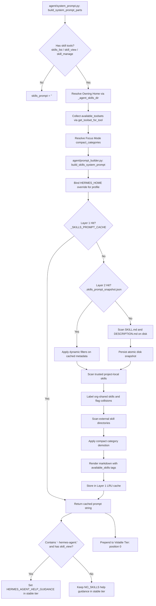
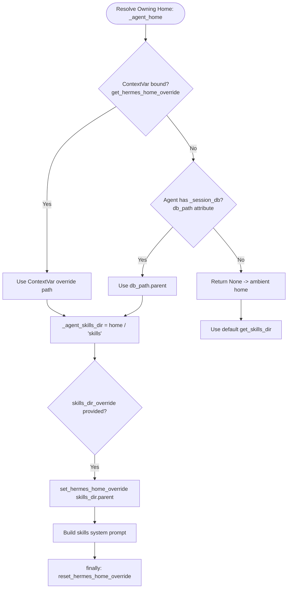
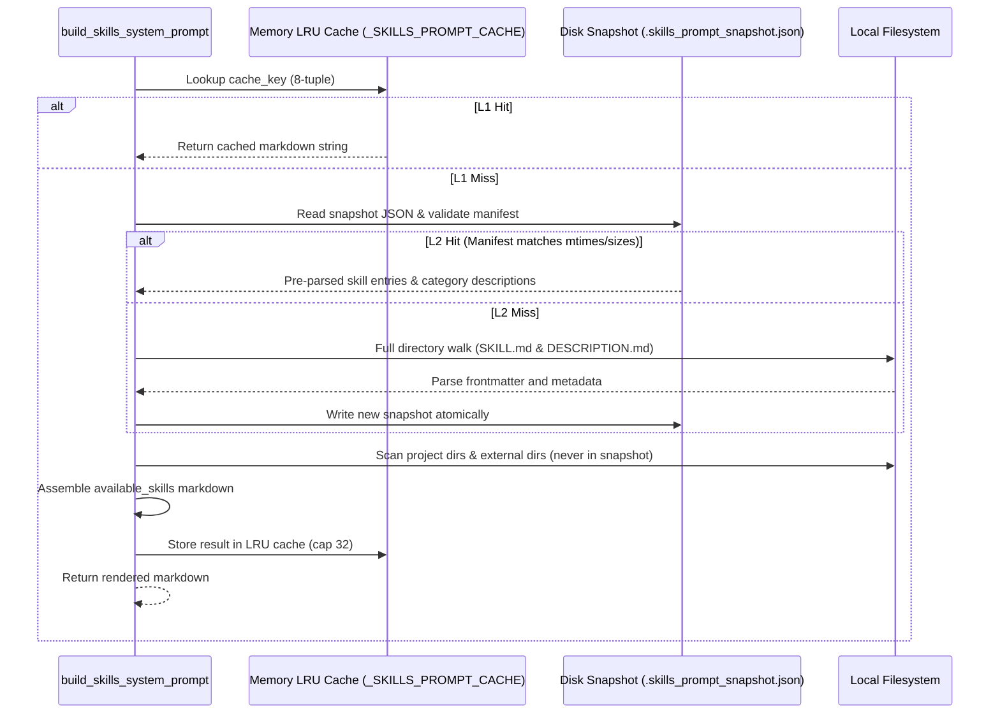

# Skills Prompt Mapping and Runtime Architecture

**Target Document:** `rust/analysis/skills-prompt-map.md`
**Scope:** Deep architectural mapping of skills-index generation from `agent/system_prompt.py` through `agent/prompt_builder.py`, `agent/skill_utils.py`, and runtime skill tools (`tools/skills_tool.py`, `tools/skill_manager_tool.py`).
**Mode:** Read-only analysis. No source code modified. No `cargo` commands run.

---

## 1. Executive Summary and System Invariants

The skills index introduces specialized domain workflows, tool instructions, and operational procedures into the agent's system prompt. It is loaded selectively based on the agent's active tool surface, filtered by runtime environment and platform compatibility, and cached across two tiers (in-memory LRU and disk snapshot).



### Core Invariants

1. **Volatile Tier Placement for Prefix Cache Stability:**
   In `agent/system_prompt.py:911-926`, `skills_prompt` is placed at the front of `volatile_parts` (position 0, ahead of memory and session timestamp). Skills are mutable at runtime (e.g. patched via `skill_manage`). Placing skills in the volatile band ensures that prompt rebuilds during compaction or session restore do not invalidate the cross-session stable prefix cache (`stable_parts`).
2. **Help Guidance Cross-Coupling:**
   In `agent/system_prompt.py:655-656`, when `skill_view` is present in `agent.valid_tool_names` and `"- hermes-agent:" in skills_prompt`, the stable tier slot `_help_guidance_slot` is updated from `HERMES_AGENT_HELP_GUIDANCE_NO_SKILLS` to `HERMES_AGENT_HELP_GUIDANCE`. This check relies strictly on string containment within the rendered skills index.
3. **Owning-Home Profile Isolation:**
   When building system prompts on background threads, ContextVars (such as `HERMES_HOME`) do not propagate across thread boundaries. The agent's owning home must resolve explicitly from `agent._session_db.db_path.parent` so that bot sessions do not leak the default profile's skills index.
4. **Project Precedence and Fail-Closed Quarantine:**
   Trusted project-local skills (`.hermes/skills`, `.agents/skills`) take highest precedence, shadowing profile-local skills with the same name. Untrusted or dangerous project skills are quarantined fail-closed.
5. **Fail-Loud Org Collisions:**
   When a personal skill and an org-shared skill share the same name, neither silently overwrites the other. Both are displayed with collision warning tags.
6. **Essential Skills Immunity:**
   The `hermes-agent` skill cannot be disabled via configuration. Disable requests targeting `hermes-agent` are ignored everywhere.

---

## 2. Call Path and Architecture

### 2.1 Python Call Path

The generation flow spans four primary source files:

| Source File | Function / Symbol | Role |
| :--- | :--- | :--- |
| `agent/system_prompt.py:619-648` | `build_system_prompt_parts` | Orchestrates gating, toolset extraction, focus mode, and calls skills prompt builder. |
| `agent/system_prompt.py:408-411` | `_agent_skills_dir` | Computes explicit `<home>/skills` path from agent session DB or ContextVar. |
| `agent/prompt_builder.py:1856-1919` | `build_skills_system_prompt` | Sets profile home override, discovers directories, manages fallback on missing directories. |
| `agent/prompt_builder.py:1921-2240` | `_build_skills_system_prompt_inner` | Implements two-layer caching, filtering, project/org merging, and markdown assembly. |
| `agent/skill_utils.py` | Metadata helpers | Handles frontmatter parsing, platform/environment matching, disabled config, and directory walking. |
| `tools/skills_tool.py` | `skills_list`, `skill_view` | Runtime tools exposed to model; uses shared discovery and metadata logic. |
| `tools/skill_manager_tool.py` | `skill_manage` | Runtime tool for skill mutation; calls `clear_skills_system_prompt_cache(clear_snapshot=True)`. |

### 2.2 System Prompt Assembly Gating

In `agent/system_prompt.py:619-648`:

```python
has_skills_tools = any(name in agent.valid_tool_names for name in ['skills_list', 'skill_view', 'skill_manage'])
if has_skills_tools:
    avail_toolsets = {
        toolset
        for toolset in (
            _r.get_toolset_for_tool(tool_name) for tool_name in agent.valid_tool_names
        )
        if toolset
    }
    _compact_cats = frozenset()
    try:
        from agent.coding_context import coding_compact_skill_categories
        _compact_cats = coding_compact_skill_categories(
            platform=agent.platform, cwd=resolve_context_cwd()
        )
    except Exception:
        _compact_cats = frozenset()
    skills_prompt = _r.build_skills_system_prompt(
        available_tools=agent.valid_tool_names,
        available_toolsets=avail_toolsets,
        compact_categories=_compact_cats or None,
        skills_dir_override=_agent_skills_dir(agent),
    )
else:
    skills_prompt = ""
```

---

## 3. Exact Inputs and Resolution Rules

`_build_skills_system_prompt_inner` consumes eight distinct inputs that form the Layer 1 cache key:

```python
cache_key = (
    str(skills_dir),
    tuple(str(d) for d in external_dirs),
    tuple(str(d) for d in project_dirs),
    tuple(sorted(str(t) for t in (available_tools or set()))),
    tuple(sorted(str(ts) for ts in (available_toolsets or set()))),
    _platform_hint,
    tuple(sorted(disabled)),
    tuple(sorted(compact_categories or ())),
)
```

### Detailed Input Breakdown

1. **`skills_dir: Path`**
   - Resolved from `skills_dir_override` if provided, else `hermes_constants.get_skills_dir()`.
   - Typically points to `<hermes_home>/skills` (or `<hermes_home>/profiles/<profile>/skills`).
2. **`external_dirs: list[Path]`**
   - Sourced from `get_all_skills_dirs()[1:]` (skipping index 0 which is `skills_dir`).
   - Sourced from `config.yaml: skills.external_dirs`.
   - Paths are expanded (`~` and `${VAR}`) and resolved. Non-existent directories are dropped.
3. **`project_dirs: list[Path]`**
   - Sourced from `agent/skill_utils.py:get_project_skills_dirs()`.
   - Searches upward from current working directory (up to 64 levels) for `.git` (directory or file).
   - Validates that the git repository root is in `skills.trusted_project_dirs`.
   - Resolves subdirectories `.hermes/skills` and `.agents/skills` under the trusted root.
4. **`available_tools: set[str] | None`**
   - Active tool names exposed to the agent (`agent.valid_tool_names`).
   - If `None`, conditional activation checks are bypassed (backward compatibility mode).
5. **`available_toolsets: set[str] | None`**
   - Unique set of toolset names mapped from `available_tools` via `get_toolset_for_tool(name)`.
6. **`_platform_hint: str`**
   - Active messaging platform hint (`agent/prompt_builder.py:_current_session_platform_hint`).
   - Checks `HERMES_PLATFORM`, `HERMES_SESSION_PLATFORM`, or `gateway.session_context.get_session_env("HERMES_SESSION_PLATFORM")`.
7. **`disabled: set[str]`**
   - Disabled skill names from `agent/skill_utils.py:get_disabled_skill_names(platform)`.
   - Union of global `skills.disabled` and platform-specific `skills.platform_disabled.<platform>`.
   - Always excludes `ESSENTIAL_SKILLS` (`{"hermes-agent"}`).
8. **`compact_categories: frozenset[str] | None`**
   - Categories demoted to names-only format in coding focus mode.
   - Sourced from `agent/coding_context.py:coding_compact_skill_categories(platform, cwd)`.
9. **`active_org: str | None` (Disk State)**
   - Read from `<skills_dir>/_org/.active_org`.
   - Controls which organization mirror under `_org/<org_id>` is indexed.

---

## 4. Owning-Home Selection and Thread Isolation

Prompt construction occurs in single-profile CLI runs, multi-profile gateways, and background worker threads. Python handles this via a strict precedence hierarchy:



### Precedence Details

1. **ContextVar Override (`get_hermes_home_override()`):**
   Highest priority. In `gateway/run.py`, multiple profiles share a single database, and each turn enters a profile scope via `_profile_runtime_scope` and `copy_context`.
2. **Session DB Path (`agent._session_db.db_path.parent`):**
   Ground truth for worker threads (`threading.Thread`). Because ContextVars do not propagate to newly spawned OS threads, unbound build threads look up the directory containing `state.db`. This prevents leaking the default profile into a bot session.
3. **Ambient Fallback (`None`):**
   Falls back to standard ambient configuration directory (`~/.hermes`).
4. **Scope Encapsulation in Builder:**
   When `skills_dir_override` is passed to `build_skills_system_prompt`, it calls `set_hermes_home_override(str(skills_dir.parent))` inside a `try ... finally` block. This guarantees that disk snapshot lookups (`_skills_prompt_snapshot_path`) and external directory resolutions operate within the profile directory rather than ambient global state.

---

## 5. Enabled and Disabled Filtering Pipeline

Skills pass through an eight-stage filtration pipeline before appearing in the generated prompt:

```
[All Candidates on Disk]
       │
       ▼ (Stage 1: Directory Exclusion)
Drop excluded directories (.git, .venv, node_modules, __pycache__, etc.)
and support subdirectories (references, templates, assets, scripts)
       │
       ▼ (Stage 2: Active Org Mirror Gating)
Prune _org/ unless .active_org marker matches _org/<active_org>
       │
       ▼ (Stage 3: Project Quarantine Check)
Scan project skills via tools.skills_guard (fail-closed if dangerous or scan error)
       │
       ▼ (Stage 4: Frontmatter Parsing & BOM Stripping)
Strip UTF-8 BOM, parse YAML frontmatter (fail-open on parse error)
       │
       ▼ (Stage 5: Host OS Platform Matching)
Match frontmatter 'platforms' against sys.platform (macos -> darwin, windows -> win32, termux)
       │
       ▼ (Stage 6: Runtime Environment Matching)
Match frontmatter 'environments' against active environment (kanban, docker, s6)
       │
       ▼ (Stage 7: Disabled Skills Configuration)
Check frontmatter 'name' or folder name against disabled set (immune: hermes-agent)
       │
       ▼ (Stage 8: Conditional Activation Rules)
Evaluate session_platforms, fallback_for_*, requires_* against active tools/toolsets
       │
       ▼
[Visible Entries]
```

### Filtering Stage Specifications

1. **Excluded Directories:**
   - Constant `EXCLUDED_SKILL_DIRS`: `.git`, `.github`, `.hub`, `.archive`, `.curator_backups`, `.venv`, `venv`, `node_modules`, `site-packages`, `__pycache__`, `.tox`, `.nox`, `.pytest_cache`, `.mypy_cache`, `.ruff_cache`.
   - Constant `SKILL_SUPPORT_DIRS`: `references`, `templates`, `assets`, `scripts`. When a directory contains `SKILL.md`, these subdirectories are excluded from candidate scans.
2. **Org Mirror Gating:**
   - Organization skills reside in `<skills_dir>/_org/<org_id>/`.
   - If `<skills_dir>/_org/.active_org` does not exist, `_org` is completely omitted.
   - If `.active_org` contains `org_id`, only `_org/<org_id>` is scanned; other organization mirrors are pruned.
3. **Project Quarantine:**
   - For skills in `project_dirs`, `is_quarantined_project_skill(skill_md)` executes security scanning (`tools.skills_guard.scan_skill_cached`).
   - If verdict is `"dangerous"` or scanning encounters an exception, the skill is quarantined (fail-closed) and excluded.
4. **Platform Compatibility (`platforms` frontmatter):**
   - Values: `macos` (mapped to `darwin`), `linux`, `windows` (mapped to `win32`).
   - Matched against `sys.platform.startswith(...)`.
   - Special case: `is_termux()` accepts `linux`, `termux`, or `android`.
   - Empty or missing `platforms` field defaults to all platforms supported.
5. **Environment Relevance (`environments` frontmatter):**
   - Known environments: `kanban`, `docker`, `s6`.
   - `kanban`: Active if `HERMES_KANBAN_TASK` or `HERMES_KANBAN_BOARD` is set and owned by dispatcher context, or if `_profile_has_kanban_toolset()` is true.
   - `docker`: Active if running in container (`is_container()`).
   - `s6`: Active if `/run/s6` or `/package/admin/s6-overlay` exists.
   - Unknown environment strings fail open (treated as matched).
   - Empty or missing `environments` defaults to all environments supported.
6. **Disabled Skills Configuration:**
   - Reads `skills.disabled` list and `skills.platform_disabled.<platform>` from `config.yaml`.
   - Supports raw string lists, JSON-encoded array strings (`'["a","b"]'`), and python literal array strings (`"['a']"`).
   - Subtraction: `(global_disabled | platform_disabled) - ESSENTIAL_SKILLS`.
   - If either frontmatter name or directory name matches, the skill is omitted.
7. **Conditional Activation Rules (`_skill_should_show`):**
   - Extracted from frontmatter `metadata.hermes`:
     - `session_platforms`: If specified and `_platform_hint` is non-empty, `_platform_hint.lower()` must be present. Unknown platform fails open.
     - `fallback_for_toolsets`: Hide skill if any listed toolset is in `available_toolsets`.
     - `fallback_for_tools`: Hide skill if any listed tool is in `available_tools`.
     - `requires_toolsets`: Hide skill if any listed toolset is missing from `available_toolsets`.
     - `requires_tools`: Hide skill if any listed tool is missing from `available_tools`.

---

## 6. Precedence, Org Mirroring, and Collision Semantics

When multiple sources contain skills, collisions are resolved deterministically:

| Tier | Precedence | Path Location | Index Tag | Collision Behavior |
| :--- | :---: | :--- | :--- | :--- |
| **Project-Local** | 1 (Highest) | `.hermes/skills/`, `.agents/skills/` | `[project]` | Shadows same-named profile-local skills. Shadowed profile entries are removed before org checks. |
| **Profile-Local** | 2 | `<home>/skills/<category>/<name>` | None | If name collides with org skill, listed as `[name collision ...]`. |
| **Org-Shared** | 2 | `<home>/skills/_org/<org_id>/<cat>/<name>` | `[org-shared: by <author>]` | Category rendered as `org:<org_id>`. If name collides with personal skill, listed as `[name collision ...]`. |
| **External Dirs** | 3 (Lowest) | Configured `skills.external_dirs` | None | Dropped if skill name already seen in project or profile local sets. |

### Fail-Loud Org Collision Logic

In `agent/prompt_builder.py:2052-2079`:
- Identifies whether each name is owned by personal, org, or both.
- If a name is present in both personal and org scopes:
  - Neither is suppressed.
  - Personal skill description prefix: `[name collision -- also exists in your org; load via category path]`.
  - Org skill description prefix: `[name collision -- also exists personally; load via category path]`.
  - At runtime, `skill_view` rejects bare unqualified names that have collisions, requiring a qualified category path.

---

## 7. Two-Layer Caching and Invalidation



### Layer 1: In-Process LRU Cache
- Stored in `_SKILLS_PROMPT_CACHE: OrderedDict[tuple, str]`.
- Max entries: `_SKILLS_PROMPT_CACHE_MAX = 32`.
- Lock: `_SKILLS_PROMPT_CACHE_LOCK = threading.Lock()`.
- Cache key: Exact 8-tuple capturing directories, tools, toolsets, platform, disabled skills, and compact categories.
- Eviction: Oldest entry popped when count exceeds 32.

### Layer 2: Disk Snapshot
- Stored at: `<hermes_home>/.skills_prompt_snapshot.json`.
- Version: `_SKILLS_SNAPSHOT_VERSION = 2`.
- Schema:
  ```json
  {
    "version": 2,
    "manifest": {
      "relative/path/SKILL.md": [1719999999000000000, 1024],
      "_org/.active_org": [1719999999, 12]
    },
    "skills": [
      {
        "skill_name": "pdf",
        "category": "productivity",
        "frontmatter_name": "pdf",
        "description": "Extract text and tables from PDF documents",
        "platforms": ["macos", "linux"],
        "conditions": { "requires_tools": ["terminal"] },
        "org_id": null,
        "org_author": null
      }
    ],
    "category_descriptions": {
      "productivity": "Document processing and office automation"
    }
  }
  ```
- Validation:
  - Reads manifest dictionary: mapping relative path to `[mtime_ns, size]` (or `[mtime_sec, size]` for `.active_org`).
  - Fast equality check: If disk manifest does not match snapshot manifest, snapshot is discarded.
- Invalidation Triggers (`clear_skills_system_prompt_cache(clear_snapshot=True)`):
  - Skill creation, edit, patch, or deletion (`tools/skill_manager_tool.py`).
  - Hub installation or uninstallation (`hermes_cli/skills_hub.py`).
  - Web server skill editor API routes (`hermes_cli/web_server.py`).
  - Memory / learning background mutations (`agent/learning_mutations.py`).
  - Session compaction and reset events (`agent/conversation_loop.py`).

---

## 8. Output Formatting and Markdown Structure

When skills exist, the generated block matches this template:

```markdown
## Skills
Before replying, scan the skills below. If a skill matches or is even partially relevant to your task, you MUST load it with skill_view(name) and follow its instructions. Err on the side of loading -- it is always better to have context you don't need than to miss critical steps, pitfalls, or established workflows. Skills contain specialized knowledge -- API endpoints, tool-specific commands, and proven workflows that outperform general-purpose approaches. Load the skill even if you think you could handle the task with basic tools like <BASIC_TOOLS>. Skills also encode the user's preferred approach, conventions, and quality standards for tasks like code review, planning, and testing -- load them even for tasks you already know how to do, because the skill defines how it should be done here.
If a skill has issues, fix it with skill_manage(action='patch').
After difficult/iterative tasks, offer to save as a skill. If a skill you loaded was missing steps, had wrong commands, or needed pitfalls you discovered, update it before finishing.

<available_skills>
  <category-1>: <optional category description from DESCRIPTION.md>
    - <skill-name-1>: <skill description truncated to 60 chars>
    - <skill-name-2>
  <category-2> [names only]: <name-a>, <name-b>
</available_skills>

Only proceed without loading a skill if genuinely none are relevant to the task.<HIDDEN_NOTE>
```

### Detailed Template Elements

1. **`<BASIC_TOOLS>` Dynamic Substitution:**
   - If `available_tools` contains `"web_search"`: `"web_search or terminal"`.
   - Otherwise: `"terminal"`.
2. **Category Ordering:**
   - Categories are sorted alphabetically (`sorted(skills_by_category.keys())`).
3. **Category Header Rendering:**
   - If `DESCRIPTION.md` exists and provides a description: `  <category>: <cat_desc>`.
   - Otherwise: `  <category>:`.
4. **Demoted Categories (`compact_categories`):**
   - For categories where `category.split('/', 1)[0]` matches `compact_categories`:
     `  <category> [names only]: <sorted_comma_separated_names>`
   - Individual skill lines and descriptions are omitted.
5. **Skill Line Rendering:**
   - Deduplicated and sorted by skill name within category.
   - If description present: `    - <name>: <desc>`.
   - If description empty: `    - <name>`.
6. **Description Truncation:**
   - Limit: `SKILL_PROMPT_DESC_LIMIT = 60`.
   - If normalized description length exceeds 60 characters: `desc[:57] + "..."`.
7. **`<HIDDEN_NOTE>` Suffix:**
   - If any category was demoted to `[names only]`:
     `\n(Categories marked [names only] are outside the current coding context, so their descriptions are omitted -- the skills work normally and load with skill_view(name) as usual.)`
   - Otherwise empty string.
8. **Empty State:**
   - If no categories or skills remain, returns `""` (empty string).

---

## 9. Failure Handling and Resilience Matrix

| Failure Mode | Location | Handling Strategy | Operational Consequence |
| :--- | :--- | :--- | :--- |
| Missing SKILL.md UTF-8 BOM | `agent/skill_utils.py:196` | Strips single leading `\ufeff`. | Prevents Windows Notepad from breaking frontmatter fence detection. |
| Malformed Frontmatter YAML | `agent/skill_utils.py:215` | Fallback to line-by-line `key: value` parsing. | Basic fields recovered even on syntax errors. |
| Unreadable SKILL.md File | `agent/prompt_builder.py:1790` | Catches `Exception`, returns `(True, {}, "")`. | Fail-open: skill remains visible in index so model can attempt loading or patching it. |
| Missing / Bad DESCRIPTION.md | `agent/prompt_builder.py:2093` | Catches `Exception`, logs debug. | Fail-silent: category renders header without description string. |
| Broken Snapshot JSON | `agent/prompt_builder.py:1679` | Catches `Exception`, returns `None`. | Fail-soft: transparently falls back to cold filesystem walk. |
| Snapshot Manifest Mismatch | `agent/prompt_builder.py:1685` | Compares mtime and size dictionary. | Stale snapshot discarded; filesystem re-scanned. |
| Snapshot Disk Write Failure | `agent/prompt_builder.py:1705` | Catches `Exception`, logs debug. | Process continues without disk cache; Layer 1 memory cache still functions. |
| Dangerous Project Skill | `agent/skill_utils.py:945` | Scans via `skills_guard`, detects verdict. | Fail-closed: dangerous repo skill excluded from prompt index. |
| Project Skill Scan Crash | `agent/skill_utils.py:953` | Catches `Exception`, logs warning. | Fail-closed: scan failure treats project skill as quarantined. |
| External Skill Read Failure | `agent/prompt_builder.py:2138` | Catches `Exception`, logs debug. | Faulty external skill skipped; rest of index intact. |
| Coding Context Query Failure | `agent/system_prompt.py:639` | Catches `Exception`, returns `frozenset()`. | Fail-open: focus mode disabled; all categories render full descriptions. |

---

## 10. Existing Python Test Suite

The Python test suite covers prompt generation across multiple levels:

### Prompt Builder Tests (`tests/agent/test_prompt_builder.py`)
- `test_deduplicates_skills` (L316): Verifies duplicate skill directories under a category render only once.
- `test_compact_categories_demote_nested_and_miss_cache_separately` (L328): Tests `[names only]` demotion for nested categories and validates cache key separation between compacted and full views.
- `test_excludes_disabled_skills` (L350): Confirms skills in disabled list do not render.
- `test_rebuilds_prompt_when_disabled_skills_change` (L379): Confirms cache bust when `config.yaml` disabled list changes.
- `test_requires_skill_hidden_when_toolset_missing` (L1013): Tests `metadata.hermes.requires_toolsets` condition.
- `test_no_args_shows_all_skills` (L1028): Tests backward compatibility when tools and toolsets are omitted.

### System Prompt Volatile Band Tests (`tests/agent/test_system_prompt.py`)
- `test_skills_not_in_stable_band` (L521): Asserts skills index does not appear in `parts["stable"]`.
- `test_skills_lead_the_volatile_band` (L525): Asserts `parts["volatile"].startswith(skills_prompt)`.
- `test_full_order_is_stable_context_then_skills` (L529): Validates overall concatenation order (`stable` -> `context` -> `skills` -> `memory` -> `timestamp`).

### Profile Isolation Tests
- `tests/agent/test_bot_profile_prompt_isolation.py:26`: `test_skills_prompt_scoped_to_override_not_ambient_home` confirms explicit `skills_dir_override` prevents leaking default profile skills on bare threads.
- `tests/agent/test_bot_profile_prompt_isolation.py:67`: `test_agent_home_resolves_from_session_db_path` confirms owning home lookup from `session_db.db_path`.
- `tests/agent/test_profile_home_override_precedence.py:101`: `test_full_prompt_scoped_to_bot_on_bare_thread` tests end-to-end prompt assembly on an unbound worker thread.

### Multi-Tier and Boundary Tests
- `tests/agent/test_org_skill_namespace.py`: Tests org mirror labeling (`[org-shared]`), author attribution (`.org-provenance.json`), and fail-loud collision detection (`[name collision]`).
- `tests/agent/test_project_skills.py`: Tests git repository discovery (`find_project_root`), trust verification (`trusted_project_dirs`), and untrusted notifications.
- `tests/agent/test_skill_session_platform_gate.py`: Tests channel-specific gating via `metadata.hermes.session_platforms`.
- `tests/agent/test_external_skills.py`: Tests resolution of `skills.external_dirs` and precedence over external duplicates.
- `tests/agent/test_skill_utils.py`: Tests BOM stripping, config list parsing (`#86661`), description truncation, and cache invalidation.

---

## 11. Current Rust Integration and Actionable Gaps

### 11.1 Current State in `rust/crates/hermes-gateway/`

1. **`ResolvedPromptSections`:**
   In `rust/crates/hermes-gateway/src/system_prompt.rs:370`:
   ```rust
   pub struct ResolvedPromptSections {
       ...
       pub skills: Option<String>,
       ...
   }
   ```
   In `ResolvedPromptSections::assemble` (L637-645), `self.skills` is correctly placed at index 0 of the `volatile` section.
2. **`StableGuidance` & Help Guidance Cross-Coupling:**
   In `rust/crates/hermes-gateway/src/system_prompt.rs:247-276`:
   ```rust
   pub struct StableGuidance<'a> {
       ...
       pub skills_index: &'a str,
       ...
   }
   ```
   `stable_guidance` checks:
   ```rust
   if has("skill_view") && input.skills_index.contains("- hermes-agent:") {
       "HERMES_AGENT_HELP_GUIDANCE"
   } else {
       "HERMES_AGENT_HELP_GUIDANCE_NO_SKILLS"
   }
   ```
3. **Existing Renderer vs Missing Loader:**
   `rust/crates/hermes-gateway/src/skills_index.rs` already provides `pub struct Index` and `pub fn render(&self) -> String` using embedded template `rust/tools/skills-index-template.json`. It assumes entries have already been loaded, filtered, and categorized.
   There is currently **no skills loader in Rust**. The `skills: Option<String>` in `ResolvedPromptSections` and `skills_index: &'a str` in `StableGuidance` have no native producer. In test harnesses, they are supplied as hardcoded mocks or empty strings. The loader must discover files on disk, evaluate environments and platform gates, check disabled lists, resolve owning homes, manage two-layer caches, and populate `Index` (or produce the rendered prompt string).

### 11.2 Actionable Implementation Gaps

To achieve full parity with the Python implementation, the Rust port requires the following components:

#### Gap 1: Skills Directory Scanner and Frontmatter Parser
- Recursive directory walker for `skills_dir`, handling symlinks and skipping `EXCLUDED_SKILL_DIRS` and `SKILL_SUPPORT_DIRS`.
- Markdown frontmatter splitter with UTF-8 BOM removal and robust YAML parsing.
- Extraction of `name`, `description` (with 60-character truncation), `platforms`, `environments`, and `metadata.hermes` activation conditions.

#### Gap 2: Owning-Home and Multi-Tier Directory Resolver
- Explicit profile home resolution matching `_agent_home` (ContextVar equivalent or session DB path).
- Resolver for `skills.external_dirs` from `config.yaml`.
- Git root locator (`find_project_root`) walking upward up to 64 levels for `.git` (file or directory).
- Git trust evaluator checking `skills.trusted_project_dirs` and candidate directories (`.hermes/skills`, `.agents/skills`).
- Scanner for active org mirror `<skills_dir>/_org/<active_org>` using `.active_org` marker.

#### Gap 3: Multi-Stage Filter Engine
- Host OS mapper matching target OS against `platforms` (`macos` -> `darwin`, `windows` -> `win32`, `linux`).
- Environment detection for `docker` (`/.dockerenv` or cgroups) and `s6` (`/run/s6`, `/package/admin/s6-overlay`).
- Disabled skills parser for `skills.disabled` and `skills.platform_disabled.<platform>` from `config.yaml`, ensuring `hermes-agent` immunity.
- Conditional activation evaluator for `fallback_for_*`, `requires_*`, and `session_platforms`.

#### Gap 4: Precedence, Provenance, and Collision Resolver
- Precedence pipeline: Project-local > Profile-local > Org-shared > External.
- Tag generator for `[project]` and `[org-shared: by <author>]`.
- Detection of name collisions between personal and org skills, adding `[name collision ...]` flags to both entries.

#### Gap 5: Two-Layer Cache Architecture
- In-memory thread-safe LRU cache (capacity 32) keyed by the 8-tuple equivalent.
- Disk snapshot serializer/deserializer (`.skills_prompt_snapshot.json`, version 2) with manifest verification based on `(mtime, size)`.
- Cache invalidation helper callable from future tool mutation hooks.

#### Gap 6: Prompt Markdown Formatter
- Markdown formatter outputting `## Skills`, `<available_skills>`, and dynamic footer.
- Focus mode formatter demoting designated categories to `  <category> [names only]: <names>` with explanatory footnote.
- Dynamic tool phrasing (`"web_search or terminal"` vs `"terminal"`).

---

## 12. Rust Architecture Blueprint

### 12.1 Proposed Module Structure

A clean, modular structure within `hermes-gateway` (or an auxiliary crate `hermes-skills`):

```text
rust/crates/hermes-gateway/src/
├── skills/
│   ├── mod.rs             // Public facade: SkillsPromptLoader, SkillsIndexOutput
│   ├── frontmatter.rs     // YAML frontmatter extraction, BOM stripping, normalization
│   ├── conditions.rs      // Platform, environment, and toolset conditional filtering
│   ├── discovery.rs       // Multi-tier scanning: project, profile local, org, external
│   ├── snapshot.rs        // Disk snapshot (v2) serializer & mtime manifest validator
│   ├── cache.rs           // In-memory thread-safe LRU cache (cap 32)
│   ├── format.rs          // Markdown index formatting, demoted categories, dynamic text
│   └── quarantine.rs      // Project skill quarantine hooks
```

### 12.2 Loader Contract

```rust
pub struct SkillsPromptInputs<'a> {
    pub skills_dir: &'a std::path::Path,
    pub external_dirs: &'a [std::path::PathBuf],
    pub project_dirs: &'a [std::path::PathBuf],
    pub available_tools: Option<&'a std::collections::BTreeSet<String>>,
    pub available_toolsets: Option<&'a std::collections::BTreeSet<String>>,
    pub platform: &'a str,
    pub disabled: &'a std::collections::BTreeSet<String>,
    pub compact_categories: Option<&'a std::collections::BTreeSet<String>>,
}

pub struct SkillsPromptOutput {
    pub prompt: String,
    pub has_hermes_agent: bool,
}

pub trait SkillsPromptLoader: Send + Sync {
    fn build_skills_prompt(&self, inputs: &SkillsPromptInputs<'_>) -> SkillsPromptOutput;
    fn clear_cache(&self, clear_snapshot: bool);
}
```

This design provides a direct drop-in replacement for `agent/prompt_builder.py:build_skills_system_prompt`, feeding directly into `ResolvedPromptSections.skills` and `StableGuidance.skills_index` in `rust/crates/hermes-gateway/src/system_prompt.rs`.
