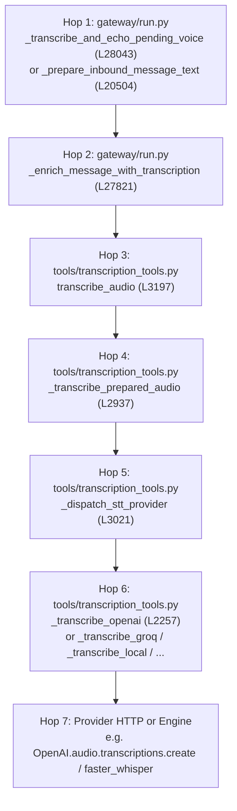
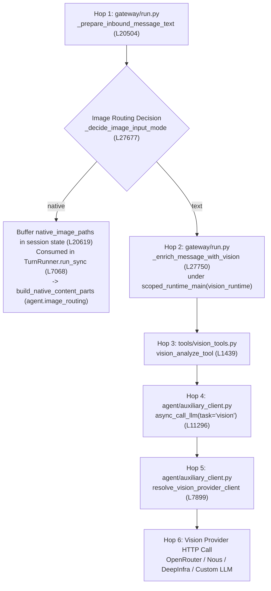

> VERIFICATION (main agent, 2026-09-06): agy-generated. Its Python-side call
> tracing is a useful lead but UNVERIFIED; check every def against source before
> use. Its "existing Rust counterpart" claims are partly wrong: `runner_vision.rs`
> does NOT exist, `build_native_content_parts` is in message.rs/native_image_content.rs
> (not image_routing.rs), and `prepare_inbound_message_text` does NOT exist (agy
> hedged "dispatch.rs or runner turn loop"). `VisionBackend` in vision_enrichment.rs
> and the enrichment/routing module names ARE real. Treat proposed target files as
> proposals, not facts.

# Gateway STT and Vision Enrichment Runner Integration Seam

This document maps precisely where and how `gateway/run.py` (`GatewayRunner`) invokes speech-to-text (STT) audio transcription and image/vision enrichment on inbound messages, tracing through all intermediate layers down to network/provider dispatch, detailing state mutations, and assessing corresponding Rust counterparts in `rust/crates/hermes-gateway/src/`.

---

## 1. Call Site Inventory in `gateway/run.py`

Every call site in `gateway/run.py` that initiates, coordinates, or executes STT transcription or vision enrichment on inbound messages is documented below.

### Summary Table

| # | Enclosing Method | Method Def Line | Callee | Callee Def Line & Module | Purpose / Execution Path |
|---|---|---|---|---|---|
| **1** | `_prepare_busy_steer_text` | `11236` | `self._transcribe_and_echo_pending_voice` | `28043` (`gateway.run`) | Transcribe voice follow-up mid-run for `agent.steer()` injection |
| **2** | `_handle_active_session_busy_message` | `11273` | `self._transcribe_and_echo_pending_voice` | `28043` (`gateway.run`) | Transcribe voice follow-up for immediate `agent.interrupt()` |
| **3** | `_handle_message` | `18798` | `self._transcribe_and_echo_pending_voice` | `28043` (`gateway.run`) | Priority interrupt on active session during early routing |
| **4** | `_prepare_inbound_message_text` | `20504` | `self._decide_image_input_mode` | `27677` (`gateway.run`) | Route images: `"native"` (pixel attach) vs `"text"` (pre-analyze) |
| **5** | `_prepare_inbound_message_text` | `20504` | `self._enrich_message_with_vision` | `27750` (`gateway.run`) | Text-mode image enrichment (pre-analyzes attached images) |
| **6** | `_prepare_inbound_message_text` | `20504` | `self._enrich_message_with_transcription` | `27821` (`gateway.run`) | Cold-path and queued-turn voice transcription enrichment |
| **7** | `_prepare_inbound_message_text` | `20504` | `_echo_adapter.send` | `gateway.platforms.base` | Echo raw transcript back to user (`🎙️ "{tx}"`) |
| **8** | `_prepare_clarify_reply_text` | `20952` | `self._transcribe_pending_audio_event_once` | `27972` (`gateway.run`) | Transcribe voice answer to active clarify prompt |
| **9** | `_run_background_task_inner` | `25489` | `self._enrich_message_with_vision` | `27750` (`gateway.run`) | Enrich background-task prompt with image descriptions |
| **10** | `_enrich_message_with_vision` | `27750` | `vision_analyze_tool` | `tools.vision_tools:1439` | Execute vision tool per image path |
| **11** | `_enrich_message_with_transcription` | `27821` | `transcribe_audio` | `tools.transcription_tools:3197` | Primary STT provider call via worker thread |
| **12** | `_enrich_message_with_transcription` | `27821` | `transcribe_audio_local_fallback` | `tools.transcription_tools:3270` | Fallback STT call on configured provider failure |
| **13** | `_transcribe_pending_audio_event_once` | `27972` | `self._enrich_message_with_transcription` | `27821` (`gateway.run`) | Cached event-level single transcription |
| **14** | `_transcribe_and_echo_pending_voice` | `28043` | `self._transcribe_pending_audio_event_once` | `27972` (`gateway.run`) | Unified STT helper: executes cached transcription |
| **15** | `_transcribe_and_echo_pending_voice` | `28043` | `self._echo_pending_stt_transcripts_once` | `28002` (`gateway.run`) | Unified STT helper: echoes unsent transcripts to chat |
| **16** | `monitor_for_interrupt` (in `_run_agent_inner`) | `32010` (nested in `31314`) | `self._transcribe_and_echo_pending_voice` | `28043` (`gateway.run`) | Primary 200ms interrupt poller transcribing pending voice |
| **17** | `_run_agent_inner` (unlimited backup poller) | `31314` | `self._transcribe_and_echo_pending_voice` | `28043` (`gateway.run`) | Backup interrupt check in turn polling loop |
| **18** | `_run_agent_inner` (bounded backup poller) | `31314` | `self._transcribe_and_echo_pending_voice` | `28043` (`gateway.run`) | Backup interrupt check in timeout-bounded turn loop |
| **19** | `_run_agent_inner` (post-turn pending drain) | `31314` | `self._transcribe_and_echo_pending_voice` | `28043` (`gateway.run`) | Post-turn drain transcribing dequeued voice message |
| **20** | `TurnRunner.run_sync` | `5934` | `self._runner._consume_pending_native_image_paths` | `20966` (`gateway.run`) | Consumes native image paths buffered by `_prepare_inbound_message_text` |
| **21** | `TurnRunner.run_sync` | `5934` | `build_native_content_parts` | `agent.image_routing:176` | Wraps user turn into OpenAI-format multimodal content parts |

---

### Detailed Verification of Call Sites

#### 1. Busy Steer Preprocessing
- **Enclosing method**:
  ```python
  # gateway/run.py:11236
  async def _prepare_busy_steer_text(self, event: MessageEvent) -> str:
  ```
- **Call site** (line 11262):
  ```python
  enriched_text, successful_transcripts = await self._transcribe_and_echo_pending_voice(
      event,
      adapter,
      event.source,
      text,
      log_context="Busy-steer",
  )
  ```
- **Callee**: `GatewayRunner._transcribe_and_echo_pending_voice` (`gateway.run`, line 28043).

#### 2. Active Session Busy Interrupt
- **Enclosing method**:
  ```python
  # gateway/run.py:11273
  async def _handle_active_session_busy_message(self, event: MessageEvent, session_key: str) -> bool:
  ```
- **Call site** (lines 11548–11554):
  ```python
  if self._pending_event_audio_paths(event):
      _interrupt_text, _ = await self._transcribe_and_echo_pending_voice(
          event,
          adapter,
          event.source,
          event.text or "",
          log_context="Voice-busy-interrupt",
      )
  ```
- **Callee**: `GatewayRunner._transcribe_and_echo_pending_voice` (`gateway.run`, line 28043).

#### 3. Priority Interrupt on Cold Path
- **Enclosing method**:
  ```python
  # gateway/run.py:18798
  async def _handle_message(self, event: MessageEvent) -> Optional[str]:
  ```
- **Call site** (lines 19606–19612):
  ```python
  if self._pending_event_audio_paths(event):
      _interrupt_text, _ = await self._transcribe_and_echo_pending_voice(
          event,
          self._adapter_for_source(source),
          source,
          event.text or "",
          log_context="Voice-priority-interrupt",
      )
  ```
- **Callee**: `GatewayRunner._transcribe_and_echo_pending_voice` (`gateway.run`, line 28043).

#### 4. Primary Inbound Message Preparation Pipeline
- **Enclosing method**:
  ```python
  # gateway/run.py:20504
  async def _prepare_inbound_message_text(
      self,
      *,
      event: MessageEvent,
      source: SessionSource,
      history: List[Dict[str, Any]],
      session_key: Optional[str] = None,
  ) -> Optional[str]:
  ```
- **Image routing decision** (lines 20610–20614):
  ```python
  _img_mode = await asyncio.to_thread(
      self._decide_image_input_mode,
      source=source,
      session_key=session_key,
  )
  ```
  Callee: `GatewayRunner._decide_image_input_mode` (`gateway.run`, line 27677).
- **Vision enrichment invocation** (lines 20648–20652):
  ```python
  with scoped_runtime_main(vision_runtime):
      message_text = await self._enrich_message_with_vision(
          message_text,
          image_paths,
      )
  ```
  Callee: `GatewayRunner._enrich_message_with_vision` (`gateway.run`, line 27750).
- **Audio transcription invocation** (lines 20654–20658):
  ```python
  if audio_paths:
      message_text, _successful_transcripts = await self._enrich_message_with_transcription(
          message_text,
          audio_paths,
      )
  ```
  Callee: `GatewayRunner._enrich_message_with_transcription` (`gateway.run`, line 27821).
- **Transcript echo** (lines 20663–20673):
  ```python
  if _successful_transcripts and self._should_echo_stt_transcripts():
      _echo_adapter = self._adapter_for_source(source)
      _echo_meta = self._thread_metadata_for_source(source, self._reply_anchor_for_event(event))
      if _echo_adapter:
          for _tx in _successful_transcripts:
              await _echo_adapter.send(
                  source.chat_id,
                  f'🎙️ "{_tx}"',
                  metadata=_echo_meta,
              )
  ```
  Callee: `BasePlatformAdapter.send` (`gateway.platforms.base`).

#### 5. Interactive Clarify Response
- **Enclosing method**:
  ```python
  # gateway/run.py:20952
  async def _prepare_clarify_reply_text(self, event) -> str:
  ```
- **Call site** (lines 20957–20959):
  ```python
  _, successful_transcripts = await self._transcribe_pending_audio_event_once(
      event, "",
  )
  ```
  Callee: `GatewayRunner._transcribe_pending_audio_event_once` (`gateway.run`, line 27972).

#### 6. Background Task Vision Enrichment
- **Enclosing method**:
  ```python
  # gateway/run.py:25489
  async def _run_background_task_inner(
      self,
      prompt: str,
      source: "SessionSource",
      task_id: str,
      event_message_id: Optional[str] = None,
      media_urls: Optional[List[str]] = None,
      media_types: Optional[List[str]] = None,
  ) -> None:
  ```
- **Call site** (lines 25555–25557):
  ```python
  enriched_prompt = await self._enrich_message_with_vision(
      prompt, image_paths,
  )
  ```
  Callee: `GatewayRunner._enrich_message_with_vision` (`gateway.run`, line 27750). Note: background tasks do not run STT; only image enrichment is performed.

#### 7. Vision Enrichment Worker
- **Enclosing method**:
  ```python
  # gateway/run.py:27750
  async def _enrich_message_with_vision(
      self,
      user_text: str,
      image_paths: List[str],
  ) -> str:
  ```
- **Call site** (lines 27786–27789):
  ```python
  result_json = await vision_analyze_tool(
      image_url=path,
      user_prompt=analysis_prompt,
  )
  ```
  Callee: `tools.vision_tools.vision_analyze_tool` (line 1439).

#### 8. Transcription Worker
- **Enclosing method**:
  ```python
  # gateway/run.py:27821
  async def _enrich_message_with_transcription(
      self,
      user_text: str,
      audio_paths: List[str],
  ) -> tuple[str, List[str]]:
  ```
- **Call sites** (lines 27886–27894):
  ```python
  result = await asyncio.to_thread(
      transcribe_audio, path, None, "gateway",
  )
  if not result.get("success"):
      fallback = await asyncio.to_thread(
          transcribe_audio_local_fallback,
          path,
      )
  ```
  Callees: `tools.transcription_tools.transcribe_audio` (line 3197) and `tools.transcription_tools.transcribe_audio_local_fallback` (line 3270).

#### 9. Cached Pending Event Audio Transcription
- **Enclosing method**:
  ```python
  # gateway/run.py:27972
  async def _transcribe_pending_audio_event_once(
      self,
      event,
      user_text: Optional[str] = None,
  ) -> tuple[str | None, List[str]]:
  ```
- **Call site** (lines 27994–27997):
  ```python
  enriched_text, successful_transcripts = await self._enrich_message_with_transcription(
      text,
      audio_paths,
  )
  ```
  Callee: `GatewayRunner._enrich_message_with_transcription` (`gateway.run`, line 27821).

#### 10. Unified Helper: Transcribe and Echo
- **Enclosing method**:
  ```python
  # gateway/run.py:28043
  async def _transcribe_and_echo_pending_voice(
      self,
      event,
      adapter,
      source,
      text: str,
      *,
      log_context: str,
      metadata=_UNSET,
  ) -> tuple[str, List[str]]:
  ```
- **Call sites** (lines 28067–28082):
  ```python
  enriched_text, transcripts = await self._transcribe_pending_audio_event_once(
      event,
      text,
  )
  ...
  await self._echo_pending_stt_transcripts_once(
      event,
      adapter,
      source,
      transcripts,
      metadata=echo_meta,
      log_context=log_context,
  )
  ```
  Callees: `self._transcribe_pending_audio_event_once` (line 27972) and `self._echo_pending_stt_transcripts_once` (line 28002).

#### 11. Interrupt Monitor Poller
- **Enclosing method**:
  ```python
  # gateway/run.py:32010 (closure within _run_agent_inner, line 31314)
  async def monitor_for_interrupt():
  ```
- **Call site** (lines 32049–32056):
  ```python
  pending_text, _ = await self._transcribe_and_echo_pending_voice(
      _peek_event,
      _adapter,
      source,
      pending_text,
      log_context="Voice-interrupt",
      metadata={"thread_id": source.thread_id} if source.thread_id else None,
  )
  ```
  Callee: `GatewayRunner._transcribe_and_echo_pending_voice` (`gateway.run`, line 28043).

#### 12. Backup Interrupt and Post-Turn Drain in Agent Polling Loop
- **Enclosing method**:
  ```python
  # gateway/run.py:31314
  async def _run_agent_inner(
      self,
      message: str,
      context_prompt: str,
      history: List[Dict[str, Any]],
      source: SessionSource,
      session_id: str,
      session_key: str = None,
      ...
  ) -> Dict[str, Any]:
  ```
- **Backup check 1 (unlimited loop)** (lines 32331–32338):
  ```python
  _bp_text, _ = await self._transcribe_and_echo_pending_voice(
      _bp_event,
      _backup_adapter,
      source,
      _bp_text or "",
      log_context="Voice-backup-interrupt",
      metadata={"thread_id": source.thread_id} if source.thread_id else None,
  )
  ```
- **Backup check 2 (timeout-bounded loop)** (lines 32433–32440):
  ```python
  _bp_text, _ = await self._transcribe_and_echo_pending_voice(
      _bp_event,
      _backup_adapter,
      source,
      _bp_text or "",
      log_context="Voice-backup-interrupt",
      metadata={"thread_id": source.thread_id} if source.thread_id else None,
  )
  ```
- **Post-turn pending drain** (lines 32619–32626):
  ```python
  pending, _ = await self._transcribe_and_echo_pending_voice(
      pending_event,
      adapter,
      source,
      _pending_text,
      log_context="Voice-drain",
      metadata={"thread_id": source.thread_id} if source.thread_id else None,
  )
  ```
  Callee: `GatewayRunner._transcribe_and_echo_pending_voice` (`gateway.run`, line 28043).

#### 20 & 21. Native Image Consumption & Attachment
- **Enclosing method**:
  ```python
  # gateway/run.py:5934
  def run_sync(self):
  ```
- **Call sites** (lines 7068–7075):
  ```python
  _native_imgs = self._runner._consume_pending_native_image_paths(ctx.session_key)
  if _native_imgs:
      from agent.image_routing import build_native_content_parts
      _parts, _skipped = build_native_content_parts(
          ctx.message,
          _native_imgs,
      )
  ```
  Callees: `GatewayRunner._consume_pending_native_image_paths` (`gateway.run`, line 20966) and `agent.image_routing.build_native_content_parts` (`agent/image_routing.py`, line 176).

---

## 2. Transcription Entry Point Tracing

Trace from the `gateway/run.py` call site down to the physical STT provider request.

### Call Chain Hops



#### Hop 1: Gateway Inbound Call Sites
- Callers: `_prepare_busy_steer_text` (line 11262), `_handle_active_session_busy_message` (line 11548), `_handle_message` (line 19606), `_prepare_inbound_message_text` (line 20655), `monitor_for_interrupt` (line 32049), `_run_agent_inner` (lines 32331, 32433, 32619).
- Intermediate caching: `_transcribe_and_echo_pending_voice` (line 28043) delegates to `_transcribe_pending_audio_event_once` (line 27972), which caches the result on the event (`_gateway_pending_stt_text`, `_gateway_pending_stt_transcripts`).

#### Hop 2: `GatewayRunner._enrich_message_with_transcription`
- **File & Def**: `gateway/run.py:27821`:
  ```python
  async def _enrich_message_with_transcription(self, user_text: str, audio_paths: List[str]) -> tuple[str, List[str]]:
  ```
- **Actions**:
  1. Deduplicates `audio_paths` preserving order.
  2. If `config.stt_enabled` is false, runs `_probe_audio_duration` (line 27849) on each path and returns formatted placeholder notes `[The user sent a voice message: ... (duration: ...)]`.
  3. Imports `tools.transcription_tools.transcribe_audio` (line 27867). If `ModuleNotFoundError`, returns `[voice message could not be transcribed]`.
  4. Calls `await asyncio.to_thread(transcribe_audio, path, None, "gateway")` (line 27886).
  5. On failure, calls `await asyncio.to_thread(transcribe_audio_local_fallback, path)` (line 27890).
  6. On success, inspects `result["transcript"]`. If empty/whitespace, emits the silence sentinel (line 27909). Otherwise appends raw transcript and formats enriched quote `f'"{transcript}"'` (line 27921).
  7. On error, formats `[voice message could not be transcribed automatically; the audio is available at: {agent_path}]` using `tools.credential_files.to_agent_visible_cache_path` (line 27936).

#### Hop 3: `tools.transcription_tools.transcribe_audio`
- **File & Def**: `tools/transcription_tools.py:3197`:
  ```python
  def transcribe_audio(file_path: str, model: Optional[str] = None, source: Optional[str] = None) -> Dict[str, Any]:
  ```
- **Actions**:
  1. Checks security read block: `agent.file_safety.get_read_block_error(file_path)` (line 3212). Refuses to read credentials/secrets.
  2. Validates source file: `_validate_audio_source_file` (line 3221).
  3. Preprocesses input: `_prepare_audio_for_transcription` (line 3225) converts silk/special containers in a temporary directory.
  4. Validates output file: `_validate_audio_file(prepared_path)` (line 3236).
  5. Calls `_transcribe_prepared_audio(prepared_path, model, source)` (line 3239).

#### Hop 4: `tools.transcription_tools._transcribe_prepared_audio`
- **File & Def**: `tools/transcription_tools.py:2937`:
  ```python
  def _transcribe_prepared_audio(file_path: str, model: Optional[str] = None, source: Optional[str] = None) -> Dict[str, Any]:
  ```
- **Actions**:
  1. Re-applies read safety guard (`get_read_block_error`).
  2. Loads STT configuration: `stt_config = _load_stt_config()` (line 2980).
  3. Checks `is_stt_enabled(stt_config)` (line 2981).
  4. Resolves provider: `provider = _get_provider(stt_config)` (line 2988).
  5. Enforces upload size cap for non-local providers: `_validate_audio_file_size` (line 2990).
  6. Converts `.caf` files to `.wav` for cloud providers (line 2994).
  7. Trims client-side silence for cloud providers: `_trim_silence_for_cloud_stt` (line 3008).
  8. Dispatches: `_dispatch_stt_provider(file_path, provider, stt_config, model, source)` (line 3015).

#### Hop 5: `tools.transcription_tools._dispatch_stt_provider`
- **File & Def**: `tools/transcription_tools.py:3021`:
  ```python
  def _dispatch_stt_provider(file_path: str, provider: str, stt_config: Dict[str, Any], model: Optional[str] = None, source: Optional[str] = None) -> Dict[str, Any]:
  ```
- **Actions**:
  1. Resolves static transcription prompt (`stt.prompt`).
  2. Runs `pre_transcription` plugin hook: `_apply_pre_transcription_hook` (line 3043).
  3. Enforces prompt length limit: `_enforce_prompt_length_limit` (line 3055).
  4. Dispatches to specific provider function:
     - `"local"` -> `_transcribe_local` (line 3062)
     - `"local_command"` -> `_transcribe_local_command` (line 3071)
     - `"groq"` -> `_transcribe_groq` (line 3078)
     - `"openai"` -> `_transcribe_openai` (line 3085)
     - `"mistral"` -> `_transcribe_mistral` (line 3092)
     - `"xai"` -> `_transcribe_xai` (line 3099)
     - `"elevenlabs"` -> `_transcribe_elevenlabs` (line 3106)
     - `"deepinfra"` -> `_transcribe_deepinfra` (line 3114)
     - Command / Plugin providers (lines 3137, 3168).

#### Hop 6 & 7: Provider HTTP Request (e.g., OpenAI / Whisper API)
- **File & Def**: `tools/transcription_tools.py:2257`:
  ```python
  def _transcribe_openai(file_path: str, model_name: str, *, api_key: Optional[str] = None, base_url: Optional[str] = None, provider_label: str = "openai", language: Optional[str] = None, prompt: Optional[str] = None) -> Dict[str, Any]:
  ```
- **Execution**:
  1. Resolves credentials & base URL: calls `_resolve_openai_audio_client_config()` (line 2277).
  2. Resolves language: `_resolve_stt_language(provider_label)` (line 2285).
  3. Instantiates `OpenAI(api_key=api_key, base_url=base_url, timeout=30, max_retries=0)` (line 2305).
  4. Executes `client.audio.transcriptions.create(model=model_name, file=audio_file, response_format="text"|"json", ...)` (line 2307).

### Credential & Provider Config Sources

1. **Provider Config**:
   - `_load_stt_config()` (`tools/transcription_tools.py:164`): reads `load_config().get("stt") or {}` from `~/.hermes/config.yaml`.
   - `_get_provider(stt_config)` (`tools/transcription_tools.py:277`): priority:
     1. `stt.provider` in `config.yaml`
     2. Auto-detection ladder: local (`_HAS_FASTER_WHISPER` / `_has_local_command`) > Groq > OpenAI > Mistral > xAI > ElevenLabs > DeepInfra.
2. **Provider Credentials**:
   - OpenAI STT (`_resolve_openai_audio_client_config`, `tools/transcription_tools.py:3306`):
     1. Config: `stt.openai.api_key` & `stt.openai.base_url`.
     2. If `stt.openai.base_url` is a private/local IP or localhost, key defaults to `"not-needed"` (line 3349).
     3. Managed Gateway: if provider selection is `"nous"`, calls `resolve_managed_tool_gateway("openai-audio")` (`tools/managed_tool_gateway.py:47`).
     4. Direct environment & credential pool: calls `resolve_openai_audio_api_key()` (`tools/tool_backend_helpers.py:51`), which checks:
        - `os.environ.get("VOICE_TOOLS_OPENAI_KEY")`
        - `os.environ.get("OPENAI_API_KEY")`
        - `resolve_provider_secret("VOICE_TOOLS_OPENAI_KEY", "openai")`, which queries the persistent `CredentialPool` (`~/.hermes/auth.json`).
   - Groq, Mistral, xAI, ElevenLabs:
     - Use `_resolve_provider_key(env_var, provider_id)` (`tools/transcription_tools.py:71`), which calls `tools.tool_backend_helpers.resolve_provider_secret(env_var, provider_id, env_getter=get_env_value)`. Checks `stt.<provider>.api_key` in config, then env var (`GROQ_API_KEY`, `MISTRAL_API_KEY`, etc.), then `CredentialPool`.

---

## 3. Vision Entry Point Tracing

Trace from `gateway/run.py` down to the actual vision model call.

### Call Chain Hops



#### Hop 1: Mode Resolution in `gateway/run.py`
- In `_prepare_inbound_message_text` (lines 20602–20653):
  1. Identifies images: `_event_media_is_image(event, i)` filters attachments into `image_paths`.
  2. Runs `_decide_image_input_mode(source=source, session_key=session_key)` via `asyncio.to_thread` (line 20610).
  3. `_decide_image_input_mode` (`gateway/run.py:27677`):
     - Resolves the active model and provider for the session using `self._resolve_session_agent_runtime(source=source, session_key=session_key)` (line 27712), honoring mid-session `/model` overrides.
     - Calls `agent.image_routing.decide_image_input_mode(provider, model, cfg)` (`agent/image_routing.py:587`).
  4. If `"native"`: sets `self._session_state(session_key).persistent.native_image_paths = list(image_paths)` (line 20619). Deferring attachment to `TurnRunner.run_sync` (lines 7068–7075).
  5. If `"text"`: binds `scoped_runtime_main(vision_runtime)` (line 20648) and calls `await self._enrich_message_with_vision(message_text, image_paths)` (line 20649).

#### Hop 2: `GatewayRunner._enrich_message_with_vision`
- **File & Def**: `gateway/run.py:27750`:
  ```python
  async def _enrich_message_with_vision(self, user_text: str, image_paths: List[str]) -> str:
  ```
- **Actions**:
  1. Defines `analysis_prompt`:
     ```text
     Concisely describe this image in 2-4 sentences (~200 Chinese characters or ~150 English words). Cover the main subject, key visible text/data/code, and overall context. If it is a chart, diagram, or scientific figure, include the important labels, legend, and key values. Skip decorative details.
     ```
  2. Iterates each image path in `image_paths` (preserving duplicates, no dedup).
  3. Calls `await vision_analyze_tool(image_url=path, user_prompt=analysis_prompt)` (line 27786).
  4. Parses JSON result: `result = json.loads(result_json)` (line 27790).
  5. If `result["success"]`: cleans description with `agent.memory_manager.sanitize_context(description)` (line 27793) and appends description block with cache path notice (lines 27794–27798).
  6. If unsuccessful or on exception: appends failure notes referencing `vision_analyze` and `image_url: {path}` (lines 27800–27811).
  7. Combines descriptions with `user_text`: descriptions first, then `\n\n`, then `user_text`.

#### Hop 3: `tools.vision_tools.vision_analyze_tool`
- **File & Def**: `tools/vision_tools.py:1439`:
  ```python
  async def vision_analyze_tool(image_url: str, user_prompt: str, model: str = None, task_id: Optional[str] = None, region: Optional[list] = None) -> str:
  ```
- **Actions**:
  1. Resolves source bytes: `tools.image_source.resolve_image_source(image_url)` (line 1518). Handles URLs, local files, and data URLs.
  2. Materializes image into `$HERMES_HOME/cache/vision/temp_vision_images/` (lines 1523–1526).
  3. Normalizes formats (SVG, BMP, etc. -> PNG) via `_normalize_to_supported_image` (line 1536).
  4. Optionally applies region crop: `_crop_image_region` (line 1555).
  5. Base64 encodes via CPU-burst executor: `_run_encode_on_cpu_executor(_image_to_base64_data_url, ...)` (line 1575).
  6. Enforces size limit (20 MB); auto-resizes down using Pillow if exceeded: `_resize_image_for_vision` (line 1584).
  7. Builds multimodal messages payload: `[{"role": "user", "content": [{"type": "text", "text": ...}, {"type": "image_url", "image_url": {"url": image_data_url}}]}]` (lines 1603–1619).
  8. Loads auxiliary client and invokes `await async_call_llm(task="vision", messages=messages, temperature=..., timeout=...)` (lines 1648–1651).
  9. If API returns image size error, resizes to `_RESIZE_TARGET_BYTES` (~5MB) and retries once (lines 1653–1666).
  10. Returns JSON string: `{"success": true, "analysis": ...}`.

#### Hop 4 & 5: `agent.auxiliary_client.async_call_llm` and Client Resolution
- **File & Def**: `agent/auxiliary_client.py:11296`:
  ```python
  async def async_call_llm(task: str = None, *, provider: str = None, model: str = None, base_url: str = None, api_key: str = None, main_runtime: Optional[Dict[str, Any]] = None, messages: list, ...) -> Any:
  ```
- **Delegation**:
  - Delegates to `_async_call_llm_impl` (line 11339) under an async semaphore.
  - When `task == "vision"`, calls `resolve_vision_provider_client(..., async_mode=True, main_runtime=main_runtime)` (line 11370).
- **File & Def**: `agent/auxiliary_client.py:7899`:
  ```python
  def resolve_vision_provider_client(provider: Optional[str] = None, model: Optional[str] = None, *, base_url: Optional[str] = None, api_key: Optional[str] = None, async_mode: bool = False, main_runtime: Optional[Dict[str, Any]] = None) -> Tuple[Optional[str], Optional[Any], Optional[str]]:
  ```
- **Resolution Steps**:
  1. Config resolution via `_resolve_task_provider_model("vision", ...)` (line 8696): inspects `auxiliary.vision` in config (`provider`, `model`, `base_url`, `api_key`, `key_env`).
  2. If explicit `base_url` or custom provider is configured, constructs custom client.
  3. If provider is `"auto"`:
     - Checks session's main provider and model (`main_runtime` passed from `scoped_runtime_main`).
     - If main provider is text-only, checks provider vision default (`_resolve_provider_vision_default`) or falls back to:
       1. OpenRouter (`google/gemini-2.0-flash` or similar)
       2. Nous Portal (`resolve_nous_provider`)
       3. DeepInfra (`DEEPINFRA_API_KEY`)
  4. Returns `(provider, client, model)`.

#### Hop 6: Model Invocation
- The resolved client sends the payload to the vision endpoint (OpenRouter, Nous, DeepInfra, Anthropic, or OpenAI) and extracts text/reasoning via `extract_content_or_reasoning`.

---

## 4. Runner and Adapter State Read & Mutated

### A. Speech-to-Text (STT) Seam

#### State Read:
1. **Config**:
   - `self.config.stt_enabled` (`gateway/run.py:27845`): master kill-switch for STT.
   - `self._should_echo_stt_transcripts()` (`gateway/run.py:28026`, `20663`): checks whether `🎙️ "{tx}"` echo is enabled.
   - `tools.transcription_tools._load_stt_config()`: reads `stt` section in `~/.hermes/config.yaml`.
2. **Event State**:
   - `event.media_urls` (`gateway/run.py:27966`): list of local file paths.
   - `event.media_types` (`gateway/run.py:20581`): MIME types.
   - `event.message_type` (`gateway/run.py:3651`, `20595`): checks for `MessageType.VOICE` vs `AUDIO` / `DOCUMENT`.
   - `_event_media_is_stt_input(event, i)` (`gateway/run.py:3649`): true if `VOICE` or MIME `audio/`.
   - `event.text`: original user message / caption.
   - Cache markers on `event`: `_gateway_pending_stt_text`, `_gateway_pending_stt_transcripts`, `_gateway_pending_stt_echoed`.
3. **Adapter & Source State**:
   - `adapter`: platform adapter (`TelegramAdapter`, `DiscordAdapter`, etc.) obtained via `self._adapter_for_source(source)`.
   - `source.chat_id`, `source.thread_id`: addressing for transcript echo.
   - `self._thread_metadata_for_source(source, reply_anchor)` (`gateway/run.py:28071`): metadata for threaded replies.

#### State Mutated:
1. **Event State (Transient Cache)**:
   - `event._gateway_pending_stt_text = enriched_text` (line 27998): prevents duplicate transcription across interrupt monitor and drain paths.
   - `event._gateway_pending_stt_transcripts = list(successful_transcripts)` (line 27999).
   - `event._gateway_pending_stt_echoed = already_echoed + len(unsent)` (line 28032): monotonic count tracking transcripts delivered to chat.
2. **Message Text**:
   - Inbounds `user_text` replaced with `f'{prefix}\n\n{user_text}'` where `prefix` contains quotes `"{transcript}"` or failure sentinels.
   - Strips Discord empty-message placeholder `(The user sent a message with no text content)`.
3. **Adapter / Chat External State**:
   - Calls `await adapter.send(source.chat_id, f'🎙️ "{tx}"', metadata=...)` to post transcription in real-time.

---

### B. Vision Enrichment Seam

#### State Read:
1. **Config**:
   - `agent.image_input_mode` (`"auto"` | `"native"` | `"text"`).
   - `auxiliary.vision` config (`provider`, `model`, `base_url`, `api_key`, `download_timeout`, `timeout`, `temperature`).
2. **Session / Runner State**:
   - `session_key` & `source`.
   - `self._resolve_session_agent_runtime(source=source, session_key=session_key)` (`gateway/run.py:27712`, `20634`): extracts turn model, provider, and requested provider, taking into account `/model` session overrides.
   - `self._session_state(session_key)`.
3. **Event State**:
   - `event.media_urls` and `event.media_types`.
   - `_event_media_is_image(event, i)` (`gateway/run.py:3626`): checks MIME `image/` or `MessageType.PHOTO`.
   - `event.text`: original user message / caption.

#### State Mutated:
1. **Native Vision Mode**:
   - `self._session_state(session_key).persistent.native_image_paths = list(image_paths)` (line 20619): buffers local file paths in session state.
   - In `TurnRunner.run_sync` (lines 7068–7082): `self._runner._consume_pending_native_image_paths(session_key)` empties the buffer (`state.persistent.native_image_paths = []`) and wraps `ctx.message` into multimodal content parts `[{"type": "text", ...}, {"type": "image_url", ...}]`.
2. **Text Vision Mode**:
   - In `scoped_runtime_main(vision_runtime)`: temporarily mutates thread-local auxiliary client runtime globals for the vision turn.
   - Mutates `message_text`: prepends `[The user sent an image~ Here's what I can see:\n{description}]\n[If you need a closer look, use vision_analyze with image_url: {path} ~]` to `message_text`.
   - File system: creates temporary normalized/cropped files in `$HERMES_HOME/cache/vision/temp_vision_images/` and unlinks them on cleanup.

---

## 5. Rust Counterpart Analysis (`rust/crates/hermes-gateway/src/`)

An audit of the six specified files and adjacent media modules in `rust/crates/hermes-gateway/src/` reveals the following status:

### 1. `transcription_http.rs` (912 lines)
- **Present in Rust**:
  - `AudioCredentialSource` trait and `ProfileAudioCredentials` struct for direct vs managed audio credentials.
  - `AudioCredentials::resolve`: full resolution logic for Nous managed gateway vs OpenAI direct credentials vs local/private base URL (`is_local_or_private_url`) vs fallback note.
  - `TranscriptionHttp`: async HTTP client for OpenAI-compatible `/audio/transcriptions` endpoints using `reqwest::multipart::Form`.
  - Model normalization (`whisper-large-v3` -> `whisper-1` for OpenAI).
  - Language and prompt parameter handling (including `languages[]` array for `gpt-transcribe`).
  - Container error detection: `rejected_container` checks for HTTP 400 with "unsupported", "corrupted", or "invalid file".
  - Transcode retry: on rejected container, calls `crate::audio_process::transcode(path)` and retries the HTTP upload once.
  - Integration with `FileReadPolicy` before opening audio files.
- **Missing in Rust**:
  - Non-OpenAI cloud providers: Groq (`_transcribe_groq`), Mistral Voxtral (`_transcribe_mistral`), xAI Grok STT (`_transcribe_xai`), ElevenLabs Scribe (`_transcribe_elevenlabs`), DeepInfra (`_transcribe_deepinfra`).
  - Local Whisper engine (`faster-whisper` C++ bindings or `whisper.cpp`).
  - Pre-transcription plugin hook (`_apply_pre_transcription_hook`).
  - Client-side silence trimming (`_trim_silence_for_cloud_stt`).
  - Whisper prompt length truncation (`_enforce_prompt_length_limit`).

### 2. `transcription_enrichment.rs` (893 lines)
- **Present in Rust**:
  - Exact port of `GatewayRunner._enrich_message_with_transcription`.
  - `TranscriptionBackend` trait abstracting external effects:
    ```rust
    #[async_trait]
    pub trait TranscriptionBackend: Send + Sync {
        fn absolute_path(&self, path: &str) -> String;
        async fn probe_duration(&self, abs_path: &str) -> Option<String>;
        async fn transcribe(&self, path: &str) -> Result<Value>;
        async fn local_fallback(&self, path: &str) -> Result<Value>;
        fn agent_visible_path(&self, abs_path: &str) -> String;
    }
    ```
  - `enrich_message_with_transcription(user_text, audio_paths, stt_enabled, module_available, backend)`:
    - Stable path deduplication.
    - Disabled STT handling: calls `probe_duration` and formats duration notes.
    - Module unavailable note (`[voice message could not be transcribed]`).
    - Local fallback on primary transcribe failure.
    - Silence sentinel handling (`SILENCE_SENTINEL` matching Python byte-for-byte with `\u{2014}`).
    - Quoted transcript formatting (`"{transcript}"`).
    - Failure note formatting with `agent_visible_path`.
    - Discord placeholder replacement (`EMPTY_CONTENT_PLACEHOLDER`).
- **Missing in Rust**:
  - Concrete implementation of `TranscriptionBackend` for the live gateway runner (currently only test mocks exist).
  - Direct connection between `TranscriptionBackend::transcribe` and `TranscriptionHttp::transcribe`.
  - Live runner call site: `GatewayRunner` inbound loop is not yet invoking `enrich_message_with_transcription`.

### 3. `vision_enrichment.rs` (630 lines)
- **Present in Rust**:
  - Exact port of `GatewayRunner._enrich_message_with_vision`.
  - `sanitize_context`: faithful port of `agent/memory_manager.py` stripping `<memory-context>` tags and `[System note: ...]` lines using `fancy_regex::Regex`.
  - `VisionBackend` trait:
    ```rust
    #[async_trait]
    pub trait VisionBackend: Send + Sync {
        async fn analyze(&self, image_path: &str, prompt: &str) -> Result<String>;
    }
    ```
  - `enrich_message_with_vision(user_text, image_paths, backend)`:
    - Exact `ANALYSIS_PROMPT` string.
    - Per-image `try`/`catch` isolation: one failure does not abort remaining images.
    - Parses JSON output of `analyze`, checks truthiness of `success`, applies `sanitize_context`.
    - Formats description blocks and failure notes with image URLs verbatim.
- **Missing in Rust**:
  - Concrete implementation of `VisionBackend` that executes `vision_analyze_tool` or an auxiliary LLM client over HTTP.
  - Image acquisition, URL download, format normalization (SVG/BMP -> PNG), and base64 encoding.
  - Concurrency limiter / CPU-burst semaphore for image encoding.
  - Auto-resize on payload rejection (> 20 MB or provider 400).

### 4. `tool_credentials.rs` (233 lines)
- **Present in Rust**:
  - `provider_secret`: resolves provider secret across config -> scoped secret -> dotenv -> credential pool closure.
  - `openai_audio_key`: resolves `VOICE_TOOLS_OPENAI_KEY` first, falling back to `OPENAI_API_KEY` for `openai-api`.
  - Enforces secret isolation under multiplexing (`is_multiplex_active`).
- **Missing in Rust**:
  - Dedicated secret helpers for other STT providers: `groq_audio_key`, `mistral_audio_key`, `xai_audio_key`, `elevenlabs_audio_key`.
  - Auxiliary vision credentials resolver (`auxiliary.vision.api_key` / `key_env`).

### 5. `credential_pool.rs` (811 lines)
- **Present in Rust**:
  - `PooledCredential`: representation of stored credentials in `auth.json`.
  - Deserialization, sanitization (`credential_persistence::sanitize`), priority, auth_type, token validation.
- **Missing in Rust**:
  - Active credential pool manager (lease acquisition, OAuth token auto-refresh, cooldowns) is noted as still being ported.
  - Direct plumbing between pool instances and the runner's tool execution scope.

### 6. `audio_process.rs` (415 lines)
- **Present in Rust**:
  - `validate_audio_file`: checks file existence, ensures not symlink, checks file type, validates extensions (`.aac`, `.caf`, `.flac`, `.m4a`, `.mp3`, `.mp4`, `.mpeg`, `.mpga`, `.oga`, `.ogg`, `.opus`, `.wav`, `.webm`).
  - `validate_upload_size`: 25 MB cap.
  - `probe_duration`: fast header parser for WAV and Ogg/Opus files; falls back to `ffprobe`.
  - `transcode`: converts rejected containers into AAC m4a (16kHz, mono, 32kbps) via `ffmpeg` in a guarded temporary directory with RAII cleanup on drop.
  - `find_binary`: locates `ffmpeg` and `ffprobe` in standard OS paths and `PATH`.
- **Missing in Rust**:
  - In-process audio conversion without external `ffmpeg` binary.
  - CAF to WAV converter for cloud providers (relies solely on `ffmpeg` transcode on error).
  - VAD (voice activity detection) / silence trimmer (`_trim_silence_for_cloud_stt`).

---

### Adjacent Existing Rust Seam Components

Several other modules in `rust/crates/hermes-gateway/src/` already implement key pieces of the seam:
- **`pending_stt.rs`**:
  - `PendingStt`: holds `prepared: Option<PreparedStt>` and `echoed: usize`.
  - `pending_event_audio_paths`: filters event media using `event_media_is_stt_input`.
  - `transcribe_pending_audio_event_once`: handles caching on `PendingStt` to ensure single transcription.
  - `echo_pending_stt_transcripts_once`: tracks `echoed` count and formats `🎙️ "{tx}"` messages.
  - `prepare_clarify_reply_text`: transcribes clarify response once.
- **`inbound_media.rs`**:
  - `classify_media(event, pending_stt_prepared)`: buckets attachments into `image_paths`, `transcription_paths`, `audio_file_paths`, `video_paths`.
- **`session_image_routing.rs`**:
  - `decide_session_image_input_mode`: ports `GatewayRunner._decide_image_input_mode`, resolving per-session model overrides and delegating to `decide_image_input_mode`.
- **`media_context.rs`**:
  - `build_document_context_note`, `build_audio_context_note`, `build_video_context_note`.
- **`session_registry.rs`**:
  - `_consume_pending_native_image_paths`: consumes buffered native image paths for a session.

---

## 6. Concrete Implementation Plan for Rust Port

To connect STT and vision enrichment to the Rust runner, implement the following **5 concrete functions/structs in strict dependency order**:

### Step 1: `GatewayTranscriptionBackend`
Implement the `TranscriptionBackend` trait from `transcription_enrichment.rs` for the runner.
- **File**: `rust/crates/hermes-gateway/src/runner_transcription.rs` (or inside runner module).
- **Signature**:
  ```rust
  pub struct GatewayTranscriptionBackend {
      pub stt_client: Option<Arc<TranscriptionHttp>>,
      pub cache_root: PathBuf,
      pub policy: FileReadPolicy,
  }

  #[async_trait]
  impl TranscriptionBackend for GatewayTranscriptionBackend {
      fn absolute_path(&self, path: &str) -> String;
      async fn probe_duration(&self, abs_path: &str) -> Option<String>;
      async fn transcribe(&self, path: &str) -> Result<Value>;
      async fn local_fallback(&self, path: &str) -> Result<Value>;
      fn agent_visible_path(&self, abs_path: &str) -> String;
  }
  ```
- **Dependencies**: `audio_process::probe_duration`, `transcription_http::TranscriptionHttp`, `file_read_safety::FileReadPolicy`.

### Step 2: `transcribe_and_echo_pending_voice`
Implement the unified helper function connecting `pending_stt.rs` to adapter outbound messaging.
- **File**: `rust/crates/hermes-gateway/src/pending_stt.rs` (or runner helper).
- **Signature**:
  ```rust
  pub async fn transcribe_and_echo_pending_voice<A: PlatformAdapter>(
      state: &mut PendingStt,
      event: &MessageEvent,
      adapter: Option<&A>,
      source: &SessionSource,
      text: &str,
      echo_enabled: bool,
      log_context: &str,
      metadata: Option<Value>,
      backend: &dyn TranscriptionBackend,
      stt_enabled: bool,
      module_available: bool,
  ) -> Result<(String, Vec<String>)>;
  ```
- **Dependencies**: `pending_stt::transcribe_pending_audio_event_once`, `pending_stt::echo_pending_stt_transcripts_once`, `Step 1 (TranscriptionBackend)`.

### Step 3: `GatewayVisionBackend`
Implement the `VisionBackend` trait from `vision_enrichment.rs` to execute image analysis via OpenRouter or auxiliary LLM client.
- **File**: `rust/crates/hermes-gateway/src/runner_vision.rs`.
- **Signature**:
  ```rust
  pub struct GatewayVisionBackend {
      pub http_client: reqwest::Client,
      pub user_config: Arc<Value>,
      pub runtime: Arc<dyn SessionImageRuntime>,
  }

  #[async_trait]
  impl VisionBackend for GatewayVisionBackend {
      async fn analyze(&self, image_path: &str, prompt: &str) -> Result<String>;
  }
  ```
- **Dependencies**: `session_image_routing::SessionImageRuntime`, `vision_enrichment::VisionBackend`.

### Step 4: `build_native_content_parts`
Construct the OpenAI-style multimodal turn payload from buffered native images and message text.
- **File**: `rust/crates/hermes-gateway/src/image_routing.rs`.
- **Signature**:
  ```rust
  pub async fn build_native_content_parts(
      message_text: &str,
      image_paths: &[String],
      policy: &FileReadPolicy,
  ) -> Result<(Vec<Value>, Vec<String>)>;
  ```
- **Dependencies**: `tokio::fs::read`, Base64 encoding, MIME sniffing.

### Step 5: `prepare_inbound_message_text`
Assemble the complete inbound preprocessing pipeline in the runner, coordinating classification, sender attribution, image routing, vision enrichment, and STT.
- **File**: `rust/crates/hermes-gateway/src/dispatch.rs` (or runner turn executor).
- **Signature**:
  ```rust
  pub async fn prepare_inbound_message_text(
      runner: &GatewayRunner,
      event: &MessageEvent,
      source: &SessionSource,
      pending_stt: &mut PendingStt,
      session_key: &str,
  ) -> Result<String>;
  ```
- **Dependencies**: `Steps 1–4`, `inbound_media::classify_media`, `session_image_routing::decide_session_image_input_mode`, `inbound_text_context::prepend_sender_context`, `media_context`.
